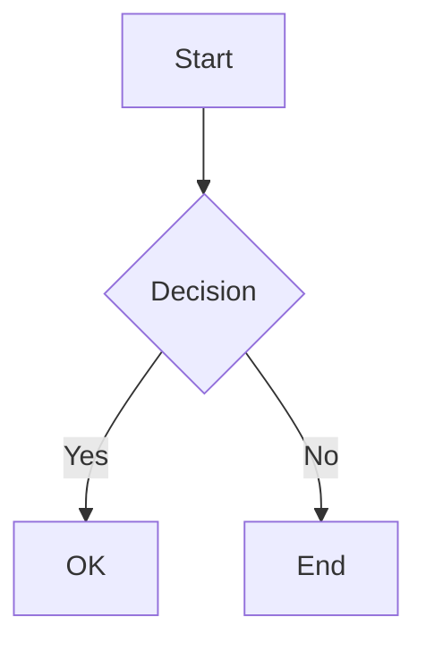
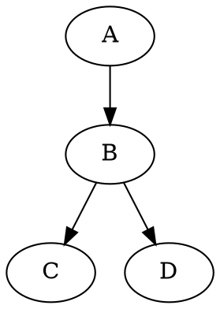
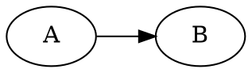
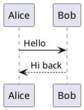

# MarkdownRenderer

Shared markdown-to-HTML rendering utility for the Enterprise Theme. Converts markdown to styled HTML using [marked](https://marked.js.org/) with optional extensions for code highlighting, math, and diagrams. Zero CSS injection — renders using the theme's native fonts and colours.

## Dependencies

### Required

| Library | Global | CDN | Purpose |
|---------|--------|-----|---------|
| [marked](https://marked.js.org/) | `window.marked` | `https://cdn.jsdelivr.net/npm/marked@15.0.7/marked.min.js` | Markdown parsing |

### Optional (auto-detected)

These libraries are probed on `window` at render time. If present, they are used automatically. If absent, the corresponding features are silently skipped.

| Library | Global | CDN | Purpose |
|---------|--------|-----|---------|
| [highlight.js](https://highlightjs.org/) | `window.hljs` | `https://cdn.jsdelivr.net/gh/highlightjs/cdn-release@11.11.1/build/highlight.min.js` | Code syntax highlighting |
| [KaTeX](https://katex.org/) | `window.katex` | `https://cdn.jsdelivr.net/npm/katex@0.16.22/dist/katex.min.js` | LaTeX/MathML math rendering |
| [Mermaid](https://mermaid.js.org/) | `window.mermaid` | `https://cdn.jsdelivr.net/npm/mermaid@11/dist/mermaid.min.js` | Mermaid diagrams |
| [@viz-js/viz](https://viz-js.com/) | `window.Viz` | `https://cdn.jsdelivr.net/npm/@viz-js/viz@3.11.0/lib/viz-standalone.js` | Graphviz/dot diagrams (client-side WASM, no server) |

### PlantUML (server-based)

PlantUML diagrams are rendered by sending the source text to a PlantUML server which returns SVG. **No client-side library is needed.**

- **Default server**: `https://www.plantuml.com/plantuml/svg/` (public, community-maintained, no SLA)
- **Recommended for production**: Self-host a PlantUML server via Docker:
  ```bash
  docker run -d -p 8080:8080 plantuml/plantuml-server:jetty
  ```
  Then configure: `plantumlServer: "http://localhost:8080/svg/"`

The encoding uses native `CompressionStream('deflate-raw')` + PlantUML's custom base64 — no encoder library needed.

## Usage

### Basic (markdown only)

```html
<script src="marked.min.js"></script>
<script src="markdownrenderer.js"></script>
<script>
var renderer = createMarkdownRenderer();
renderer.render("# Hello\n\nSome **bold** text.", targetElement);
</script>
```

### With code highlighting

```html
<link rel="stylesheet" href="highlight.js/styles/github.min.css">
<script src="marked.min.js"></script>
<script src="highlight.min.js"></script>
<script src="markdownrenderer.js"></script>
<script>
var renderer = createMarkdownRenderer();
renderer.render("```js\nconsole.log('hi');\n```", targetElement);
</script>
```

### With all extensions

```html
<link rel="stylesheet" href="highlight.js/styles/github.min.css">
<link rel="stylesheet" href="katex/dist/katex.min.css">
<script src="marked.min.js"></script>
<script src="highlight.min.js"></script>
<script src="katex.min.js"></script>
<script src="mermaid.min.js"></script>
<script src="viz-standalone.js"></script>
<script src="markdownrenderer.js"></script>
<script>
var renderer = createMarkdownRenderer({
    plantumlServer: "http://localhost:8080/svg/"
});
renderer.render(markdownContent, targetElement);
</script>
```

### Configuration options

```typescript
createMarkdownRenderer({
    highlight: true,        // Use highlight.js if available (default: true)
    math: true,             // Use KaTeX if available (default: true)
    mermaid: true,          // Use Mermaid if available (default: true)
    graphviz: true,         // Use @viz-js/viz if available (default: true)
    plantuml: true,         // Enable PlantUML server rendering (default: true)
    plantumlServer: "...",  // PlantUML server URL (default: public server)
});
```

### Disabling specific features

```typescript
// Only markdown + code highlighting, no diagrams or math
createMarkdownRenderer({
    math: false,
    mermaid: false,
    graphviz: false,
    plantuml: false,
});
```

## API

### `createMarkdownRenderer(opts?): MarkdownRendererHandle`

Creates a renderer instance. Registered on `window.createMarkdownRenderer`.

### `MarkdownRendererHandle`

| Method | Description |
|--------|-------------|
| `render(md, target)` | Render markdown into a DOM element. Runs async post-processing for diagrams. |
| `toHtml(md)` | Convert markdown to sanitised HTML string. Does **not** process diagrams (they require DOM). |

## Supported markdown features

### Standard markdown
Headings, paragraphs, bold, italic, links, images, lists, blockquotes, horizontal rules, tables.

### Code blocks
Fenced code blocks with language tags. Syntax highlighted when highlight.js is loaded.

````markdown
```javascript
function greet() { console.log("hello"); }
```
````

### Math (KaTeX)
Inline math with `$E = mc^2$` and block math with:

```markdown
$$
\int_0^\infty e^{-x^2} dx = \frac{\sqrt{\pi}}{2}
$$
```

### Mermaid diagrams

````markdown

````

### Graphviz / dot diagrams

Rendered entirely client-side via `@viz-js/viz` (WASM). No server needed.

````markdown

````

Also supports the `graphviz` language tag:

````markdown

````

### PlantUML diagrams

Rendered via server. Source is deflate-compressed, base64-encoded, and fetched as SVG.

````markdown

````

## Security

- All HTML output is sanitised: `<script>`, `<iframe>`, `<object>`, `<embed>`, and `<form>` elements are stripped
- Event handler attributes (`onclick`, `onload`, etc.) and `javascript:` URLs are removed
- PlantUML server calls send only diagram source text (no cookies, no credentials)
- Consumer-provided markdown is never trusted

## Architecture

The renderer is designed as a thin orchestration layer:

```
[marked]  ──parse──>  HTML string  ──sanitize──>  Safe HTML
                          │
              ┌───────────┼───────────┐
              │           │           │
         [highlight.js] [KaTeX]   [code blocks]
                                      │
                            ┌─────────┼─────────┐
                            │         │         │
                       [Mermaid]  [Viz.js]  [PlantUML]
                       (client)  (client)  (server)
```

- **marked** handles all parsing and standard HTML generation
- **highlight.js** is wired into marked's code renderer
- **KaTeX** is wired as a marked tokenizer/renderer extension
- **Mermaid**, **Graphviz**, and **PlantUML** are post-render steps that find placeholder `<div>` elements and replace them with rendered diagrams

## Used by

- **HelpDrawer** — slide-out documentation panel
- **DocViewer** — three-column documentation layout

Both components call `window.createMarkdownRenderer()` internally. Load `markdownrenderer.js` before their scripts.
