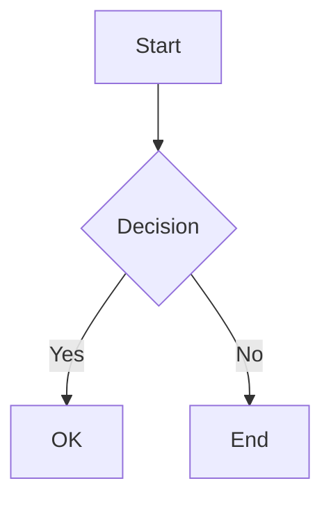
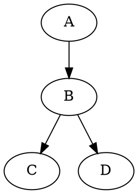
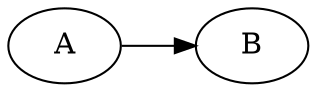
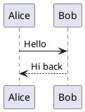

<!-- AGENT: Auto-generated — do not edit. Run `npm run build` to regenerate. -->

# Component Reference

Complete reference for all custom components shipped with the enterprise theme.

## Components

| Component | CSS | JS |
|-----------|-----|----|
| [actionitems](#actionitems) | `components/actionitems/actionitems.css` | `components/actionitems/actionitems.js` |
| [activityfeed](#activityfeed) | `components/activityfeed/activityfeed.css` | `components/activityfeed/activityfeed.js` |
| [anchorlayout](#anchorlayout) | `components/anchorlayout/anchorlayout.css` | `components/anchorlayout/anchorlayout.js` |
| [anglepicker](#anglepicker) | `components/anglepicker/anglepicker.css` | `components/anglepicker/anglepicker.js` |
| [applauncher](#applauncher) | `components/applauncher/applauncher.css` | `components/applauncher/applauncher.js` |
| [auditlogviewer](#auditlogviewer) | `components/auditlogviewer/auditlogviewer.css` | `components/auditlogviewer/auditlogviewer.js` |
| [bannerbar](#bannerbar) | `components/bannerbar/bannerbar.css` | `components/bannerbar/bannerbar.js` |
| [borderlayout](#borderlayout) | `components/borderlayout/borderlayout.css` | `components/borderlayout/borderlayout.js` |
| [boxlayout](#boxlayout) | `components/boxlayout/boxlayout.css` | `components/boxlayout/boxlayout.js` |
| [breadcrumb](#breadcrumb) | `components/breadcrumb/breadcrumb.css` | `components/breadcrumb/breadcrumb.js` |
| [cardlayout](#cardlayout) | `components/cardlayout/cardlayout.css` | `components/cardlayout/cardlayout.js` |
| [codeeditor](#codeeditor) | `components/codeeditor/codeeditor.css` | `components/codeeditor/codeeditor.js` |
| [colorpicker](#colorpicker) | `components/colorpicker/colorpicker.css` | `components/colorpicker/colorpicker.js` |
| [columnspicker](#columnspicker) | `components/columnspicker/columnspicker.css` | `components/columnspicker/columnspicker.js` |
| [commandpalette](#commandpalette) | `components/commandpalette/commandpalette.css` | `components/commandpalette/commandpalette.js` |
| [commentoverlay](#commentoverlay) | `components/commentoverlay/commentoverlay.css` | `components/commentoverlay/commentoverlay.js` |
| [confirmdialog](#confirmdialog) | `components/confirmdialog/confirmdialog.css` | `components/confirmdialog/confirmdialog.js` |
| [contextmenu](#contextmenu) | `components/contextmenu/contextmenu.css` | `components/contextmenu/contextmenu.js` |
| [conversation](#conversation) | `components/conversation/conversation.css` | `components/conversation/conversation.js` |
| [cronpicker](#cronpicker) | `components/cronpicker/cronpicker.css` | `components/cronpicker/cronpicker.js` |
| [datagrid](#datagrid) | `components/datagrid/datagrid.css` | `components/datagrid/datagrid.js` |
| [datepicker](#datepicker) | `components/datepicker/datepicker.css` | `components/datepicker/datepicker.js` |
| [diagramengine](#diagramengine) | `components/diagramengine/diagramengine.css` | `components/diagramengine/diagramengine.js` |
| [docklayout](#docklayout) | `components/docklayout/docklayout.css` | `components/docklayout/docklayout.js` |
| [docviewer](#docviewer) | `components/docviewer/docviewer.css` | `components/docviewer/docviewer.js` |
| [durationpicker](#durationpicker) | `components/durationpicker/durationpicker.css` | `components/durationpicker/durationpicker.js` |
| [editablecombobox](#editablecombobox) | `components/editablecombobox/editablecombobox.css` | `components/editablecombobox/editablecombobox.js` |
| [emptystate](#emptystate) | `components/emptystate/emptystate.css` | `components/emptystate/emptystate.js` |
| [errordialog](#errordialog) | `components/errordialog/errordialog.css` | `components/errordialog/errordialog.js` |
| [facetsearch](#facetsearch) | `components/facetsearch/facetsearch.css` | `components/facetsearch/facetsearch.js` |
| [fileexplorer](#fileexplorer) | `components/fileexplorer/fileexplorer.css` | `components/fileexplorer/fileexplorer.js` |
| [fileupload](#fileupload) | `components/fileupload/fileupload.css` | `components/fileupload/fileupload.js` |
| [flexgridlayout](#flexgridlayout) | `components/flexgridlayout/flexgridlayout.css` | `components/flexgridlayout/flexgridlayout.js` |
| [flowlayout](#flowlayout) | `components/flowlayout/flowlayout.css` | `components/flowlayout/flowlayout.js` |
| [fontdropdown](#fontdropdown) | `components/fontdropdown/fontdropdown.css` | `components/fontdropdown/fontdropdown.js` |
| [formdialog](#formdialog) | `components/formdialog/formdialog.css` | `components/formdialog/formdialog.js` |
| [gauge](#gauge) | `components/gauge/gauge.css` | `components/gauge/gauge.js` |
| [gradientpicker](#gradientpicker) | `components/gradientpicker/gradientpicker.css` | `components/gradientpicker/gradientpicker.js` |
| [graphcanvas](#graphcanvas) | `components/graphcanvas/graphcanvas.css` | `components/graphcanvas/graphcanvas.js` |
| [graphlegend](#graphlegend) | `components/graphlegend/graphlegend.css` | `components/graphlegend/graphlegend.js` |
| [graphminimap](#graphminimap) | `components/graphminimap/graphminimap.css` | `components/graphminimap/graphminimap.js` |
| [graphtoolbar](#graphtoolbar) | `components/graphtoolbar/graphtoolbar.css` | `components/graphtoolbar/graphtoolbar.js` |
| [gridlayout](#gridlayout) | `components/gridlayout/gridlayout.css` | `components/gridlayout/gridlayout.js` |
| [guidedtour](#guidedtour) | `components/guidedtour/guidedtour.css` | `components/guidedtour/guidedtour.js` |
| [helpdrawer](#helpdrawer) | `components/helpdrawer/helpdrawer.css` | `components/helpdrawer/helpdrawer.js` |
| [helptooltip](#helptooltip) | `components/helptooltip/helptooltip.css` | `components/helptooltip/helptooltip.js` |
| [inlinetoolbar](#inlinetoolbar) | `components/inlinetoolbar/inlinetoolbar.css` | `components/inlinetoolbar/inlinetoolbar.js` |
| [layerlayout](#layerlayout) | `components/layerlayout/layerlayout.css` | `components/layerlayout/layerlayout.js` |
| [lineendingpicker](#lineendingpicker) | `components/lineendingpicker/lineendingpicker.css` | `components/lineendingpicker/lineendingpicker.js` |
| [lineshapepicker](#lineshapepicker) | `components/lineshapepicker/lineshapepicker.css` | `components/lineshapepicker/lineshapepicker.js` |
| [linetypepicker](#linetypepicker) | `components/linetypepicker/linetypepicker.css` | `components/linetypepicker/linetypepicker.js` |
| [linewidthpicker](#linewidthpicker) | `components/linewidthpicker/linewidthpicker.css` | `components/linewidthpicker/linewidthpicker.js` |
| [logconsole](#logconsole) | `components/logconsole/logconsole.css` | `components/logconsole/logconsole.js` |
| [magnifier](#magnifier) | `components/magnifier/magnifier.css` | `components/magnifier/magnifier.js` |
| [marginspicker](#marginspicker) | `components/marginspicker/marginspicker.css` | `components/marginspicker/marginspicker.js` |
| [markdowneditor](#markdowneditor) | `components/markdowneditor/markdowneditor.css` | `components/markdowneditor/markdowneditor.js` |
| [markdownrenderer](#markdownrenderer) | `components/markdownrenderer/markdownrenderer.css` | `components/markdownrenderer/markdownrenderer.js` |
| [maskedentry](#maskedentry) | `components/maskedentry/maskedentry.css` | `components/maskedentry/maskedentry.js` |
| [multiselectcombo](#multiselectcombo) | `components/multiselectcombo/multiselectcombo.css` | `components/multiselectcombo/multiselectcombo.js` |
| [notificationcenter](#notificationcenter) | `components/notificationcenter/notificationcenter.css` | `components/notificationcenter/notificationcenter.js` |
| [orientationpicker](#orientationpicker) | `components/orientationpicker/orientationpicker.css` | `components/orientationpicker/orientationpicker.js` |
| [peoplepicker](#peoplepicker) | `components/peoplepicker/peoplepicker.css` | `components/peoplepicker/peoplepicker.js` |
| [periodpicker](#periodpicker) | `components/periodpicker/periodpicker.css` | `components/periodpicker/periodpicker.js` |
| [permissionmatrix](#permissionmatrix) | `components/permissionmatrix/permissionmatrix.css` | `components/permissionmatrix/permissionmatrix.js` |
| [personchip](#personchip) | `components/personchip/personchip.css` | `components/personchip/personchip.js` |
| [pill](#pill) | `components/pill/pill.css` | `components/pill/pill.js` |
| [presenceindicator](#presenceindicator) | `components/presenceindicator/presenceindicator.css` | `components/presenceindicator/presenceindicator.js` |
| [progressmodal](#progressmodal) | `components/progressmodal/progressmodal.css` | `components/progressmodal/progressmodal.js` |
| [prompttemplatemanager](#prompttemplatemanager) | `components/prompttemplatemanager/prompttemplatemanager.css` | `components/prompttemplatemanager/prompttemplatemanager.js` |
| [propertyinspector](#propertyinspector) | `components/propertyinspector/propertyinspector.css` | `components/propertyinspector/propertyinspector.js` |
| [reasoningaccordion](#reasoningaccordion) | `components/reasoningaccordion/reasoningaccordion.css` | `components/reasoningaccordion/reasoningaccordion.js` |
| [relationshipmanager](#relationshipmanager) | `components/relationshipmanager/relationshipmanager.css` | `components/relationshipmanager/relationshipmanager.js` |
| [ribbon](#ribbon) | `components/ribbon/ribbon.css` | `components/ribbon/ribbon.js` |
| [ribbonbuilder](#ribbonbuilder) | `components/ribbonbuilder/ribbonbuilder.css` | `components/ribbonbuilder/ribbonbuilder.js` |
| [richtextinput](#richtextinput) | `components/richtextinput/richtextinput.css` | `components/richtextinput/richtextinput.js` |
| [ruler](#ruler) | `components/ruler/ruler.css` | `components/ruler/ruler.js` |
| [searchbox](#searchbox) | `components/searchbox/searchbox.css` | `components/searchbox/searchbox.js` |
| [sharedialog](#sharedialog) | `components/sharedialog/sharedialog.css` | `components/sharedialog/sharedialog.js` |
| [sidebar](#sidebar) | `components/sidebar/sidebar.css` | `components/sidebar/sidebar.js` |
| [sizespicker](#sizespicker) | `components/sizespicker/sizespicker.css` | `components/sizespicker/sizespicker.js` |
| [skeletonloader](#skeletonloader) | `components/skeletonloader/skeletonloader.css` | `components/skeletonloader/skeletonloader.js` |
| [slider](#slider) | `components/slider/slider.css` | `components/slider/slider.js` |
| [smarttextinput](#smarttextinput) | `components/smarttextinput/smarttextinput.css` | `components/smarttextinput/smarttextinput.js` |
| [spacingpicker](#spacingpicker) | `components/spacingpicker/spacingpicker.css` | `components/spacingpicker/spacingpicker.js` |
| [spinemap](#spinemap) | `components/spinemap/spinemap.css` | `components/spinemap/spinemap.js` |
| [splitlayout](#splitlayout) | `components/splitlayout/splitlayout.css` | `components/splitlayout/splitlayout.js` |
| [sprintpicker](#sprintpicker) | `components/sprintpicker/sprintpicker.css` | `components/sprintpicker/sprintpicker.js` |
| [stacklayout](#stacklayout) | `components/stacklayout/stacklayout.css` | `components/stacklayout/stacklayout.js` |
| [statusbadge](#statusbadge) | `components/statusbadge/statusbadge.css` | `components/statusbadge/statusbadge.js` |
| [statusbar](#statusbar) | `components/statusbar/statusbar.css` | `components/statusbar/statusbar.js` |
| [stepper](#stepper) | `components/stepper/stepper.css` | `components/stepper/stepper.js` |
| [symbolpicker](#symbolpicker) | `components/symbolpicker/symbolpicker.css` | `components/symbolpicker/symbolpicker.js` |
| [tabbedpanel](#tabbedpanel) | `components/tabbedpanel/tabbedpanel.css` | `components/tabbedpanel/tabbedpanel.js` |
| [tagger](#tagger) | `components/tagger/tagger.css` | `components/tagger/tagger.js` |
| [themetoggle](#themetoggle) | `components/themetoggle/themetoggle.css` | `components/themetoggle/themetoggle.js` |
| [timeline](#timeline) | `components/timeline/timeline.css` | `components/timeline/timeline.js` |
| [timepicker](#timepicker) | `components/timepicker/timepicker.css` | `components/timepicker/timepicker.js` |
| [timezonepicker](#timezonepicker) | `components/timezonepicker/timezonepicker.css` | `components/timezonepicker/timezonepicker.js` |
| [toast](#toast) | `components/toast/toast.css` | `components/toast/toast.js` |
| [toolbar](#toolbar) | `components/toolbar/toolbar.css` | `components/toolbar/toolbar.js` |
| [toolcolorpicker](#toolcolorpicker) | `components/toolcolorpicker/toolcolorpicker.css` | `components/toolcolorpicker/toolcolorpicker.js` |
| [treegrid](#treegrid) | `components/treegrid/treegrid.css` | `components/treegrid/treegrid.js` |
| [treeview](#treeview) | `components/treeview/treeview.css` | `components/treeview/treeview.js` |
| [typebadge](#typebadge) | `components/typebadge/typebadge.css` | `components/typebadge/typebadge.js` |
| [usermenu](#usermenu) | `components/usermenu/usermenu.css` | `components/usermenu/usermenu.js` |
| [workspaceswitcher](#workspaceswitcher) | `components/workspaceswitcher/workspaceswitcher.css` | `components/workspaceswitcher/workspaceswitcher.js` |

---

<a id="actionitems"></a>

# ActionItems

A rich, stateful action item list with status lifecycle tracking, person assignments, priority badges, due dates, comment slots, tags, hierarchical numbering, inline editing, section-based grouping, drag-and-drop reordering, nesting, keyboard navigation, multi-select, bulk operations, faceted filtering, sorting, clipboard, and export.

## Quick Start

```html
<link rel="stylesheet" href="components/actionitems/actionitems.css">
<script src="components/actionitems/actionitems.js"></script>
```

```javascript
const list = createActionItems({
    container: "my-container",
    items: [
        {
            id: "1",
            index: 1,
            order: 1,
            content: "Review Q3 budget",
            status: "not-started",
            priority: "high",
            dueDate: "2026-03-20",
            tags: [],
            commentCount: 0,
            createdAt: new Date().toISOString(),
            updatedAt: new Date().toISOString()
        }
    ],
    onStatusChange: (id, oldS, newS) => console.log(id, oldS, "->", newS)
});
```

## Features

- **Status lifecycle** -- Not Started, In Progress, Done, Archived with click-to-cycle and keyboard toggle
- **Priority badges** -- High, Medium, Low with colour-coded indicators
- **Due dates** -- relative display (overdue, today, this week) with overdue highlighting
- **Person assignment** -- PersonChip integration with avatar and name display
- **Tags** -- Pill-based coloured labels per item
- **Comment slots** -- expandable comment area with count badge; consumer renders content via callback
- **Hierarchical nesting** -- parent/child items with indented rendering and Tab/Shift+Tab indent/outdent
- **Inline editing** -- double-click to edit content; Enter to confirm, Escape to cancel
- **Section grouping** -- items grouped by status with collapsible section headers and counts
- **Drag-and-drop reordering** -- drag handle with visual drop indicator and cross-section moves
- **Keyboard navigation** -- full arrow key nav, Space to cycle status, Enter to edit, Delete to remove
- **Multi-select** -- click with Ctrl/Shift for range selection; visual selection indicators
- **Bulk operations** -- bulk status change, bulk delete, bulk assign on selected items
- **Faceted filtering** -- filter by status, assignee, priority, due date facet, and tags
- **Sorting** -- 10 sort options including manual order, created, modified, priority, due date, assignee
- **Clipboard** -- Ctrl+C/X/V/A for copy/cut/paste/select-all in markdown checklist format
- **Export** -- JSON and markdown export with import from markdown checklists
- **Full/Compact modes** -- full mode with all features; compact mode for sidebars and dashboards
- **Dark mode** -- fully compatible via `var(--theme-*)` CSS custom properties

## Configuration Options

| Option | Type | Default | Description |
|--------|------|---------|-------------|
| `container` | `string \| HTMLElement` | *required* | Container element or ID string |
| `items` | `ActionItem[]` | `[]` | Initial items to render |
| `mode` | `"full" \| "compact"` | `"full"` | Display mode |
| `groupByStatus` | `boolean` | `true` | Group items by status with section headers |
| `showPriority` | `boolean` | `true` | Show priority badges |
| `showDueDates` | `boolean` | `true` | Show due date display |
| `showComments` | `boolean` | `true` | Show comment count and comment slot |
| `showTags` | `boolean` | `true` | Show tags/labels on items |
| `allowNesting` | `boolean` | `true` | Allow sub-item nesting |
| `allowCreate` | `boolean` | `true` | Allow inline creation of new items |
| `allowReorder` | `boolean` | `true` | Allow drag-and-drop reordering |
| `defaultSort` | `SortOption` | `"order"` | Default sort order |
| `placeholder` | `string` | `"Add a new item..."` | Placeholder text for new items |
| `emptyMessage` | `string` | `"No items yet"` | Message for empty state |

## Public API

| Method | Signature | Description |
|--------|-----------|-------------|
| `addItem` | `(item: Partial<ActionItem>) => ActionItem` | Add a new item; returns the created item with generated ID and timestamps |
| `removeItem` | `(itemId: string) => void` | Remove an item by ID |
| `updateItem` | `(itemId: string, changes: Partial<ActionItem>) => void` | Update an item's properties |
| `setAssignee` | `(itemId: string, person?: ActionItemPerson) => void` | Set or clear the assignee |
| `setCommentCount` | `(itemId: string, count: number) => void` | Set the comment count badge value |
| `getItems` | `() => ActionItem[]` | Get all items |
| `getItem` | `(itemId: string) => ActionItem \| null` | Get a single item by ID |
| `getItemsByStatus` | `(status: ActionItemStatus) => ActionItem[]` | Get items filtered by status |
| `getSelectedIds` | `() => string[]` | Get selected item IDs |
| `setSelection` | `(ids: string[]) => void` | Set selection programmatically |
| `clearSelection` | `() => void` | Clear all selections |
| `toggleSection` | `(status: ActionItemStatus, expanded: boolean) => void` | Expand or collapse a status section |
| `setFilter` | `(filter: ActionItemFilter) => void` | Apply a faceted filter |
| `clearFilters` | `() => void` | Clear all filters |
| `setSort` | `(sort: SortOption) => void` | Set the sort order |
| `export` | `(format: "json" \| "markdown") => string` | Export items in the specified format |
| `importMarkdown` | `(markdown: string) => ActionItem[]` | Import items from markdown checklist format |
| `scrollToItem` | `(itemId: string) => void` | Scroll to a specific item |
| `getElement` | `() => HTMLElement` | Get the root DOM element |
| `destroy` | `() => void` | Destroy the component and clean up |

## Event Callbacks

| Callback | Signature | Description |
|----------|-----------|-------------|
| `onItemCreate` | `(item: ActionItem) => void` | Fired when a new item is created |
| `onItemUpdate` | `(itemId: string, changes: Partial<ActionItem>) => void` | Fired when any item property changes |
| `onItemDelete` | `(itemId: string) => void` | Fired when an item is deleted |
| `onStatusChange` | `(itemId, oldStatus, newStatus) => void` | Fired when an item's status changes |
| `onContentEdit` | `(itemId: string, newContent: string) => void` | Fired when item content is edited |
| `onCommentToggle` | `(itemId: string, expanded: boolean) => void` | Fired when a comment slot is toggled |
| `onRenderCommentSlot` | `(itemId: string, container: HTMLElement) => void` | Fired to render comments into the slot |
| `onAssignmentRequest` | `(itemId, currentAssignee?) => void` | Fired when the user clicks the assignee chip |
| `onPriorityChange` | `(itemId: string, priority?: ActionItemPriority) => void` | Fired when priority changes |
| `onDueDateChange` | `(itemId: string, dueDate?: string) => void` | Fired when due date changes |
| `onSelectionChange` | `(selectedIds: string[]) => void` | Fired on selection changes |
| `onTagChange` | `(itemId: string, tags: ActionItemTag[]) => void` | Fired on tag add/remove |
| `onItemReorder` | `(itemId, newOrder, newParentId?) => void` | Fired when an item is reordered via drag-and-drop |
| `onBulkStatusChange` | `(itemIds: string[], newStatus) => void` | Fired on bulk status change |
| `onBulkDelete` | `(itemIds: string[]) => void` | Fired on bulk delete request |
| `onBulkAssign` | `(itemIds: string[], currentAssignee?) => void` | Fired on bulk assign request |
| `onExport` | `(format, items: ActionItem[]) => void` | Fired on export request |

## Keyboard Shortcuts

| Key | Action |
|-----|--------|
| `Arrow Up / Down` | Navigate between items |
| `Ctrl+Shift+Arrow Up / Down` | Move item up/down in order |
| `Space` | Cycle focused item status (Not Started -> In Progress -> Done) |
| `Enter` | Begin inline editing on focused item |
| `Escape` | Cancel editing or clear selection |
| `Tab` | Indent item (nest as sub-item) |
| `Shift+Tab` | Outdent item (un-nest) |
| `Delete / Backspace` | Delete focused or selected items |
| `Ctrl+C` | Copy selected items as markdown checklist |
| `Ctrl+X` | Cut selected items |
| `Ctrl+V` | Paste items from clipboard |
| `Ctrl+A` | Select all items |

## Compact Mode

```javascript
createActionItems({
    container: "sidebar-tasks",
    items: myItems,
    mode: "compact",
    groupByStatus: false,
    showComments: false,
    showTags: false,
    allowNesting: false,
    placeholder: "Quick add..."
});
```

Compact mode reduces padding and hides comment slots and tag displays for use in space-constrained contexts such as sidebar panels and dashboard widgets.

## Sort Options

| Value | Label |
|-------|-------|
| `"order"` | Manual order |
| `"created-asc"` | Created (oldest) |
| `"created-desc"` | Created (newest) |
| `"modified"` | Last modified |
| `"priority-desc"` | Priority (high first) |
| `"priority-asc"` | Priority (low first) |
| `"due-date-asc"` | Due date (soonest) |
| `"due-date-desc"` | Due date (latest) |
| `"assignee-asc"` | Assignee (A-Z) |
| `"assignee-desc"` | Assignee (Z-A) |

## Integration Notes

- **PersonChip** -- assignee display renders as a PersonChip (avatar + name) when the PersonChip component is loaded. Falls back to a plain text span.
- **Pill** -- tags render as Pill elements when the Pill component is loaded. Falls back to coloured spans.
- **Comment slot** -- the `onRenderCommentSlot` callback receives a container element; the consumer is responsible for rendering comment UI (e.g., a CommentOverlay or custom thread) into it.
- **Clipboard** -- copy/paste uses markdown checklist format (`- [ ] item`, `- [x] done`) for interoperability with external tools.
- **Export** -- JSON export includes all item metadata; markdown export produces a human-readable checklist with priority and due date annotations.

## Status Lifecycle

```
Not Started  ──>  In Progress  ──>  Done
    ⬡                ◐              ✓
```

Items cycle through statuses via click on the status indicator or `Space` key. The `"archived"` status is available programmatically via `updateItem()` but does not appear in the cycle.


---

<a id="activityfeed"></a>

# ActivityFeed

Social-style activity feed with date grouping, infinite scroll, real-time additions, and compact mode.

## Usage

```html
<link rel="stylesheet" href="components/activityfeed/activityfeed.css">
<script src="components/activityfeed/activityfeed.js"></script>
```

```javascript
const feed = createActivityFeed({
    events: [
        {
            id: "1",
            actor: { id: "u1", name: "Jane Doe" },
            action: "commented on",
            target: "Project Alpha",
            targetUrl: "/projects/alpha",
            timestamp: new Date(),
            eventType: "comment",
            content: "Looking great! Let's ship this week."
        }
    ],
    height: "400px",
    onLoadMore: async () => fetchMoreEvents(),
    onEventClick: (ev) => console.log("Clicked:", ev.id),
}, "my-container");
```

## Options

| Option | Type | Default | Description |
|--------|------|---------|-------------|
| `events` | `ActivityEvent[]` | `[]` | Initial events |
| `groupByDate` | `boolean` | `true` | Group by Today/Yesterday/This Week/Earlier |
| `showAvatars` | `boolean` | `true` | Show actor avatars |
| `compact` | `boolean` | `false` | Compact mode |
| `maxInitialEvents` | `number` | `20` | Max initial render |
| `height` | `string` | `"auto"` | Container height |
| `onLoadMore` | `() => Promise<ActivityEvent[]>` | - | Infinite scroll callback |
| `onEventClick` | `(ev) => void` | - | Event card click |
| `onActorClick` | `(actor) => void` | - | Actor name click |
| `onTargetClick` | `(ev) => void` | - | Target link click |

## API

| Method | Description |
|--------|-------------|
| `show(containerId)` | Mount to container |
| `hide()` | Remove from DOM |
| `destroy()` | Full cleanup |
| `addEvent(ev)` | Prepend real-time event |
| `addEvents(evs)` | Append events (pagination) |
| `setEvents(evs)` | Replace all events |
| `getEvents()` | Get current events |
| `clear()` | Remove all events |
| `refresh()` | Re-render |
| `scrollToTop()` | Scroll to top |

## Event Types

| Type | Icon | Colour |
|------|------|--------|
| `comment` | bi-chat-left-text | Blue |
| `status_change` | bi-arrow-repeat | Purple |
| `assignment` | bi-person-plus | Teal |
| `creation` | bi-plus-circle | Green |
| `deletion` | bi-trash | Red |
| `upload` | bi-cloud-upload | Cyan |
| `custom` | bi-circle | Gray |


---

<a id="anchorlayout"></a>

# AnchorLayout

A constraint-based layout container that positions children by declaring anchor relationships between child edges and container edges. Children stretch or float based on which edges are anchored. Uses CSS `position: relative` on the container and `position: absolute` on children. Inspired by Android ConstraintLayout, Qt AnchorLayout, and WPF Canvas with anchoring.

## Assets

| Asset | Path |
|-------|------|
| CSS | `components/anchorlayout/anchorlayout.css` |
| JS | `components/anchorlayout/anchorlayout.js` |
| Types | `components/anchorlayout/anchorlayout.d.ts` |

## Requirements

- **Bootstrap CSS** — for SCSS variables (`$gray-*`, `$font-size-*`, etc.)
- Does **not** require Bootstrap JS.

## Quick Start

```html
<link rel="stylesheet" href="components/anchorlayout/anchorlayout.css">
<script src="components/anchorlayout/anchorlayout.js"></script>

<script>
    // Pin a button to the bottom-right corner
    var saveBtn = document.createElement("button");
    saveBtn.textContent = "Save";
    saveBtn.className = "btn btn-primary";

    var layout = createAnchorLayout({
        height: "400px",
        width: "100%",
        children: [
            {
                child: saveBtn,
                anchorBottom: 16,
                anchorRight: 16
            }
        ]
    });
</script>
```

## How It Works

AnchorLayout creates a `position: relative` container. Each child is wrapped in a `position: absolute` div whose `top`, `bottom`, `left`, `right`, and `transform` properties are set based on anchor declarations.

```
Container (position: relative)
┌──────────────────────────────────────────────────────────┐
│                                                          │
│  anchorTop: 10 ──────────────────── anchorTop: 10        │
│  anchorLeft: 10                     anchorRight: 10      │
│  ┌──────────┐                       ┌──────────┐        │
│  │ Child A  │                       │ Child B  │        │
│  │ (floats  │                       │ (floats  │        │
│  │  top-left│                       │ top-right│        │
│  └──────────┘                       └──────────┘        │
│                                                          │
│                  ┌──────────┐                            │
│                  │ Child C  │ anchorCenterH: 0           │
│                  │ (centered│ anchorCenterV: 0           │
│                  │  both)   │                            │
│                  └──────────┘                            │
│                                                          │
│  anchorTop: 0    ┌────────────────────────────┐          │
│  anchorBottom: 0 │ Child D (stretches         │          │
│  anchorLeft: 0   │  to fill — all 4 edges     │          │
│                  │  anchored)                  │          │
│                  └────────────────────────────┘          │
│                                                          │
└──────────────────────────────────────────────────────────┘
```

## Options

### AnchorLayoutOptions

| Option | Type | Default | Description |
|--------|------|---------|-------------|
| `id` | `string` | auto | Custom element ID |
| `children` | `AnchorChildConfig[]` | `[]` | Initial children with anchor constraints |
| `padding` | `string` | — | Container padding (CSS value) |
| `cssClass` | `string` | — | Additional CSS classes |
| `height` | `string` | — | Height CSS value |
| `width` | `string` | — | Width CSS value |
| `onLayoutChange` | `(state) => void` | — | Fired on resize events |

### AnchorChildConfig

| Property | Type | Default | Description |
|----------|------|---------|-------------|
| `child` | `HTMLElement \| Component` | — | Child element or component |
| `anchorTop` | `number \| string` | — | Offset from top edge (px or CSS value) |
| `anchorBottom` | `number \| string` | — | Offset from bottom edge |
| `anchorLeft` | `number \| string` | — | Offset from left edge |
| `anchorRight` | `number \| string` | — | Offset from right edge |
| `anchorCenterH` | `number \| string` | — | Center horizontally with optional offset |
| `anchorCenterV` | `number \| string` | — | Center vertically with optional offset |
| `minWidth` | `number \| string` | — | Minimum width constraint |
| `maxWidth` | `number \| string` | — | Maximum width constraint |
| `minHeight` | `number \| string` | — | Minimum height constraint |
| `maxHeight` | `number \| string` | — | Maximum height constraint |

## Anchor Rules

### Dual-Edge Stretching

When both opposing edges are anchored, the child stretches to fill the space between them.

```js
// Stretches horizontally between 10px from left and 10px from right
{ child: panel, anchorLeft: 10, anchorRight: 10 }

// Stretches both directions — fills the entire container with 20px margin
{ child: overlay, anchorTop: 20, anchorBottom: 20, anchorLeft: 20, anchorRight: 20 }
```

### Single-Edge Floating

When only one edge is anchored, the child floats at that offset and uses its natural size.

```js
// Floats at top-left corner
{ child: logo, anchorTop: 0, anchorLeft: 0 }

// Floats at bottom-right with 16px inset
{ child: fab, anchorBottom: 16, anchorRight: 16 }
```

### Center Anchoring

Use `anchorCenterH` and `anchorCenterV` to center a child along one or both axes. The value is an optional offset from center.

```js
// Centered both horizontally and vertically
{ child: spinner, anchorCenterH: 0, anchorCenterV: 0 }

// Centered horizontally, 30px from top
{ child: title, anchorCenterH: 0, anchorTop: 30 }

// Centered vertically with 20px rightward offset
{ child: sidebar, anchorCenterV: 0, anchorCenterH: 20 }
```

**Note:** Center anchoring uses CSS `transform: translate()`. When both `anchorCenterH` and `anchorCenterV` are set, they combine into a single `translate(-50%, -50%)`. Non-zero offsets are applied via `margin-left` or `margin-top`.

## Public API

| Method | Returns | Description |
|--------|---------|-------------|
| `show(container?)` | `void` | Append to container and display |
| `hide()` | `void` | Remove from DOM (preserves state) |
| `destroy()` | `void` | Full cleanup, destroy all children |
| `getRootElement()` | `HTMLElement \| null` | The root container |
| `isVisible()` | `boolean` | Whether the layout is displayed |
| `setContained(value)` | `void` | Set contained mode |
| `addChild(config)` | `void` | Add a child with anchor constraints |
| `removeChild(index)` | `void` | Remove child by index |
| `updateAnchors(index, anchors)` | `void` | Update anchor constraints for a child |
| `getChildCount()` | `number` | Number of children |
| `getState()` | `AnchorLayoutState` | Serialisable state snapshot |
| `setState(state)` | `void` | No-op (anchors are config-driven) |

## AnchorLayoutState

```typescript
interface AnchorLayoutState {
    childCount: number;
}
```

## Composability

AnchorLayout implements the standard layout container contract. Any component with `show(container)` / `hide()` / `destroy()` can be used as a child. Plain HTMLElements are also supported.

```js
// Pin a toolbar at the top, a status bar at the bottom,
// and fill the center with a content panel
var layout = new AnchorLayout({
    height: "100vh",
    width: "100%",
    children: [
        { child: toolbar, anchorTop: 0, anchorLeft: 0, anchorRight: 0 },
        { child: content, anchorTop: 48, anchorBottom: 32, anchorLeft: 0, anchorRight: 0 },
        { child: statusBar, anchorBottom: 0, anchorLeft: 0, anchorRight: 0 }
    ]
});
```

## Global Exports

When loaded via `<script>` tag:

- `window.AnchorLayout` — AnchorLayout class
- `window.createAnchorLayout` — Factory function (creates and shows)

## CSS Classes

| Class | Element | Description |
|-------|---------|-------------|
| `.anchorlayout` | Root | Relative-positioned container |
| `.anchorlayout-child` | Wrapper | Absolute-positioned child wrapper |


---

<a id="anglepicker"></a>

# AnglePicker

A circular dial input for selecting angles from 0 to 360 degrees. Supports both inline (always-visible dial for property panels) and dropdown (compact trigger button for toolbars) modes. Includes optional live shadow preview, tick mark labels, and snap-to-increment dragging.

## Usage

### Inline Mode

```html
<link rel="stylesheet" href="components/anglepicker/anglepicker.css">
<script src="components/anglepicker/anglepicker.js"></script>

<div id="my-angle-picker"></div>

<script>
var picker = createAnglePicker("my-angle-picker", {
    value: 225,
    mode: "inline",
    showPreview: true,
    onChange: function(angle) {
        console.log("Angle:", angle + "°");
    }
});
</script>
```

### Dropdown Mode

```html
<div id="toolbar-angle"></div>

<script>
var picker = createAnglePicker("toolbar-angle", {
    value: 45,
    mode: "dropdown",
    size: "sm",
    onChange: function(angle) {
        console.log("Shadow angle:", angle);
    }
});
</script>
```

## Options

| Option | Type | Default | Description |
|--------|------|---------|-------------|
| `value` | `number` | `0` | Initial angle in degrees (0–359) |
| `mode` | `"inline" \| "dropdown"` | `"inline"` | Display mode |
| `size` | `"sm" \| "md" \| "lg"` | `"md"` | Size variant |
| `step` | `number` | `1` | Arrow key increment in degrees |
| `snapStep` | `number` | `15` | Shift+drag / Shift+arrow snap increment |
| `showTicks` | `boolean` | `true` | Show tick marks on dial |
| `tickLabels` | `"none" \| "degrees" \| "compass"` | `"none"` | Tick label display mode |
| `showInput` | `boolean` | `true` | Show editable center input |
| `showPreview` | `boolean` | `false` | Show live shadow preview square |
| `previewDistance` | `number` | `6` | Shadow offset distance in px |
| `previewBlur` | `number` | `8` | Shadow blur radius in px |
| `previewColor` | `string` | `"rgba(0,0,0,0.4)"` | Shadow color |
| `disabled` | `boolean` | `false` | Disable the picker |
| `onChange` | `(angle: number) => void` | — | Fires on angle change |
| `onOpen` | `() => void` | — | Fires when dropdown opens |
| `onClose` | `() => void` | — | Fires when dropdown closes |

## API

| Method | Returns | Description |
|--------|---------|-------------|
| `getValue()` | `number` | Current angle (0–359) |
| `setValue(angle)` | `void` | Set angle programmatically |
| `open()` | `void` | Open dropdown (dropdown mode) |
| `close()` | `void` | Close dropdown (dropdown mode) |
| `enable()` | `void` | Enable the picker |
| `disable()` | `void` | Disable the picker |
| `getElement()` | `HTMLElement \| null` | Root DOM element |
| `destroy()` | `void` | Tear down and remove from DOM |

## Keyboard

### Dial Focused

| Key | Action |
|-----|--------|
| `Right` / `Up` | Increase by `step` (default 1°) |
| `Left` / `Down` | Decrease by `step` (default 1°) |
| `Shift + arrow` | Change by `snapStep` (default 15°) |
| `Home` | Jump to 0° |
| `End` | Jump to 359° |

### Dropdown Mode

| Key | Action |
|-----|--------|
| `ArrowDown` / `Enter` | Open dropdown |
| `Escape` | Close dropdown |

## Tick Labels

- `"none"` — no labels (default)
- `"degrees"` — shows 0°, 90°, 180°, 270° at cardinal positions
- `"compass"` — shows E, N, W, S at cardinal positions

## Shadow Preview

When `showPreview: true`, a small square appears beside the dial showing a live CSS `box-shadow` at the currently selected angle. The shadow distance, blur, and color are configurable.

## Sizes

| Size | Dial diameter |
|------|--------------|
| `sm` | 80px |
| `md` | 120px |
| `lg` | 160px |


---

<a id="applauncher"></a>

# AppLauncher

Grid-based application launcher with three view modes: dropdown (waffle icon trigger), modal (centered overlay), and fullpage (inline with sidebar). Supports search, favourites, recent apps, categories, badges, and full 2D grid keyboard navigation.

## Quick Start

```html
<link rel="stylesheet" href="css/custom.css">
<link rel="stylesheet" href="components/applauncher/applauncher.css">
<script src="components/applauncher/applauncher.js"></script>
```

```javascript
// Dropdown mode (default)
const launcher = createAppLauncher({
    apps: [
        { id: "crm", name: "CRM", icon: "bi bi-people" },
        { id: "mail", name: "Mail", icon: "bi bi-envelope" },
        { id: "files", name: "Files", icon: "bi bi-folder" },
    ],
    activeAppId: "crm",
    onSelect: (app) => console.log("Selected:", app.name),
}, "launcher-container");

// Modal mode
const modal = createAppLauncher({
    apps: myApps,
    mode: "modal",
    categories: [
        { id: "prod", label: "Productivity", icon: "bi bi-lightning" },
        { id: "admin", label: "Admin", icon: "bi bi-gear" },
    ],
    onSelect: (app) => window.location.href = app.url,
}, "modal-trigger-container");

// Fullpage mode
const fullpage = createAppLauncher({
    apps: myApps,
    mode: "fullpage",
    categories: myCategories,
}, "fullpage-container");
```

## Options

| Option | Type | Default | Description |
|--------|------|---------|-------------|
| `apps` | `AppItem[]` | *required* | List of applications |
| `categories` | `AppCategory[]` | `undefined` | Category groupings |
| `activeAppId` | `string` | `undefined` | Currently active app ID |
| `mode` | `"dropdown" \| "modal" \| "fullpage"` | `"dropdown"` | View mode |
| `columns` | `number` | `3/4/4` | Grid columns (mode-dependent default) |
| `showSearch` | `boolean` | `true` | Show search input |
| `showFavorites` | `boolean` | `true` | Show favourites section |
| `showRecent` | `boolean` | `true` | Show recent apps section |
| `maxRecent` | `number` | `6` | Max recent apps |
| `showCategories` | `boolean` | `true` | Show category tabs/sidebar |
| `placeholder` | `string` | `"Search apps..."` | Search placeholder |
| `triggerIcon` | `string` | `"bi bi-grid-3x3-gap"` | Trigger icon class |
| `triggerLabel` | `string` | `"Apps"` | Trigger button text |
| `showTriggerLabel` | `boolean` | `true` | Show trigger label text |
| `size` | `"sm" \| "default" \| "lg"` | `"default"` | Size variant |
| `favoritesKey` | `string` | `"applauncher-favorites"` | localStorage key |
| `recentKey` | `string` | `"applauncher-recent"` | localStorage key |
| `cssClass` | `string` | `undefined` | Additional root CSS classes |
| `keyBindings` | `Record<string, string>` | See below | Key binding overrides |
| `onSelect` | `(app: AppItem) => void` | `undefined` | App selection callback |
| `onSearch` | `(query: string) => Promise<AppItem[]>` | `undefined` | Async search |
| `onFavoriteToggle` | `(id: string, isFav: boolean) => void` | `undefined` | Favourite callback |
| `onOpen` | `() => void` | `undefined` | Open callback |
| `onClose` | `() => void` | `undefined` | Close callback |

## AppItem

| Property | Type | Description |
|----------|------|-------------|
| `id` | `string` | Unique ID |
| `name` | `string` | Display name |
| `description` | `string?` | Optional description |
| `icon` | `string?` | Bootstrap icon class |
| `iconUrl` | `string?` | Image URL (overrides icon) |
| `url` | `string?` | Navigation URL |
| `category` | `string?` | Category ID |
| `badge` | `string?` | Badge text ("NEW", "3") |
| `badgeVariant` | `"info" \| "success" \| "warning" \| "danger"` | Badge colour |
| `disabled` | `boolean?` | Disabled state |
| `data` | `Record<string, unknown>?` | Custom data |

## Methods

| Method | Returns | Description |
|--------|---------|-------------|
| `show(containerId)` | `void` | Append to container |
| `hide()` | `void` | Remove from DOM |
| `destroy()` | `void` | Full teardown |
| `open()` | `void` | Open dropdown/modal |
| `close()` | `void` | Close dropdown/modal |
| `isOpen()` | `boolean` | Open state |
| `getApps()` | `AppItem[]` | Current app list |
| `setApps(apps)` | `void` | Replace app list |
| `addApp(app)` | `void` | Add single app |
| `removeApp(id)` | `void` | Remove by ID |
| `updateApp(id, updates)` | `void` | Partial update |
| `getActiveAppId()` | `string` | Active app ID |
| `setActiveAppId(id)` | `void` | Set active app |
| `getFavorites()` | `string[]` | Favourite IDs |
| `setFavorites(ids)` | `void` | Set favourites |
| `toggleFavorite(id)` | `void` | Toggle favourite |
| `clearFavorites()` | `void` | Clear all favourites |
| `getRecent()` | `string[]` | Recent IDs |
| `clearRecent()` | `void` | Clear recent list |
| `setCategories(cats)` | `void` | Update categories |
| `setSearchQuery(q)` | `void` | Programmatic search |
| `getMode()` | `string` | Current mode |

## Keyboard

| Key | Context | Action |
|-----|---------|--------|
| Enter / Space | Trigger | Open launcher |
| Escape | Dropdown / Modal | Close |
| Arrow Right/Left | Grid | Horizontal navigation |
| Arrow Down/Up | Grid | Vertical navigation |
| Home / End | Grid | First / last tile |
| Enter | Focused tile | Select app |
| Shift+F | Focused tile | Toggle favourite |
| / | Any | Focus search input |

## Default Key Bindings

```javascript
{
    close: "Escape",
    focusDown: "ArrowDown",
    focusUp: "ArrowUp",
    focusLeft: "ArrowLeft",
    focusRight: "ArrowRight",
    focusFirst: "Home",
    focusLast: "End",
    select: "Enter",
    toggleFav: "Shift+F",
    focusSearch: "/",
}
```

## CSS Classes

All classes use the `applauncher-` prefix. Key classes:

- `.applauncher` — root
- `.applauncher-trigger` — waffle button
- `.applauncher-dropdown` — dropdown portal
- `.applauncher-modal` / `.applauncher-backdrop` / `.applauncher-modal-content` — modal
- `.applauncher-fullpage` / `.applauncher-sidebar` — fullpage layout
- `.applauncher-search` / `.applauncher-search-input` — search
- `.applauncher-tabs` / `.applauncher-tab` — category tabs
- `.applauncher-grid` / `.applauncher-tile` — tile grid
- `.applauncher-tile-active` / `.applauncher-tile-disabled` — tile states
- `.applauncher-tile-badge` / `.applauncher-tile-fav` — badge and favourite star
- `.applauncher-section-header` — section labels
- `.applauncher-sm` / `.applauncher-lg` — size variants

## Asset Paths

```
CSS: components/applauncher/applauncher.css
JS:  components/applauncher/applauncher.js
```


---

<a id="auditlogviewer"></a>

# AuditLogViewer

Read-only filterable audit log viewer with severity badges, expandable detail rows, filter chips, pagination, and CSV/JSON export.

## Usage

```html
<link rel="stylesheet" href="components/auditlogviewer/auditlogviewer.css">
<script src="components/auditlogviewer/auditlogviewer.js"></script>
```

```javascript
const viewer = createAuditLogViewer({
    entries: [
        {
            id: "1",
            timestamp: new Date(),
            actor: "admin",
            action: "user.login",
            resource: "Session #42",
            ipAddress: "10.0.1.5",
            severity: "info"
        }
    ],
    height: "500px",
    onRowClick: (entry) => console.log("Row clicked:", entry.id),
}, "my-container");
```

## Options

| Option | Type | Default | Description |
|--------|------|---------|-------------|
| `entries` | `AuditLogEntry[]` | `[]` | Initial entries |
| `pageSize` | `number` | `50` | Entries per page |
| `serverSide` | `boolean` | `false` | Server-side pagination mode |
| `showFilters` | `boolean` | `true` | Show filter bar |
| `showExport` | `boolean` | `true` | Show export buttons |
| `showDetail` | `boolean` | `true` | Enable expandable detail rows |
| `showSeverity` | `boolean` | `true` | Show severity column |
| `showIPAddress` | `boolean` | `true` | Show IP address column |
| `autoRefresh` | `number` | `0` | Auto-refresh interval (ms) |
| `height` | `string` | `"500px"` | Container height |

## API

| Method | Description |
|--------|-------------|
| `show(containerId)` | Mount to container |
| `hide()` | Remove from DOM |
| `destroy()` | Full cleanup |
| `setEntries(entries)` | Replace all entries |
| `addEntry(entry)` | Prepend a new entry |
| `setFilters(filters)` | Apply filters |
| `clearFilters()` | Clear all filters |
| `setPage(page)` | Navigate to page |
| `exportCSV()` | Export as CSV |
| `exportJSON()` | Export as JSON |
| `refresh()` | Re-render |

## Severity Levels

| Level | Colour | Icon |
|-------|--------|------|
| `info` | Gray | bi-info-circle |
| `warning` | Yellow | bi-exclamation-triangle |
| `critical` | Red | bi-exclamation-octagon |


---

<a id="bannerbar"></a>

# BannerBar

A fixed-to-top viewport banner for announcing significant events such as service status updates, critical issues, maintenance windows, and success confirmations.

## Features

- Four severity presets: info, warning, critical, success
- Full colour override support for custom branding
- Optional bold title, icon, and action link/button
- Closeable via X button (configurable)
- Optional auto-dismiss timer
- Scrollable overflow at configurable max height
- Slide-in/slide-out animation
- Single-instance model (new banner replaces the previous)
- Sets `--bannerbar-height` CSS custom property on `<html>` for layout offset
- WCAG AA accessible with appropriate ARIA attributes

## Assets

| Asset | Path |
|-------|------|
| CSS | `components/bannerbar/bannerbar.css` |
| JS | `components/bannerbar/bannerbar.js` |
| Types | `components/bannerbar/bannerbar.d.ts` |

**Requires:** Bootstrap CSS (for SCSS variables), Bootstrap Icons CSS. Does **not** require Bootstrap JS.

## Quick Start

```html
<link rel="stylesheet" href="components/bannerbar/bannerbar.css">
<script src="components/bannerbar/bannerbar.js"></script>
<script>
    var banner = createBannerBar({
        message: "Scheduled maintenance tonight at 02:00 UTC.",
        variant: "warning"
    });
</script>
```

## API

### `createBannerBar(options)` / `showBanner(options)`

Creates, shows, and returns a `BannerBar` instance. `showBanner` is an ergonomic alias.

### `new BannerBar(options)`

Creates a BannerBar instance without showing it. Call `.show()` to display.

### Options

| Property | Type | Default | Description |
|----------|------|---------|-------------|
| `id` | string | auto | Unique identifier |
| `title` | string | — | Bold title text before the message |
| `message` | string | **(required)** | Main message text |
| `variant` | `"info"` \| `"warning"` \| `"critical"` \| `"success"` | `"info"` | Severity preset |
| `icon` | string | variant default | Bootstrap Icons class |
| `actionLabel` | string | — | Text for action link/button |
| `actionHref` | string | — | If set, action renders as `<a>` |
| `onAction` | function | — | Click handler for action |
| `closable` | boolean | `true` | Show the close X button |
| `autoDismissMs` | number | `0` | Auto-close after N ms (0 = disabled) |
| `maxHeight` | number | `200` | Max height in px before scrolling |
| `backgroundColor` | string | — | CSS colour override |
| `textColor` | string | — | CSS colour override |
| `borderColor` | string | — | CSS border-bottom colour override |
| `zIndex` | number | `1045` | CSS z-index |
| `cssClass` | string | — | Additional CSS classes |
| `onClose` | function | — | Called after close/destroy |

### Instance Methods

| Method | Description |
|--------|-------------|
| `show()` | Show the banner (replaces any active banner) |
| `hide()` | Hide the banner with slide-out animation |
| `destroy()` | Remove the banner and release all resources |
| `setMessage(msg)` | Update the message text |
| `setTitle(title)` | Update the title text (empty string hides it) |
| `setVariant(variant)` | Switch severity variant |
| `isVisible()` | Returns `true` if the banner is currently shown |

## Variants

| Variant | Use Case | Default Icon |
|---------|----------|-------------|
| `info` | Announcements, feature notices | `bi-info-circle-fill` |
| `warning` | Maintenance windows, degradation | `bi-exclamation-triangle-fill` |
| `critical` | Outages, breaking issues | `bi-exclamation-octagon-fill` |
| `success` | Completed operations, confirmations | `bi-check-circle-fill` |

## Examples

### Basic Info Banner

```javascript
createBannerBar({
    message: "New dashboard analytics are now available."
});
```

### Critical Banner with Title

```javascript
createBannerBar({
    title: "Service Disruption",
    message: "Payment processing is currently unavailable. We are investigating.",
    variant: "critical"
});
```

### Banner with Action Link

```javascript
createBannerBar({
    message: "Your subscription expires in 3 days.",
    variant: "warning",
    actionLabel: "Renew Now",
    actionHref: "/billing/renew"
});
```

### Auto-Dismissing Success Banner

```javascript
createBannerBar({
    message: "All records imported successfully.",
    variant: "success",
    autoDismissMs: 5000
});
```

### Custom Colours

```javascript
createBannerBar({
    message: "Beta feature enabled for your account.",
    backgroundColor: "#f0e6ff",
    textColor: "#4a1d8e",
    borderColor: "#7c3aed"
});
```

## CSS Custom Property

When visible, the banner sets `--bannerbar-height` on `<html>` to its measured pixel height. Other components (e.g., Sidebar) use this to offset their top position:

```css
.my-fixed-element {
    top: var(--bannerbar-height, 0px);
}
```

The property is removed when the banner is hidden or destroyed.

## Accessibility

- Root element has `role="alert"` with `aria-live="assertive"` for critical/warning variants, `aria-live="polite"` for info/success
- Close button has `aria-label="Close banner"`
- Action element is a standard focusable `<a>` or `<button>`
- All variant colour combinations meet WCAG AA contrast requirements


---

<a id="borderlayout"></a>

# BorderLayout

A five-region CSS Grid layout container that divides its area into North, South, East, West, and Center regions. North and South span the full width; East and West fill the remaining height; Center takes all remaining space. Supports region collapsing and dynamic slot assignment.

## Assets

| Asset | Path |
|-------|------|
| CSS | `components/borderlayout/borderlayout.css` |
| JS | `components/borderlayout/borderlayout.js` |
| Types | `components/borderlayout/borderlayout.d.ts` |

## Requirements

- **Bootstrap CSS** — for SCSS variables (`$gray-*`, `$font-size-*`, etc.)
- Does **not** require Bootstrap JS.

## Quick Start

```html
<link rel="stylesheet" href="components/borderlayout/borderlayout.css">
<script src="components/borderlayout/borderlayout.js"></script>

<script>
    var header = document.createElement("header");
    header.textContent = "Application Header";
    header.style.padding = "12px";
    header.style.background = "#f0f0f0";

    var nav = document.createElement("nav");
    nav.textContent = "Navigation";
    nav.style.padding = "12px";

    var content = document.createElement("main");
    content.textContent = "Main Content Area";

    var layout = createBorderLayout({
        north: header,
        west: nav,
        center: content,
        westWidth: "200px",
        northHeight: "auto",
        gap: 1,
        height: "100vh",
        width: "100%",
        collapsible: ["west", "east"]
    });
</script>
```

## How It Works

BorderLayout creates a CSS Grid with 5 named areas:

```
┌─────────────────────────────────────┐
│              north                  │  auto / fixed height
├──────┬──────────────────┬───────────┤
│      │                  │           │
│ west │     center       │   east    │  1fr (fills remaining)
│      │                  │           │
├──────┴──────────────────┴───────────┤
│              south                  │  auto / fixed height
└─────────────────────────────────────┘
```

When a component is passed to a region:
1. Calls `component.setContained(true)` if available
2. Calls `component.show(cell)` — mounts inside the grid cell
3. Grid template updates dynamically when regions change

## Options

| Option | Type | Default | Description |
|--------|------|---------|-------------|
| `id` | `string` | auto | Custom element ID |
| `north` | `HTMLElement \| Component` | — | North (top) region child |
| `south` | `HTMLElement \| Component` | — | South (bottom) region child |
| `east` | `HTMLElement \| Component` | — | East (right) region child |
| `west` | `HTMLElement \| Component` | — | West (left) region child |
| `center` | `HTMLElement \| Component` | — | Center region child |
| `gap` | `number \| string` | `"0"` | Gap between regions |
| `northHeight` | `string` | `"auto"` | North region height |
| `southHeight` | `string` | `"auto"` | South region height |
| `eastWidth` | `string` | `"auto"` | East region width |
| `westWidth` | `string` | `"auto"` | West region width |
| `collapsible` | `BorderRegion[]` | — | Regions that can be collapsed |
| `padding` | `string` | — | Container padding |
| `cssClass` | `string` | — | Additional CSS classes |
| `height` | `string` | — | Height CSS value |
| `width` | `string` | — | Width CSS value |
| `onLayoutChange` | `(state) => void` | — | Fired on resize/collapse events |

## Public API

| Method | Returns | Description |
|--------|---------|-------------|
| `show(container?)` | `void` | Append to container and display |
| `hide()` | `void` | Remove from DOM (preserves state) |
| `destroy()` | `void` | Full cleanup, destroy all children |
| `getRootElement()` | `HTMLElement \| null` | The root grid container |
| `isVisible()` | `boolean` | Whether the layout is displayed |
| `setNorth(child \| null)` | `void` | Set or clear north region |
| `setSouth(child \| null)` | `void` | Set or clear south region |
| `setEast(child \| null)` | `void` | Set or clear east region |
| `setWest(child \| null)` | `void` | Set or clear west region |
| `setCenter(child \| null)` | `void` | Set or clear center region |
| `collapseRegion(region)` | `void` | Collapse a collapsible region |
| `expandRegion(region)` | `void` | Expand a collapsed region |
| `getRegionElement(region)` | `HTMLElement \| null` | Grid cell for a region |
| `getState()` | `BorderLayoutState` | Serialisable state snapshot |
| `setState(state)` | `void` | Restore collapsed regions |
| `setContained(value)` | `void` | Set contained mode |

## BorderLayoutState

```typescript
interface BorderLayoutState {
    regions: Record<BorderRegion, boolean>;
    collapsed: BorderRegion[];
}
```

## Nesting Example

```js
// BorderLayout as an application shell
var appShell = createBorderLayout({
    north: toolbar,
    west: new BorderLayout({
        north: searchBox,
        center: treeView,
        south: userProfile,
        height: "100%"
    }),
    center: tabPanel,
    east: propertyInspector,
    south: statusBar,
    collapsible: ["west", "east"],
    height: "100vh"
});
```

## Global Exports

When loaded via `<script>` tag:

- `window.BorderLayout` — BorderLayout class
- `window.createBorderLayout` — Factory function (creates and shows)

## CSS Classes

| Class | Element | Description |
|-------|---------|-------------|
| `.borderlayout` | Root | CSS Grid container |
| `.borderlayout-north` | Cell | North (top) region |
| `.borderlayout-south` | Cell | South (bottom) region |
| `.borderlayout-east` | Cell | East (right) region |
| `.borderlayout-west` | Cell | West (left) region |
| `.borderlayout-center` | Cell | Center region |
| `.borderlayout-collapsed` | Cell | Collapsed region modifier |


---

<a id="boxlayout"></a>

# BoxLayout

A single-axis flex layout container that arranges children sequentially along one axis (horizontal or vertical) with configurable flex factors, alignment, and gap. Inspired by Java Swing BoxLayout, WPF StackPanel, and CSS Flexbox.

## Assets

| Asset | Path |
|-------|------|
| CSS | `components/boxlayout/boxlayout.css` |
| JS | `components/boxlayout/boxlayout.js` |
| Types | `components/boxlayout/boxlayout.d.ts` |

## Requirements

- **Bootstrap CSS** — for SCSS variables (`$gray-*`, `$font-size-*`, etc.)
- Does **not** require Bootstrap JS.

## Quick Start

```html
<link rel="stylesheet" href="components/boxlayout/boxlayout.css">
<script src="components/boxlayout/boxlayout.js"></script>

<script>
    var layout = createBoxLayout({
        direction: "horizontal",
        gap: 8,
        align: "stretch",
        height: "100%",
        children: [
            { child: document.getElementById("sidebar"), flex: 0, minSize: 200 },
            { child: document.getElementById("content"), flex: 1 }
        ]
    });
</script>
```

## How It Works

BoxLayout creates a CSS Flexbox container. Children are arranged sequentially along the main axis (row or column). Each child can be assigned a flex factor to consume proportional remaining space, or it can use its natural size.

```
direction: "horizontal"
┌──────────┬────────────────────────────────┬──────────┐
│ flex: 0  │          flex: 1               │ flex: 0  │
│ (200px)  │    (fills remaining space)     │ (auto)   │
└──────────┴────────────────────────────────┴──────────┘

direction: "vertical"
┌──────────────────────────────────────────────────────┐
│ flex: 0 (auto height)                                │
├──────────────────────────────────────────────────────┤
│                                                      │
│ flex: 1 (fills remaining space)                      │
│                                                      │
├──────────────────────────────────────────────────────┤
│ flex: 0 (auto height)                                │
└──────────────────────────────────────────────────────┘
```

## Options

| Option | Type | Default | Description |
|--------|------|---------|-------------|
| `id` | `string` | auto | Custom element ID |
| `direction` | `"horizontal" \| "vertical"` | — | Main axis direction (required) |
| `children` | `BoxLayoutChildConfig[]` | `[]` | Initial children |
| `gap` | `number \| string` | `"0"` | Gap between children (px or CSS value) |
| `align` | `"start" \| "center" \| "end" \| "stretch" \| "baseline"` | `"stretch"` | Cross-axis alignment |
| `justify` | `"start" \| "center" \| "end" \| "space-between" \| "space-around" \| "space-evenly"` | `"start"` | Main-axis distribution |
| `padding` | `string` | — | Container padding (CSS value) |
| `cssClass` | `string` | — | Additional CSS classes |
| `height` | `string` | — | Height CSS value |
| `width` | `string` | — | Width CSS value |
| `onLayoutChange` | `(state) => void` | — | Fired on resize events |

### BoxLayoutChildConfig

| Property | Type | Default | Description |
|----------|------|---------|-------------|
| `child` | `HTMLElement \| Component` | — | Child element or component |
| `flex` | `number` | `0` | Flex grow factor. 0 = natural size |
| `minSize` | `number` | — | Minimum size in px along main axis |
| `maxSize` | `number` | — | Maximum size in px along main axis |
| `alignSelf` | `"start" \| "center" \| "end" \| "stretch" \| "baseline"` | — | Cross-axis alignment override |

## Public API

| Method | Returns | Description |
|--------|---------|-------------|
| `show(container?)` | `void` | Append to container and display |
| `hide()` | `void` | Remove from DOM (preserves state) |
| `destroy()` | `void` | Full cleanup, destroy all children |
| `getRootElement()` | `HTMLElement \| null` | The root flex container |
| `isVisible()` | `boolean` | Whether the layout is displayed |
| `addChild(config, index?)` | `void` | Add a child at optional index |
| `removeChild(index)` | `void` | Remove child by index |
| `getChildCount()` | `number` | Number of children |
| `getChildElement(index)` | `HTMLElement \| null` | Wrapper element at index |
| `getState()` | `BoxLayoutState` | Serialisable state snapshot |
| `setState(state)` | `void` | Restore state (direction) |
| `setContained(value)` | `void` | Set contained mode |

## BoxLayoutState

```typescript
interface BoxLayoutState {
    direction: "horizontal" | "vertical";
    childCount: number;
}
```

## Composability

BoxLayout implements the standard layout container contract. Any component with `show(container)` / `hide()` / `destroy()` can be used as a child. Plain HTMLElements are also supported.

```js
// Nest a BoxLayout inside a BorderLayout
var innerBox = new BoxLayout({
    direction: "horizontal",
    gap: 8,
    children: [
        { child: buttonA, flex: 0 },
        { child: spacer, flex: 1 },
        { child: buttonB, flex: 0 }
    ]
});

borderLayout.setNorth(innerBox);
```

## Global Exports

When loaded via `<script>` tag:

- `window.BoxLayout` — BoxLayout class
- `window.createBoxLayout` — Factory function (creates and shows)

## CSS Classes

| Class | Element | Description |
|-------|---------|-------------|
| `.boxlayout` | Root | Flex container |
| `.boxlayout-child` | Wrapper | Per-child flex wrapper |


---

<a id="breadcrumb"></a>

# Breadcrumb Navigation

Hierarchical path display with clickable segments, optional terminal dropdown actions, and overflow truncation for deep hierarchies. Extends Bootstrap 5 breadcrumb base styles.

## Assets

| Asset | Path |
|-------|------|
| CSS | `components/breadcrumb/breadcrumb.css` |
| JS | `components/breadcrumb/breadcrumb.js` |
| Types | `components/breadcrumb/breadcrumb.d.ts` |

## Requirements

- **Bootstrap CSS** — for `.breadcrumb` / `.breadcrumb-item` base classes and SCSS variables
- **Bootstrap Icons** — per-item and action icons (`bi-*` classes)
- Does **not** require Bootstrap JS.

## Quick Start

```html
<link rel="stylesheet" href="components/breadcrumb/breadcrumb.css">
<script src="components/breadcrumb/breadcrumb.js"></script>
<script>
    var bc = createBreadcrumb({
        container: document.getElementById("my-breadcrumb"),
        items: [
            { label: "Home", icon: "bi-house-fill" },
            { label: "Projects" },
            { label: "Acme Corp" }
        ],
        onItemClick: function(item, index) {
            console.log("Navigate to:", item.label);
        }
    });
</script>
```

## API

### `createBreadcrumb(options): BreadcrumbHandle`

Factory function — creates and mounts a breadcrumb instance.

### BreadcrumbOptions

| Option | Type | Default | Description |
|--------|------|---------|-------------|
| `container` | `HTMLElement` | **required** | Mount target element |
| `items` | `BreadcrumbItem[]` | `[]` | Initial path segments |
| `actions` | `BreadcrumbAction[]` | `[]` | Terminal segment dropdown actions |
| `maxVisible` | `number` | `5` | Max visible items; 0 = no truncation |
| `separator` | `string` | `"/"` | Divider character between segments |
| `size` | `"sm" \| "md" \| "lg"` | `"md"` | Size variant |
| `cssClass` | `string` | — | Additional CSS class(es) on root |
| `onItemClick` | `(item, index) => void` | — | Click callback for segments |
| `onActionClick` | `(actionId, item) => void` | — | Click callback for actions |

### BreadcrumbItem

| Property | Type | Description |
|----------|------|-------------|
| `label` | `string` | Display text (required) |
| `href` | `string` | Navigation URL (renders `<a>` instead of `<button>`) |
| `icon` | `string` | Bootstrap Icons class (e.g. `"bi-house-fill"`) |
| `data` | `unknown` | Arbitrary payload for callbacks |

### BreadcrumbAction

| Property | Type | Description |
|----------|------|-------------|
| `id` | `string` | Unique identifier (required) |
| `label` | `string` | Display text (required) |
| `icon` | `string` | Bootstrap Icons class |
| `separator` | `boolean` | Show divider line above this action |
| `disabled` | `boolean` | Grey out and prevent click |

### BreadcrumbHandle

| Method | Returns | Description |
|--------|---------|-------------|
| `setItems(items)` | `void` | Replace all segments |
| `addItem(item)` | `void` | Append a new segment |
| `removeItem(index)` | `void` | Remove segment by index |
| `getItems()` | `BreadcrumbItem[]` | Return copy of current items |
| `setActions(actions)` | `void` | Replace terminal dropdown actions |
| `getElement()` | `HTMLElement` | Return root `<nav>` element |
| `destroy()` | `void` | Remove DOM and event listeners |

## Overflow Truncation

When the number of items exceeds `maxVisible`, middle segments collapse into an ellipsis (`…`) that opens a dropdown listing the hidden items:

```javascript
var bc = createBreadcrumb({
    container: el,
    maxVisible: 5,
    items: [
        { label: "Root" },
        { label: "Level 1" },
        { label: "Level 2" },
        { label: "Level 3" },
        { label: "Level 4" },
        { label: "Level 5" },
        { label: "Level 6" },
        { label: "Current" }
    ]
});
// Renders: Root > … > Level 4 > Level 5 > Level 6 > Current
```

## Terminal Actions

Add a dropdown menu to the last segment for contextual actions:

```javascript
var bc = createBreadcrumb({
    container: el,
    items: [
        { label: "Home" },
        { label: "Settings" }
    ],
    actions: [
        { id: "edit", label: "Edit", icon: "bi-pencil" },
        { id: "delete", label: "Delete", icon: "bi-trash", separator: true }
    ],
    onActionClick: function(actionId, item) {
        console.log("Action:", actionId, "on", item.label);
    }
});
```

## Size Variants

| Variant | Class | Font Size |
|---------|-------|-----------|
| Small | `breadcrumb-nav-sm` | 0.75rem |
| Medium | *(default)* | `$breadcrumb-font-size` (0.8125rem) |
| Large | `breadcrumb-nav-lg` | 1rem |

## Keyboard

| Key | Action |
|-----|--------|
| `Tab` | Focus breadcrumb items sequentially |
| `Enter` / `Space` | Activate focused item or action |
| `Escape` | Close any open dropdown |
| `Arrow Down` / `Arrow Up` | Navigate within open dropdown |
| `Alt + D` | Focus breadcrumb (global, per KEYBOARD.md) |

## Accessibility

- Root element: `<nav aria-label="Breadcrumb">`
- Active (terminal) item: `aria-current="page"`
- Dropdown triggers: `aria-haspopup="true"`, `aria-expanded`
- Menu items: `role="menu"` / `role="menuitem"`
- Icons: `aria-hidden="true"`

## CSS Custom Properties

| Property | Default | Description |
|----------|---------|-------------|
| `--breadcrumb-nav-divider` | `"/"` | Separator character |


---

<a id="cardlayout"></a>

# CardLayout

An indexed-stack layout container that stacks all children in the same space but displays only one at a time. Supports animated transitions (fade, slide) between cards, lazy loading, and keyboard navigation via `next()`/`previous()`.

## Assets

| Asset | Path |
|-------|------|
| CSS | `components/cardlayout/cardlayout.css` |
| JS | `components/cardlayout/cardlayout.js` |
| Types | `components/cardlayout/cardlayout.d.ts` |

## Requirements

- **Bootstrap CSS** — for SCSS variables (`$gray-*`, `$font-size-*`, etc.)
- Does **not** require Bootstrap JS.

## Quick Start

```html
<link rel="stylesheet" href="components/cardlayout/cardlayout.css">
<script src="components/cardlayout/cardlayout.js"></script>

<script>
    var step1 = document.createElement("div");
    step1.innerHTML = "<h2>Step 1</h2><p>Enter your details</p>";

    var step2 = document.createElement("div");
    step2.innerHTML = "<h2>Step 2</h2><p>Choose your plan</p>";

    var step3 = document.createElement("div");
    step3.innerHTML = "<h2>Step 3</h2><p>Confirm and submit</p>";

    var wizard = createCardLayout({
        activeKey: "step1",
        transition: "slide-left",
        transitionDuration: 200,
        height: "400px",
        cards: [
            { key: "step1", child: step1 },
            { key: "step2", child: step2 },
            { key: "step3", child: step3 }
        ]
    });

    // Navigate programmatically
    document.getElementById("nextBtn").onclick = function() {
        wizard.next();
    };
</script>
```

## How It Works

CardLayout creates a container where all card wrappers are stacked. Only the active card has `display: block`; all others have `display: none`. When switching cards, CSS animation classes are applied for the transition duration, then cleaned up.

```
┌──────────────────────────────────┐
│                                  │
│         Active Card              │   ← visible (display: block)
│       (e.g. "step2")            │
│                                  │
├──────────────────────────────────┤
│  Card "step1" (display: none)   │   ← hidden
│  Card "step3" (display: none)   │   ← hidden
└──────────────────────────────────┘
```

## Options

| Option | Type | Default | Description |
|--------|------|---------|-------------|
| `id` | `string` | auto | Custom element ID |
| `activeKey` | `string` | first card | Key of initially active card |
| `cards` | `CardConfig[]` | `[]` | Initial cards |
| `sizing` | `"largest" \| "active" \| "fixed"` | `"active"` | Container sizing strategy |
| `transition` | `"none" \| "fade" \| "slide-left" \| "slide-up"` | `"none"` | Transition animation |
| `transitionDuration` | `number` | `200` | Animation duration in ms |
| `preserveState` | `boolean` | `true` | Retain inactive card state |
| `padding` | `string` | — | Container padding |
| `cssClass` | `string` | — | Additional CSS classes |
| `height` | `string` | — | Height CSS value |
| `width` | `string` | — | Width CSS value |
| `onLayoutChange` | `(state) => void` | — | Fired on card switch/resize |

### CardConfig

| Property | Type | Default | Description |
|----------|------|---------|-------------|
| `key` | `string` | — | Unique card identifier (required) |
| `child` | `HTMLElement \| Component` | — | Card content (required) |
| `lazyLoad` | `boolean` | `false` | Defer mounting until first activation |

## Public API

| Method | Returns | Description |
|--------|---------|-------------|
| `show(container?)` | `void` | Append to container and display |
| `hide()` | `void` | Remove from DOM (preserves state) |
| `destroy()` | `void` | Full cleanup, destroy all cards |
| `getRootElement()` | `HTMLElement \| null` | The root container |
| `isVisible()` | `boolean` | Whether the layout is displayed |
| `addCard(config)` | `void` | Add a new card |
| `removeCard(key)` | `void` | Remove card by key |
| `setActiveCard(key)` | `void` | Switch to card by key |
| `getActiveCard()` | `string \| null` | Key of the active card |
| `next()` | `void` | Activate next card (wraps) |
| `previous()` | `void` | Activate previous card (wraps) |
| `getCardCount()` | `number` | Number of cards |
| `getState()` | `CardLayoutState` | Serialisable state snapshot |
| `setState(state)` | `void` | Restore active card |
| `setContained(value)` | `void` | Set contained mode |

## CardLayoutState

```typescript
interface CardLayoutState {
    activeKey: string | null;
    cardCount: number;
}
```

## Transitions

All transitions respect `prefers-reduced-motion: reduce` — when enabled, transitions are disabled and cards switch immediately.

| Transition | Description |
|-----------|-------------|
| `"none"` | Instant switch, no animation |
| `"fade"` | Outgoing card fades out, incoming fades in |
| `"slide-left"` | Outgoing slides left, incoming slides in from right |
| `"slide-up"` | Outgoing slides up, incoming slides in from bottom |

## Global Exports

When loaded via `<script>` tag:

- `window.CardLayout` — CardLayout class
- `window.createCardLayout` — Factory function (creates and shows)

## CSS Classes

| Class | Element | Description |
|-------|---------|-------------|
| `.cardlayout` | Root | Stack container |
| `.cardlayout-card` | Wrapper | Per-card wrapper |
| `.cardlayout-enter-fade` | Card | Fade-in animation |
| `.cardlayout-exit-fade` | Card | Fade-out animation |
| `.cardlayout-enter-slide-left` | Card | Slide-in from right |
| `.cardlayout-exit-slide-left` | Card | Slide-out to left |
| `.cardlayout-enter-slide-up` | Card | Slide-in from bottom |
| `.cardlayout-exit-slide-up` | Card | Slide-out upward |


---

<a id="codeeditor"></a>

# CodeEditor

Bootstrap 5-themed code editor wrapping CodeMirror 6 with syntax highlighting, toolbar, and diagnostics.

## Prerequisites

**CodeMirror 6 is required.** The component checks for `window.EditorView` and `window.EditorState` at `show()` time. If these globals are missing, it displays an error message instead of rendering an editor.

### Required Globals

| Global | Package | Role |
|--------|---------|------|
| `EditorView` | `@codemirror/view` | Core view (required) |
| `EditorState` | `@codemirror/state` | Core state (required) |

### Recommended Globals

These are optional but provide the full editing experience:

| Global | Package | Role |
|--------|---------|------|
| `keymap`, `defaultKeymap` | `@codemirror/view` | Key binding support |
| `history`, `historyKeymap` | `@codemirror/commands` | Undo/redo |
| `undo`, `redo`, `indentSelection` | `@codemirror/commands` | Editing commands |
| `syntaxHighlighting`, `defaultHighlightStyle` | `@codemirror/language` | Syntax colours |
| `lineNumbers`, `drawSelection`, `dropCursor` | `@codemirror/view` | UI features |
| `bracketMatching`, `closeBrackets`, `closeBracketsKeymap` | `@codemirror/autocomplete` | Bracket handling |
| `highlightActiveLine`, `highlightSelectionMatches` | `@codemirror/view` / `@codemirror/search` | Highlighting |
| `search`, `searchKeymap` | `@codemirror/search` | Find/replace |
| `indentOnInput` | `@codemirror/language` | Auto-indent |
| `setDiagnostics` | `@codemirror/lint` | Gutter diagnostics |

### Language Globals

Add language support by exposing factory functions as globals:

| Global | Package |
|--------|---------|
| `javascript` | `@codemirror/lang-javascript` |
| `json` | `@codemirror/lang-json` |
| `yaml` | `@codemirror/lang-yaml` (community) |
| `html` | `@codemirror/lang-html` |
| `css` | `@codemirror/lang-css` |
| `sql` | `@codemirror/lang-sql` |
| `python` | `@codemirror/lang-python` |
| `markdown` | `@codemirror/lang-markdown` |

### Loading via ESM CDN

CodeMirror 6 is ESM-native. Use a `<script type="module">` with an ESM CDN to expose globals:

```html
<script type="module">
    import { EditorView, keymap, lineNumbers, drawSelection, dropCursor,
             highlightActiveLine, highlightSelectionMatches }
        from "https://esm.sh/@codemirror/view@6";
    import { EditorState } from "https://esm.sh/@codemirror/state@6";
    import { history, historyKeymap, defaultKeymap, undo, redo, indentSelection }
        from "https://esm.sh/@codemirror/commands@6";
    import { syntaxHighlighting, defaultHighlightStyle, indentOnInput }
        from "https://esm.sh/@codemirror/language@6";
    import { search, searchKeymap } from "https://esm.sh/@codemirror/search@6";
    import { closeBrackets, closeBracketsKeymap } from "https://esm.sh/@codemirror/autocomplete@6";
    import { bracketMatching } from "https://esm.sh/@codemirror/language@6";
    import { javascript } from "https://esm.sh/@codemirror/lang-javascript@6";
    import { json } from "https://esm.sh/@codemirror/lang-json@6";
    import { html } from "https://esm.sh/@codemirror/lang-html@6";
    import { css } from "https://esm.sh/@codemirror/lang-css@6";
    import { sql } from "https://esm.sh/@codemirror/lang-sql@6";
    import { python } from "https://esm.sh/@codemirror/lang-python@6";
    import { markdown } from "https://esm.sh/@codemirror/lang-markdown@6";

    // Expose as globals for CodeEditor
    Object.assign(window, {
        EditorView, EditorState, keymap, lineNumbers, drawSelection, dropCursor,
        highlightActiveLine, highlightSelectionMatches, history, historyKeymap,
        defaultKeymap, undo, redo, indentSelection, syntaxHighlighting,
        defaultHighlightStyle, indentOnInput, search, searchKeymap,
        closeBrackets, closeBracketsKeymap, bracketMatching,
        javascript, json, html, css, sql, python, markdown
    });
    window.dispatchEvent(new Event("codemirror-ready"));
</script>
```

Alternatively, provide a pre-bundled UMD build that sets these globals.

## Quick Start

```html
<link rel="stylesheet" href="components/codeeditor/codeeditor.css">
<script src="components/codeeditor/codeeditor.js"></script>
<script>
    var editor = createCodeEditor("my-container", {
        value: "function greet() {\n    console.log('Hello!');\n}",
        language: "javascript",
        onSave: function(value) { console.log("Saved:", value); }
    });
</script>
```

## API

### `CodeEditorOptions`

| Property | Type | Default | Description |
|----------|------|---------|-------------|
| `value` | `string` | `""` | Initial text content |
| `language` | `CodeEditorLanguage` | `"javascript"` | Syntax highlighting language |
| `readOnly` | `boolean` | `false` | Read-only mode |
| `lineNumbers` | `boolean` | `true` | Show line numbers (CM mode only) |
| `wordWrap` | `boolean` | `false` | Enable word wrap |
| `tabSize` | `number` | `4` | Spaces per tab |
| `placeholder` | `string` | — | Placeholder text |
| `height` | `string` | `"300px"` | Editor height |
| `maxHeight` | `string` | — | Max height for auto-grow |
| `autoGrow` | `boolean` | `false` | Grow height with content |
| `theme` | `"light" \| "dark"` | `"light"` | Theme mode |
| `showToolbar` | `boolean` | `true` | Show toolbar |
| `toolbarActions` | `CodeEditorToolbarAction[]` | All actions | Which toolbar actions to show |
| `diagnostics` | `CodeEditorDiagnostic[]` | `[]` | Initial diagnostics (CM mode only) |
| `disabled` | `boolean` | `false` | Disabled state |
| `cssClass` | `string` | — | Additional CSS class |

### Callbacks

| Callback | Signature | Description |
|----------|-----------|-------------|
| `onChange` | `(value: string) => void` | Content changed (100ms debounce) |
| `onSave` | `(value: string) => void` | Ctrl+S pressed |
| `onLanguageChange` | `(lang) => void` | Language changed via toolbar |
| `onFocus` | `() => void` | Editor focused |
| `onBlur` | `() => void` | Editor blurred |

### Methods

| Method | Description |
|--------|-------------|
| `show(containerId)` | Render into container, detect CodeMirror |
| `hide()` | Remove from DOM, preserve state |
| `destroy()` | Clean up all resources |
| `getElement()` | Get root DOM element |
| `getValue()` | Get editor content |
| `setValue(value)` | Set editor content |
| `getLanguage()` | Get current language |
| `setLanguage(lang)` | Change language |
| `setReadOnly(readOnly)` | Toggle read-only |
| `setTheme(theme)` | Switch light/dark |
| `setDiagnostics(diags)` | Set gutter diagnostics (CM mode only) |
| `clearDiagnostics()` | Clear all diagnostics |
| `focus()` / `blur()` | Focus management |
| `getSelection()` | Get selected text |
| `replaceSelection(text)` | Replace selection |
| `undo()` / `redo()` | Undo/redo |
| `format()` | Auto-indent (CM mode only) |
| `toggleWordWrap()` | Toggle word wrap |
| `toggleLineNumbers()` | Toggle line numbers |
| `getEditorInstance()` | Get raw CodeMirror EditorView |

## Features

- **Syntax highlighting** — JavaScript, TypeScript, JSON, YAML, HTML, CSS, SQL, Python, Markdown
- **Toolbar** — Language selector, undo/redo, word wrap, copy, format, save
- **Light & dark themes** — CSS custom properties integrating with Bootstrap variables
- **Diagnostics** — Gutter markers for errors, warnings, info (CodeMirror mode)
- **Copy to clipboard** — With visual checkmark feedback
- **Auto-grow** — Height adjusts with content up to maxHeight
- **Read-only mode** — Editing blocked, copy/save still available
- **Tab handling** — Tab inserts spaces (respects tabSize)
- **Ctrl+S** — Fires onSave callback

## Keyboard

| Key | Action |
|-----|--------|
| Ctrl/Cmd + S | Save |
| Ctrl/Cmd + Z | Undo |
| Ctrl/Cmd + Shift + Z | Redo |
| Ctrl/Cmd + F | Find (CM mode) |
| Tab | Indent / insert spaces |
| Shift + Tab | Outdent |

## Accessibility

- `role="group"` with `aria-label="Code editor"` on root
- `role="toolbar"` with `aria-label="Editor actions"` on toolbar
- `aria-label` on all buttons and the language selector
- `aria-pressed` on word wrap toggle
- `aria-readonly` and `aria-disabled` states
- Live region for language change and diagnostic announcements


---

<a id="colorpicker"></a>

# ColorPicker

A canvas-based colour selection control with saturation/brightness gradient, vertical hue strip, optional opacity slider, hex/RGB/HSL format tabs, text inputs, and configurable preset swatches. Operates in popup or inline mode.

## Assets

| Asset | Path |
|-------|------|
| CSS | `components/colorpicker/colorpicker.css` |
| JS | `components/colorpicker/colorpicker.js` |
| Types | `components/colorpicker/colorpicker.d.ts` |

## Requirements

- **Bootstrap CSS** — for SCSS variables (`$gray-*`, `$primary`, etc.)
- **Bootstrap Icons** — `bi-clipboard`, `bi-check2`
- Does **not** require Bootstrap JS.
- No external colour libraries — all conversions are internal.

## Quick Start

```html
<link rel="stylesheet" href="components/colorpicker/colorpicker.css">
<script src="components/colorpicker/colorpicker.js"></script>
<script>
    var picker = createColorPicker("my-container", {
        value: "#FF5733",
        showOpacity: true,
        swatches: ["#EF4444", "#F59E0B", "#10B981", "#3B82F6", "#8B5CF6"],
        onChange: function(color, alpha) {
            console.log("Selected:", color, "Alpha:", alpha);
        }
    });
</script>
```

## Options (ColorPickerOptions)

| Option | Type | Default | Description |
|--------|------|---------|-------------|
| `value` | `string` | `"#3B82F6"` | Initial colour (hex string) |
| `format` | `"hex" \| "rgb" \| "hsl"` | `"hex"` | Output format for `getValue()` |
| `showOpacity` | `boolean` | `false` | Show alpha/opacity slider |
| `showFormatTabs` | `boolean` | `true` | Show hex/RGB/HSL format tabs |
| `showInputs` | `boolean` | `true` | Show text input fields |
| `swatches` | `string[]` | — | Preset swatch colours (hex strings) |
| `inline` | `boolean` | `false` | Render inline (true) or popup (false) |
| `popupPosition` | `string` | `"bottom-start"` | Popup position: `bottom-start`, `bottom-end`, `top-start`, `top-end` |
| `triggerElement` | `HTMLElement` | — | Custom trigger element (popup only) |
| `label` | `string` | — | Optional label displayed above the picker |
| `disabled` | `boolean` | `false` | Disable the component |
| `size` | `"mini" \| "sm" \| "default" \| "lg"` | `"default"` | Size variant |
| `onChange` | `function` | — | Called on commit (swatch click, Enter, popup close, drag end) |
| `onInput` | `function` | — | Called continuously during drag and on every colour adjustment |
| `onOpen` | `function` | — | Called when popup opens |
| `onClose` | `function` | — | Called when popup closes |

## API

| Method | Returns | Description |
|--------|---------|-------------|
| `show(containerId?)` | `void` | Append to container (or body) |
| `hide()` | `void` | Remove from DOM, keep state |
| `destroy()` | `void` | Hide, clean up, null references |
| `getValue()` | `string` | Colour in configured format |
| `getValueWithAlpha()` | `string` | Colour as `rgba()` string |
| `setValue(color)` | `void` | Set colour (hex, rgb(), or hsl()) |
| `getAlpha()` | `number` | Current alpha (0-1) |
| `setAlpha(a)` | `void` | Set alpha (clamped 0-1) |
| `open()` | `void` | Open popup (no-op inline) |
| `close()` | `void` | Close popup (no-op inline) |
| `getElement()` | `HTMLElement` | Root DOM element |
| `getPopupElement()` | `HTMLElement \| null` | Popup panel element (null if inline or closed) |
| `setLabel(label)` | `void` | Update or create the label text |
| `enable()` | `void` | Enable the component |
| `disable()` | `void` | Disable; closes popup if open |

### Convenience Function

```typescript
createColorPicker(containerId, options?)  // Create, show, and return
```

### Global Exports

```
window.ColorPicker
window.createColorPicker
```

## Keyboard Accessibility

| Context | Key | Action |
|---------|-----|--------|
| Palette | Arrow keys | Move saturation/brightness by 1% |
| Palette | Shift+Arrow | Move by 10% |
| Hue strip | ArrowUp/Down | Change hue by 1 degree |
| Hue strip | Shift+Arrow | Change hue by 10 degrees |
| Opacity | ArrowLeft/Right | Change alpha by 1% |
| Opacity | Shift+Arrow | Change alpha by 10% |
| Swatch | Enter/Space | Select swatch colour |
| Text input | Enter | Apply typed value |
| Popup | Escape | Close popup, return focus to trigger |

## Accessibility

- Palette, hue strip, and opacity have `role="slider"` with `aria-valuenow/min/max`
- Swatch grid has `role="listbox"` with `role="option"` items
- Format tabs use `role="tablist"` and `role="tab"` with `aria-selected`
- Trigger button has `aria-haspopup="dialog"` and `aria-expanded`
- `aria-live="polite"` region announces colour changes

## onInput vs onChange

| Callback | When it fires | Use case |
|----------|---------------|----------|
| `onInput` | Every pointer move during drag, every keyboard step, every commit | Live preview (e.g. update canvas fill in real time) |
| `onChange` | Swatch click, Enter in hex input, drag end (pointer up), keyboard steps | Persist to backend, commit undo history |

Both callbacks receive `(color: string, alpha?: number)`. During a drag, `onInput` fires continuously and `onChange` fires once on pointer release. On discrete actions (keyboard, swatch, Enter), both fire together.

## Disabled State

When disabled (`disabled: true` or `disable()` method):

- **Inline mode**: entire picker has `opacity: 0.5`, all interactions disabled, swatches show `cursor: not-allowed` with no hover scale.
- **Popup mode**: trigger shows `cursor: not-allowed`, hover border suppressed, click does not open popup. Trigger has `aria-disabled="true"`.

## Examples

### Live preview with onInput

```javascript
var picker = createColorPicker("canvas-tools", {
    value: "#3B82F6",
    label: "Fill",
    onInput: function(color) {
        // Real-time preview while dragging
        selectedShape.style.fill = color;
    },
    onChange: function(color) {
        // Commit: save to backend
        api.updateShapeFill(shapeId, color);
    }
});
```

### Accessing the popup element

```javascript
var picker = createColorPicker("dock-panel", {
    value: "#10B981",
    onOpen: function() {
        var popup = picker.getPopupElement();
        if (popup) { popup.style.zIndex = "2000"; }
    }
});
```

### Label option

```javascript
var fill = createColorPicker("fill-container", {
    label: "Fill",
    inline: true,
    value: "#3B82F6"
});

var stroke = createColorPicker("stroke-container", {
    label: "Stroke",
    inline: true,
    value: "#1F2937"
});
```

### Inline picker with opacity

```javascript
var picker = createColorPicker("theme-editor", {
    value: "#6366F1",
    inline: true,
    showOpacity: true,
    format: "rgb",
    onChange: function(color, alpha) {
        document.getElementById("preview").style.backgroundColor = color;
    }
});
```

### Popup with preset swatches

```javascript
var picker = createColorPicker("brand-color", {
    value: "#10B981",
    swatches: [
        "#EF4444", "#F59E0B", "#10B981", "#3B82F6",
        "#8B5CF6", "#EC4899", "#6B7280", "#1F2937"
    ],
    onChange: function(color) {
        console.log("Brand colour:", color);
    }
});
```

See `specs/colorpicker.prd.md` for the complete specification.


---

<a id="columnspicker"></a>

# ColumnsPicker

A dropdown showing column layout presets with visual SVG page thumbnails. Each option displays a small page icon with vertical column dividers and horizontal placeholder lines illustrating the layout. Designed for use in Ribbon toolbars, standalone toolbars, and property panels.

## Usage

```html
<link rel="stylesheet" href="components/columnspicker/columnspicker.css">
<script src="components/columnspicker/columnspicker.js"></script>

<div id="my-columns"></div>

<script>
var picker = createColumnsPicker({
    container: "my-columns",
    value: "Two",
    onChange: function(preset) {
        console.log("Columns:", preset.columns, "Widths:", preset.widths);
    }
});
</script>
```

## Options

| Option | Type | Default | Description |
|--------|------|---------|-------------|
| `container` | `HTMLElement \| string` | *required* | Container element or ID |
| `value` | `string` | `"One"` | Initial selected preset name |
| `presets` | `ColumnPreset[]` | built-in 5 | Custom preset definitions |
| `showCustom` | `boolean` | `true` | Show "Custom Columns..." link |
| `onChange` | `(preset) => void` | | Callback on selection |
| `onCustom` | `() => void` | | Callback for custom link |
| `ribbonMode` | `boolean` | `true` | Ribbon-compatible rendering |

## Default Presets

| Name | Columns | Widths |
|------|---------|--------|
| One | 1 | [1] |
| Two | 2 | [1, 1] |
| Three | 3 | [1, 1, 1] |
| Left | 2 | [1, 2] (narrow-wide) |
| Right | 2 | [2, 1] (wide-narrow) |

## API

| Method | Description |
|--------|-------------|
| `getValue()` | Returns the currently selected `ColumnPreset` |
| `setValue(name)` | Select a preset by name |
| `setPresets(presets)` | Replace all presets |
| `show()` | Open the dropdown |
| `hide()` | Close the dropdown |
| `destroy()` | Remove from DOM and clean up |
| `getElement()` | Get the root DOM element |

## Keyboard

| Key | Action |
|-----|--------|
| `Arrow Down` / `Arrow Up` | Navigate items |
| `Enter` / `Space` | Select focused item |
| `Escape` | Close dropdown |

## CSS Classes

| Class | Purpose |
|-------|---------|
| `.columnspicker` | Root container |
| `.columnspicker-trigger` | Dropdown button |
| `.columnspicker-panel` | Dropdown panel |
| `.columnspicker-item` | Preset item |
| `.columnspicker-item--selected` | Selected state |
| `.columnspicker-thumb` | SVG thumbnail |
| `.columnspicker-custom` | Custom columns link |


---

<a id="commandpalette"></a>

# CommandPalette

Keyboard-first command palette (Ctrl+K omnibar) for searching and executing registered commands with fuzzy matching, category grouping, recent history, and match highlighting.

## Assets

| File | Purpose |
|------|---------|
| `commandpalette.ts` | TypeScript source |
| `commandpalette.scss` | Component styles |
| `commandpalette.js` | Compiled JS (IIFE-wrapped) |
| `commandpalette.css` | Compiled CSS |

## Usage

```html
<link rel="stylesheet" href="components/commandpalette/commandpalette.css">
<script src="components/commandpalette/commandpalette.js"></script>
```

### Basic — Register Commands

```javascript
CommandPalette.configure({
    commands: [
        { id: "save", label: "Save Document", icon: "bi-save", category: "Actions", shortcut: "Ctrl+S", action: function() { console.log("Save!"); } },
        { id: "settings", label: "Open Settings", icon: "bi-gear", category: "Navigation", shortcut: "Ctrl+,", action: function() { console.log("Settings!"); } }
    ]
});
// Now press Ctrl+K (or Cmd+K on macOS) to open
```

### Programmatic Open

```javascript
openCommandPalette();
```

### Register Commands Individually

```javascript
registerCommand({
    id: "toggle-sidebar",
    label: "Toggle Sidebar",
    icon: "bi-layout-sidebar",
    category: "View",
    shortcut: "Ctrl+B",
    action: function() { sidebar.toggleCollapse(); }
});
```

## Interfaces

### PaletteCommand

```typescript
interface PaletteCommand {
    id: string;
    label: string;
    icon?: string;                   // Bootstrap Icons class
    category?: string;               // Grouping category
    shortcut?: string;               // Display-only shortcut badge
    keywords?: string[];             // Additional search terms
    description?: string;            // Secondary text
    disabled?: boolean;              // Default: false
    hidden?: boolean;                // Excluded from search. Default: false
    action: () => void | Promise<void>;
}
```

### CommandPaletteOptions

```typescript
interface CommandPaletteOptions {
    commands?: PaletteCommand[];
    placeholder?: string;            // Default: "Type a command..."
    hotkey?: string;                 // Default: "ctrl+k" ("meta+k" on macOS)
    maxResults?: number;             // Default: 20
    showRecent?: boolean;            // Default: true
    maxRecent?: number;              // Default: 5
    showShortcuts?: boolean;         // Default: true
    showCategories?: boolean;        // Default: true
    width?: string;                  // Default: "600px"
    zIndex?: number;                 // Default: 1080
    backdropOpacity?: number;        // Default: 0.5
    cssClass?: string;
    onOpen?: () => void;
    onClose?: () => void;
    onSelect?: (command: PaletteCommand) => void;
    onSearch?: (query: string) => void;
}
```

## API

| Method | Description |
|--------|-------------|
| `CommandPalette.getInstance()` | Returns singleton instance |
| `CommandPalette.configure(options)` | Configure the singleton |
| `registerCommand(cmd)` | Register a command |
| `registerCommands(cmds)` | Register multiple commands |
| `unregisterCommand(id)` | Remove a command |
| `setCommands(cmds)` | Replace all commands |
| `getCommand(id)` | Get a command by ID |
| `getCommands()` | Get all commands |
| `open()` | Open the palette |
| `close()` | Close the palette |
| `isOpen()` | Check if open |
| `clearRecent()` | Clear recent history |
| `destroy()` | Full cleanup |
| `openCommandPalette()` | Global: open singleton |

## Keyboard

| Key | Action |
|-----|--------|
| Ctrl+K (Cmd+K on macOS) | Open/close palette |
| Arrow Down | Highlight next result |
| Arrow Up | Highlight previous result |
| Enter | Execute highlighted command |
| Escape | Close palette |
| Home | Highlight first result |
| End | Highlight last result |
| Tab | Trapped (focus stays in input) |

## Fuzzy Search

The palette implements a lightweight fuzzy search:

1. **Exact prefix match** — Highest score
2. **Substring match** — High score
3. **Character-skip match** — Score based on contiguity
4. **Keyword match** — 70% of label match score
5. **Description match** — 50% of label match score

Matched characters are highlighted with `<mark>` elements.

## Singleton Pattern

Only one CommandPalette exists per page. Use `CommandPalette.configure()` or the global `registerCommand()` functions.

## Dependencies

- **Required:** Bootstrap 5 CSS, Bootstrap Icons


---

<a id="commentoverlay"></a>

# CommentOverlay

Transparent overlay system for anchoring comment pins to DOM elements, enabling inline annotation with threaded discussions, @mentions, resolve/unresolve, drag-to-reposition, and visual connector lines.

## Quick Start

```html
<link rel="stylesheet" href="components/commentoverlay/commentoverlay.css">
<script src="components/commentoverlay/commentoverlay.js"></script>
<script>
    var overlay = createCommentOverlay("my-container", {
        currentUser: { id: "u1", name: "Alice Chen" },
        mentionUsers: [
            { id: "u1", name: "Alice Chen" },
            { id: "u2", name: "Bob Smith", email: "bob@example.com" }
        ],
        pins: [
            {
                id: "pin-1",
                anchorElement: document.getElementById("my-paragraph"),
                offsetX: 12, offsetY: -8,
                thread: {
                    id: "pin-1",
                    rootComment: {
                        id: "c1", author: { id: "u2", name: "Bob Smith" },
                        text: "Check this value @[u1]",
                        createdAt: "2025-12-01T10:00:00Z",
                        edited: false, mentions: ["u1"]
                    },
                    replies: [],
                    resolved: false
                }
            }
        ],
        onCommentCreate: function(threadId, comment) {
            console.log("New comment:", threadId, comment.text);
        }
    });
</script>
```

## Assets

| Asset | Path |
|-------|------|
| CSS   | `components/commentoverlay/commentoverlay.css` |
| JS    | `components/commentoverlay/commentoverlay.js` |
| Types | `components/commentoverlay/commentoverlay.d.ts` |

**Requires:** Bootstrap CSS, Bootstrap Icons CSS.

## Interfaces

### MentionUser

| Property    | Type     | Description |
|-------------|----------|-------------|
| `id`        | `string` | Unique user identifier |
| `name`      | `string` | Display name |
| `avatarUrl` | `string` | Optional avatar image URL |
| `email`     | `string` | Optional email for autocomplete |

### CommentData

| Property    | Type           | Description |
|-------------|----------------|-------------|
| `id`        | `string`       | Unique comment identifier |
| `author`    | `MentionUser`  | Comment author |
| `text`      | `string`       | Comment text (`@[userId]` for mentions) |
| `createdAt` | `string`       | ISO 8601 timestamp |
| `editedAt`  | `string`       | Last edit timestamp |
| `edited`    | `boolean`      | Whether edited |
| `mentions`  | `string[]`     | Mentioned user IDs |

### CommentThread

| Property     | Type            | Description |
|--------------|-----------------|-------------|
| `id`         | `string`        | Thread identifier |
| `rootComment`| `CommentData`   | First comment |
| `replies`    | `CommentData[]` | Reply comments |
| `resolved`   | `boolean`       | Whether resolved |
| `resolvedBy` | `MentionUser`   | Who resolved |
| `resolvedAt` | `string`        | When resolved |
| `metadata`   | `Record`        | Custom data |

### CommentPinData

| Property         | Type            | Description |
|------------------|-----------------|-------------|
| `id`             | `string`        | Pin identifier |
| `anchorElement`  | `HTMLElement`   | DOM element to anchor to |
| `anchorSelector` | `string`        | CSS selector fallback |
| `offsetX`        | `number`        | X offset from anchor |
| `offsetY`        | `number`        | Y offset from anchor |
| `thread`         | `CommentThread` | Associated thread |
| `icon`           | `string`        | Bootstrap Icons class |
| `colour`         | `string`        | CSS colour value |
| `showConnector`  | `boolean`       | Show connector line |
| `visible`        | `boolean`       | Whether visible |

## Options (`CommentOverlayOptions`)

| Property | Type | Default | Description |
|----------|------|---------|-------------|
| `container` | `HTMLElement` | `document.body` | Element to overlay |
| `pins` | `CommentPinData[]` | `[]` | Initial pins |
| `mentionUsers` | `MentionUser[]` | `[]` | Users for @mention |
| `currentUser` | `MentionUser` | -- | Current user (required) |
| `showConnectors` | `boolean` | `true` | Show SVG connector lines |
| `draggablePins` | `boolean` | `true` | Allow drag-to-reposition |
| `allowResolve` | `boolean` | `true` | Show resolve button |
| `resolvedDisplay` | `string` | `"muted"` | `"muted"`, `"hidden"`, or `"normal"` |
| `enableMentions` | `boolean` | `true` | Enable @mention autocomplete |
| `defaultPinIcon` | `string` | `"bi-chat-dots-fill"` | Default pin icon |
| `defaultPinColour` | `string` | `$blue-600` | Default pin colour |
| `zIndex` | `number` | `1075` | Overlay z-index |
| `timestampFormat` | `string` | `"relative"` | `"relative"` or `"absolute"` |
| `panelWidth` | `number` | `320` | Thread popover width |
| `panelMaxHeight` | `number` | `400` | Thread popover max height |
| `pinSize` | `number` | `24` | Pin diameter in pixels |
| `onCommentCreate` | `(threadId, comment) => void` | -- | New comment callback |
| `onCommentEdit` | `(threadId, commentId, text) => void` | -- | Edit callback |
| `onCommentDelete` | `(threadId, commentId) => void` | -- | Delete callback |
| `onThreadResolve` | `(threadId, resolvedBy) => void` | -- | Resolve callback |
| `onThreadUnresolve` | `(threadId) => void` | -- | Unresolve callback |
| `onPinCreate` | `(pin) => void` | -- | New pin callback |
| `onPinMove` | `(pinId, x, y) => void` | -- | Pin repositioned callback |
| `onPinDelete` | `(pinId) => void` | -- | Pin deleted callback |
| `onMention` | `(userId, threadId, commentId) => void` | -- | @mention used |
| `onMentionSearch` | `(query) => Promise<MentionUser[]>` | -- | Async mention search |
| `onPinClick` | `(pinId) => void` | -- | Pin clicked |

## API Methods

| Method | Description |
|--------|-------------|
| `addPin(pin)` | Add a pin with its thread |
| `removePin(pinId)` | Remove a pin and thread |
| `updatePin(pinId, updates)` | Update pin properties |
| `getPin(pinId)` | Get pin by ID |
| `getAllPins()` | Get all pins |
| `addComment(threadId, comment)` | Add a comment to a thread |
| `updateComment(threadId, commentId, text)` | Update comment text |
| `removeComment(threadId, commentId)` | Remove a comment |
| `resolveThread(threadId, resolvedBy)` | Resolve a thread |
| `unresolveThread(threadId)` | Reopen a thread |
| `setMentionUsers(users)` | Update mention user list |
| `openThread(pinId)` | Open thread popover |
| `closeAllThreads()` | Close all popovers |
| `enterPlacementMode()` | Enter pin placement mode |
| `exitPlacementMode()` | Exit placement mode |
| `reposition()` | Recalculate pin positions |
| `setVisible(visible)` | Show/hide overlay |
| `setResolvedFilter(show)` | Filter by resolved state |
| `getElement()` | Get overlay DOM element |
| `exportComments()` | Export as JSON string |
| `destroy()` | Full teardown |

## Keyboard

| Key | Context | Action |
|-----|---------|--------|
| **Enter / Space** | Pin focused | Open thread popover |
| **Escape** | Popover open | Close popover |
| **Escape** | Placement mode | Cancel placement |
| **Enter** | Reply input | Send reply |
| **Shift+Enter** | Reply input | Newline |
| **Ctrl+Enter** | Edit textarea | Save edit |
| **Escape** | Edit textarea | Cancel edit |
| **ArrowDown/Up** | @mention dropdown | Navigate suggestions |
| **Enter** | @mention highlighted | Select user |
| **Escape** | @mention dropdown | Close dropdown |

## @Mention Format

Mentions are stored as `@[userId]` in comment text. When rendered, they are resolved against the `mentionUsers` list and displayed as styled chips. Use `onMentionSearch` for async user lookups.

See `specs/commentoverlay.prd.md` for the full specification.


---

<a id="confirmdialog"></a>

# ConfirmDialog

A general-purpose confirmation modal with customizable title, message, icon, buttons, and a promise-based API. Use this for "Are you sure?" / "Do you want to proceed?" flows. Distinct from ErrorDialog, which is designed for literate error messages with technical details and correlation IDs.

## Assets

| Asset | Path |
|-------|------|
| CSS | `components/confirmdialog/confirmdialog.css` |
| JS | `components/confirmdialog/confirmdialog.js` |
| Types | `components/confirmdialog/confirmdialog.d.ts` |

## Requirements

- **Bootstrap CSS** -- for SCSS variables and `.btn-*` classes
- **Bootstrap Icons** -- variant icons (`bi-question-circle`, `bi-exclamation-triangle`, etc.)
- **Enterprise theme CSS** -- `css/custom.css`
- Does **not** require Bootstrap JS.

## Quick Start

```html
<link rel="stylesheet" href="css/custom.css">
<link rel="stylesheet" href="icons/bootstrap-icons.css">
<link rel="stylesheet" href="components/confirmdialog/confirmdialog.css">

<script src="components/confirmdialog/confirmdialog.js"></script>
<script>
    async function handleDelete() {
        const confirmed = await showConfirmDialog({
            title: "Delete Item",
            message: "Are you sure you want to delete this item? This action cannot be undone.",
            variant: "danger",
            confirmLabel: "Delete",
        });

        if (confirmed) {
            deleteItem();
        }
    }

    // Danger shortcut
    async function handleQuickDelete() {
        const confirmed = await showDangerConfirmDialog(
            "This will permanently delete the project and all its data."
        );
        if (confirmed) { deleteProject(); }
    }
</script>
```

## API

### Global Functions

| Function | Returns | Description |
|----------|---------|-------------|
| `showConfirmDialog(options)` | `Promise<boolean>` | Show confirmation dialog; resolves `true` on confirm, `false` on cancel |
| `showDangerConfirmDialog(message, title?)` | `Promise<boolean>` | Danger variant shortcut with "Delete" label |

### Class: `ConfirmDialog`

```js
const dialog = new ConfirmDialog({ message: "Proceed with this action?" });
const confirmed = await dialog.show();
```

- `show()` -- Builds, mounts, and displays the dialog. Returns `Promise<boolean>`.

## ConfirmDialogOptions

| Option | Type | Default | Description |
|--------|------|---------|-------------|
| `title` | `string` | `"Confirm"` | Dialog title text |
| `message` | `string` | **required** | Main message body |
| `icon` | `string` | Per variant | Bootstrap Icons class (e.g. `"bi-exclamation-triangle"`) |
| `variant` | `string` | `"default"` | `"default"`, `"danger"`, `"warning"`, `"info"` |
| `confirmLabel` | `string` | `"Confirm"` | Confirm button text |
| `cancelLabel` | `string` | `"Cancel"` | Cancel button text |
| `showCancel` | `boolean` | `true` | Whether to show the cancel button |
| `onConfirm` | `() => void` | -- | Callback fired on confirm (in addition to promise) |
| `onCancel` | `() => void` | -- | Callback fired on cancel (in addition to promise) |
| `closeOnBackdrop` | `boolean` | `true` | Close the dialog when the backdrop is clicked |
| `cssClass` | `string` | -- | Additional CSS class on the dialog root |
| `keyBindings` | `Partial<Record<string, string>>` | -- | Override default key combos |

## Variants

| Variant | Icon | Button Class | Use Case |
|---------|------|-------------|----------|
| `default` | `bi-question-circle` | `btn-primary` | General confirmation |
| `danger` | `bi-exclamation-triangle` | `btn-danger` | Destructive actions (delete, remove) |
| `warning` | `bi-exclamation-circle` | `btn-warning` | Potentially risky actions |
| `info` | `bi-info-circle` | `btn-info` | Informational confirmation |

## Keyboard

| Key | Action |
|-----|--------|
| `Escape` | Cancel (resolve `false`) |
| `Enter` | Confirm -- only when the confirm button is focused |
| `Tab` | Cycle focus between cancel and confirm buttons (focus trap) |

Key bindings can be overridden via the `keyBindings` option:

```js
showConfirmDialog({
    message: "Proceed?",
    keyBindings: { confirm: "Ctrl+Enter" },
});
```

## Accessibility

- Dialog uses `role="alertdialog"` and `aria-modal="true"`
- Title linked via `aria-labelledby`
- Message linked via `aria-describedby`
- Focus is trapped within the dialog buttons (Tab cycles between them)
- On open, focus moves to the confirm button
- On close, focus returns to the previously focused element
- Close button has `aria-label="Close"`
- Animations respect `prefers-reduced-motion: reduce`

## DOM Structure

```
div.confirmdialog-backdrop
  div.confirmdialog.confirmdialog-{variant} [role="alertdialog" aria-modal="true"]
    div.confirmdialog-header
      i.bi.{icon}.confirmdialog-icon.confirmdialog-icon-{variant}
      h5.confirmdialog-title "Confirm Action"
      button.confirmdialog-close [aria-label="Close"]
    div.confirmdialog-body
      p.confirmdialog-message "Are you sure?"
    div.confirmdialog-footer
      button.confirmdialog-cancel.btn.btn-secondary "Cancel"
      button.confirmdialog-confirm.btn.btn-{variant} "Confirm"
```

## Features

- **Promise-based** -- `await showConfirmDialog(...)` returns `true`/`false`
- **Four variants** -- default, danger, warning, info with matching icon and button colours
- **Focus trap** -- Tab cycles within the dialog; no focus escape
- **Focus restore** -- Returns focus to the previously active element on close
- **Backdrop dismiss** -- Click outside to cancel (configurable)
- **XSS safe** -- All content set via `textContent`, never `innerHTML`
- **Auto-cleanup** -- DOM is removed when the dialog resolves
- **No Bootstrap JS dependency** -- Fully standalone modal implementation


---

<a id="contextmenu"></a>

# ContextMenu

A theme-aware, accessible context menu component with icons, keyboard shortcuts, separators, sub-menus, checked/radio states, and viewport edge detection. Designed for right-click (desktop) or programmatic invocation across all applications.

## Assets

| Asset | Path |
|-------|------|
| CSS | `components/contextmenu/contextmenu.css` |
| JS | `components/contextmenu/contextmenu.js` |
| Types | `components/contextmenu/contextmenu.d.ts` |

## Requirements

- **Bootstrap CSS** — for SCSS variables
- **Bootstrap Icons** — item icons (`bi-*` classes)
- Does **not** require Bootstrap JS.

## Quick Start

```html
<link rel="stylesheet" href="components/contextmenu/contextmenu.css">
<script src="components/contextmenu/contextmenu.js"></script>
<script>
    document.addEventListener("contextmenu", function(e) {
        e.preventDefault();
        createContextMenu({
            x: e.clientX,
            y: e.clientY,
            items: [
                { id: "cut", label: "Cut", icon: "scissors", shortcut: "Ctrl+X" },
                { id: "copy", label: "Copy", icon: "files", shortcut: "Ctrl+C" },
                { id: "paste", label: "Paste", icon: "clipboard", shortcut: "Ctrl+V" },
                { id: "sep1", label: "", type: "separator" },
                { id: "delete", label: "Delete", icon: "trash", shortcut: "Del", danger: true }
            ],
            onClose: function() { console.log("Menu closed"); }
        });
    });
</script>
```

## API

### Global Functions

| Function | Returns | Description |
|----------|---------|-------------|
| `createContextMenu(options)` | `ContextMenu` | Create and display a context menu |

### ContextMenuOptions

| Option | Type | Default | Description |
|--------|------|---------|-------------|
| `items` | `ContextMenuItem[]` | **required** | Menu items |
| `x` | `number` | **required** | Horizontal position (px) |
| `y` | `number` | **required** | Vertical position (px) |
| `theme` | `string` | `"auto"` | `light`, `dark`, or `auto` |
| `minWidth` | `number` | `200` | Minimum width (px) |
| `maxWidth` | `number` | `320` | Maximum width (px) |
| `onClose` | `function` | — | Called when menu closes |
| `autoClose` | `boolean` | `true` | Close on outside click |
| `closeOnEscape` | `boolean` | `true` | Close on Escape key |
| `animation` | `string` | `"fade"` | `fade`, `scale`, or `none` |

### ContextMenuItem

| Option | Type | Default | Description |
|--------|------|---------|-------------|
| `id` | `string` | **required** | Unique identifier |
| `label` | `string` | **required** | Display text |
| `icon` | `string` | — | Bootstrap icon name (without `bi-` prefix) |
| `shortcut` | `string` | — | Keyboard shortcut hint |
| `disabled` | `boolean` | `false` | Disables the item |
| `checked` | `boolean` | — | Checkmark state |
| `active` | `boolean` | — | Radio-style active state |
| `type` | `string` | `"item"` | `item`, `separator`, `header`, `submenu` |
| `danger` | `boolean` | `false` | Red styling for destructive actions |
| `children` | `ContextMenuItem[]` | — | Sub-menu items (for `type: "submenu"`) |
| `onClick` | `function` | — | Click handler receiving the item |

### ContextMenu (Handle)

| Method | Returns | Description |
|--------|---------|-------------|
| `close()` | `void` | Close the menu |
| `isOpen()` | `boolean` | Whether the menu is visible |
| `updateItems(items)` | `void` | Replace menu items |
| `destroy()` | `void` | Tear down permanently |

## Features

- **Theme-aware** — follows system light/dark mode via CSS custom properties; explicit `light`/`dark` override available
- **Keyboard navigation** — Arrow Up/Down to navigate, Enter to select, Escape to close, Right to open sub-menu, Left to close sub-menu
- **Sub-menus** — nested menus with hover delay and arrow indicator
- **Viewport edge detection** — flips up/left when near viewport edges
- **Checked/radio states** — checkmark icon with `aria-checked`
- **Disabled items** — 50% opacity, no pointer events, `aria-disabled`
- **Danger items** — red text and icon for destructive actions
- **Headers** — bold, non-clickable section labels
- **Separators** — horizontal dividers with `role="separator"`
- **Animation** — fade-in (150ms), scale, or none
- **Icons** — Bootstrap Icons with 20px icon column
- **Shortcuts** — right-aligned muted shortcut hints

## Accessibility

- Container: `role="menu"`, `aria-label="Context menu"`
- Items: `role="menuitem"`, `tabindex="-1"`
- Separators: `role="separator"`
- Disabled items: `aria-disabled="true"`
- Sub-menu triggers: `aria-haspopup="menu"`
- Checked items: `aria-checked="true"` or `"false"`
- Focus management: first non-disabled item focused on open
- Focus visible: 2px inset primary ring

## Visual Design

- Border radius: 8px
- Box shadow: `0 4px 16px rgba(0,0,0,0.12), 0 0 0 1px rgba(0,0,0,0.05)`
- Item height: 32px
- Icon column: 20px wide
- Shortcut column: right-aligned, muted
- Hover: theme-aware hover background
- z-index: 1080

See `specs/explorer-context-menu.req.md` for the full specification.


---

<a id="conversation"></a>

# Conversation

A programmable turn-by-turn conversation UI component for AI agent interactions in enterprise SaaS applications. Supports rich text rendering via Vditor, streaming responses, session management, user feedback, copy in multiple formats, and inline error display.

## Features

- **Turn-by-turn messaging** — user, assistant, system, and error message roles
- **Rich text rendering** — assistant messages rendered as Markdown via Vditor with syntax highlighting, math (KaTeX), and footnotes
- **Token streaming** — stream assistant responses chunk-by-chunk with a final Vditor render on completion
- **Session management** — create, load, save, and clear conversation sessions with async callbacks
- **Feedback** — thumbs-up/down with optional written comments on assistant messages
- **Copy to clipboard** — copy single messages or the entire conversation in Markdown, HTML, or plain text
- **Inline errors** — structured error display with title, message, suggestion, and expandable technical details
- **Typing indicator** — animated dots with configurable label text
- **Customisable avatars** — Bootstrap Icons class names or image URLs for user and assistant
- **Full accessibility** — ARIA roles, live regions, keyboard navigation
- **MCP App rendering** — embed interactive MCP apps in sandboxed iframes within message bubbles with JSON-RPC 2.0 postMessage communication and automatic theme injection
- **Canvas side panel** — optional resizable side panel for full-size MCP app display with pointer-capture resize, keyboard navigation, and expand-from-inline

## Assets

| Asset | Path |
|-------|------|
| CSS | `components/conversation/conversation.css` |
| JS | `components/conversation/conversation.js` |
| Types | `components/conversation/conversation.d.ts` |

**Dependencies:**

| Dependency | Purpose | Required |
|------------|---------|----------|
| Bootstrap CSS | Layout and base styles | Yes |
| Bootstrap Icons | Avatar and action button icons | Yes |
| Vditor (CDN) | Markdown rendering for assistant messages | Yes |
| DOMPurify (CDN) | HTML sanitisation on copy export paths | Recommended |

## Quick Start

```html
<link rel="stylesheet" href="https://cdn.jsdelivr.net/npm/bootstrap@5/css/bootstrap.min.css">
<link rel="stylesheet" href="https://cdn.jsdelivr.net/npm/bootstrap-icons/font/bootstrap-icons.css">
<link rel="stylesheet" href="components/conversation/conversation.css">

<script src="https://cdn.jsdelivr.net/npm/vditor/dist/index.min.js"></script>
<script src="https://cdn.jsdelivr.net/npm/dompurify/dist/purify.min.js"></script>
<script src="components/conversation/conversation.js"></script>

<div id="chat-container" style="height: 600px;"></div>

<script>
    var chat = createConversation(
    {
        title: "Support Agent",
        onSendMessage: function(message, session)
        {
            // Call your backend API here
            chat.showTypingIndicator();
            fetch("/api/chat", { method: "POST", body: JSON.stringify({ message: message }) })
                .then(function(res) { return res.json(); })
                .then(function(data)
                {
                    chat.hideTypingIndicator();
                    chat.addAssistantMessage(data.reply);
                });
        }
    }, "chat-container");
</script>
```

## API

### Constructor

```typescript
const chat = new Conversation(options?: ConversationOptions);
```

Creates the conversation DOM but does not attach it to the page. Call `show()` to mount.

### ConversationOptions

| Option | Type | Default | Description |
|--------|------|---------|-------------|
| `maxMessages` | `number` | `0` (unlimited) | Maximum messages to retain in buffer. Oldest messages are evicted when exceeded. |
| `session` | `ConversationSession` | — | Initial session to load. A default empty session is created if omitted. |
| `placeholder` | `string` | `"Type a message..."` | Placeholder text for the input textarea. |
| `showHeader` | `boolean` | `true` | Show the session header with title and action buttons. |
| `title` | `string` | `"Conversation"` | Title displayed in the header. |
| `showFeedback` | `boolean` | `true` | Show thumbs-up/down feedback buttons on assistant messages. |
| `showMessageCopy` | `boolean` | `true` | Show copy button on individual messages. |
| `showConversationCopy` | `boolean` | `true` | Show conversation-level copy dropdown in header. |
| `showNewConversation` | `boolean` | `true` | Show the "New conversation" button in the header. |
| `showClearContext` | `boolean` | `true` | Show the "Clear context" button in the header. |
| `showTimestamps` | `boolean` | `false` | Show timestamp (HH:MM) on each message. |
| `userDisplayName` | `string` | `"You"` | Display name for user messages. |
| `assistantDisplayName` | `string` | `"Assistant"` | Display name for assistant messages. |
| `userAvatar` | `string` | `"bi-person-circle"` | User avatar: a Bootstrap Icons class (e.g., `"bi-person-circle"`) or an image URL. |
| `assistantAvatar` | `string` | `"bi-robot"` | Assistant avatar: a Bootstrap Icons class or an image URL. |
| `typingIndicatorText` | `string` | `"Thinking..."` | Text shown beside the typing indicator dots. |
| `autoFocus` | `boolean` | `true` | Auto-focus the input textarea on `show()`. |
| `disabled` | `boolean` | `false` | Disable the input area (prevents sending). |
| `height` | `string` | `"100%"` | CSS height of the component. |
| `width` | `string` | `"100%"` | CSS width of the component. |
| `size` | `"sm" \| "md" \| "lg"` | `"md"` | Bootstrap size variant controlling density. |
| `cssClass` | `string` | — | Additional CSS class(es) on the root element. |
| `onNewSession` | `() => Promise<ConversationSession> \| ConversationSession` | — | Called when a new session is requested. |
| `onLoadSession` | `(sessionId: string) => Promise<ConversationSession> \| ConversationSession` | — | Called when loading an existing session. |
| `onSaveSession` | `(session: ConversationSession) => Promise<void> \| void` | — | Called to persist the session after each message. |
| `onClearSession` | `(sessionId: string) => Promise<void> \| void` | — | Called when the user clicks "Clear context". |
| `onSendMessage` | `(message: string, session: ConversationSession) => void` | — | Called when the user sends a message. |
| `onFeedback` | `(messageId: string, feedback: FeedbackData, session: ConversationSession) => void` | — | Called when feedback is given on an assistant message. |
| `onCopy` | `(content: string, format: CopyFormat) => void` | — | Called when content is copied. |
| `onError` | `(error: Error) => void` | — | Called when an error occurs. |
| `enableMcpApps` | `boolean` | `false` | Enable MCP App rendering in messages. When true, messages with `metadata.mcpApp` are rendered as sandboxed iframes. |
| `showCanvas` | `boolean` | `false` | Show the canvas side panel for full-size MCP apps. Adds a `.conversation-with-canvas` wrapper around the conversation. |
| `canvasWidth` | `number` | `480` | Default canvas panel width in pixels. |
| `canvasMinWidth` | `number` | `280` | Minimum canvas panel width in pixels. |
| `canvasMaxWidthFraction` | `number` | `0.6` | Maximum canvas width as a fraction of the container width. |
| `onMcpAppMessage` | `(appId: string, method: string, params: unknown) => void` | — | Called when an MCP app sends a JSON-RPC message to the host. |
| `onCanvasToggle` | `(open: boolean) => void` | — | Called when the canvas panel is opened or closed. |

### McpAppConfig

Configuration for an MCP App resource to render within a message. The app HTML runs in a sandboxed iframe with no access to the host page.

| Property | Type | Default | Description |
|----------|------|---------|-------------|
| `html` | `string` | — | The HTML content of the MCP app (text/html;profile=mcp-app). Required. |
| `title` | `string` | `"App"` | Title for the app panel header. |
| `preferredWidth` | `number` | `480` | Preferred width in pixels for canvas mode. |
| `preferredHeight` | `number` | `300` | Preferred height in pixels for inline mode. |
| `connectDomains` | `string[]` | — | Allowed connect-src domains for the iframe CSP. |
| `displayMode` | `"inline" \| "canvas"` | `"inline"` | Render inline within the message or in the canvas panel. |
| `sandboxFlags` | `string` | `"allow-scripts allow-forms"` | Override iframe sandbox flags. `allow-same-origin` is never permitted. |

### ConversationMessage

| Property | Type | Description |
|----------|------|-------------|
| `id` | `string` | Unique message identifier. Auto-generated if not provided. |
| `role` | `"user" \| "assistant" \| "system" \| "error"` | Who sent the message. |
| `content` | `string` | Message content (Markdown for assistant, plain text for user). |
| `timestamp` | `Date` | UTC timestamp. |
| `feedback` | `FeedbackData` | Feedback on this message (assistant messages only). Optional. |
| `metadata` | `Record<string, unknown>` | Arbitrary metadata the consumer can attach. Optional. |

### ConversationSession

| Property | Type | Description |
|----------|------|-------------|
| `id` | `string` | Unique session identifier. |
| `title` | `string` | Human-readable session title. Optional. |
| `messages` | `ConversationMessage[]` | Messages in this session. |
| `createdAt` | `Date` | When the session was created. |
| `updatedAt` | `Date` | When the session was last updated. |
| `metadata` | `Record<string, unknown>` | Arbitrary session metadata. Optional. |

### StreamHandle

| Property / Method | Type | Description |
|-------------------|------|-------------|
| `messageId` | `string` (readonly) | The message ID being streamed. |
| `appendChunk(text)` | `(text: string) => void` | Append a text chunk to the message. |
| `complete(metadata?)` | `(metadata?: Record<string, unknown>) => void` | Mark streaming as complete. Triggers final Vditor render. Pass `{ mcpApp: config }` to transition into MCP app display. |
| `error(message?)` | `(message?: string) => void` | Mark streaming as errored. Shows inline error state. |
| `getContent()` | `() => string` | Returns current accumulated content. |
| `getState()` | `() => StreamState` | Returns current stream state: `"streaming"`, `"complete"`, or `"error"`. |

### ConversationError

| Property | Type | Description |
|----------|------|-------------|
| `title` | `string` | Short error title. Required. |
| `message` | `string` | Explanation text. Required. |
| `suggestion` | `string` | Actionable suggestion. Optional. |
| `technicalDetail` | `string` | Technical detail shown in an expandable section. Optional. |
| `errorCode` | `string` | Error code for searchability. Optional. |
| `correlationId` | `string` | Correlation ID for backend log tracing. Optional. |

### FeedbackData

| Property | Type | Description |
|----------|------|-------------|
| `sentiment` | `"positive" \| "negative"` | Positive or negative sentiment. |
| `comment` | `string` | Optional written comment from the user. |
| `timestamp` | `Date` | UTC timestamp of when feedback was given. |

### Methods

| Method | Description |
|--------|-------------|
| `show(container?)` | Appends to container (ID string or HTMLElement) and makes visible. |
| `hide()` | Removes from DOM without destroying state. |
| `destroy()` | Hides and releases all references and timers. |
| `addUserMessage(text)` | Adds a user message to the conversation. Returns `ConversationMessage`. |
| `addAssistantMessage(text)` | Adds a complete assistant message rendered via Vditor. Returns `ConversationMessage`. |
| `addSystemMessage(text)` | Adds an informational system message. Returns `ConversationMessage`. |
| `addError(error)` | Adds an inline error with expandable details. Returns `ConversationMessage`. |
| `startAssistantMessage()` | Begins a streaming assistant message. Returns a `StreamHandle`. |
| `showTypingIndicator()` | Shows the animated typing indicator. |
| `hideTypingIndicator()` | Hides the typing indicator. |
| `loadSession(session)` | Replaces the current session and re-renders all messages. |
| `newSession()` | Creates a new session via callback and reinitialises. Returns `Promise<void>`. |
| `clearSession()` | Clears messages in the current session. Returns `Promise<void>`. |
| `getSession()` | Returns a deep copy of the current session. |
| `getMessages()` | Returns a copy of the messages array. |
| `copyMessage(messageId, format, btn?)` | Copies a single message to the clipboard. |
| `copyConversation(format, btn?)` | Copies the entire conversation to the clipboard. |
| `setDisabled(disabled)` | Enables or disables the input area. |
| `setTitle(title)` | Updates the header title. |
| `scrollToBottom()` | Forces scroll to the bottom of the message list. |
| `focus()` | Focuses the input textarea. |
| `getMessageCount()` | Returns current message count. |
| `isStreaming()` | Returns `true` if a stream is active. |
| `isVisible()` | Returns visibility state. |
| `getElement()` | Returns the root DOM element (or `null`). |
| `addAppMessage(text, appConfig)` | Adds an assistant message with an inline MCP app. Returns `ConversationMessage`. |
| `openCanvas(config)` | Opens the canvas side panel with the given MCP app config. Requires `showCanvas: true`. |
| `closeCanvas()` | Closes the canvas side panel. The previously expanded inline frame is restored. |
| `isCanvasOpen()` | Returns `true` if the canvas panel is currently open. |

### Convenience Functions

```typescript
createConversation(options?, container?)    // Create, show, and return
```

### Global Exports

```
window.Conversation
window.createConversation
```

## Streaming Example

Use `startAssistantMessage()` to stream tokens from your backend into the conversation. During streaming, chunks are displayed as plain text. On `complete()`, the full content is rendered through Vditor.

```javascript
chat.showTypingIndicator();

fetch("/api/stream", { method: "POST", body: JSON.stringify({ prompt: userText }) })
    .then(function(response)
    {
        chat.hideTypingIndicator();
        var stream = chat.startAssistantMessage();
        var reader = response.body.getReader();
        var decoder = new TextDecoder();

        function pump()
        {
            reader.read().then(function(result)
            {
                if (result.done)
                {
                    stream.complete();
                    return;
                }
                var chunk = decoder.decode(result.value, { stream: true });
                stream.appendChunk(chunk);
                pump();
            }).catch(function(err)
            {
                stream.error("Connection lost: " + err.message);
            });
        }

        pump();
    });
```

## Session Management Example

Provide session lifecycle callbacks to persist conversations to your backend.

```javascript
var chat = createConversation(
{
    title: "Project Assistant",

    onNewSession: function()
    {
        return fetch("/api/sessions", { method: "POST" })
            .then(function(res) { return res.json(); });
    },

    onSaveSession: function(session)
    {
        return fetch("/api/sessions/" + session.id,
        {
            method: "PUT",
            headers: { "Content-Type": "application/json" },
            body: JSON.stringify(session)
        });
    },

    onClearSession: function(sessionId)
    {
        return fetch("/api/sessions/" + sessionId + "/clear",
        {
            method: "POST"
        });
    },

    onLoadSession: function(sessionId)
    {
        return fetch("/api/sessions/" + sessionId)
            .then(function(res) { return res.json(); });
    },

    onSendMessage: function(message, session)
    {
        // Handle message and respond
    }
}, "chat-container");
```

You can also load a session programmatically:

```javascript
var savedSession = {
    id: "session-abc123",
    title: "Previous chat",
    messages: [],
    createdAt: new Date("2026-01-15"),
    updatedAt: new Date("2026-01-15")
};

chat.loadSession(savedSession);
```

## Feedback Example

When feedback buttons are enabled (`showFeedback: true`), users can rate assistant messages as helpful or unhelpful. Clicking a feedback button opens a modal for an optional written comment.

```javascript
var chat = createConversation(
{
    showFeedback: true,

    onFeedback: function(messageId, feedback, session)
    {
        console.log("Feedback on", messageId, ":", feedback.sentiment);
        if (feedback.comment)
        {
            console.log("Comment:", feedback.comment);
        }

        fetch("/api/feedback",
        {
            method: "POST",
            headers: { "Content-Type": "application/json" },
            body: JSON.stringify(
            {
                messageId: messageId,
                sentiment: feedback.sentiment,
                comment: feedback.comment,
                sessionId: session.id
            })
        });
    }
}, "chat-container");
```

## Copy Functionality

The component supports copying content in three formats:

| Format | Description |
|--------|-------------|
| `"markdown"` | Raw Markdown source. For assistant messages, this is the original Markdown content. |
| `"html"` | Rendered HTML from the DOM, sanitised through DOMPurify. |
| `"plaintext"` | Plain text extracted from the rendered DOM via `textContent`. |

**Conversation-level copy** is available through a dropdown in the header (when `showConversationCopy` is `true`). Each message is prefixed with the sender's display name.

**Message-level copy** is available through a clipboard button on individual assistant messages (when `showMessageCopy` is `true`). Message-level copy defaults to Markdown format.

The `onCopy` callback is fired after each copy operation:

```javascript
var chat = createConversation(
{
    onCopy: function(content, format)
    {
        console.log("Copied as", format, ":", content.length, "characters");
    }
}, "chat-container");
```

## Error Display

Use `addError()` to display structured, user-friendly error messages inline in the conversation. Errors follow the literate error pattern with a title, explanation, suggestion, and expandable technical details.

```javascript
chat.addError(
{
    title: "Request failed",
    message: "The assistant could not process your request because the service is temporarily unavailable.",
    suggestion: "Wait a moment and try again, or contact support if the problem persists.",
    technicalDetail: "HTTP 503 Service Unavailable\nEndpoint: POST /api/v2/chat/completions",
    errorCode: "CHAT-503",
    correlationId: "req-7f3a-4b2c-9d1e"
});
```

The error code and correlation ID appear in the expandable "Technical Details" section, making it straightforward for support teams to trace issues in backend logs.

## MCP App Rendering

The component supports the [MCP Apps specification](https://mcpui.dev) (stable 2026-01-26) for embedding interactive content within chat messages. MCP apps run in sandboxed iframes with JSON-RPC 2.0 communication via `postMessage`.

### Inline MCP App

Add a message with an inline MCP app using `addAppMessage()`:

```javascript
var chat = createConversation(
{
    enableMcpApps: true,

    onMcpAppMessage: function(appId, method, params)
    {
        console.log("MCP message from", appId, ":", method, params);

        // Example: respond to a data request from the app
        if (method === "getData")
        {
            // Send response back to the iframe
            // (handled internally via the McpAppFrame postMessage bridge)
        }
    },

    onSendMessage: function(message, session)
    {
        // Simulate an API response that returns MCP app content
        chat.showTypingIndicator();
        setTimeout(function()
        {
            chat.hideTypingIndicator();
            chat.addAppMessage("Here are the server metrics:", {
                html: "<html><body><h2>CPU Usage</h2><p>42%</p></body></html>",
                title: "Server Metrics",
                preferredHeight: 200
            });
        }, 1000);
    }
}, "chat-container");
```

### Streaming into MCP App

Stream text first, then transition to an MCP app on completion:

```javascript
var stream = chat.startAssistantMessage();
stream.appendChunk("Analysing your data");
stream.appendChunk("...");

// On completion, attach MCP app content
stream.complete({
    mcpApp: {
        html: "<html><body><div id='chart'>...</div></body></html>",
        title: "Analysis Results",
        preferredHeight: 400
    }
});
```

### Canvas Side Panel

Enable the canvas panel for full-size MCP app display:

```javascript
var chat = createConversation(
{
    enableMcpApps: true,
    showCanvas: true,
    canvasWidth: 500,

    onCanvasToggle: function(open)
    {
        console.log("Canvas", open ? "opened" : "closed");
    }
}, "chat-container");

// Programmatically open an app in the canvas
chat.openCanvas({
    html: "<html><body><div id='editor'>Full-size editor...</div></body></html>",
    title: "Code Editor",
    preferredWidth: 600
});

// Close the canvas
chat.closeCanvas();
```

When `showCanvas` is true, inline MCP apps display an "expand" button. Clicking it moves the app to the canvas panel. The canvas panel supports pointer-capture resize with min/max width constraints and keyboard navigation (Esc to close, Arrow keys to resize).

### MCP App HTML Structure

MCP app HTML is injected into a sandboxed iframe via `srcdoc`. The component automatically prepends:

1. A **Content Security Policy** meta tag restricting resource access
2. A **theme style block** injecting `--mcp-*` CSS custom properties (colours, fonts) computed from the host page's Bootstrap theme at runtime
3. A **bridge script** providing `window.mcpBridge.send(method, params)` and `window.mcpBridge.onMessage` for JSON-RPC 2.0 communication with the host

Example MCP app HTML that communicates with the host:

```html
<html>
<body>
    <button id="btn">Request Data</button>
    <pre id="output"></pre>
    <script>
        document.getElementById("btn").addEventListener("click", function()
        {
            window.mcpBridge.send("getData", { query: "metrics" });
        });

        window.mcpBridge.onMessage = function(method, params)
        {
            document.getElementById("output").textContent = JSON.stringify(params, null, 2);
        };
    </script>
</body>
</html>
```

## Security

The Conversation component applies defence-in-depth to prevent cross-site scripting (XSS):

- **User messages** are rendered using `textContent` only. HTML in user input is never interpreted.
- **Assistant messages** are rendered through `Vditor.preview()` with `sanitize: true`, which strips dangerous markup before rendering Markdown.
- **HTML copy export** passes through `DOMPurify.sanitize()` before being written to the clipboard. If DOMPurify is not loaded, a console warning is emitted.
- **System messages** and **error messages** use `textContent` for all user-visible strings.
- **MCP App iframes** are sandboxed with `sandbox="allow-scripts allow-forms"` — no `allow-same-origin`, preventing access to the host page's DOM, cookies, or storage. A CSP meta tag is injected restricting `default-src` to `'none'`, `script-src` and `style-src` to `'unsafe-inline'`, and `connect-src` to explicitly listed domains only. PostMessage validation uses `event.source === iframe.contentWindow` (not origin, since sandboxed iframe origin is `"null"`). Each frame gets a unique ID for routing.

Loading DOMPurify via CDN is recommended for production deployments to ensure HTML export paths are sanitised.

## Accessibility

The component implements the following accessibility features:

| Feature | Implementation |
|---------|----------------|
| Region landmark | Root element uses `role="region"` with `aria-label` set to the conversation title. |
| Live region | Message list uses `role="log"` with `aria-live="polite"` and `aria-relevant="additions"` so screen readers announce new messages. |
| Message articles | Each message bubble uses `role="article"` with a descriptive `aria-label` (sender name and time). |
| Typing indicator | Uses `role="status"` with `aria-label` matching the typing indicator text. |
| Input label | The textarea has `aria-label="Message input"`. |
| Button labels | All action buttons have `aria-label` attributes (e.g., "Send message", "Rate as helpful", "Copy message"). |
| Keyboard send | Press Enter to send a message. Press Shift+Enter for a new line. |
| Copy menu | The copy dropdown menu uses `role="menu"` with `role="menuitem"` on each option. |
| Focus management | `autoFocus` places focus on the input textarea when the component is shown. |

| Key | Action |
|-----|--------|
| Enter | Send message |
| Shift+Enter | Insert new line |
| Tab | Navigate between focusable elements |
| Escape | Close canvas panel (when canvas has focus) |
| Arrow Left/Right | Resize canvas panel (when resize handle has focus) |

| Feature | Implementation |
|---------|----------------|
| Canvas landmark | Canvas panel uses `role="complementary"` with `aria-label="MCP App Canvas"`. |
| Resize handle | Resize divider uses `role="separator"` with `aria-orientation="vertical"` and keyboard resize. |

See `specs/conversation.prd.md` and `specs/conversation-mcpui.prd.md` for the complete specifications.


---

<a id="cronpicker"></a>

# CronPicker

A visual builder for extended 6-field CRON expressions (second, minute, hour, day-of-month, month, day-of-week) with presets, mode-based field editors, human-readable descriptions, and bidirectional raw expression editing.

## Quick Start

```html
<link rel="stylesheet" href="components/cronpicker/cronpicker.css">
<script src="components/cronpicker/cronpicker.js"></script>

<div id="my-cron"></div>
<script>
    var picker = createCronPicker("my-cron", {
        value: "0 0 9 * * 1-5",
        onChange: function(expr) { console.log("Expression:", expr); }
    });
</script>
```

## Configuration Options

| Option | Type | Default | Description |
|--------|------|---------|-------------|
| `value` | `string` | `"0 * * * * *"` | Initial CRON expression |
| `showPresets` | `boolean` | `true` | Show preset dropdown |
| `showDescription` | `boolean` | `true` | Show human-readable description |
| `showRawExpression` | `boolean` | `true` | Show raw expression input |
| `allowRawEdit` | `boolean` | `true` | Allow editing raw expression |
| `showFormatHint` | `boolean` | `true` | Show field order hint |
| `presets` | `CronPreset[]` | Default list | Custom presets |
| `disabled` | `boolean` | `false` | Disable the component |
| `readonly` | `boolean` | `false` | Read-only mode |
| `size` | `"sm" \| "default" \| "lg"` | `"default"` | Size variant |
| `onChange` | `(value: string) => void` | — | Expression change callback |
| `onPresetSelect` | `(preset: CronPreset) => void` | — | Preset selection callback |

## CronPreset Interface

```typescript
interface CronPreset {
    label: string;  // Display label
    value: string;  // CRON expression
}
```

## Public API

| Method | Returns | Description |
|--------|---------|-------------|
| `getValue()` | `string` | Current CRON expression |
| `getDescription()` | `string` | Human-readable description |
| `setValue(cron)` | `void` | Set expression programmatically |
| `clear()` | `void` | Reset to default expression |
| `enable()` | `void` | Enable component |
| `disable()` | `void` | Disable component |
| `destroy()` | `void` | Remove from DOM |

## CRON Expression Format

Six-field extended format: `second minute hour day-of-month month day-of-week`

| Field | Range | Labels |
|-------|-------|--------|
| Second | 0–59 | Numeric |
| Minute | 0–59 | Numeric |
| Hour | 0–23 | Numeric |
| Day of Month | 1–31 | Numeric |
| Month | 1–12 | Jan–Dec |
| Day of Week | 0–6 | Sun–Sat |

### Supported Syntax

| Syntax | Meaning | Example |
|--------|---------|---------|
| `*` | Every value | Every minute |
| `N` | Specific value | `30` |
| `N,M` | List | `1,15` |
| `N-M` | Range | `1-5` (Mon–Fri) |
| `*/N` | Step from 0 | `*/15` (every 15) |
| `N/M` | Step from N | `5/10` |

## Default Presets

| Preset | Expression |
|--------|-----------|
| Every second | `* * * * * *` |
| Every minute | `0 * * * * *` |
| Every hour | `0 0 * * * *` |
| Daily at midnight | `0 0 0 * * *` |
| Daily at noon | `0 0 12 * * *` |
| Weekdays at 9am | `0 0 9 * * 1-5` |
| Weekly on Monday | `0 0 0 * * 1` |
| Monthly on the 1st | `0 0 0 1 * *` |
| Yearly on Jan 1 | `0 0 0 1 1 *` |

## Features

- **Visual field builder** with 4 modes per field: Every, Specific, Range, Step
- **Chip grid** for specific value selection with named labels for months and days
- **Bidirectional sync** between visual builder and raw expression input
- **Human-readable description** generated live from the expression
- **Presets** for common schedules with custom preset support
- **Accessible** with ARIA roles on all interactive elements

## Dependencies

- Bootstrap CSS (form-control, form-select, btn)
- Bootstrap Icons CSS
- Does **not** require Bootstrap JS


---

<a id="datagrid"></a>

# DataGrid

High-performance flat data table with sorting, filtering, pagination, column resize, row selection, inline editing, virtual scrolling, footer aggregation, and CSV export.

## Quick Start

```html
<link rel="stylesheet" href="components/datagrid/datagrid.css">
<script src="components/datagrid/datagrid.js"></script>
<script>
    var grid = createDataGrid({
        columns: [
            { id: "name", label: "Name", sortable: true, filterable: true },
            { id: "status", label: "Status", filterType: "select",
              filterOptions: [
                  { value: "active", label: "Active" },
                  { value: "inactive", label: "Inactive" }
              ]},
            { id: "amount", label: "Amount", align: "right", aggregate: "sum" }
        ],
        rows: [
            { id: "1", data: { name: "Acme Corp", status: "active", amount: 1234.56 } },
            { id: "2", data: { name: "Beta Inc", status: "inactive", amount: 567.89 } }
        ],
        showFooter: true,
        selectable: "checkbox"
    }, "my-container");
</script>
```

## API

### `DataGridOptions`

| Property | Type | Default | Description |
|----------|------|---------|-------------|
| `columns` | `DataGridColumn[]` | *required* | Column definitions |
| `rows` | `DataGridRow[]` | `[]` | Initial row data |
| `pageSize` | `number` | `50` | Rows per page (0 = no pagination) |
| `pageSizeOptions` | `number[]` | `[25, 50, 100, 250]` | Page size dropdown options |
| `serverSide` | `boolean` | `false` | Server-side pagination mode |
| `virtualScrolling` | `"auto" \| "enabled" \| "disabled"` | `"auto"` | Virtual scrolling mode. "auto" activates above 5,000 rows |
| `selectable` | `boolean \| "single" \| "multi" \| "checkbox"` | `false` | Row selection mode |
| `showRowNumbers` | `boolean` | `false` | Show row number column |
| `showFooter` | `boolean` | `false` | Show footer aggregation row |
| `striped` | `boolean` | `true` | Alternating row backgrounds |
| `dense` | `boolean` | `false` | Compact row height (24px vs 32px) |
| `enableColumnReorder` | `boolean` | `false` | Allow drag-and-drop column reorder |
| `externalSort` | `boolean` | `false` | Disable built-in sorting (emit events only) |
| `externalFilter` | `boolean` | `false` | Disable built-in filtering (emit events only) |
| `height` | `string` | `"400px"` | Scroll container height |
| `emptyStateOptions` | `object` | — | Options for empty state display |
| `cssClass` | `string` | — | Additional CSS class on root |

### `DataGridColumn`

| Property | Type | Default | Description |
|----------|------|---------|-------------|
| `id` | `string` | *required* | Unique column identifier |
| `label` | `string` | *required* | Column header text |
| `width` | `number` | `120` | Column width in pixels |
| `minWidth` | `number` | `60` | Minimum column width |
| `maxWidth` | `number` | — | Maximum column width |
| `resizable` | `boolean` | `true` | Allow column resize |
| `sortable` | `boolean` | `true` | Allow sorting |
| `filterable` | `boolean` | `false` | Show filter in filter row |
| `filterType` | `"text" \| "select" \| "number-range" \| "date-range"` | `"text"` | Filter input type |
| `filterOptions` | `Array<{ value, label }>` | — | Options for select filter |
| `editable` | `boolean` | `false` | Allow inline cell editing |
| `editorType` | `"text" \| "number" \| "select" \| "date"` | `"text"` | Editor input type |
| `editorOptions` | `Array<{ value, label }>` | — | Options for select editor |
| `align` | `"left" \| "center" \| "right"` | `"left"` | Cell text alignment |
| `renderer` | `(cell, row, value) => void` | — | Custom cell renderer |
| `comparator` | `(a, b) => number` | — | Custom sort comparator |
| `aggregate` | `"sum" \| "avg" \| "count" \| "min" \| "max" \| Function` | — | Footer aggregation |
| `cssClass` | `string` | — | Additional CSS class on cells |
| `pinned` | `"left" \| "right"` | — | Pin column to side |
| `hidden` | `boolean` | `false` | Hide column |

### `DataGridRow`

| Property | Type | Description |
|----------|------|-------------|
| `id` | `string` | Unique row identifier |
| `data` | `Record<string, unknown>` | Row data keyed by column ID |
| `cssClass` | `string` | Additional CSS class on row |
| `disabled` | `boolean` | Disable selection and editing |

### Callbacks

| Callback | Signature | Description |
|----------|-----------|-------------|
| `onSort` | `(sorts: SortEntry[]) => void` | Sort state changed |
| `onFilter` | `(filters: Record<string, unknown>) => void` | Filter state changed |
| `onPageChange` | `(page: number, pageSize: number) => void` | Page or page size changed |
| `onCellEdit` | `(rowId, colId, oldValue, newValue) => boolean \| void` | Cell edit committed. Return `false` to reject |
| `onRowSelect` | `(selectedIds: string[]) => void` | Selection changed |
| `onRowClick` | `(row: DataGridRow) => void` | Row clicked |
| `onRowDoubleClick` | `(row: DataGridRow) => void` | Row double-clicked |
| `onColumnResize` | `(columnId, width) => void` | Column resized |
| `onColumnReorder` | `(columnId, newIndex) => void` | Column reordered |
| `onExport` | `(format: "csv") => void` | Export completed |

### Methods

| Method | Description |
|--------|-------------|
| `show(containerId)` | Render into a container element |
| `hide()` | Remove from DOM (preserves state) |
| `destroy()` | Clean up all resources |
| `getElement()` | Returns the root DOM element |
| `setRows(rows)` | Replace all row data |
| `addRow(row, index?)` | Add a row at optional index |
| `removeRow(rowId)` | Remove a row by ID |
| `updateRow(rowId, data)` | Merge data into a row |
| `getRow(rowId)` | Get a row by ID |
| `setTotalRowCount(count)` | Set total count for server-side mode |
| `getSelectedRows()` | Get selected row objects |
| `selectRow(rowId)` | Select a row |
| `deselectRow(rowId)` | Deselect a row |
| `selectAll()` | Select all rows on current page |
| `deselectAll()` | Deselect all rows |
| `setPage(page)` | Navigate to a page |
| `getPage()` | Get current page number |
| `getPageCount()` | Get total page count |
| `setPageSize(size)` | Change rows per page |
| `sort(columnId, direction?)` | Sort by column |
| `clearSort()` | Clear all sorts |
| `setFilter(columnId, value)` | Set a column filter |
| `clearFilters()` | Clear all filters |
| `refresh()` | Re-process data and re-render |
| `exportCSV(filename?)` | Export filtered/sorted data as CSV |
| `getColumns()` | Get column definitions (copy) |
| `showColumn(columnId)` | Un-hide a column |
| `hideColumn(columnId)` | Hide a column |
| `setColumnWidth(columnId, width)` | Set column width |
| `scrollToRow(rowId)` | Scroll a row into view |

## Features

- **Sorting** — Click header to sort (asc/desc/none). Shift+Click for multi-column sort.
- **Filtering** — Text search (250ms debounce), select dropdown, number range, date range.
- **Pagination** — Page buttons with ellipsis, page size dropdown, "Showing X-Y of Z" info.
- **Column resize** — Pointer-capture drag on header borders with min/max constraints.
- **Column reorder** — HTML5 drag-and-drop on header cells.
- **Row selection** — Single, multi (Ctrl/Shift+Click), or checkbox with select-all.
- **Inline editing** — Text, number, select, date editors. Enter/Tab commit, Escape cancel.
- **Virtual scrolling** — Auto-activates above 5,000 rows. DOM recycling for 100K+ rows.
- **Footer aggregation** — Sum, average, count, min, max, or custom function per column.
- **CSV export** — RFC 4180 compliant. Downloads filtered/sorted visible data.
- **Dense mode** — Compact 24px rows for high-density data display.
- **Row striping** — Alternating backgrounds for readability (enabled by default).

## Keyboard

| Key | Action |
|-----|--------|
| Arrow keys | Navigate cells (2D grid pattern) |
| Home / End | First / last cell in row |
| Ctrl+Home / Ctrl+End | First / last cell in grid |
| Space | Toggle row selection |
| Enter / F2 | Start inline editing |
| Escape | Cancel editing |
| Tab / Shift+Tab | Next / previous editable cell (while editing) |
| Ctrl+A | Select all rows on page |

## Accessibility

- Full WAI-ARIA Grid pattern: `role="grid"`, `role="row"`, `role="columnheader"`, `role="gridcell"`
- `aria-sort` on sortable headers
- `aria-rowindex` on body rows
- Roving tabindex for single Tab stop
- Live region announcements for sort, filter, page, selection, and edit changes
- Checkbox `role="checkbox"` with `aria-checked` and `aria-label`
- Pagination `<nav>` with `aria-label="Pagination"` and `aria-current="page"`


---

<a id="datepicker"></a>

# DatePicker

A calendar date picker with day, month, and year navigation views.

## Quick Start

### Script Tag

```html
<link rel="stylesheet" href="https://theme.priyavijai-kalyan2007.workers.dev/components/datepicker/datepicker.css">
<script src="https://theme.priyavijai-kalyan2007.workers.dev/components/datepicker/datepicker.js"></script>

<div id="my-date"></div>
<script>
    var picker = createDatePicker("my-date", {
        format: "yyyy-MM-dd",
        firstDayOfWeek: 0,
        onSelect: function(date) { console.log("Selected:", date); }
    });
</script>
```

## Configuration Options

| Option | Type | Default | Description |
|--------|------|---------|-------------|
| `value` | `Date` | Today | Initial selected date |
| `format` | `string` | `"yyyy-MM-dd"` | Display format |
| `firstDayOfWeek` | `number` | `0` | 0=Sunday, 1=Monday, …, 6=Saturday |
| `showWeekNumbers` | `boolean` | `false` | Show ISO week numbers |
| `showTodayButton` | `boolean` | `true` | Show Today button |
| `minDate` | `Date` | — | Earliest selectable date |
| `maxDate` | `Date` | — | Latest selectable date |
| `disabledDates` | `Date[]` | — | Specific non-selectable dates |
| `isDateDisabled` | `(date: Date) => boolean` | — | Custom disable function |
| `disabled` | `boolean` | `false` | Disable the component |
| `readonly` | `boolean` | `false` | Read-only input, calendar works |
| `placeholder` | `string` | Format string | Placeholder text |
| `size` | `"mini" \| "sm" \| "default" \| "lg"` | `"default"` | Size variant |
| `locale` | `string` | `"en-US"` | Locale for month/day names |
| `showFormatHint` | `boolean` | `true` | Show format hint below input |
| `formatHint` | `string` | Format string | Custom hint text |
| `showFormatHelp` | `boolean` | `true` | Show help icon |
| `formatHelpText` | `string` | Auto-generated | Custom help tooltip |
| `onSelect` | `(date: Date) => void` | — | Selection callback |
| `onChange` | `(date: Date \| null) => void` | — | Value change callback |
| `onOpen` | `() => void` | — | Calendar open callback |
| `onClose` | `() => void` | — | Calendar close callback |

## Instance Methods

| Method | Returns | Description |
|--------|---------|-------------|
| `getValue()` | `Date \| null` | Current selected date |
| `getFormattedValue()` | `string` | Formatted date string |
| `setValue(date)` | `void` | Set date programmatically |
| `open()` | `void` | Open the calendar |
| `close()` | `void` | Close the calendar |
| `navigateTo(year, month)` | `void` | Navigate to specific month |
| `enable()` | `void` | Enable the component |
| `disable()` | `void` | Disable the component |
| `setMinDate(date)` | `void` | Set minimum date |
| `setMaxDate(date)` | `void` | Set maximum date |
| `destroy()` | `void` | Remove from DOM |

## Keyboard Interactions

| Key | Day View |
|-----|----------|
| Arrow keys | Navigate by day/week |
| Home / End | First/last day of week |
| PageUp / PageDown | Previous/next month |
| Shift+PageUp/Down | Previous/next year |
| Enter / Space | Select focused date |
| Escape | Close calendar |
| t | Jump to today |

## Dependencies

- Bootstrap 5 CSS (input-group, form-control, btn)
- Bootstrap Icons (bi-calendar3, bi-chevron-left, bi-chevron-right)
- Enterprise Theme CSS


---

<a id="diagramengine"></a>

# DiagramEngine

Universal vector canvas engine for diagramming, graph visualization, technical drawing, poster creation, and embedded document surfaces. 22,000+ lines across 26 source modules with full gradient, image, text-along-path, and raster painting support.

## Quick Start

```html
<link rel="stylesheet" href="components/diagramengine/diagramengine.css">
<script src="components/diagramengine/diagramengine.js"></script>

<div id="canvas" style="width: 100%; height: 600px;"></div>

<script>
var engine = createDiagramEngine("canvas", {
    grid: { visible: true, size: 20, style: "dots" },
    editable: true,
    textEditable: true,
});

engine.loadStencilPack("flowchart");

engine.addObject({
    semantic: { type: "process", data: { label: "Start" } },
    presentation: {
        shape: "rectangle",
        bounds: { x: 100, y: 100, width: 160, height: 80 },
        textContent: {
            runs: [{ text: "Start", bold: true }],
            overflow: "visible",
            verticalAlign: "middle",
            horizontalAlign: "center",
            padding: 8,
        },
    },
});
</script>
```

## Features

### Core

- **38+ built-in shapes** across 7 stencil packs (basic, extended, flowchart, UML, BPMN, ER, network) plus paintable canvas shapes
- **12 tools**: select, draw, text, connect, pen, brush, highlighter, paintbrush, measure, pan, zoom
- **Semantic/presentation split** — domain meaning separate from visual appearance
- **SVG rendering** with theme-aware colours (`var(--theme-*)`)
- **Dark mode** via MutationObserver on `data-bs-theme`

### Drawing & Painting

- **Pen tool** — click to place anchor points, click near first point to close shape with fill
- **Brush tool** — freehand drawing with point simplification
- **Highlighter tool** — semi-transparent thick strokes in 6 preset colours (yellow, pink, blue, green, orange, red)
- **Paintbrush tool** — raster painting inside paintable shapes with configurable brush size, shape (circle/square), colour, alpha, and hardness (0 = airbrush, 1 = hard edge)
- **Paintable shapes** — HTML `<canvas>` inside SVG clip masks (rectangle, circle, ellipse, triangle) with data URI persistence

### Gradients

- **Gradient fills** — linear and radial gradients on any shape (solid, gradient, pattern, or none)
- **Gradient strokes** — gradient colours on shape borders and connector lines
- **Per-edge stroke control** — independent top/right/bottom/left borders with separate colour, width, dash pattern, and gradient per side
- **Gradient text** — per-run gradient colours on text via CSS `background-clip: text` (foreignObject) or SVG `fill="url(#gradient)"` (textPath)
- **GradientPicker integration** — compose with the GradientPicker component for interactive gradient editing

### Text

- **Rich text** via `<foreignObject>` with inline editing on double-click
- **Text along path (WordArt)** — text follows SVG paths (arcs, bezier curves) via `<textPath>`
- **Per-run styling** — bold, italic, underline, strikethrough, font family, font size, colour (solid or gradient), letter spacing, superscript, subscript
- **Template engine** with `{{variable | filter}}` data binding

### Connectors

- **Straight, orthogonal, curved, manhattan, elbow, entity** routing algorithms
- **7 arrow markers** — none, block, classic, open, diamond, oval, dash
- **Selectable connectors** — click to select with dashed highlight, 12px transparent hit area
- **Port hover indicators** — blue circles appear at edge/corner ports during connect drag
- **Gradient connector strokes** — solid or gradient colours on connector lines
- **Connector labels** — positioned at start, middle, or end of path

### Images

- **SVG `<image>` rendering** from URL or data URI with `preserveAspectRatio` fit modes (cover, contain, stretch, original)
- **Custom HTTP headers** for authenticated image loading — fetched via XHR, converted to data URI
- **Transparency preserved** — PNG/WebP/GIF alpha channels render correctly

### Viewport

- **Ultra Zoom** — 10% to 3200% (32x) for pixel-level precision
- **Pan** — click+drag, middle-mouse, Space+drag
- **Zoom to fit**, zoom to selection, zoom to object
- **Coordinate conversion** — `screenToCanvas()`, `canvasToScreen()`, `canvasToContainer()`

### Organisation

- **Groups** with collapse/expand, nested groups
- **Layers** with visibility, lock, opacity, z-ordering
- **Page frames** — 40+ predefined sizes (paper, cards, photo, presentation, social, mobile, screen) with customisable margins and borders
- **Alignment guides** — snap to edges, centres, equal spacing during drag
- **Z-ordering** — bring to front, send to back, bring forward, send backward

### Persistence & Export

- **JSON** — full document serialisation with `toJSON()` / `fromJSON()`
- **SVG** — vector export with `exportSVG()`
- **Dirty tracking** — `isDirty()` / `markClean()` / `getChangeCount()`
- **PNG export** — deprecated (CORS limitations); use `exportSVG()` + server-side rendering

### Analysis & Collaboration

- **Graph analysis** — shortest path, connected components, incoming/outgoing connectors
- **Find and replace** across all text content
- **Format painter** — pick and apply styles between objects
- **Comments** anchored to objects, connectors, or canvas positions
- **Deep linking** via `diagram://` URI scheme
- **Undo/redo** with command merge window

## Stencil Packs

| Pack | Shapes | Load |
|---|---|---|
| `basic` | rectangle, ellipse, diamond, triangle, text | Auto-loaded |
| `extended` | hexagon, star, cross, parallelogram, arrow-right, chevron, callout, donut, image, icon, path, paintable | Auto-loaded |
| `flowchart` | process, decision, terminator, data, document, preparation, database | `loadStencilPack("flowchart")` |
| `uml` | uml-class, uml-actor, uml-note, uml-component, uml-package | `loadStencilPack("uml")` |
| `bpmn` | bpmn-task, bpmn-start-event, bpmn-end-event, bpmn-gateway | `loadStencilPack("bpmn")` |
| `er` | er-entity, er-relationship | `loadStencilPack("er")` |
| `network` | server, cloud, firewall | `loadStencilPack("network")` |

Custom shapes can be registered via `registerStencilPack(name, shapes)`.

## Tools

| Tool | Name | Cursor | Description |
|---|---|---|---|
| Select | `select` | default | Click, multi-select, move, resize, rotate, rubber band, connector selection |
| Draw | `draw` | crosshair | Click/drag to place shapes from stencil palette |
| Text | `text` | text | Click to create text objects |
| Connect | `connect` | crosshair | Click source → drag → release on target; port indicators shown on nearby shapes |
| Pen | `pen` | crosshair | Click to add anchor points; click near first point to close shape; Enter to finalise |
| Brush | `brush` | crosshair | Freehand vector drawing with point simplification |
| Highlighter | `highlighter` | crosshair | Semi-transparent marker strokes; 6 preset colours |
| Paintbrush | `paintbrush` | crosshair | Raster painting inside paintable shapes; configurable size, hardness, alpha |
| Measure | `measure` | crosshair | Click+drag to measure distances |
| Pan | `pan` | grab | Drag to pan canvas; also via middle-mouse or Space+drag |
| Zoom | — | — | Scroll wheel, +/-, 0 for zoom-to-fit |

### Tool Configuration

```javascript
// Access any tool instance for property configuration
var brush = engine.getToolInstance("paintbrush");
brush.brushSize = 12;
brush.brushHardness = 0.3;  // 0 = airbrush, 1 = hard edge
brush.brushColor = "#ff0000";
brush.brushAlpha = 0.6;
brush.brushShape = "circle";  // or "square"

var highlighter = engine.getToolInstance("highlighter");
highlighter.highlightColor = "rgba(255, 182, 193, 0.4)";  // pink
```

## Style System

### Fill Types

```javascript
// Solid fill
{ type: "solid", color: "#1c7ed6" }

// Linear gradient fill
{ type: "gradient", gradient: {
    type: "linear", angle: 90,
    stops: [
        { offset: 0, color: "rgba(255, 0, 0, 0.8)" },
        { offset: 1, color: "rgba(0, 0, 255, 0.8)" }
    ]
}}

// Radial gradient fill
{ type: "gradient", gradient: {
    type: "radial", center: { x: 0.3, y: 0.3 }, radius: 0.8,
    stops: [
        { offset: 0, color: "#ffffff" },
        { offset: 1, color: "#000000" }
    ]
}}

// No fill
{ type: "none" }
```

### Stroke Types

```javascript
// Solid stroke
{ color: "#000000", width: 2 }

// Gradient stroke
{ color: { type: "linear", angle: 90, stops: [...] }, width: 3 }

// Dashed stroke
{ color: "#333", width: 1.5, dashPattern: [6, 3] }
```

### Per-Edge Borders

```javascript
perEdgeStroke: {
    top: { visible: true, color: "#1c7ed6", width: 3 },
    right: { visible: true, color: { type: "linear", stops: [...] }, width: 4 },
    bottom: { visible: true, color: "#dc2626", width: 3 },
    left: { visible: false }  // hidden
}
```

### Text Styling

```javascript
textContent: {
    runs: [
        { text: "Bold ", bold: true, color: "#1c7ed6" },
        { text: "Gradient ", color: { type: "linear", angle: 0,
            stops: [{ offset: 0, color: "#FF0000" }, { offset: 1, color: "#0000FF" }]
        }},
        { text: "Alpha", color: "rgba(111, 66, 193, 0.5)" }
    ],
    overflow: "visible",
    verticalAlign: "middle",
    horizontalAlign: "center",
    padding: 8
}
```

### Text Along Path (WordArt)

```javascript
textContent: {
    runs: [{ text: "Curved Text!", fontSize: 24, bold: true }],
    textPath: {
        path: "M 0,100 Q 200,0 400,100",  // SVG path in local coordinates
        startOffset: 0.5,                   // 50% along path
        textAnchor: "middle"                // centre text at offset
    },
    overflow: "visible",
    verticalAlign: "middle",
    horizontalAlign: "center",
    padding: 0
}
```

### Image Objects

```javascript
presentation: {
    shape: "image",
    image: {
        src: "https://example.com/photo.png",
        fit: "contain",  // cover, contain, stretch, original
        headers: { "Authorization": "Bearer token123" }  // optional auth
    }
}
```

### Paintable Shapes

```javascript
presentation: {
    shape: "paintable",
    paintable: {
        clipShape: "rectangle",  // rectangle, circle, ellipse, triangle
        clipToBounds: true,      // clip paint to shape boundary
        canvasData: "data:image/png;base64,..."  // persisted canvas content
    }
}
```

## API Reference

### Document

| Method | Description |
|--------|-------------|
| `getDocument()` | Returns the full document object |
| `setDocument(doc)` | Replaces the document |
| `clear()` | Clears all objects, connectors, comments |
| `toJSON(indent?)` | Serialises to JSON string |
| `fromJSON(json)` | Loads from JSON string |
| `isDirty()` | Whether document has unsaved changes |
| `markClean()` | Resets dirty flag |

### Objects

| Method | Description |
|--------|-------------|
| `addObject(partial)` | Add object with defaults filled in |
| `removeObject(id)` | Remove by ID (also removes attached connectors) |
| `updateObject(id, changes)` | Deep-merge changes (preserves sibling style properties) |
| `getObject(id)` | Get by ID or null |
| `getObjects()` | All objects |
| `getObjectsBySemanticType(type)` | Filter by semantic type |

### Connectors

| Method | Description |
|--------|-------------|
| `addConnector(partial)` | Create connector between objects |
| `removeConnector(id)` | Remove by ID |
| `updateConnector(id, changes)` | Update properties |
| `getConnector(id)` | Get by ID or null |
| `getConnectors()` | All connectors |
| `getConnectorsBetween(a, b)` | Connectors between two objects |

### Selection

| Method | Description |
|--------|-------------|
| `select(ids)` | Select objects by ID |
| `clearSelection()` | Clear all selection |
| `getSelectedObjects()` | Selected objects |
| `getSelectedConnectors()` | Selected connectors |

### Viewport

| Method | Description |
|--------|-------------|
| `zoomIn()` / `zoomOut()` | Step zoom (0.15 increments) |
| `zoomToFit()` | Fit all objects in view |
| `setZoomLevel(n)` | Set exact zoom (0.1 – 32.0) |
| `getZoomLevel()` | Current zoom level |
| `getViewport()` | Viewport state (x, y, zoom) |

### Tools

| Method | Description |
|--------|-------------|
| `setActiveTool(name)` | Switch active tool (cursor updates automatically) |
| `getActiveTool()` | Current tool name |
| `getToolInstance(name)` | Get tool instance for property configuration |
| `setDrawShape(type)` | Set shape type for draw tool |

### Transform

| Method | Description |
|--------|-------------|
| `rotateObjects(ids, degrees)` | Rotate objects |
| `flipHorizontal(ids)` / `flipVertical(ids)` | Mirror objects |
| `alignObjects(ids, alignment)` | Align (left, center, right, top, middle, bottom) |
| `distributeObjects(ids, axis)` | Distribute evenly (horizontal, vertical) |
| `bringToFront(ids)` / `sendToBack(ids)` | Z-ordering |

### Groups & Layers

| Method | Description |
|--------|-------------|
| `group(ids)` / `ungroup(groupId)` | Group/ungroup objects |
| `collapseGroup(id)` / `expandGroup(id)` | Collapse/expand groups |
| `addLayer(partial)` / `removeLayer(id)` / `getLayers()` | Layer management |

### Clipboard & History

| Method | Description |
|--------|-------------|
| `copy()` / `cut()` / `paste()` / `duplicate()` | Clipboard operations |
| `undo()` / `redo()` | History navigation |
| `canUndo()` / `canRedo()` | History state |

### Page Frames

| Method | Description |
|--------|-------------|
| `addPageFrame(sizeName, position?)` | Add frame (40+ predefined sizes) |
| `removePageFrame(id)` | Remove frame |
| `lockPageFrame(id)` / `unlockPageFrame(id)` | Lock/unlock position |
| `setPageFrameMargins(id, margins)` | Set margins (normal, narrow, wide, none, custom) |
| `setPageFrameBorder(id, color, width)` | Customise border |
| `setPageFrameBackground(id, color)` | Set background |
| `getPageFrames()` / `getPageFrameSizes()` | Query frames and available sizes |

### Export

| Method | Description |
|--------|-------------|
| `exportSVG()` | Vector SVG export |
| `exportJSON()` | Full document JSON |
| `exportPNG(options?)` | **Deprecated** — use `exportSVG()` + server-side rendering |

### Format & Search

| Method | Description |
|--------|-------------|
| `pickFormat(id)` / `applyFormat(ids)` | Format painter |
| `clearFormat()` / `hasFormat()` | Format state |
| `findText(query, options?)` | Search text content |
| `replaceText(query, replacement, options?)` | Replace text |

### Graph Analysis

| Method | Description |
|--------|-------------|
| `getShortestPath(from, to)` | BFS shortest path |
| `getConnectedComponents()` | DFS connected components |
| `getIncomingConnectors(id)` / `getOutgoingConnectors(id)` | Connector queries |

### Spatial Queries

| Method | Description |
|--------|-------------|
| `findObjectsInRect(rect)` | Objects within rectangle |
| `findObjectsAtPoint(point)` | Objects at point |

### Comments & Navigation

| Method | Description |
|--------|-------------|
| `addComment(anchor, content, metadata?)` | Add comment |
| `getComments()` / `getCommentsForObject(id)` | Query comments |
| `resolveComment(id)` | Mark resolved |
| `navigateToURI(uri)` | Deep link navigation |

### Events

| Event | Payload |
|-------|---------|
| `object:add` / `object:remove` / `object:change` | DiagramObject |
| `connector:add` / `connector:remove` | DiagramConnector |
| `selection:change` | { objects, connectors } |
| `viewport:change` | ViewportState |
| `tool:change` | tool name string |
| `history:undo` / `history:redo` | — |
| `dirty:change` | boolean |
| `text:edit:start` / `text:edit:end` | DiagramObject |
| `comment:add` | DiagramComment |

### Lifecycle

| Method | Description |
|--------|-------------|
| `resize()` | Recalculate SVG dimensions |
| `getElement()` | Root container element |
| `destroy()` | Full cleanup |

## Keyboard Shortcuts

| Key | Action |
|---|---|
| Ctrl+Z | Undo |
| Ctrl+Y / Ctrl+Shift+Z | Redo |
| Delete / Backspace | Delete selected objects or connectors |
| Ctrl+A | Select all |
| Arrows | Nudge 1px (10px with Shift) |
| Ctrl+C / Ctrl+X / Ctrl+V / Ctrl+D | Copy / Cut / Paste / Duplicate |
| Ctrl+G / Ctrl+Shift+G | Group / Ungroup |
| +/= | Zoom in |
| - | Zoom out |
| 0 | Zoom to fit |
| Middle-click drag | Pan |
| Scroll wheel | Zoom at cursor position |
| Space+drag | Pan |
| Enter | Finalise pen path |
| Escape | Cancel current tool operation |

## Architecture

```
components/diagramengine/
├── diagramengine.ts        # Bundled output (22,000+ lines)
├── diagramengine.scss      # Component styles
├── diagramengine.test.ts   # Per-edge stroke + gradient tests
├── diagramengine-core.test.ts      # Factory, CRUD, selection, zoom, undo, serialisation
├── diagramengine-features.test.ts  # Connectors, layers, groups, transforms, clipboard
├── diagramengine-advanced.test.ts  # Find/replace, format painter, graph analysis, events
├── README.md               # This file
└── src/                    # 26 source modules (concatenated by bundle script)
    ├── types.ts            # All interfaces and type definitions
    ├── event-bus.ts        # Pub/sub event system
    ├── undo-stack.ts       # Command pattern undo/redo
    ├── shape-registry.ts   # Shape registration + SVG rendering utilities
    ├── shapes-basic.ts     # 5 basic shapes (rectangle, ellipse, diamond, triangle, text)
    ├── shapes-extended.ts  # 12 extended shapes (hexagon, star, path, paintable, etc.)
    ├── stencils-*.ts       # Flowchart, UML, BPMN, ER, Network stencil packs
    ├── connectors.ts       # Connector routing, rendering, hit testing
    ├── guides.ts           # Alignment and spacing guides
    ├── render-engine.ts    # SVG DOM rendering, selection, inline editing, images, text
    ├── tool-select.ts      # Selection, move, resize, rotate, connector selection
    ├── tool-draw.ts        # Shape placement
    ├── tool-text.ts        # Text object creation
    ├── tool-connect.ts     # Connector creation with port indicators
    ├── tool-pen.ts         # Vector path drawing with close-shape support
    ├── tool-brush.ts       # Freehand vector drawing
    ├── tool-highlighter.ts # Semi-transparent marker strokes
    ├── tool-paintbrush.ts  # Raster painting with hardness control
    ├── tool-measure.ts     # Distance measurement
    ├── tool-pan.ts         # Canvas panning
    ├── tool-manager.ts     # Tool lifecycle, cursor management
    ├── templates.ts        # Template variable resolution
    ├── page-frames.ts      # Page frame rendering (40+ sizes)
    └── engine.ts           # Main engine class (public API)
```

## Spec

Full PRD: `specs/diagramengine.prd.md` (3,685 lines, 21 sections)


---

<a id="docklayout"></a>

# DockLayout

A CSS Grid-based layout coordinator that arranges Toolbar, Sidebar, TabbedPanel, StatusBar, and content into a 5-zone application shell. Inspired by Java Swing's `BorderLayout` — child components are automatically positioned and resized without manual pixel-positioning.

## Assets

| Asset | Path |
|-------|------|
| CSS | `components/docklayout/docklayout.css` |
| JS | `components/docklayout/docklayout.js` |
| Types | `components/docklayout/docklayout.d.ts` |

## Requirements

- **Bootstrap CSS** — for SCSS variables (`$gray-*`, `$font-size-*`, etc.)
- Component CSS/JS for each slot component used (Toolbar, Sidebar, TabbedPanel, StatusBar)
- Does **not** require Bootstrap JS.

## Quick Start

```html
<link rel="stylesheet" href="components/docklayout/docklayout.css">
<link rel="stylesheet" href="components/toolbar/toolbar.css">
<link rel="stylesheet" href="components/sidebar/sidebar.css">
<link rel="stylesheet" href="components/statusbar/statusbar.css">

<script src="components/toolbar/toolbar.js"></script>
<script src="components/sidebar/sidebar.js"></script>
<script src="components/statusbar/statusbar.js"></script>
<script src="components/docklayout/docklayout.js"></script>

<div id="my-content">
    <h1>Hello World</h1>
</div>

<script>
    var toolbar = new Toolbar({
        label: "My App",
        mode: "docked",
        dockPosition: "top",
        regions: [{ id: "main", tools: [{ id: "save", label: "Save", icon: "bi-floppy" }] }]
    });

    var sidebar = new Sidebar({
        title: "Explorer",
        dockPosition: "left",
        width: 260
    });

    var statusBar = new StatusBar({
        size: "sm",
        regions: [{ id: "status", label: "Ready" }]
    });

    var layout = createDockLayout({
        toolbar: toolbar,
        leftSidebar: sidebar,
        statusBar: statusBar,
        content: document.getElementById("my-content")
    });
</script>
```

## How It Works

DockLayout creates a CSS Grid with 6 named areas:

```
┌─────────────────────────────────────┐
│              toolbar                │  auto height
├──────┬──────────────────┬───────────┤
│      │                  │           │
│ left │     center       │   right   │  1fr (fills remaining)
│      │                  │           │
├──────┴──────────────────┴───────────┤
│              bottom                 │  auto height
├─────────────────────────────────────┤
│              status                 │  auto height
└─────────────────────────────────────┘
```

When a component is passed to DockLayout, it automatically:
1. Calls `component.setContained(true)` — switches from `position: fixed` to `position: relative`
2. Calls `component.show(gridCell)` — mounts inside the grid cell
3. Hooks resize/collapse listeners — updates grid template dynamically

## Options

| Option | Type | Default | Description |
|--------|------|---------|-------------|
| `id` | `string` | auto | Custom element ID |
| `container` | `HTMLElement \| string` | `document.body` | Mount target |
| `toolbar` | `Toolbar` | — | Top row, spans full width |
| `leftSidebar` | `Sidebar` | — | Left column |
| `rightSidebar` | `Sidebar` | — | Right column |
| `bottomPanel` | `TabbedPanel` | — | Bottom row, above status bar |
| `statusBar` | `StatusBar` | — | Bottom-most row |
| `content` | `HTMLElement \| string` | — | Center cell element or CSS selector |
| `cssClass` | `string` | — | Additional CSS classes on root |
| `height` | `string` | `"100vh"` | Height CSS value |
| `width` | `string` | `"100vw"` | Width CSS value |
| `onLayoutChange` | `(layout: LayoutState) => void` | — | Fired on any resize/collapse/slot change |

## Public API

| Method | Returns | Description |
|--------|---------|-------------|
| `show()` | `void` | Append to container, display layout |
| `hide()` | `void` | Remove from DOM (preserves state) |
| `destroy()` | `void` | Full cleanup, destroy all child components |
| `setToolbar(toolbar)` | `void` | Set or remove (`null`) the toolbar |
| `setLeftSidebar(sidebar)` | `void` | Set or remove the left sidebar |
| `setRightSidebar(sidebar)` | `void` | Set or remove the right sidebar |
| `setBottomPanel(panel)` | `void` | Set or remove the bottom panel |
| `setStatusBar(statusBar)` | `void` | Set or remove the status bar |
| `setContent(element)` | `void` | Set or replace center content |
| `getLayoutState()` | `LayoutState` | Current dimensions of all slots |
| `getContentElement()` | `HTMLElement` | The center grid cell element |
| `getRootElement()` | `HTMLElement` | The root grid container |
| `isVisible()` | `boolean` | Whether the layout is displayed |

## LayoutState

```typescript
interface LayoutState {
    toolbar: { height: number } | null;
    leftSidebar: { width: number; collapsed: boolean } | null;
    rightSidebar: { width: number; collapsed: boolean } | null;
    bottomPanel: { height: number; collapsed: boolean } | null;
    statusBar: { height: number } | null;
    content: { width: number; height: number };
}
```

## Contained Mode

DockLayout automatically sets `contained: true` on child components. This switches them from viewport-fixed positioning to parent-relative positioning. All existing component features (resize, collapse, callbacks) continue to work.

Components that support contained mode:
- **Sidebar** — width controlled by resize handle, fills parent height
- **Toolbar** — auto height, fills parent width
- **StatusBar** — fixed height based on size, fills parent width
- **TabbedPanel** — height controlled by resize handle, fills parent width
- **BannerBar** — fixed to top of container instead of viewport

## Dynamic Slot Management

```js
// Add a bottom panel later
var chatPanel = new TabbedPanel({
    dockPosition: "bottom",
    height: 250,
    tabs: [{ id: "chat", title: "Chat", icon: "bi-chat" }]
});
layout.setBottomPanel(chatPanel);

// Remove it later
layout.setBottomPanel(null);
```

## Integration with Content Components

Content placed in the center cell automatically fills it via CSS:

```css
.dock-layout-center > * {
    width: 100%;
    height: 100%;
}
```

Components like TreeGrid, TreeView, Conversation, and Timeline work naturally in the center cell. For MarkdownEditor, pass `contained: true` to use `height: "100%"` instead of the default `"70vh"`.

## Global Exports

When loaded via `<script>` tag:

- `window.DockLayout` — DockLayout class
- `window.createDockLayout` — Factory function (creates and shows)

## CSS Classes

| Class | Element | Description |
|-------|---------|-------------|
| `.dock-layout` | Root | CSS Grid container |
| `.dock-layout-toolbar` | Cell | Toolbar slot |
| `.dock-layout-left` | Cell | Left sidebar slot |
| `.dock-layout-center` | Cell | Center content area |
| `.dock-layout-right` | Cell | Right sidebar slot |
| `.dock-layout-bottom` | Cell | Bottom panel slot |
| `.dock-layout-status` | Cell | Status bar slot |


---

<a id="docviewer"></a>

# DocViewer

Full-page three-column documentation layout.

## Overview

DocViewer renders documentation in a three-column CSS Grid layout: a hierarchical TOC tree on the left, Vditor-rendered content in the center, and an "On This Page" outline on the right with IntersectionObserver-based scroll tracking.

## Usage

```html
<!-- Vditor CDN (required) -->
<link rel="stylesheet" href="https://unpkg.com/vditor@3.11.2/dist/index.css" />
<script src="https://unpkg.com/vditor@3.11.2/dist/index.min.js"></script>

<!-- DocViewer -->
<link rel="stylesheet" href="components/docviewer/docviewer.css" />
<script src="components/docviewer/docviewer.js"></script>
```

```javascript
var viewer = createDocViewer({
    container: document.getElementById("docs-container"),
    pages: [
        {
            id: "intro",
            title: "Introduction",
            markdown: "# Introduction\n\nWelcome to the docs.",
            children: [
                { id: "getting-started", title: "Getting Started", url: "/docs/getting-started.md" },
                { id: "installation", title: "Installation", url: "/docs/installation.md" }
            ]
        },
        {
            id: "api",
            title: "API Reference",
            icon: "bi-code-slash",
            url: "/docs/api.md"
        }
    ],
    activePage: "intro",
    onPageChange: function(pageId) { console.log("Page:", pageId); }
});

// Navigate programmatically
viewer.navigateTo("api");
```

## Factory

| Function | Returns | Description |
|----------|---------|-------------|
| `createDocViewer(options)` | `DocViewerHandle` | Creates documentation viewer |

## Options

| Property | Type | Default | Description |
|----------|------|---------|-------------|
| `container` | `HTMLElement` | Required | Parent element |
| `pages` | `DocPage[]` | Required | Page tree |
| `activePage` | `string` | First page | Initial page ID |
| `showToc` | `boolean` | `true` | Show TOC panel |
| `showOutline` | `boolean` | `true` | Show outline panel |
| `tocWidth` | `number` | `260` | TOC width in px |
| `outlineWidth` | `number` | `220` | Outline width in px |
| `onPageChange` | `(pageId) => void` | — | Navigation callback |
| `onReady` | `() => void` | — | Render complete callback |

## DocPage

| Property | Type | Required | Description |
|----------|------|----------|-------------|
| `id` | `string` | Yes | Unique identifier |
| `title` | `string` | Yes | TOC display title |
| `markdown` | `string` | No | Inline markdown |
| `url` | `string` | No | URL to fetch |
| `children` | `DocPage[]` | No | Child pages |
| `icon` | `string` | No | Bootstrap Icons class |

## API

| Method | Description |
|--------|-------------|
| `navigateTo(pageId)` | Navigate to page |
| `getActivePage()` | Current page ID |
| `expandTocNode(pageId)` | Expand TOC node |
| `collapseTocNode(pageId)` | Collapse TOC node |
| `searchToc(query)` | Filter TOC |
| `getElement()` | Root element |
| `destroy()` | Clean up |

## Layout

Three-column CSS Grid: `260px 1fr 220px` (configurable).

### Content Enhancements

- **Code blocks**: copy-to-clipboard button
- **Images**: CSS drop-shadow
- **Videos**: responsive 16:9 wrapper
- **Headings**: auto-assigned anchor IDs

### Responsive

- **< 1200px**: outline panel hides
- **< 768px**: TOC hides, hamburger toggle appears

## Keyboard

| Key | Action |
|-----|--------|
| `Arrow keys` | Navigate TOC tree |
| `Enter` | Select TOC item |
| `ArrowRight` | Expand TOC node |
| `ArrowLeft` | Collapse TOC node |

## Dependencies

- **Vditor ≥3.11.2** — CDN; falls back to plain text
- **Bootstrap Icons** — TOC icons

## Asset Paths

```
CSS: components/docviewer/docviewer.css
JS:  components/docviewer/docviewer.js
```


---

<a id="durationpicker"></a>

# DurationPicker

A duration/interval picker with configurable unit patterns and ISO 8601 support.

## Quick Start

```html
<link rel="stylesheet" href="https://theme.priyavijai-kalyan2007.workers.dev/components/durationpicker/durationpicker.css">
<script src="https://theme.priyavijai-kalyan2007.workers.dev/components/durationpicker/durationpicker.js"></script>

<div id="my-duration"></div>
<script>
    var picker = createDurationPicker("my-duration", {
        pattern: "h-m",
        onChange: function(val) { console.log("Duration:", val); }
    });
</script>
```

## Supported Patterns

`d-h-m`, `h-m`, `h-m-s`, `h`, `m`, `s`, `m-s`, `w`, `fn`, `mo`, `q`, `y`, `y-mo`, `y-mo-d`, `w-d`, `w-d-h`, `d-h-m-s`

## Configuration Options

| Option | Type | Default | Description |
|--------|------|---------|-------------|
| `pattern` | `string` | `"h-m"` | Unit pattern |
| `value` | `DurationValue` | All zeros | Initial value |
| `unitSteps` | `Record<DurationUnit, number>` | All 1 | Step per unit |
| `unitMax` | `Record<DurationUnit, number>` | Natural ranges | Max per unit |
| `carry` | `boolean` | `false` | Overflow carries to next unit |
| `hideZeroLeading` | `boolean` | `true` | Hide leading zeros in display |
| `displayFormat` | `(val) => string` | — | Custom formatter |
| `showClearButton` | `boolean` | `true` | Show Clear button |
| `showFormatHint` | `boolean` | `true` | Show ISO 8601 hint |
| `showFormatHelp` | `boolean` | `true` | Show help icon |
| `disabled` | `boolean` | `false` | Disable component |
| `readonly` | `boolean` | `false` | Read-only input |
| `size` | `"mini" \| "sm" \| "default" \| "lg"` | `"default"` | Size variant |
| `onChange` | `(val: DurationValue) => void` | — | Change callback |

## Instance Methods

| Method | Returns | Description |
|--------|---------|-------------|
| `getValue()` | `DurationValue` | Current duration |
| `getFormattedValue()` | `string` | Display string |
| `toISO()` | `string` | ISO 8601 string |
| `toTotalSeconds()` | `number` | Total in seconds |
| `setValue(val)` | `void` | Set duration |
| `setFromISO(iso)` | `void` | Set from ISO string |
| `clear()` | `void` | Reset to zero |
| `open()` / `close()` | `void` | Toggle dropdown |
| `enable()` / `disable()` | `void` | Toggle state |
| `destroy()` | `void` | Remove from DOM |

## Manual Input

Accepts ISO 8601 (`PT4H30M`) or shorthand (`4h 30m`).

## Dependencies

- Bootstrap 5 CSS, Bootstrap Icons, Enterprise Theme CSS


---

<a id="editablecombobox"></a>

# EditableComboBox

A combined text input and dropdown list component built on Bootstrap 5. Users can type free text or select a value from a filterable dropdown.

## Purpose and Use Cases

- Searchable selectors with large option lists
- Fields where users may type a custom value or pick from suggestions
- Tag entry with auto-complete suggestions
- Country, region, or status selectors

## Quick Start

### Script Tag

```html
<!-- Dependencies -->
<link rel="stylesheet" href="css/custom.css">
<link rel="stylesheet" href="icons/bootstrap-icons.css">
<link rel="stylesheet" href="components/editablecombobox/editablecombobox.css">

<!-- Component -->
<div id="my-combo"></div>
<script src="components/editablecombobox/editablecombobox.js"></script>
<script>
    createEditableComboBox("my-combo", {
        items: [
            { label: "Apple" },
            { label: "Banana" },
            { label: "Cherry" }
        ],
        placeholder: "Pick a fruit..."
    });
</script>
```

### ES Module

```js
import { createEditableComboBox } from "./components/editablecombobox/editablecombobox.js";

const combo = createEditableComboBox("my-combo", {
    items: [{ label: "Red" }, { label: "Green" }, { label: "Blue" }],
    onSelect: (item) => console.log("Selected:", item.label)
});
```

## Configuration Options

| Option | Type | Default | Description |
|--------|------|---------|-------------|
| `items` | `ComboBoxItem[]` | Required | The items to display in the dropdown |
| `placeholder` | `string` | `undefined` | Placeholder text for the input |
| `value` | `string` | `undefined` | Initial input value |
| `restrictToItems` | `boolean` | `false` | When true, only list values are accepted |
| `maxVisibleItems` | `number` | `8` | Max visible items before scrolling |
| `minFilterLength` | `number` | `0` | Min characters before filtering starts |
| `disabled` | `boolean` | `false` | Disables the component |
| `readonly` | `boolean` | `false` | Makes input non-editable; dropdown still works |
| `size` | `"mini" \| "sm" \| "default" \| "lg"` | `"default"` | Size variant |
| `filterFn` | `function` | Substring match | Custom filter function |
| `onSelect` | `function` | `undefined` | Called when an item is selected |
| `onChange` | `function` | `undefined` | Called when input value changes |
| `onOpen` | `function` | `undefined` | Called when dropdown opens |
| `onClose` | `function` | `undefined` | Called when dropdown closes |

### ComboBoxItem

| Property | Type | Default | Description |
|----------|------|---------|-------------|
| `label` | `string` | Required | Display text |
| `value` | `string` | `undefined` | Programmatic value (distinct from label) |
| `disabled` | `boolean` | `false` | Item is visible but not selectable |
| `group` | `string` | `undefined` | Group header under which the item appears |

## Instance Methods

| Method | Returns | Description |
|--------|---------|-------------|
| `getValue()` | `string` | Current input text |
| `getSelectedItem()` | `ComboBoxItem \| null` | Selected item, or null for free text |
| `setValue(value)` | `void` | Set input value programmatically |
| `setItems(items)` | `void` | Replace the dropdown items |
| `open()` | `void` | Open the dropdown |
| `close()` | `void` | Close the dropdown |
| `enable()` | `void` | Enable the component |
| `disable()` | `void` | Disable the component |
| `destroy()` | `void` | Remove from DOM and clean up |

## Keyboard Interactions

| Key | Closed | Open |
|-----|--------|------|
| ArrowDown | Opens, highlights first | Highlights next |
| ArrowUp | Opens, highlights last | Highlights previous |
| Enter | No effect | Selects highlighted item |
| Escape | No effect | Closes dropdown |
| Tab | Normal tab | Commits highlight, moves focus |
| Home/End | Cursor in input | First/last item |
| PageUp/Down | No effect | Scroll by 10 items |

## Accessibility

- Implements the WAI-ARIA Combobox pattern
- `role="combobox"` on the input with `aria-expanded`, `aria-controls`, `aria-activedescendant`
- `role="listbox"` on the dropdown, `role="option"` on each item
- Focus stays on the input; items are highlighted via `aria-activedescendant`
- "No matches" message uses `role="status"` for screen reader announcement

## Dependencies

| Dependency | Required | Notes |
|------------|----------|-------|
| Bootstrap 5 CSS | Yes | For `input-group`, `form-control`, `btn` |
| Bootstrap 5 JS | No | Not used by this component |
| Bootstrap Icons | Yes | For `bi-chevron-down` |
| Enterprise Theme CSS | Yes | For theme variable overrides |


---

<a id="emptystate"></a>

# EmptyState

A centered placeholder component shown when a view, list, table, or container has no data. Presents a large icon (or custom illustration), heading, optional description, primary CTA button, and secondary link. Supports three size variants and compact mode.

## Assets

| Asset | Path |
|-------|------|
| CSS | `components/emptystate/emptystate.css` |
| JS | `components/emptystate/emptystate.js` |
| Types | `components/emptystate/emptystate.d.ts` |

## Requirements

- **Bootstrap CSS** — for SCSS variables (`$gray-*`) and `.btn-*` classes
- **Bootstrap Icons** — for default and CTA button icons
- Does **not** require Bootstrap JS.

## Quick Start

```html
<link rel="stylesheet" href="components/emptystate/emptystate.css">
<script src="components/emptystate/emptystate.js"></script>
<script>
    var empty = createEmptyState("my-container", {
        heading: "No projects found",
        description: "Create your first project to get started.",
        actionLabel: "Create Project",
        actionIcon: "bi-plus-lg",
        onAction: function() { console.log("Create clicked"); }
    });
</script>
```

## Options (EmptyStateOptions)

| Option | Type | Default | Description |
|--------|------|---------|-------------|
| `icon` | `string` | `"bi-inbox"` | Bootstrap Icons class |
| `iconColor` | `string` | — | CSS colour for icon |
| `heading` | `string` | **required** | Primary heading text |
| `description` | `string` | — | Descriptive text below heading |
| `actionLabel` | `string` | — | Primary CTA button label |
| `actionIcon` | `string` | — | CTA button icon class |
| `actionVariant` | `string` | `"primary"` | Bootstrap button variant |
| `onAction` | `function` | — | CTA click handler |
| `secondaryLabel` | `string` | — | Secondary link text |
| `onSecondary` | `function` | — | Secondary link handler |
| `illustration` | `HTMLElement` | — | Custom element replacing icon |
| `size` | `"sm" \| "md" \| "lg"` | `"md"` | Size variant |
| `compact` | `boolean` | `false` | Reduced padding for panels |
| `cssClass` | `string` | — | Additional CSS class(es) |

## API

| Method | Returns | Description |
|--------|---------|-------------|
| `show(containerId?)` | `void` | Append to container (or body) |
| `hide()` | `void` | Remove from DOM, keep state |
| `destroy()` | `void` | Hide, clean up, null references |
| `getElement()` | `HTMLElement` | Root DOM element |
| `setHeading(text)` | `void` | Update heading text |
| `setDescription(text)` | `void` | Update description text |
| `setIcon(iconClass)` | `void` | Replace icon class |
| `showAction(label, callback)` | `void` | Show/update CTA button |
| `hideAction()` | `void` | Hide CTA button |

### Global Exports

```
window.EmptyState
window.createEmptyState
```

## Accessibility

- Heading uses native `<h3>`/`<h4>`/`<h5>` for document outline
- Icon/illustration has `aria-hidden="true"` (decorative)
- CTA button references description via `aria-describedby`
- Secondary link is a native `<button>` element

See `specs/emptystate.prd.md` for the complete specification.


---

<a id="errordialog"></a>

# ErrorDialog Component

A Bootstrap 5 modal that displays literate error messages with user-friendly narrative and collapsible technical details.

## Dependencies

- Bootstrap 5 JS (Modal API) — loaded as a global script
- Bootstrap Icons CSS — for header and UI icons
- Enterprise theme CSS — `css/custom.css`
- Component CSS — `components/errordialog/errordialog.css`

## Quick Start

```html
<!-- In your HTML head -->
<link rel="stylesheet" href="css/custom.css">
<link rel="stylesheet" href="icons/bootstrap-icons.css">
<link rel="stylesheet" href="components/errordialog/errordialog.css">

<!-- Container where modals will be injected -->
<div id="error-dialog-container"></div>

<!-- Scripts -->
<script src="js/bootstrap.bundle.min.js"></script>
<script src="components/errordialog/errordialog.js"></script>
<script>
    showErrorDialog("error-dialog-container", {
        title: "Document Could Not Be Saved",
        message: "The server rejected the save request.",
        suggestion: "Please try again in a moment.",
        errorCode: "DOC_SAVE_FAILED",
        correlationId: "a1b2c3d4-e5f6-7890"
    });
</script>
```

## LiterateError Interface

| Field | Type | Required | Description |
|-------|------|----------|-------------|
| `title` | `string` | Yes | Short, non-alarming summary |
| `message` | `string` | Yes | Full sentence in plain language |
| `suggestion` | `string` | No | Actionable advice for the user |
| `errorCode` | `string` | No | Unique, searchable error code |
| `correlationId` | `string` | No | UUID linking to backend logs |
| `timestamp` | `string` | No | UTC timestamp of the error |
| `technicalDetail` | `string` | No | Stack trace, API response, etc. |
| `context` | `Record<string, string>` | No | Key-value pairs of system state |
| `onRetry` | `() => void` | No | Callback for the Retry button |

## API

### Class: `ErrorDialog`

```js
const dialog = new ErrorDialog("container-id");
dialog.show({ title: "Error", message: "Something went wrong." });
dialog.hide();
dialog.destroy();
```

- `show(error)` — Builds and displays the modal
- `hide()` — Hides the modal (triggers cleanup)
- `destroy()` — Removes the modal element from the DOM

### Function: `showErrorDialog(containerId, error)`

One-liner convenience function. Creates an `ErrorDialog` instance and immediately shows it.

## Features

- **Danger header** — Red header strip with exclamation icon
- **Suggestion box** — Light alert with lightbulb icon (only when suggestion provided)
- **Technical accordion** — Collapsible section with error code, correlation ID, timestamp, context, and stack trace
- **Copy to clipboard** — Copies all technical details with visual feedback
- **Retry button** — Shown only when `onRetry` callback is provided
- **XSS safe** — All content set via `textContent`, never `innerHTML`
- **Auto-cleanup** — Modal DOM is removed when dismissed

## Accessibility

- Modal uses `aria-labelledby` pointing to the title
- Close button has `aria-label="Close"`
- Suggestion box has `role="alert"`
- Tab navigation works across all focusable elements
- Escape key closes the modal


---

<a id="facetsearch"></a>

# FacetSearch

Facet-aware search bar that combines free-text search with structured `key:value` query facets. Parsed facets appear as removable chips inline, while an autocomplete dropdown assists with facet key discovery and value selection.

## Quick Start

```html
<link rel="stylesheet" href="components/facetsearch/facetsearch.css">
<script src="components/facetsearch/facetsearch.js"></script>
<script>
    var search = createFacetSearch("my-container", {
        facets: [
            { key: "status", label: "Status", valueType: "enum",
              values: ["open", "closed", "pending"], icon: "bi bi-circle" },
            { key: "priority", label: "Priority", valueType: "enum",
              values: ["critical", "high", "medium", "low"] },
            { key: "author", label: "Author", valueType: "text" }
        ],
        onSearch: function(query) {
            console.log("Facets:", query.facets, "Text:", query.text);
        }
    });
</script>
```

## Assets

| Asset | Path |
|-------|------|
| CSS   | `components/facetsearch/facetsearch.css` |
| JS    | `components/facetsearch/facetsearch.js` |
| Types | `components/facetsearch/facetsearch.d.ts` |

**Requires:** Bootstrap CSS, Bootstrap Icons CSS.

## Facet Definition (`FacetDefinition`)

| Property | Type | Default | Description |
|----------|------|---------|-------------|
| `key` | `string` | -- | Internal key for query syntax (e.g., `"status"`) |
| `label` | `string` | -- | Human-readable label |
| `valueType` | `FacetValueType` | -- | `"text"`, `"enum"`, `"date"`, `"number"`, `"boolean"` |
| `values` | `string[]` | `undefined` | Static list of valid values (for enum type) |
| `loadValues` | `(query: string) => Promise<string[]>` | `undefined` | Async value loader |
| `icon` | `string` | `undefined` | Bootstrap Icons class |
| `multiple` | `boolean` | `false` | Allow multiple values for the same key |
| `defaultOperator` | `string` | `":"` | Default operator |
| `operators` | `string[]` | `[":", "!:"]` | Allowed operators |
| `color` | `string` | `undefined` | Chip background colour |
| `valuePlaceholder` | `string` | `undefined` | Hint for value input |

## Options (`FacetSearchOptions`)

| Property | Type | Default | Description |
|----------|------|---------|-------------|
| `facets` | `FacetDefinition[]` | -- | Available facet definitions (required) |
| `value` | `string` | `""` | Initial search string |
| `placeholder` | `string` | `"Search..."` | Input placeholder |
| `showFacetChips` | `boolean` | `true` | Render facets as inline chips |
| `showHistory` | `boolean` | `false` | Show recent searches in dropdown |
| `maxHistory` | `number` | `10` | Maximum recent searches stored |
| `submitOnEnter` | `boolean` | `true` | Submit on Enter key |
| `clearOnSubmit` | `boolean` | `false` | Clear after submit |
| `size` | `"sm" \| "default" \| "lg"` | `"default"` | Size variant |
| `disabled` | `boolean` | `false` | Disable all interaction |
| `cssClass` | `string` | `undefined` | Additional CSS class |
| `onSearch` | `(query) => void` | `undefined` | Submit callback |
| `onChange` | `(value) => void` | `undefined` | Input change callback |
| `onFacetAdd` | `(key, value) => void` | `undefined` | Facet added callback |
| `onFacetRemove` | `(key) => void` | `undefined` | Facet removed callback |
| `onClear` | `() => void` | `undefined` | Clear callback |

## API Methods

| Method | Signature | Description |
|--------|-----------|-------------|
| `show` | `(containerId: string) => void` | Render into container |
| `hide` | `() => void` | Remove from DOM, keep state |
| `destroy` | `() => void` | Full teardown |
| `getValue` | `() => string` | Get raw query string |
| `setValue` | `(value: string) => void` | Set and parse query |
| `getQuery` | `() => FacetSearchQuery` | Get parsed query object |
| `clear` | `() => void` | Clear all chips and input |
| `focus` | `() => void` | Focus the input |
| `addFacet` | `(key, value) => void` | Add a facet chip programmatically |
| `removeFacet` | `(key) => void` | Remove a facet chip by key |
| `getFacets` | `() => ParsedFacet[]` | Get active facets |
| `enable` | `() => void` | Enable the component |
| `disable` | `() => void` | Disable the component |

## Query Syntax

| Syntax | Meaning |
|--------|---------|
| `status:open` | Facet equals |
| `status!:open` | Facet not equals |
| `-status:open` | Negated facet |
| `count>10` | Greater than |
| `count<=100` | Less than or equal |
| `author:"Jane Doe"` | Quoted value with spaces |
| `bug fix` | Free text |

## Keyboard Interaction

| Key | Action |
|-----|--------|
| **ArrowDown/Up** | Navigate dropdown suggestions |
| **Enter** | Select suggestion or submit search |
| **Escape** | Close dropdown |
| **Backspace** (at start) | Remove last chip |
| **Tab** | Accept suggestion, close dropdown |
| **Home/End** | Jump to first/last suggestion |

## Standalone Parser

The query parser is exported as a standalone pure function:

```js
var result = parseFacetQuery("status:open priority:high bug fix", facetDefs);
// result.facets = [{key:"status", op:":", value:"open", negated:false}, ...]
// result.text = "bug fix"
```

See `specs/facetsearch.prd.md` for the full specification.


---

<a id="fileexplorer"></a>

# FileExplorer

Two-pane file navigation component with a folder tree sidebar, breadcrumb navigation, three view modes (grid, list, detail), multi-selection, context menu, inline rename, sorting, and callback-driven file operations.

## Quick Start

```html
<link rel="stylesheet" href="components/fileexplorer/fileexplorer.css">
<script src="components/fileexplorer/fileexplorer.js"></script>
<script>
    var explorer = createFileExplorer("my-container", {
        roots: [
            {
                id: "root", name: "Documents", type: "folder",
                children: [
                    { id: "f1", name: "Report.pdf", type: "file", size: 245000 },
                    { id: "f2", name: "Budget.xlsx", type: "file", size: 89000 },
                    {
                        id: "sub", name: "Images", type: "folder",
                        children: [
                            { id: "f3", name: "logo.png", type: "file", size: 34000 }
                        ]
                    }
                ]
            }
        ],
        onOpen: function(file) { console.log("Open:", file.name); },
        onNavigate: function(folder) { console.log("Navigate:", folder.name); }
    });
</script>
```

## Assets

| Asset | Path |
|-------|------|
| CSS   | `components/fileexplorer/fileexplorer.css` |
| JS    | `components/fileexplorer/fileexplorer.js` |
| Types | `components/fileexplorer/fileexplorer.d.ts` |

**Requires:** Bootstrap CSS, Bootstrap Icons CSS.

## FileNode Interface

| Property | Type | Description |
|----------|------|-------------|
| `id` | `string` | Unique identifier |
| `name` | `string` | Display name |
| `type` | `"file" \| "folder"` | Node type |
| `icon` | `string` | Bootstrap Icons class override |
| `size` | `number` | File size in bytes |
| `modified` | `Date` | Last modified date |
| `mimeType` | `string` | MIME type string |
| `parentId` | `string` | Parent folder ID |
| `children` | `FileNode[]` | Child nodes (folders) |
| `data` | `Record<string, unknown>` | Custom data |

## Options (`FileExplorerOptions`)

| Property | Type | Default | Description |
|----------|------|---------|-------------|
| `roots` | `FileNode[]` | -- | Root-level nodes (required) |
| `viewMode` | `"grid" \| "list" \| "detail"` | `"detail"` | Initial view mode |
| `showBreadcrumbs` | `boolean` | `true` | Show breadcrumb bar |
| `showToolbar` | `boolean` | `true` | Show toolbar |
| `showTreePane` | `boolean` | `true` | Show tree sidebar |
| `treePaneWidth` | `number` | `250` | Initial tree pane width (px) |
| `selectable` | `"single" \| "multi"` | `"multi"` | Selection mode |
| `contextMenuItems` | `FileContextMenuItem[]` | `[]` | Right-click menu items |
| `height` | `string` | `"500px"` | Explorer height |
| `showStatusLine` | `boolean` | `true` | Show status line |
| `sortField` | `string` | `"name"` | Initial sort field |
| `sortDirection` | `string` | `"asc"` | Initial sort direction |
| `onNavigate` | `(folder) => void` | -- | Folder navigation callback |
| `onSelect` | `(files) => void` | -- | Selection change callback |
| `onOpen` | `(file) => void` | -- | File open callback |
| `onRename` | `(file, name) => Promise<boolean>` | -- | Rename callback |
| `onDelete` | `(files) => Promise<boolean>` | -- | Delete callback |
| `onMove` | `(files, target) => Promise<boolean>` | -- | Move callback |
| `onCreateFolder` | `(parent, name) => Promise<FileNode>` | -- | New folder callback |
| `onLoadChildren` | `(folder) => Promise<FileNode[]>` | -- | Lazy load callback |
| `onUpload` | `(folder, files) => Promise<void>` | -- | Upload callback |

## API Methods

| Method | Description |
|--------|-------------|
| `show(containerId)` | Render into container |
| `hide()` | Remove from DOM, keep state |
| `destroy()` | Full teardown |
| `navigate(folderId)` | Navigate to a folder |
| `getSelectedFiles()` | Get selected nodes |
| `refresh()` | Re-render current view |
| `setViewMode(mode)` | Switch view mode |
| `getViewMode()` | Get current view mode |
| `getCurrentFolder()` | Get current folder node |
| `getPath()` | Get breadcrumb path array |
| `addFile(file, parentId)` | Add a file node |
| `removeFile(fileId)` | Remove a file node |
| `updateFile(fileId, changes)` | Update a file node |
| `setSort(field, direction)` | Change sort |

## View Modes

- **Grid**: Thumbnail-style cards with large icons and file names in a CSS grid
- **List**: Compact single-line rows with icon, name, and size
- **Detail**: Table-like layout with sortable column headers (Name, Modified, Size, Type)

## Keyboard

| Key | Action |
|-----|--------|
| **ArrowDown/Up** | Navigate items |
| **Enter** | Open file or navigate folder |
| **F2** | Start inline rename |
| **Delete** | Delete selected items |
| **Escape** | Cancel rename, close menu, deselect |
| **Backspace** | Navigate to parent folder |
| **Ctrl+A** | Select all (multi mode) |

## File Type Icons

Extensions are auto-mapped to Bootstrap Icons (PDF, Word, Excel, images, video, audio, code, text, markdown, archives). Set `FileNode.icon` to override.

See `specs/fileexplorer.prd.md` for the full specification.


---

<a id="fileupload"></a>

# FileUpload

A drag-and-drop file upload zone with progress bars, file type validation, size limits, batch upload, and an optional download queue. Modelled after Dropbox, Google Drive, and AWS S3 Console upload patterns.

## Features

- **Drag-and-drop** -- dashed-border dropzone with visual feedback on drag-over
- **Click to browse** -- hidden file input triggered by click or keyboard
- **File validation** -- max file size, max total size, max file count, MIME/extension filtering
- **Progress tracking** -- per-file progress bars with ARIA progressbar role
- **Status transitions** -- queued, uploading, completed, failed with distinct visual states
- **Retry failed uploads** -- action button changes to retry icon on failure
- **Batch upload** -- auto-upload on add or manual `uploadAll()` call
- **Download section** -- optional list of downloadable files with links
- **Disabled state** -- disables all interaction and applies visual indicator
- **Size variants** -- sm, md (default), lg for different layout contexts
- **Accessible** -- ARIA live region, button roles, progressbar roles, keyboard support
- **Reduced motion** -- respects `prefers-reduced-motion` media query

## Assets

| Asset | Path |
|-------|------|
| CSS   | `components/fileupload/fileupload.css` |
| JS    | `components/fileupload/fileupload.js` |
| Types | `components/fileupload/fileupload.d.ts` |

**Requires:** Bootstrap CSS (for SCSS variables), Bootstrap Icons (for file type and action icons). Does **not** require Bootstrap JS.

## Quick Start

### Basic Upload

```html
<link rel="stylesheet" href="components/fileupload/fileupload.css">
<script src="components/fileupload/fileupload.js"></script>

<div id="upload-container"></div>

<script>
    var uploader = createFileUpload("upload-container", {
        accept: "image/*,.pdf",
        maxFileSize: 5 * 1024 * 1024,
        maxFiles: 5,
        onUpload: function(file, onProgress) {
            return new Promise(function(resolve, reject) {
                // Simulate upload with progress
                var progress = 0;
                var interval = setInterval(function() {
                    progress += 0.1;
                    onProgress(progress);
                    if (progress >= 1) {
                        clearInterval(interval);
                        resolve();
                    }
                }, 200);
            });
        }
    });
</script>
```

### With Downloads

```html
<script>
    var uploader = createFileUpload("upload-container", {
        showDownloads: true,
        downloads: [
            { name: "report.pdf", size: 1258291, url: "/files/report.pdf" },
            { name: "data.csv", size: 45032, url: "/files/data.csv", icon: "bi-file-text" }
        ],
        onUpload: function(file, onProgress) {
            // Your upload logic here
            return fetch("/api/upload", { method: "POST", body: file });
        }
    });
</script>
```

### ES Module

```typescript
import { FileUpload, createFileUpload } from "./components/fileupload/fileupload";

const uploader = createFileUpload("my-container", {
    accept: "image/*",
    maxFileSize: 10 * 1024 * 1024,
    autoUpload: false,
    onUpload: async (file, onProgress) => {
        const formData = new FormData();
        formData.append("file", file);
        await uploadWithProgress("/api/upload", formData, onProgress);
    },
});

// Later, start all uploads manually
uploader.uploadAll();
```

## API

### Factory Function

```typescript
createFileUpload(containerId: string, options: FileUploadOptions): FileUpload
```

Creates a FileUpload instance, appends it to the container, and returns the instance.

### Constructor

```typescript
const uploader = new FileUpload(options: FileUploadOptions);
```

Creates the FileUpload DOM but does not attach to the page. Call `show()` to attach.

### FileUploadOptions

| Option | Type | Default | Description |
|--------|------|---------|-------------|
| `accept` | `string` | -- | Accepted MIME types/extensions (e.g., `"image/*,.pdf"`) |
| `maxFileSize` | `number` | `10485760` (10 MB) | Max individual file size in bytes |
| `maxTotalSize` | `number` | `104857600` (100 MB) | Max total upload size in bytes |
| `maxFiles` | `number` | `10` | Max number of files |
| `multiple` | `boolean` | `true` | Allow multiple file selection |
| `onUpload` | `function` | -- | Upload handler called per file with progress callback |
| `onRemove` | `function` | -- | Called when a file is removed from the queue |
| `autoUpload` | `boolean` | `true` | Start uploads immediately on file add |
| `showDownloads` | `boolean` | `false` | Show the download section |
| `downloads` | `FileDownloadItem[]` | -- | Pre-populated download items |
| `disabled` | `boolean` | `false` | Disabled state |
| `size` | `"sm" \| "md" \| "lg"` | `"md"` | Size variant |
| `cssClass` | `string` | -- | Additional CSS class(es) |
| `keyBindings` | `Partial<Record<string, string>>` | -- | Override default key combos |

### FileDownloadItem

| Property | Type | Required | Description |
|----------|------|----------|-------------|
| `name` | `string` | Yes | Display name of the file |
| `size` | `number` | No | File size in bytes (for display) |
| `url` | `string` | Yes | Download URL |
| `icon` | `string` | No | Bootstrap icon class (e.g., `"bi-file-pdf"`) |

### Methods

| Method | Description |
|--------|-------------|
| `show(containerId?)` | Appends to container (ID string) and activates listeners |
| `hide()` | Removes from DOM without destroying state |
| `destroy()` | Hides, releases all references |
| `getElement()` | Returns the root DOM element |
| `addFiles(files)` | Programmatically adds files to the queue |
| `removeFile(fileId)` | Removes a file from the queue by internal ID |
| `retryFile(fileId)` | Retries a failed file upload |
| `clearAll()` | Removes all files from the queue |
| `getFiles()` | Returns array of `{ name, status, progress }` |
| `setDisabled(disabled)` | Toggles the disabled state |
| `setDownloads(downloads)` | Replaces the download section items |
| `uploadAll()` | Starts uploading all queued files |

### Global Exports

```
window.FileUpload
window.createFileUpload
```

## File States

| State | Description | Visual |
|-------|-------------|--------|
| `queued` | File added, upload not started | Default styling, "Queued" text |
| `uploading` | Upload in progress | Blue progress bar animating, percentage text |
| `completed` | Upload succeeded | Green progress bar at 100%, "Completed" text |
| `failed` | Upload failed | Red progress bar, error text, retry action button |

## Keyboard Shortcuts

| Key | Action |
|-----|--------|
| `Enter` | Open file browser (when dropzone focused) |
| `Space` | Open file browser (when dropzone focused) |
| `Delete` | Remove file (future: when file row focused) |
| `Tab` | Navigate between dropzone, file rows, and action buttons |

Override key bindings via the `keyBindings` option:

```typescript
createFileUpload("container", {
    keyBindings: {
        browse: "Ctrl+O",
    },
});
```

### Available Action Names

| Action | Default | Description |
|--------|---------|-------------|
| `browse` | `Enter` | Open file browser |
| `browseAlt` | `Space` | Open file browser (alternate) |
| `removeFile` | `Delete` | Remove focused file |

## Accessibility

- Dropzone uses `role="button"` with `tabindex="0"` and descriptive `aria-label`
- File list uses `role="list"` with `role="listitem"` on each file row
- Progress bars use `role="progressbar"` with `aria-valuenow`, `aria-valuemin`, `aria-valuemax`
- Action buttons have descriptive `aria-label` (e.g., "Remove photo.jpg", "Retry report.pdf")
- Live region (`aria-live="polite"`) announces file additions, removals, and upload status changes
- Download links have descriptive `aria-label` (e.g., "Download report.pdf")
- Focus-visible outline on dropzone for keyboard navigation
- Disabled state uses `aria-disabled="true"` and removes from tab order


---

<a id="flexgridlayout"></a>

# FlexGridLayout

An advanced CSS Grid layout container with mixed track sizes and cell spanning. Supports variable column and row definitions (`px`, `fr`, `auto`), named grid areas, per-cell alignment overrides, and multi-column/multi-row spanning. Designed for complex enterprise form layouts, dashboard grids, and any arrangement requiring non-uniform track sizing.

## Assets

| Asset | Path |
|-------|------|
| CSS | `components/flexgridlayout/flexgridlayout.css` |
| JS | `components/flexgridlayout/flexgridlayout.js` |
| Types | `components/flexgridlayout/flexgridlayout.d.ts` |

## Requirements

- **Bootstrap CSS** -- for SCSS variables (`$gray-*`, `$font-size-*`, etc.)
- Does **not** require Bootstrap JS.

## Quick Start

```html
<link rel="stylesheet" href="components/flexgridlayout/flexgridlayout.css">
<script src="components/flexgridlayout/flexgridlayout.js"></script>

<script>
    // A two-column form layout: fixed label column, flexible field column
    var layout = createFlexGridLayout({
        columns: ["160px", "1fr"],
        rows: ["auto", "auto", "auto"],
        gap: 8,
        padding: "16px",
        cells: [
            { child: document.getElementById("label-name"),  column: 0, row: 0 },
            { child: document.getElementById("field-name"),  column: 1, row: 0 },
            { child: document.getElementById("label-email"), column: 0, row: 1 },
            { child: document.getElementById("field-email"), column: 1, row: 1 },
            { child: document.getElementById("label-notes"), column: 0, row: 2, alignSelf: "start" },
            { child: document.getElementById("field-notes"), column: 1, row: 2 }
        ]
    });
</script>
```

## How It Works

FlexGridLayout creates a CSS Grid container. Columns and rows are defined as arrays of track size strings. Each cell is placed at a specific column/row position and can optionally span multiple tracks.

```
columns: ["160px", "1fr", "1fr"]
rows:    ["auto", "1fr", "auto"]

     160px        1fr           1fr
   +----------+-------------+-------------+
   |  Header (columnSpan: 3)              |  auto
   +----------+-------------+-------------+
   |  Nav     |  Main content             |  1fr
   |  (fixed) |  (columnSpan: 2)          |
   +----------+-------------+-------------+
   |  Footer (columnSpan: 3)              |  auto
   +----------+-------------+-------------+
```

Track sizes can be mixed freely:
- **`px`** -- fixed pixel widths (labels, icons, gutters)
- **`fr`** -- fractional units that share remaining space
- **`auto`** -- sizes to content
- **`minmax()`** -- responsive ranges

## Options

### FlexGridLayoutOptions

| Option | Type | Default | Description |
|--------|------|---------|-------------|
| `id` | `string` | auto | Custom element ID |
| `columns` | `string[]` | -- | Column track definitions (required) |
| `rows` | `string[]` | -- | Row track definitions |
| `gap` | `number \| string` | `"0"` | Uniform gap between cells |
| `rowGap` | `number \| string` | -- | Override gap for rows |
| `columnGap` | `number \| string` | -- | Override gap for columns |
| `areas` | `string[]` | -- | CSS grid-template-areas row strings |
| `cells` | `FlexGridCellConfig[]` | `[]` | Initial cells to place |
| `padding` | `string` | -- | Container padding (CSS value) |
| `cssClass` | `string` | -- | Additional CSS classes |
| `height` | `string` | -- | Height CSS value |
| `width` | `string` | -- | Width CSS value |
| `onLayoutChange` | `(state) => void` | -- | Fired on resize or structural changes |

### FlexGridCellConfig

| Property | Type | Default | Description |
|----------|------|---------|-------------|
| `child` | `HTMLElement \| Component` | -- | Child element or component |
| `column` | `number` | -- | 0-based column index (required) |
| `row` | `number` | -- | 0-based row index (required) |
| `columnSpan` | `number` | `1` | Number of columns to span |
| `rowSpan` | `number` | `1` | Number of rows to span |
| `alignSelf` | `"start" \| "center" \| "end" \| "stretch"` | -- | Block-axis alignment override |
| `justifySelf` | `"start" \| "center" \| "end" \| "stretch"` | -- | Inline-axis alignment override |

## Public API

| Method | Returns | Description |
|--------|---------|-------------|
| `show(container?)` | `void` | Append to container and display |
| `hide()` | `void` | Remove from DOM (preserves state) |
| `destroy()` | `void` | Full cleanup, destroy all cells |
| `getRootElement()` | `HTMLElement \| null` | The root grid container |
| `isVisible()` | `boolean` | Whether the layout is displayed |
| `addCell(config)` | `void` | Place a child at a grid position |
| `removeCell(column, row)` | `void` | Remove child at position |
| `getCellElement(column, row)` | `HTMLElement \| null` | Wrapper element at position |
| `setColumns(columns)` | `void` | Update column track definitions |
| `setRows(rows)` | `void` | Update row track definitions |
| `getState()` | `FlexGridLayoutState` | Serialisable state snapshot |
| `setState(state)` | `void` | Restore column/row definitions |
| `setContained(value)` | `void` | Set contained mode |

## FlexGridLayoutState

```typescript
interface FlexGridLayoutState {
    columns: string[];
    rows: string[];
    cellCount: number;
}
```

## Composability

FlexGridLayout implements the standard layout container contract. Any component with `show(container)` / `hide()` / `destroy()` can be used as a child. Plain HTMLElements are also supported. Components with a `setContained(true)` method are automatically put into contained mode.

```js
// A dashboard layout with mixed track sizes
var dashboard = new FlexGridLayout({
    columns: ["240px", "1fr", "1fr"],
    rows: ["48px", "1fr", "32px"],
    gap: 4,
    height: "100vh",
    cells: [
        { child: toolbar,    column: 0, row: 0, columnSpan: 3 },
        { child: sidebar,    column: 0, row: 1 },
        { child: mainPanel,  column: 1, row: 1, columnSpan: 2 },
        { child: statusBar,  column: 0, row: 2, columnSpan: 3 }
    ]
});
```

## Global Exports

When loaded via `<script>` tag:

- `window.FlexGridLayout` -- FlexGridLayout class
- `window.createFlexGridLayout` -- Factory function (creates and shows)

## CSS Classes

| Class | Element | Description |
|-------|---------|-------------|
| `.flexgridlayout` | Root | CSS Grid container |
| `.flexgridlayout-cell` | Wrapper | Per-cell grid wrapper with placement |


---

<a id="flowlayout"></a>

# FlowLayout

A wrapping flex layout container that arranges children sequentially and wraps to the next line when the boundary is reached. Supports configurable gap, alignment, content distribution, and separate row/column gaps.

## Assets

| Asset | Path |
|-------|------|
| CSS | `components/flowlayout/flowlayout.css` |
| JS | `components/flowlayout/flowlayout.js` |
| Types | `components/flowlayout/flowlayout.d.ts` |

## Requirements

- **Bootstrap CSS** — for SCSS variables (`$gray-*`, `$font-size-*`, etc.)
- Does **not** require Bootstrap JS.

## Quick Start

```html
<link rel="stylesheet" href="components/flowlayout/flowlayout.css">
<script src="components/flowlayout/flowlayout.js"></script>

<script>
    var tags = ["JavaScript", "TypeScript", "CSS", "HTML", "React", "Vue"];
    var children = tags.map(function(tag) {
        var el = document.createElement("span");
        el.className = "badge bg-primary";
        el.textContent = tag;
        return el;
    });

    var layout = createFlowLayout({
        direction: "horizontal",
        gap: 8,
        align: "center",
        children: children
    });
</script>
```

## How It Works

FlowLayout creates a CSS Flexbox container with `flex-wrap: wrap`. Children are placed sequentially along the primary axis and wrap to new lines when they exceed the container boundary.

```
direction: "horizontal", gap: 8
┌─────────────────────────────────────────────┐
│ [Tag 1] [Tag 2] [Tag 3] [Tag 4] [Tag 5]   │
│ [Tag 6] [Tag 7] [Tag 8]                    │
└─────────────────────────────────────────────┘
```

## Options

| Option | Type | Default | Description |
|--------|------|---------|-------------|
| `id` | `string` | auto | Custom element ID |
| `direction` | `"horizontal" \| "vertical"` | `"horizontal"` | Primary flow direction |
| `children` | `Array<HTMLElement \| Component>` | `[]` | Initial children |
| `gap` | `number \| string` | `"0"` | Gap between children |
| `rowGap` | `number \| string` | — | Override gap for rows |
| `columnGap` | `number \| string` | — | Override gap for columns |
| `align` | `"start" \| "center" \| "end" \| "stretch" \| "baseline"` | `"stretch"` | Per-line cross-axis alignment |
| `justify` | `"start" \| "center" \| "end" \| "space-between" \| "space-around" \| "space-evenly"` | `"start"` | Main-axis distribution |
| `alignContent` | `"start" \| "center" \| "end" \| "stretch" \| "space-between" \| "space-around"` | `"start"` | Distribution of lines |
| `padding` | `string` | — | Container padding |
| `cssClass` | `string` | — | Additional CSS classes |
| `height` | `string` | — | Height CSS value |
| `width` | `string` | — | Width CSS value |
| `onLayoutChange` | `(state) => void` | — | Fired on resize events |

## Public API

| Method | Returns | Description |
|--------|---------|-------------|
| `show(container?)` | `void` | Append to container and display |
| `hide()` | `void` | Remove from DOM (preserves state) |
| `destroy()` | `void` | Full cleanup, destroy all children |
| `getRootElement()` | `HTMLElement \| null` | The root flex container |
| `isVisible()` | `boolean` | Whether the layout is displayed |
| `addChild(child, index?)` | `void` | Add a child at optional index |
| `removeChild(index)` | `void` | Remove child by index |
| `clear()` | `void` | Remove all children |
| `getChildCount()` | `number` | Number of children |
| `getChildElement(index)` | `HTMLElement \| null` | Wrapper element at index |
| `getState()` | `FlowLayoutState` | Serialisable state snapshot |
| `setState(state)` | `void` | Restore state (direction) |
| `setContained(value)` | `void` | Set contained mode |

## Global Exports

When loaded via `<script>` tag:

- `window.FlowLayout` — FlowLayout class
- `window.createFlowLayout` — Factory function (creates and shows)

## CSS Classes

| Class | Element | Description |
|-------|---------|-------------|
| `.flowlayout` | Root | Flex-wrap container |
| `.flowlayout-child` | Wrapper | Per-child wrapper |


---

<a id="fontdropdown"></a>

# FontDropdown

A dropdown where each font name renders in its own typeface, similar to the font picker in Google Docs. Includes a search input for filtering, recently-used tracking via localStorage, and full keyboard navigation.

## Purpose and Use Cases

- Rich text editors that need a font family picker
- Document formatting toolbars and Ribbon controls
- Theme or typography configuration panels
- Any UI where users select from a list of fonts with live preview

## Quick Start

### Script Tag

```html
<!-- Dependencies -->
<link rel="stylesheet" href="css/custom.css">
<link rel="stylesheet" href="icons/bootstrap-icons.css">
<link rel="stylesheet" href="components/fontdropdown/fontdropdown.css">

<!-- Component -->
<div id="my-fonts"></div>
<script src="components/fontdropdown/fontdropdown.js"></script>
<script>
    createFontDropdown("my-fonts", {
        value: "Georgia, serif",
        showRecent: true,
        onChange: (font) => console.log("Selected:", font.label)
    });
</script>
```

### ES Module

```js
import { createFontDropdown } from "./components/fontdropdown/fontdropdown.js";

const picker = createFontDropdown("my-fonts", {
    placeholder: "Choose a font...",
    previewText: "The quick brown fox",
    onChange: (font) => applyFont(font.value)
});
```

## Configuration Options

| Option | Type | Default | Description |
|--------|------|---------|-------------|
| `fonts` | `FontItem[]` | 17 web-safe fonts | Custom font list; see Default Fonts below |
| `value` | `string` | `undefined` | Initially selected font value |
| `placeholder` | `string` | `"Select font..."` | Placeholder text when no font is selected |
| `showRecent` | `boolean` | `false` | Show recently-used fonts section |
| `maxRecent` | `number` | `5` | Maximum number of recent fonts to remember |
| `previewText` | `string` | `undefined` | Optional preview text shown beside each font name |
| `size` | `"mini" \| "sm" \| "default" \| "lg"` | `"default"` | Size variant |
| `disabled` | `boolean` | `false` | Disables the dropdown |
| `maxVisibleItems` | `number` | `8` | Max visible items before scrolling |
| `onChange` | `function` | `undefined` | Called when the selected font changes |
| `onOpen` | `function` | `undefined` | Called when the dropdown opens |
| `onClose` | `function` | `undefined` | Called when the dropdown closes |
| `keyBindings` | `Partial<Record<string, string>>` | `undefined` | Override default keyboard bindings |

### FontItem

| Property | Type | Description |
|----------|------|-------------|
| `label` | `string` | Display name shown in the dropdown (e.g. `"Arial"`) |
| `value` | `string` | CSS font-family value (e.g. `"Arial, sans-serif"`) |

## Instance Methods

| Method | Returns | Description |
|--------|---------|-------------|
| `getValue()` | `string` | Current font-family value, or `""` if none |
| `getSelectedFont()` | `FontItem \| null` | Selected font object, or null |
| `setValue(value)` | `void` | Select a font by value or label |
| `setFonts(fonts)` | `void` | Replace the entire font list |
| `open()` | `void` | Open the dropdown |
| `close()` | `void` | Close the dropdown |
| `enable()` | `void` | Enable the component |
| `disable()` | `void` | Disable the component |
| `getElement()` | `HTMLElement \| null` | Root DOM element |
| `destroy()` | `void` | Remove from DOM and clean up |

## Default Fonts

The component ships with 17 web-safe fonts when no custom `fonts` array is provided:

Arial, Calibri, Cambria, Comic Sans MS, Consolas, Courier New, Georgia, Helvetica, Impact, JetBrains Mono, Lucida Console, Open Sans, Palatino, Tahoma, Times New Roman, Trebuchet MS, Verdana.

## Keyboard Interactions

| Key | Closed | Open |
|-----|--------|------|
| ArrowDown | Opens dropdown | Highlights next item |
| ArrowUp | Opens dropdown | Highlights previous item |
| Space | Opens dropdown | Types in search |
| Enter | No effect | Selects highlighted item |
| Escape | No effect | Closes dropdown |
| Home | No effect | First item |
| End | No effect | Last item |
| PageUp/Down | No effect | Scroll by page |

Key bindings can be overridden via the `keyBindings` option using action names: `openOrMoveDown`, `openOrMoveUp`, `confirmSelection`, `closeDropdown`, `jumpToFirst`, `jumpToLast`, `pageDown`, `pageUp`.

## Recently Used Fonts

When `showRecent: true`, the dropdown displays a "Recently Used" section above the full font list. Selections are persisted to `localStorage` under the key `fontdropdown-recent`. Configure the maximum count with `maxRecent` (default 5).

## Size Variants

```html
<script>createFontDropdown("sm-picker", { size: "sm" });</script>
<script>createFontDropdown("default-picker", {});</script>
<script>createFontDropdown("lg-picker", { size: "lg" });</script>
```

Size classes applied: `fontdropdown-sm`, `fontdropdown-lg`.

## Ribbon Integration

Register FontDropdown as a custom control in the Ribbon component:

```js
const ribbon = createRibbon("ribbon-host", {
    tabs: [{
        label: "Home",
        groups: [{
            label: "Font",
            controls: [{
                type: "custom",
                render: (container) => {
                    createFontDropdown(container.id, {
                        size: "sm",
                        showRecent: true,
                        onChange: (font) => applyFont(font.value)
                    });
                }
            }]
        }]
    }]
});
```

## Accessibility

- `role="combobox"` on the trigger with `aria-expanded`, `aria-haspopup="listbox"`
- `role="listbox"` on the font list, `role="option"` on each item
- `aria-selected="true"` on the currently selected item
- `aria-activedescendant` tracks the highlighted item during keyboard navigation
- `aria-label` on both trigger (`"Font selector"`) and search input (`"Filter fonts"`)
- Search match highlighting via `<mark>` elements
- "No matching fonts" message uses `role="presentation"`

## Dependencies

| Dependency | Required | Notes |
|------------|----------|-------|
| Bootstrap 5 CSS | Yes | For base styling variables |
| Bootstrap 5 JS | No | Not used by this component |
| Bootstrap Icons | Yes | For `bi-chevron-down` caret icon |
| Enterprise Theme CSS | Yes | For theme variable overrides |


---

<a id="formdialog"></a>

# FormDialog

A modal dialog optimized for form-based workflows (create, edit, invite, assign). Supports two mutually exclusive modes: **single-page** (scrollable form body with optional collapsible sections) and **wizard** (multi-step form with step indicator, Back/Next navigation, and per-step validation). Optionally includes a **resizable sidebar panel** for help text, previews, or contextual information.

## Assets

| Asset | Path |
|-------|------|
| CSS | `components/formdialog/formdialog.css` |
| JS | `components/formdialog/formdialog.js` |
| Types | `components/formdialog/formdialog.d.ts` |

## Requirements

- **Bootstrap CSS** -- for SCSS variables and `.btn-*` classes
- **Bootstrap Icons** -- `bi-x-lg`, `bi-chevron-down`, `bi-chevron-right`, `bi-check-lg`
- **Enterprise theme CSS** -- `css/custom.css`
- **Optional:** `window.showConfirmDialog` (from ConfirmDialog) for dirty-change warnings
- **Optional:** `window.showErrorToast` (from Toast) for rejected promise errors
- Does **not** require Bootstrap JS.

## Quick Start

```html
<link rel="stylesheet" href="css/custom.css">
<link rel="stylesheet" href="icons/bootstrap-icons.css">
<link rel="stylesheet" href="components/formdialog/formdialog.css">

<script src="components/formdialog/formdialog.js"></script>
<script>
    const dialog = createFormDialog({
        title: "Invite New User",
        size: "sm",
        description: "Send an invitation to join your workspace.",
        submitLabel: "Send Invitation",
        fields: [
            { name: "email", label: "Email Address", type: "email", required: true, placeholder: "user@example.com" },
            { name: "role", label: "Role", type: "select", required: true, value: "MEMBER",
              options: [{ value: "MEMBER", label: "Member" }, { value: "ADMIN", label: "Admin" }] }
        ],
        onSubmit: async (values) => {
            await fetch("/api/invitations", { method: "POST", body: JSON.stringify(values) });
        }
    });

    dialog.show();
</script>
```

## API

### Factory Function

| Function | Returns | Description |
|----------|---------|-------------|
| `createFormDialog(options)` | `FormDialog` | Create a form dialog instance |

### FormDialog Instance

| Method | Returns | Description |
|--------|---------|-------------|
| `show()` | `void` | Open dialog, focus first field |
| `close()` | `void` | Close dialog, call `onCancel` |
| `destroy()` | `void` | Remove from DOM, clean up listeners |
| `getValue(name)` | `string` | Get field value by name |
| `setValue(name, value)` | `void` | Set field value by name |
| `getValues()` | `Record<string, string>` | Get all field values as flat object |
| `setFieldError(name, msg)` | `void` | Show inline error below a field |
| `clearFieldErrors()` | `void` | Remove all field error messages |
| `setLoading(loading)` | `void` | Toggle loading state (spinner, disable fields) |
| `setTitle(title)` | `void` | Update dialog title text |
| `isDirty()` | `boolean` | Check if any field changed from initial value |
| `goToStep(index)` | `void` | Navigate to wizard step by index |
| `nextStep()` | `void` | Advance to next wizard step (validates current) |
| `prevStep()` | `void` | Go back to previous wizard step |
| `getCurrentStep()` | `number` | Get current wizard step index |
| `toggleSection(id)` | `void` | Toggle a collapsible section |
| `setSectionCollapsed(id, collapsed)` | `void` | Set section collapsed state |
| `updatePanel(content)` | `void` | Replace panel content with new element |
| `getElement()` | `HTMLElement` | Get the overlay root element |
| `getContentElement()` | `HTMLElement` | Get the form body element |

## FormDialogOptions

| Option | Type | Default | Description |
|--------|------|---------|-------------|
| `title` | `string` | **required** | Dialog title |
| `description` | `string` | -- | Description text below the header |
| `size` | `string` | `"md"` | `"sm"` (400px), `"md"` (550px), `"lg"` (750px), `"xl"` (960px) |
| `fields` | `FormFieldDef[]` | -- | Single-page mode field definitions |
| `sections` | `FormSection[]` | -- | Collapsible section definitions |
| `steps` | `FormStep[]` | -- | Wizard mode step definitions (mutually exclusive with `fields`) |
| `stepTransition` | `string` | `"slide"` | Wizard transition: `"slide"`, `"fade"`, `"none"` |
| `panel` | `FormDialogPanel` | -- | Resizable sidebar panel configuration |
| `submitLabel` | `string` | `"Submit"` | Submit button text |
| `cancelLabel` | `string` | `"Cancel"` | Cancel button text |
| `nextLabel` | `string` | `"Next"` | Wizard next button text |
| `backLabel` | `string` | `"Back"` | Wizard back button text |
| `onSubmit` | `function` | **required** | Called with all field values; may return a Promise |
| `onCancel` | `function` | -- | Called when dialog is cancelled |
| `onStepChange` | `function` | -- | Called with `(stepIndex, stepId)` on wizard navigation |
| `onFieldChange` | `function` | -- | Called with `(name, value)` on any field input |
| `customContent` | `HTMLElement` | -- | Custom DOM appended after fields |
| `autoClose` | `boolean` | `true` | Auto-close after successful submit |
| `closeOnBackdrop` | `boolean` | `true` | Close on backdrop click |
| `closeOnEscape` | `boolean` | `true` | Close on Escape key |
| `warnOnDirty` | `boolean` | `false` | Show confirm dialog before discarding changes |
| `cssClass` | `string` | -- | Additional CSS class on dialog |
| `keyBindings` | `object` | -- | Override default key combos |

## Field Types

| Type | Element | Notes |
|------|---------|-------|
| `text` | `<input type="text">` | Standard text input |
| `email` | `<input type="email">` | Basic email validation |
| `password` | `<input type="password">` | Password input |
| `number` | `<input type="number">` | Numeric input |
| `select` | `<select>` | Dropdown from `options` array |
| `textarea` | `<textarea>` | Multi-line, `rows` configurable (default 3) |
| `readonly` | `<input readonly>` | Grey background, value included in submit |
| `hidden` | `<input type="hidden">` | No visible UI, value included in submit |
| `checkbox` | `<input type="checkbox">` | Boolean field, uses `checked` |
| `toggle` | Toggle switch | Styled checkbox as toggle, uses `checked` |
| `date` | `<input type="date">` | Native date picker |
| `custom` | Consumer-provided | `customElement` inserted; label/help/error managed by dialog |

## FormFieldDef

| Option | Type | Default | Description |
|--------|------|---------|-------------|
| `name` | `string` | **required** | Unique field name (key in values object) |
| `label` | `string` | **required** | Display label above the field |
| `type` | `FormFieldType` | **required** | Field type (see table above) |
| `placeholder` | `string` | -- | Placeholder text |
| `required` | `boolean` | `false` | Whether field is required |
| `value` | `string` | -- | Initial value |
| `checked` | `boolean` | -- | Initial checked state (checkbox/toggle) |
| `options` | `array` | -- | Options for select: `{ value, label }[]` |
| `helpText` | `string` | -- | Help text shown below field |
| `rows` | `number` | `3` | Textarea visible rows |
| `disabled` | `boolean` | `false` | Disable the field |
| `autocomplete` | `string` | -- | HTML autocomplete attribute |
| `width` | `string` | `"full"` | `"full"`, `"half"`, `"third"` for multi-column layout |
| `section` | `string` | -- | Section ID for grouping into collapsible sections |
| `customElement` | `HTMLElement` | -- | Custom DOM for `type: "custom"` |
| `validate` | `function` | -- | Custom validator: returns error string or `null` |

## FormSection

| Option | Type | Default | Description |
|--------|------|---------|-------------|
| `id` | `string` | **required** | Unique section identifier |
| `label` | `string` | **required** | Section heading text |
| `collapsed` | `boolean` | `false` | Initial collapsed state |
| `icon` | `string` | -- | Bootstrap icon class for section heading |

## FormStep (Wizard Mode)

| Option | Type | Default | Description |
|--------|------|---------|-------------|
| `id` | `string` | **required** | Unique step identifier |
| `label` | `string` | **required** | Step label in indicator |
| `description` | `string` | -- | Description text shown at top of step |
| `icon` | `string` | -- | Bootstrap icon class |
| `fields` | `FormFieldDef[]` | **required** | Fields for this step |
| `sections` | `FormSection[]` | -- | Collapsible sections within step |
| `validate` | `function` | -- | Per-step cross-field validator |

## FormDialogPanel

| Option | Type | Default | Description |
|--------|------|---------|-------------|
| `content` | `HTMLElement` or `function` | **required** | Static element or `(values) => HTMLElement` reactive callback |
| `width` | `number` | `300` | Initial panel width in px |
| `minWidth` | `number` | `200` | Minimum drag width |
| `maxWidth` | `number` | `500` | Maximum drag width |
| `title` | `string` | -- | Panel header title |

## Modes

### Single-Page Mode

Provide `fields` (and optionally `sections`) for a single scrollable form. Fields are rendered in order; adjacent `half` or `third` fields are placed in multi-column rows.

```js
createFormDialog({
    title: "Edit User",
    size: "lg",
    sections: [
        { id: "personal", label: "Personal Information" },
        { id: "access", label: "Access & Permissions", collapsed: true }
    ],
    fields: [
        { name: "first", label: "First Name", type: "text", required: true, width: "third", section: "personal" },
        { name: "middle", label: "Middle Name", type: "text", width: "third", section: "personal" },
        { name: "last", label: "Last Name", type: "text", required: true, width: "third", section: "personal" },
        { name: "role", label: "Role", type: "select", width: "half", section: "access",
          options: [{ value: "admin", label: "Admin" }, { value: "member", label: "Member" }] },
        { name: "status", label: "Status", type: "select", width: "half", section: "access",
          options: [{ value: "active", label: "Active" }, { value: "inactive", label: "Inactive" }] }
    ],
    onSubmit: async (values) => { /* save */ }
});
```

### Wizard Mode

Provide `steps` for a multi-step wizard. Each step has its own fields. The step indicator shows progress, and Back/Next buttons navigate between steps.

```js
createFormDialog({
    title: "Create Workspace",
    size: "xl",
    stepTransition: "slide",
    steps: [
        { id: "basics", label: "Basics", fields: [
            { name: "name", label: "Workspace Name", type: "text", required: true }
        ]},
        { id: "members", label: "Members", description: "Invite team members.", fields: [
            { name: "email", label: "Email", type: "email", required: true },
            { name: "role", label: "Role", type: "select", options: [
                { value: "member", label: "Member" }, { value: "admin", label: "Admin" }
            ]}
        ]},
        { id: "review", label: "Review", fields: [] }
    ],
    onSubmit: async (values) => { /* create workspace */ }
});
```

### With Panel

Add a resizable sidebar panel for help text or previews. If `panel.content` is a function, it re-renders reactively when fields change.

```js
createFormDialog({
    title: "Create Role",
    size: "xl",
    panel: {
        title: "Help",
        width: 280,
        content: (values) => {
            const el = document.createElement("div");
            el.textContent = values.name
                ? `Role "${values.name}" will be created.`
                : "Fill in the role details.";
            return el;
        }
    },
    fields: [
        { name: "name", label: "Role Name", type: "text", required: true },
        { name: "description", label: "Description", type: "textarea" }
    ],
    onSubmit: async (values) => { /* save */ }
});
```

## Keyboard

| Key | Context | Action |
|-----|---------|--------|
| `Escape` | Dialog | Close (with dirty warning if `warnOnDirty`) |
| `Tab` / `Shift+Tab` | Dialog | Cycle focus within dialog (focus trap) |
| `Enter` | Single-line field | Submit form (single-page) or next step (wizard) |

Key bindings can be overridden via the `keyBindings` option.

## Validation

- **Required fields** -- non-empty trimmed value; inline error "This field is required"
- **Email fields** -- basic `@` + `.` check; inline error "Please enter a valid email address"
- **Custom per-field** -- `field.validate(value)` returns error string or `null`
- **Custom per-step** (wizard) -- `step.validate(values)` for cross-field validation
- Errors clear automatically on field input
- On submit/next: all visible fields validated, first invalid field focused

## Accessibility

- Dialog: `role="dialog"`, `aria-modal="true"`, `aria-labelledby` pointing to title
- Close button: `aria-label="Close"`
- Required fields: `aria-required="true"`
- Error fields: `aria-invalid="true"`, `aria-describedby` linked to error element
- Section toggles: `aria-expanded`, `aria-controls`
- Step indicator: `aria-current="step"` on active step
- Live region: `aria-live="polite"` for announcements
- Focus trap: Tab/Shift+Tab cycles within dialog
- Focus restore: returns focus to previously active element on close
- Animations respect `prefers-reduced-motion: reduce`

## DOM Structure

### Single-Page (with panel)

```
div.formdialog-overlay
  div.formdialog-backdrop
  div.formdialog-dialog.formdialog-dialog-{size} [role="dialog" aria-modal="true"]
    div.formdialog-header
      h2.formdialog-title
      button.formdialog-close [aria-label="Close"]
    div.formdialog-description?
    div.formdialog-body.formdialog-body-split?
      div.formdialog-form
        div.formdialog-section
          button.formdialog-section-toggle [aria-expanded]
            i.formdialog-section-chevron
            i.formdialog-section-icon?
            span (label)
          div.formdialog-section-body [id]
            div.formdialog-row.formdialog-row-half?
              div.formdialog-group
                label.formdialog-label
                input.formdialog-input
                span.formdialog-help
                span.formdialog-error
      div.formdialog-divider?
      div.formdialog-panel?
        div.formdialog-panel-header?
        div.formdialog-panel-content
    div.formdialog-footer
      div.formdialog-footer-left
      div.formdialog-actions
        button.btn.btn-secondary (Cancel)
        button.btn.btn-primary (Submit)
```

### Wizard Mode

```
div.formdialog-overlay
  div.formdialog-backdrop
  div.formdialog-dialog [role="dialog"]
    div.formdialog-header
    div.formdialog-steps
      button.formdialog-step.formdialog-step-complete
        span.formdialog-step-number (check icon)
        span.formdialog-step-label
      span.formdialog-step-connector.formdialog-step-connector-done
      button.formdialog-step.formdialog-step-active [aria-current="step"]
        span.formdialog-step-number (2)
        span.formdialog-step-label
      span.formdialog-step-connector
      button.formdialog-step.formdialog-step-pending
        span.formdialog-step-number (3)
        span.formdialog-step-label
    div.formdialog-body
      div.formdialog-form (current step fields)
    div.formdialog-footer
      div.formdialog-footer-left "Step 2 of 3"
      div.formdialog-actions
        button (Back)
        button (Next / Submit)
```

## Features

- **Two modes** -- single-page or wizard, mutually exclusive
- **12 field types** -- text, email, password, number, select, textarea, readonly, hidden, checkbox, toggle, date, custom
- **Multi-column layout** -- `width: "half"` or `"third"` for side-by-side fields
- **Collapsible sections** -- group related fields with expand/collapse
- **Resizable panel** -- pointer-capture drag sidebar for help or previews
- **Reactive panel** -- panel content re-renders when fields change (function mode)
- **Wizard stepping** -- numbered step indicator with connectors, configurable transitions
- **Built-in validation** -- required, email, custom per-field, custom per-step
- **Loading state** -- spinner on submit button, all fields disabled during async submit
- **Dirty tracking** -- optional `warnOnDirty` prompts ConfirmDialog before discarding changes
- **Focus trap** -- Tab cycles within dialog; no escape
- **Focus restore** -- returns focus to previously active element
- **XSS safe** -- all content set via `textContent`, never `innerHTML`
- **Auto-cleanup** -- DOM removed on `destroy()`
- **No Bootstrap JS dependency** -- fully standalone modal implementation


---

<a id="gauge"></a>

# Gauge

A visual measure component modeled after the ASN.1 Gauge type. Displays a value on a scale with configurable colour thresholds. Supports three shapes (tile, ring, bar) and two modes (value, time countdown).

## Features

- **Three shapes** — square tile, circular ring (SVG), horizontal/vertical bar
- **Value mode** — numeric value with min/max/units (e.g., storage, licenses, CPU)
- **Time mode** — countdown to a target date with auto-tick and overdue state
- **Configurable thresholds** — colour changes at user-defined percentage boundaries
- **Over-limit / Overdue** — distinct colour and label when value exceeds max or time passes
- **Fluid or explicit sizing** — fills parent container or uses preset/pixel sizes
- **Custom formatting** — provide a `formatValue` callback for custom display
- **Full accessibility** — `role="meter"` / `role="timer"`, ARIA value attributes, descriptive labels

## Assets

| Asset | Path |
|-------|------|
| CSS | `components/gauge/gauge.css` |
| JS | `components/gauge/gauge.js` |
| Types | `components/gauge/gauge.d.ts` |

**Requires:** Bootstrap CSS (for SCSS variables). Does **not** require Bootstrap JS or Bootstrap Icons.

## Quick Start

```html
<link rel="stylesheet" href="components/gauge/gauge.css">
<script src="components/gauge/gauge.js"></script>
<script>
    // Value tile
    var storage = createTileGauge({
        mode: "value",
        title: "Storage",
        value: 50,
        max: 100,
        unit: "GiB"
    }, "my-container");

    // Countdown ring
    var deadline = createRingGauge({
        mode: "time",
        title: "Sprint End",
        targetDate: new Date("2026-03-01"),
        max: 30 * 86400000  // 30 days in ms
    }, "timer-container");
</script>
```

## API

### Constructor

```typescript
const gauge = new Gauge(options: GaugeOptions);
```

Creates the gauge DOM but does not attach to the page.

### GaugeOptions

| Option | Type | Default | Description |
|--------|------|---------|-------------|
| `shape` | `"tile" \| "ring" \| "bar"` | required | Visual shape |
| `mode` | `"value" \| "time"` | `"value"` | Data mode |
| `value` | `number` | `0` | Current value (value mode) |
| `min` | `number` | `0` | Minimum value |
| `max` | `number` | `100` | Maximum value |
| `unit` | `string` | — | Unit label (e.g., "GiB") |
| `targetDate` | `Date \| string` | — | Countdown target (time mode) |
| `autoTick` | `boolean` | `true` | Enable auto-tick timer (time mode) |
| `title` | `string` | — | Gauge title/name |
| `subtitle` | `string` | — | Subtitle text (auto-generated if omitted) |
| `size` | `GaugeSize \| number` | fluid | Predefined or pixel size |
| `orientation` | `"horizontal" \| "vertical"` | `"horizontal"` | Bar orientation |
| `thresholds` | `GaugeThreshold[]` | 70/30/10/0% | Colour thresholds |
| `invertThresholds` | `boolean` | `false` | Lower % = worse |
| `overLimitColor` | `string` | `"#dc3545"` | Over-limit colour |
| `overLimitLabel` | `string` | `"Over Limit"` | Over-limit text |
| `overdueColor` | `string` | `"#dc3545"` | Overdue colour |
| `overdueLabel` | `string` | `"Overdue"` | Overdue text |
| `formatValue` | `function` | — | Custom value formatter |
| `cssClass` | `string` | — | Additional CSS classes |
| `ariaLabel` | `string` | auto | Screen reader label |
| `onChange` | `function` | — | Fires on value change |
| `onOverLimit` | `function` | — | Fires when over-limit state entered |
| `onOverdue` | `function` | — | Fires when overdue state entered |

### Methods

| Method | Description |
|--------|-------------|
| `show(container?)` | Appends to container (ID string or HTMLElement) |
| `hide()` | Removes from DOM without destroying |
| `destroy()` | Hides, releases all references and timers |
| `setValue(value)` | Updates value and refreshes display |
| `setTargetDate(date)` | Updates target date and restarts auto-tick |
| `setThresholds(thresholds)` | Replaces threshold configuration |
| `getValue()` | Returns current value |
| `getPercentage()` | Returns current percentage |
| `isOverLimit()` | Returns true if value exceeds max |
| `isOverdue()` | Returns true if target date has passed |
| `isVisible()` | Returns visibility state |
| `getElement()` | Returns the root DOM element |

### Convenience Functions

```typescript
createGauge(options, container?)        // Create, show, and return
createTileGauge(options, container?)    // Shorthand for tile shape
createRingGauge(options, container?)    // Shorthand for ring shape
createBarGauge(options, container?)     // Shorthand for bar shape
```

### Global Exports

```
window.Gauge
window.createGauge
window.createTileGauge
window.createRingGauge
window.createBarGauge
```

## Shapes

### Tile

Square card with large value text on a coloured background. Best for dashboard KPI tiles.

### Ring

Circular SVG arc that fills based on percentage. Value displayed in the centre. Best for utilisation metrics.

### Bar

Horizontal or vertical bar with percentage fill. Best for inline progress/quota indicators.

## Threshold Configuration

Thresholds define colour boundaries based on percentage:

```javascript
createTileGauge({
    mode: "value",
    value: 75,
    max: 100,
    thresholds: [
        { value: 70, color: "#2b8a3e", label: "Good" },
        { value: 30, color: "#e67700", label: "Warning" },
        { value: 10, color: "#d9480f", label: "Danger" },
        { value: 0,  color: "#c92a2a", label: "Critical" }
    ]
}, "container");
```

For "remaining" scenarios where lower is worse, use `invertThresholds: true`.

## Size Variants

| Size | Pixels |
|------|--------|
| `"xs"` | 80px |
| `"sm"` | 120px |
| `"md"` | 180px |
| `"lg"` | 260px |
| `"xl"` | 360px |

Omit `size` for fluid mode — the gauge fills its parent container with `aspect-ratio: 1` (tile/ring) and scales typography via CSS container queries.

## Keyboard Accessibility

| Key | Action |
|-----|--------|
| Tab | Focus gauge element |

Gauge elements use `role="meter"` (value mode) or `role="timer"` (time mode) with `aria-valuenow`, `aria-valuemin`, `aria-valuemax`, and `aria-label` attributes.

See `specs/gauge.prd.md` for the complete specification.


---

<a id="gradientpicker"></a>

# GradientPicker

A gradient colour picker that enables users to create, edit, and preview linear and radial gradients with full alpha support. Features draggable stop handles, live CSS preview, preset swatches, and configurable min/max stops. Composes the existing ColorPicker and AnglePicker components for stop colour and angle editing. Operates in popup or inline mode.

## Assets

| Asset | Path |
|-------|------|
| CSS | `components/gradientpicker/gradientpicker.css` |
| JS | `components/gradientpicker/gradientpicker.js` |
| Types | `components/gradientpicker/gradientpicker.d.ts` |

## Requirements

- **Bootstrap CSS** — for SCSS variables (`$gray-*`, `$primary`, etc.) and form controls
- **Bootstrap Icons** — `bi-arrow-left-right`, `bi-x-lg`, `bi-chevron-down`
- Does **not** require Bootstrap JS.
- **ColorPicker** (optional) — for per-stop colour + alpha editing. Falls back to native `<input type="color">` + alpha slider.
- **AnglePicker** (optional) — for linear gradient angle control. Falls back to `<input type="number">`.

## Quick Start

```html
<link rel="stylesheet" href="components/gradientpicker/gradientpicker.css">
<script src="components/gradientpicker/gradientpicker.js"></script>
<script>
    var gradient = createGradientPicker("my-container", {
        value: {
            type: "linear",
            angle: 90,
            stops: [
                { position: 0, color: "#3B82F6", alpha: 1 },
                { position: 1, color: "#8B5CF6", alpha: 1 }
            ]
        },
        onChange: function(value) {
            console.log("Gradient:", value);
        }
    });
</script>
```

## Options (GradientPickerOptions)

| Option | Type | Default | Description |
|--------|------|---------|-------------|
| `value` | `Partial<GradientValue>` | — | Initial gradient value |
| `mode` | `"inline" \| "popup"` | `"popup"` | Display mode |
| `size` | `"mini" \| "sm" \| "default" \| "lg"` | `"default"` | Size variant |
| `popupPosition` | `"bottom-start" \| "bottom-end" \| "top-start" \| "top-end"` | `"bottom-start"` | Popup position relative to trigger |
| `minStops` | `number` | `2` | Minimum number of gradient stops |
| `maxStops` | `number` | `8` | Maximum number of gradient stops |
| `showTypeToggle` | `boolean` | `true` | Show linear/radial type toggle |
| `showAngle` | `boolean` | `true` | Show angle control (linear mode) |
| `showRadialControls` | `boolean` | `true` | Show centre/radius controls (radial mode) |
| `showReverse` | `boolean` | `true` | Show reverse button |
| `showClear` | `boolean` | `true` | Show clear button |
| `presets` | `GradientPreset[]` | (built-in) | Preset gradient swatches |
| `disabled` | `boolean` | `false` | Disable the component |
| `label` | `string` | — | Label text above the picker |
| `onChange` | `function` | — | Fires on any gradient change (stops, angle, type, centre, radius) |
| `onInput` | `function` | — | Fires continuously during drag operations |
| `onClear` | `function` | — | Fires when gradient is cleared |
| `onOpen` | `function` | — | Fires when popup opens |
| `onClose` | `function` | — | Fires when popup closes |

## API

| Method | Returns | Description |
|--------|---------|-------------|
| `getValue()` | `GradientValue` | Get the current gradient value |
| `setValue(value)` | `void` | Set the gradient programmatically |
| `getStops()` | `GradientStop[]` | Get stops only |
| `setStops(stops)` | `void` | Set stops only (preserves type, angle, etc.) |
| `getAngle()` | `number` | Get the angle (linear mode) |
| `setAngle(angle)` | `void` | Set the angle (linear mode) |
| `getType()` | `"linear" \| "radial"` | Get the gradient type |
| `setType(type)` | `void` | Set the gradient type |
| `reverse()` | `void` | Reverse all stop positions (1 - position) |
| `clear()` | `void` | Clear gradient (reset to default two-stop) |
| `toGradientDefinition()` | `GradientDefinition` | Convert current value to DiagramEngine format |
| `fromGradientDefinition(def)` | `void` | Load from a DiagramEngine GradientDefinition |
| `open()` | `void` | Open popup (popup mode only) |
| `close()` | `void` | Close popup (popup mode only) |
| `enable()` | `void` | Enable the component |
| `disable()` | `void` | Disable the component |
| `getElement()` | `HTMLElement \| null` | Get root DOM element |
| `destroy()` | `void` | Tear down and clean up |

### Factory Function

```typescript
createGradientPicker(containerId, options?)  // Create, show, and return
```

### Global Exports

```
window.GradientPicker
window.createGradientPicker
```

## GradientStop

Each stop defines a colour at a position along the gradient axis.

```typescript
interface GradientStop
{
    /** Position along the gradient axis. 0.0 = start, 1.0 = end. */
    position: number;

    /** Colour in hex (#RRGGBB) or rgba string. */
    color: string;

    /** Opacity for this stop. 0.0 = transparent, 1.0 = opaque. Default: 1.0. */
    alpha: number;
}
```

## GradientValue

The complete gradient state, including type, stops, angle, and radial parameters.

```typescript
interface GradientValue
{
    /** Gradient interpolation type. */
    type: "linear" | "radial";

    /** Ordered colour stops (minimum 2). */
    stops: GradientStop[];

    /** Angle in degrees for linear gradients (0 = right, 90 = down). */
    angle: number;

    /** Centre point for radial gradients (0-1 normalised). */
    center: { x: number; y: number };

    /** Radius for radial gradients (0-1 normalised). */
    radius: number;
}
```

## GradientPreset

A named preset with a full gradient definition.

```typescript
interface GradientPreset
{
    /** Display name for tooltip. */
    name: string;

    /** Gradient definition for this preset. */
    value: GradientValue;
}
```

## Size Variants

| Size | Trigger Height | Preview Bar | Handle Size | Panel Width |
|------|---------------|-------------|-------------|-------------|
| `mini` | 22px | 16px | 8x8px | 260px |
| `sm` | 28px | 18px | 10x10px | 280px |
| `default` | 34px | 24px | 12x12px | 320px |
| `lg` | 42px | 32px | 14x14px | 380px |

Panel width applies to both inline and popup modes. In popup mode, the trigger inherits the size variant height; the popup panel always uses the width above regardless of trigger size.

## Composition Dependencies

GradientPicker composes two sibling components at runtime via `window` factory lookup. Both are optional -- the picker degrades gracefully without them.

| Dependency | Lookup | Available | Behaviour |
|-----------|--------|-----------|-----------|
| ColorPicker | `window.createColorPicker` | Yes | Full colour picker with alpha for each stop |
| ColorPicker | `window.createColorPicker` | No | Simple `<input type="color">` + alpha slider |
| AnglePicker | `window.createAnglePicker` | Yes | Circular dial for angle selection |
| AnglePicker | `window.createAnglePicker` | No | `<input type="number" min="0" max="359">` |

### ColorPicker Composition

- Created once per GradientPicker instance, reused for all stops
- Options: `{ inline: true, showOpacity: true, showFormatTabs: false, size: "sm" }`
- Shown/hidden when a stop is selected/deselected
- `onInput` updates the selected stop's colour and alpha in real time
- `onChange` commits the final colour

### AnglePicker Composition

- Created once, embedded in the angle controls section
- Options: `{ mode: "dropdown", size: "sm", showTicks: true, showInput: true }`
- `onChange` updates the gradient angle and preview bar
- Falls back to `<input type="number">` if not available

## DiagramEngine Integration

`GradientValue` maps to DiagramEngine's `GradientDefinition` format. Use the conversion helpers:

| GradientValue | GradientDefinition |
|---------------|-------------------|
| `type` | `type` |
| `stops[].position` | `stops[].offset` |
| `stops[].color` + `stops[].alpha` | `stops[].color` (as rgba string) |
| `angle` | `angle` |
| `center` | `center` |
| `radius` | `radius` |

```javascript
// Export to DiagramEngine
var gradDef = gradient.toGradientDefinition();
diagramEngine.setShapeFill(shapeId, gradDef);

// Import from DiagramEngine
var def = diagramEngine.getShapeFill(shapeId);
gradient.fromGradientDefinition(def);
```

## Keyboard Accessibility

| Context | Key | Action |
|---------|-----|--------|
| Preview bar | Left / Right | Select prev / next stop handle |
| Selected handle | Left / Right | Move stop position by 1% |
| Selected handle | Shift+Left / Shift+Right | Move stop position by 5% |
| Selected handle | Enter / Space | Open ColorPicker for the stop |
| Selected handle | Delete / Backspace | Remove stop (if above minStops) |
| Popup | Escape | Close ColorPicker or popup |
| All controls | Tab | Move focus between type toggle, preview bar, stop handles, position input, angle/radial controls, presets, action buttons |

## Stop Handle Interactions

| Action | Behaviour |
|--------|-----------|
| Click on bar (empty area) | Add new stop at click position with interpolated colour |
| Click on handle | Select the stop for editing |
| Drag handle | Reposition stop (clamped 0-1, cannot pass adjacent stops) |
| Right-click handle | Remove stop (if above minStops) |
| Double-click handle | Open ColorPicker for that stop |
| Delete/Backspace on selected | Remove selected stop (if above minStops) |

## Default Presets

When `presets` is not provided, these built-in presets are available:

| Name | Type | Angle | Stops |
|------|------|-------|-------|
| Sunset | linear | 90 | `#FF512F` 0% -> `#F09819` 50% -> `#DD2476` 100% |
| Ocean | linear | 135 | `#2193B0` 0% -> `#6DD5ED` 100% |
| Grayscale | linear | 90 | `#000000` 0% -> `#FFFFFF` 100% |
| Forest | linear | 135 | `#134E5E` 0% -> `#71B280` 100% |
| Berry | linear | 135 | `#8E2DE2` 0% -> `#4A00E0` 100% |
| Fire | linear | 0 | `#F83600` 0% -> `#F9D423` 100% |

## onInput vs onChange

| Callback | When it fires | Use case |
|----------|---------------|----------|
| `onInput` | Every pointer move during stop drag, every keyboard step | Live preview (e.g. update shape fill in real time) |
| `onChange` | Stop drag end (pointer up), keyboard steps, type change, preset applied, angle change | Persist to backend, commit undo history |

Both callbacks receive `(value: GradientValue)`. During a drag, `onInput` fires continuously and `onChange` fires once on pointer release.

## Examples

### Inline gradient editor

```javascript
var gradient = createGradientPicker("fill-editor", {
    mode: "inline",
    value: {
        type: "linear",
        angle: 135,
        stops: [
            { position: 0, color: "#6366F1", alpha: 1 },
            { position: 0.5, color: "#EC4899", alpha: 0.8 },
            { position: 1, color: "#F59E0B", alpha: 1 }
        ]
    },
    onChange: function(value) {
        document.getElementById("preview").style.background = toCssGradient(value);
    }
});
```

### Popup with custom presets

```javascript
var gradient = createGradientPicker("toolbar-fill", {
    size: "sm",
    presets: [
        {
            name: "Brand",
            value: {
                type: "linear", angle: 90,
                stops: [
                    { position: 0, color: "#1E40AF", alpha: 1 },
                    { position: 1, color: "#7C3AED", alpha: 1 }
                ],
                center: { x: 0.5, y: 0.5 }, radius: 0.5
            }
        }
    ],
    onChange: function(value) {
        console.log("Gradient:", value);
    }
});
```

### DiagramEngine integration

```javascript
var gradient = createGradientPicker("shape-fill", {
    mode: "popup",
    size: "mini",
    onOpen: function() {
        // Load current shape gradient when picker opens
        var def = diagramEngine.getSelectedShapeFill();
        if (def) { gradient.fromGradientDefinition(def); }
    },
    onChange: function(value) {
        diagramEngine.setSelectedShapeFill(gradient.toGradientDefinition());
    }
});
```

## CDN Usage

```html
<!-- Bootstrap CSS and Icons -->
<link rel="stylesheet" href="https://cdn.jsdelivr.net/npm/bootstrap@5.3.3/dist/css/bootstrap.min.css">
<link rel="stylesheet" href="https://cdn.jsdelivr.net/npm/bootstrap-icons@1.11.3/font/bootstrap-icons.css">

<!-- Optional: ColorPicker (for full colour editing) -->
<link rel="stylesheet" href="components/colorpicker/colorpicker.css">
<script src="components/colorpicker/colorpicker.js"></script>

<!-- Optional: AnglePicker (for angle dial) -->
<link rel="stylesheet" href="components/anglepicker/anglepicker.css">
<script src="components/anglepicker/anglepicker.js"></script>

<!-- GradientPicker -->
<link rel="stylesheet" href="components/gradientpicker/gradientpicker.css">
<script src="components/gradientpicker/gradientpicker.js"></script>

<div id="gradient-container"></div>
<script>
    var gradient = createGradientPicker("gradient-container", {
        mode: "inline",
        showTypeToggle: true,
        onChange: function(value) {
            console.log("Type:", value.type, "Stops:", value.stops.length);
        }
    });
</script>
```

See `specs/gradientpicker.prd.md` for the complete specification.


---

<a id="graphcanvas"></a>

# GraphCanvas

Interactive SVG graph visualization with multiple layout algorithms, zoom/pan, selection, edge creation, keyboard shortcuts, and export.

## Usage

```html
<link rel="stylesheet" href="components/graphcanvas/graphcanvas.css" />
<script src="components/graphcanvas/graphcanvas.js"></script>
```

```javascript
const canvas = createGraphCanvas({
    container: document.getElementById("graph"),
    mode: "schema",
    layout: "force",
    nodes: [
        { id: "1", label: "OKR", type: "strategy.okr", color: "#C0392B" },
        { id: "2", label: "Project", type: "work.project", color: "#2196f3" }
    ],
    edges: [
        { id: "e1", sourceId: "1", targetId: "2", label: "aligns_to", type: "aligns_to" }
    ],
    onNodeClick: (node) => console.log("Clicked:", node.label),
    onSelectionChange: (nodes, edges) => console.log("Selected:", nodes.length)
});
```

## Modes

- **schema** — Type definitions and relationship edges (the meta-model)
- **instance** — Resource instances and actual relationships

## Layout Algorithms

| Layout | Description |
|--------|-------------|
| `force` | Spring-embedder with repulsion + spring attraction (default) |
| `hierarchical` | BFS-based level assignment with configurable direction |
| `radial` | Concentric rings from root nodes |
| `dagre` | Delegates to `window.dagre` if loaded; falls back to hierarchical |
| `group-by-namespace` | Groups nodes by namespace, grid arrangement, mini-force within |

## Keyboard Shortcuts

| Key | Action |
|-----|--------|
| `+` / `-` | Zoom in / out |
| `0` | Zoom to fit |
| `Delete` | Remove selected edges |
| `Escape` | Clear selection |
| `Ctrl+A` | Select all visible nodes |
| `F` | Center on selected node |
| Arrow keys | Nudge selected nodes |

## Interactions

- **Click node** — Select, triggers `onNodeClick`
- **Ctrl+click** — Multi-select
- **Drag node** — Move and pin position
- **Shift+drag canvas** — Rubber-band selection
- **Scroll wheel** — Zoom (focal point under cursor)
- **Click+drag canvas** — Pan
- **Right-click** — Context menu
- **Double-click node** — Triggers `onNodeDoubleClick`

## Public API

### Data
- `setData(nodes, edges)` — Replace all data
- `addNode(node)` / `removeNode(id)` / `updateNode(id, updates)`
- `addEdge(edge)` / `removeEdge(id)` / `updateEdge(id, updates)`
- `getNodes()` / `getEdges()`

### Selection
- `selectNode(id)` / `selectEdge(id)` / `clearSelection()`
- `getSelectedNodes()` / `getSelectedEdges()`

### Viewport
- `zoomIn()` / `zoomOut()` / `zoomToFit()` / `zoomToNode(id)`
- `getZoomLevel()` / `setZoomLevel(level)` / `centerOnNode(id)`

### Layout
- `setLayout(layout, direction?)` / `relayout()`

### Filtering
- `setNodeFilter(typeKeys)` / `setEdgeFilter(keys)` / `setDepthFilter(maxDepth)`

### Highlighting
- `highlightPath(nodeIds)` / `highlightNeighbors(nodeId, depth)`
- `highlightBlastRadius(nodeId)` / `clearHighlights()`

### Export
- `exportSVG()` — SVG markup string
- `exportPNG()` — Promise resolving to Blob
- `exportJSON()` — `{ nodes, edges }` object

### Lifecycle
- `setMode(mode)` / `getMode()` / `resize()` / `destroy()`

## Global

```javascript
window.createGraphCanvas(options)
```


---

<a id="graphlegend"></a>

# GraphLegend

Collapsible legend panel showing color/icon/shape key for graph node types and edge types. Designed for the Ontology Visualizer but works with any graph canvas that needs a visual key.

## Usage

```html
<link rel="stylesheet" href="components/graphlegend/graphlegend.css" />
<link rel="stylesheet" href="components/typebadge/typebadge.css" />
<script src="components/typebadge/typebadge.js"></script>
<script src="components/graphlegend/graphlegend.js"></script>
```

```javascript
const legend = createGraphLegend({
    container: document.getElementById("graph-container"),
    nodeTypes: [
        {
            typeKey: "strategy.okr",
            displayName: "OKR",
            icon: "crosshair",
            color: "#C0392B",
            count: 5
        },
        {
            typeKey: "org.team",
            displayName: "Team",
            icon: "people",
            color: "#2980B9",
            count: 3
        }
    ],
    edgeTypes: [
        {
            relationshipKey: "owned_by",
            displayName: "owned by",
            color: "#94a3b8",
            style: "solid",
            count: 8
        }
    ],
    showCounts: true,
    position: "bottom-left"
});
```

## Options

| Option | Type | Default | Description |
|--------|------|---------|-------------|
| `container` | `HTMLElement` | — | Container element to mount into. Required. |
| `nodeTypes` | `LegendNodeType[]` | — | List of node types to display. Required. |
| `edgeTypes` | `LegendEdgeType[]` | `[]` | List of edge types to display. |
| `title` | `string` | `"Legend"` | Panel header title. |
| `collapsed` | `boolean` | `false` | Start collapsed. |
| `showEdgeTypes` | `boolean` | `true` | Show the edge types section. |
| `showCounts` | `boolean` | `false` | Show count badges next to types. |
| `position` | `string` | `"bottom-left"` | `"bottom-left"`, `"bottom-right"`, `"top-left"`, `"top-right"` |
| `maxHeight` | `number` | `300` | Max height in px before scrolling. |

## LegendNodeType

| Field | Type | Description |
|-------|------|-------------|
| `typeKey` | `string` | Ontology type key, e.g. `"strategy.okr"` |
| `displayName` | `string` | Display label, e.g. `"OKR"` |
| `icon` | `string` | Bootstrap icon name (without `bi bi-` prefix) |
| `color` | `string` | Hex color |
| `count` | `number?` | Number of this type in the graph |
| `status` | `string?` | `"active"`, `"planned"`, `"deprecated"`, or `"external"` |

## LegendEdgeType

| Field | Type | Description |
|-------|------|-------------|
| `relationshipKey` | `string` | Relationship key, e.g. `"owned_by"` |
| `displayName` | `string` | Display label, e.g. `"owned by"` |
| `color` | `string?` | Edge color hex. Default: `"#94a3b8"` |
| `style` | `string?` | `"solid"`, `"dashed"`, or `"dotted"`. Default: `"solid"` |
| `count` | `number?` | Number of this edge type in the graph |

## Public API

| Method | Description |
|--------|-------------|
| `setNodeTypes(types)` | Replace the list of node types and re-render. |
| `setEdgeTypes(types)` | Replace the list of edge types and re-render. |
| `updateCounts(nodeCounts, edgeCounts)` | Update count badges in-place. |
| `show()` | Show the legend panel. |
| `hide()` | Hide the legend panel. |
| `toggle()` | Toggle visibility. |
| `isVisible()` | Returns whether the panel is visible. |
| `setCollapsed(collapsed)` | Programmatically collapse or expand the body. |
| `destroy()` | Remove from DOM and clean up. |

## Callbacks

| Property | Signature | Description |
|----------|-----------|-------------|
| `onTypeClick` | `(typeKey: string) => void` | Called when a type item is clicked. |
| `onTypeHover` | `(typeKey: string \| null) => void` | Called on mouseenter/mouseleave. |

## Dependencies

- **TypeBadge** — used internally for node type rendering. Falls back to a simple color-dot badge when TypeBadge is not loaded.

## Status Indicators

- **planned** — Dashed border around the item row.
- **deprecated** — Reduced opacity (50%).
- **external** — Small external-link icon appended.

## Accessibility

- Root element has `role="complementary"` with `aria-label="Graph legend"`.
- Toggle button has `aria-expanded` and `aria-label` reflecting state.
- Items are focusable (`tabindex="0"`) when `onTypeClick` is set, with keyboard activation via Enter or Space.

## Global

```javascript
window.createGraphLegend(options)
```


---

<a id="graphminimap"></a>

# GraphMinimap

A small, always-visible overview widget that shows a miniaturised view of the entire graph canvas. Displays a viewport rectangle indicating the currently visible region. Users can click or drag the viewport rectangle to pan the main canvas.

## Assets

| Asset | Path |
|-------|------|
| CSS | `components/graphminimap/graphminimap.css` |
| JS | `components/graphminimap/graphminimap.js` |
| Types | `components/graphminimap/graphminimap.d.ts` |

## Requirements

- **Bootstrap CSS** — for SCSS variables
- A `GraphCanvasHandle`-compatible graph canvas instance
- Does **not** require Bootstrap JS

## Quick Start

```html
<link rel="stylesheet" href="components/graphminimap/graphminimap.css">
<script src="components/graphminimap/graphminimap.js"></script>
<script>
    var minimap = createGraphMinimap({
        container: document.getElementById("minimap-host"),
        graphCanvas: myGraphCanvasInstance
    });

    // Manually refresh after data changes
    minimap.refresh();

    // Toggle visibility
    minimap.toggle();

    // Clean up
    minimap.destroy();
</script>
```

## API

### Factory Function

| Function | Returns | Description |
|----------|---------|-------------|
| `createGraphMinimap(options)` | `GraphMinimap` | Create a minimap instance |

### GraphMinimapOptions

| Option | Type | Default | Description |
|--------|------|---------|-------------|
| `container` | `HTMLElement` | **required** | Host element for the minimap |
| `graphCanvas` | `GraphCanvasHandle` | **required** | Graph canvas to synchronise with |
| `width` | `number` | `200` | Minimap width in px |
| `height` | `number` | `150` | Minimap height in px |
| `backgroundColor` | `string` | `'#f8f9fa'` | SVG background colour |
| `viewportColor` | `string` | `'rgba(59,130,246,0.3)'` | Viewport rectangle fill |
| `viewportBorderColor` | `string` | `'#3b82f6'` | Viewport rectangle border |
| `nodeColor` | `string` | `'#94a3b8'` | Default node dot colour |
| `edgeColor` | `string` | `'#cbd5e1'` | Default edge line colour |
| `showEdges` | `boolean` | `true` | Render edges (auto-disabled for >500 nodes) |
| `collapsed` | `boolean` | `false` | Start collapsed |
| `position` | `string` | `'bottom-right'` | Corner position hint |

### GraphCanvasHandle Interface

The graph canvas passed to the minimap must implement this interface:

```typescript
interface GraphCanvasHandle {
    getNodes(): { id: string; x: number; y: number; color?: string }[];
    getEdges(): { source: string; target: string }[];
    getViewport(): { x: number; y: number; zoom: number; width: number; height: number };
    panTo(x: number, y: number): void;
    on(event: string, callback: Function): void;
    off(event: string, callback: Function): void;
}
```

### GraphMinimap Handle

| Method | Returns | Description |
|--------|---------|-------------|
| `refresh()` | `void` | Re-read graph data and redraw |
| `show()` | `void` | Show the minimap widget |
| `hide()` | `void` | Hide the minimap widget |
| `toggle()` | `void` | Toggle minimap visibility |
| `isVisible()` | `boolean` | Check if minimap is visible |
| `destroy()` | `void` | Remove from DOM and clean up |

## Behaviour

1. **Nodes** are rendered as small filled circles (3px radius). Nodes with a `color` property use that colour; otherwise the configured `nodeColor` is used.
2. **Edges** are rendered as 1px lines connecting source and target nodes.
3. **Viewport rectangle** shows the currently visible region with a semi-transparent fill and solid border.
4. **Click** anywhere on the minimap to pan the main canvas to that position.
5. **Drag** the viewport rectangle (or anywhere) to pan the main canvas in real-time.
6. **Auto-refresh** occurs when the graph canvas fires a `layoutComplete` event.
7. **Collapse/expand** via the toggle button in the header.
8. **Performance**: For graphs with more than 500 nodes, edge rendering is automatically skipped.

## Accessibility

- `role="img"` with `aria-label="Graph minimap showing overview of the graph"` on the wrapper.
- Toggle button has `aria-label="Toggle minimap"` and `aria-expanded` state.
- No keyboard interaction required — the minimap is a visual navigation aid.

## Dark Mode

The component uses `var(--theme-*)` CSS tokens for backgrounds, borders, and text. SVG fill colours are passed by the consumer and do not change automatically on theme toggle.


---

<a id="graphtoolbar"></a>

# GraphToolbar

Factory function that creates a preconfigured Toolbar instance for graph visualization applications. Assembles standard regions for graph editing (undo/redo/delete), layout algorithm selection, zoom controls, grid snap/minimap toggles, export, and node search.

GraphToolbar is **not** a new component class — it wraps the existing Toolbar component (ADR-030).

## Usage

```html
<link rel="stylesheet" href="components/toolbar/toolbar.css">
<link rel="stylesheet" href="components/graphtoolbar/graphtoolbar.css">
<script src="components/toolbar/toolbar.js"></script>
<script src="components/graphtoolbar/graphtoolbar.js"></script>
```

```javascript
const handle = createGraphToolbar({
    onUndo: () => graph.undo(),
    onRedo: () => graph.redo(),
    onDelete: () => graph.deleteSelected(),
    onApplyLayout: (id) => graph.applyLayout(id),
    onZoomIn: () => { graph.zoomIn(); handle.setZoomLabel(graph.getZoom()); },
    onZoomOut: () => { graph.zoomOut(); handle.setZoomLabel(graph.getZoom()); },
    onZoomToFit: () => { graph.fitToView(); handle.setZoomLabel(graph.getZoom()); },
    onGridSnapToggle: (on) => graph.setGridSnap(on),
    onMinimapToggle: (on) => graph.setMinimapVisible(on),
    onExport: (format) => graph.export(format),
    onSearch: (query) => graph.highlightMatches(query),
    onSearchSubmit: (query) => graph.selectFirstMatch(query)
});
```

## Options

| Option | Type | Default | Description |
|--------|------|---------|-------------|
| `layouts` | `GraphToolbarLayout[]` | 6 defaults | Layout algorithm choices |
| `defaultLayout` | `string` | `"hierarchical"` | Initially selected layout |
| `showUndo` | `boolean` | `true` | Show Undo button |
| `showRedo` | `boolean` | `true` | Show Redo button |
| `showDelete` | `boolean` | `true` | Show Delete button |
| `showLayoutSelector` | `boolean` | `true` | Show layout dropdown + Apply |
| `showZoomControls` | `boolean` | `true` | Show zoom in/out/fit/label |
| `showGridSnap` | `boolean` | `true` | Show grid snap toggle |
| `showMinimap` | `boolean` | `true` | Show minimap toggle |
| `showExport` | `boolean` | `true` | Show export dropdown |
| `showSearch` | `boolean` | `true` | Show search input |
| `exportFormats` | `string[]` | `["png","svg","json"]` | Export format options |
| `initialZoom` | `number` | `100` | Initial zoom percentage |
| `gridSnapEnabled` | `boolean` | `false` | Initial grid snap state |
| `minimapEnabled` | `boolean` | `false` | Initial minimap state |
| `enableKeyboardShortcuts` | `boolean` | `true` | Register document shortcuts |
| `toolbarOptions` | `object` | `{}` | Pass-through Toolbar options |

## Handle API

| Method | Description |
|--------|-------------|
| `setZoomLabel(zoom)` | Update zoom percentage display |
| `setGridSnapState(enabled)` | Set grid snap toggle state |
| `setMinimapState(enabled)` | Set minimap toggle state |
| `setUndoEnabled(enabled)` | Enable/disable Undo button |
| `setRedoEnabled(enabled)` | Enable/disable Redo button |
| `setDeleteEnabled(enabled)` | Enable/disable Delete button |
| `setLayout(layoutId)` | Select a layout in the dropdown |
| `destroy()` | Clean up toolbar and keyboard listeners |
| `toolbar` | The underlying Toolbar instance |

## Keyboard Shortcuts

| Shortcut | Action |
|----------|--------|
| `Ctrl+Z` | Undo |
| `Ctrl+Y` / `Ctrl+Shift+Z` | Redo |
| `Delete` | Delete selected |
| `Ctrl+=` | Zoom in |
| `Ctrl+-` | Zoom out |
| `Ctrl+0` | Zoom to fit |

Shortcuts are suppressed when focus is in an input field or a modal is open.


---

<a id="gridlayout"></a>

# GridLayout

A uniform CSS Grid layout container where all cells are the same size, arranged via `grid-template-columns: repeat(N, 1fr)`. Supports a fixed column count or responsive auto-fit columns calculated from container width and a minimum cell width. Optional aspect ratio enforcement keeps cells proportional.

## Assets

| Asset | Path |
|-------|------|
| CSS | `components/gridlayout/gridlayout.css` |
| JS | `components/gridlayout/gridlayout.js` |
| Types | `components/gridlayout/gridlayout.d.ts` |

## Requirements

- **Bootstrap CSS** -- for SCSS variables (`$gray-*`, `$font-size-*`, etc.)
- Does **not** require Bootstrap JS.

## Quick Start

```html
<link rel="stylesheet" href="components/gridlayout/gridlayout.css">
<script src="components/gridlayout/gridlayout.js"></script>

<script>
    var cards = [];
    for (var i = 0; i < 6; i++) {
        var card = document.createElement("div");
        card.className = "p-3 border bg-white";
        card.textContent = "Card " + (i + 1);
        cards.push(card);
    }

    var grid = createGridLayout({
        columns: 3,
        gap: 12,
        padding: "16px",
        children: cards
    });
</script>
```

## How It Works

GridLayout creates a CSS Grid container with equal-width columns. When `columns` is a number, the grid uses a fixed column count. When `columns` is `"auto"`, a ResizeObserver monitors the container width and recalculates the column count as `Math.floor(containerWidth / minCellWidth)`, clamped to the child count.

```
columns: 3, gap: 12
+----------+----------+----------+
|  Cell 1  |  Cell 2  |  Cell 3  |
+----------+----------+----------+
|  Cell 4  |  Cell 5  |  Cell 6  |
+----------+----------+----------+

columns: "auto", minCellWidth: 200 (container: 650px -> 3 cols)
+----------+----------+----------+
|  Cell 1  |  Cell 2  |  Cell 3  |
+----------+----------+----------+
|  Cell 4  |  Cell 5  |  Cell 6  |
+----------+----------+----------+

columns: "auto", minCellWidth: 200 (container: 350px -> 1 col)
+------------------------------+
|           Cell 1             |
+------------------------------+
|           Cell 2             |
+------------------------------+
|           Cell 3             |
+------------------------------+
```

## Options

| Option | Type | Default | Description |
|--------|------|---------|-------------|
| `id` | `string` | auto | Custom element ID |
| `columns` | `number \| "auto"` | -- | Column count or `"auto"` for responsive (required) |
| `rows` | `number \| "auto"` | `"auto"` | Row count or `"auto"` for natural flow |
| `gap` | `number \| string` | `"0"` | Gap between cells (px or CSS value) |
| `aspectRatio` | `number` | -- | Width/height ratio for cells (e.g. 1.0 = square) |
| `minCellWidth` | `number` | `200` | Minimum cell width in px when columns is `"auto"` |
| `children` | `Array<HTMLElement \| Component>` | `[]` | Initial children |
| `padding` | `string` | -- | Container padding (CSS value) |
| `cssClass` | `string` | -- | Additional CSS classes |
| `height` | `string` | -- | Height CSS value |
| `width` | `string` | -- | Width CSS value |
| `onLayoutChange` | `(state) => void` | -- | Fired on column recalculation or child add/remove |

## Public API

| Method | Returns | Description |
|--------|---------|-------------|
| `show(container?)` | `void` | Append to container and display |
| `hide()` | `void` | Remove from DOM (preserves state) |
| `destroy()` | `void` | Full cleanup, destroy all children |
| `getRootElement()` | `HTMLElement \| null` | The root grid container |
| `isVisible()` | `boolean` | Whether the grid is displayed |
| `addChild(child, index?)` | `void` | Add a child at optional index |
| `removeChild(index)` | `void` | Remove child by index |
| `clear()` | `void` | Remove all children |
| `getChildCount()` | `number` | Number of children |
| `getChildElement(index)` | `HTMLElement \| null` | Cell wrapper element at index |
| `setColumns(n)` | `void` | Update columns dynamically (number or "auto") |
| `getState()` | `GridLayoutState` | Serialisable state snapshot |
| `setState(state)` | `void` | Restore state (columns) |
| `setContained(value)` | `void` | Set contained mode |

## GridLayoutState

```typescript
interface GridLayoutState {
    columns: number;
    rows: number;
    childCount: number;
}
```

## Composability

GridLayout implements the standard layout container contract. Any component with `show(container)` / `hide()` / `destroy()` can be used as a child. Plain HTMLElements are also supported. Duck-typed child mounting checks for `setContained`, `show`, `getRootElement`, and falls back to direct `appendChild`.

```js
// Place gauges in a 2x2 grid
var grid = new GridLayout({
    columns: 2,
    gap: 16,
    aspectRatio: 1,
    children: [gaugeA, gaugeB, gaugeC, gaugeD]
});
grid.show(document.getElementById("dashboard"));
```

## Global Exports

When loaded via `<script>` tag:

- `window.GridLayout` -- GridLayout class
- `window.createGridLayout` -- Factory function (creates and shows)

## CSS Classes

| Class | Element | Description |
|-------|---------|-------------|
| `.gridlayout` | Root | CSS Grid container |
| `.gridlayout-cell` | Wrapper | Per-child grid cell wrapper |


---

<a id="guidedtour"></a>

# GuidedTour

Product walkthrough component wrapping Driver.js.

## Overview

GuidedTour creates in-app product tours using [Driver.js](https://driverjs.com/) (MIT, ~5KB, zero deps) with enterprise-themed popovers. It supports step progression, conditional visibility, localStorage persistence, and analytics hooks.

## Usage

```html
<!-- Driver.js CDN (required) -->
<link rel="stylesheet" href="https://cdn.jsdelivr.net/npm/driver.js@1.4.1/dist/driver.css" />
<script src="https://cdn.jsdelivr.net/npm/driver.js@1.4.1/dist/driver.js.iife.js"></script>

<!-- GuidedTour -->
<link rel="stylesheet" href="components/guidedtour/guidedtour.css" />
<script src="components/guidedtour/guidedtour.js"></script>
```

```javascript
var tour = createGuidedTour({
    tourId: "onboarding",
    steps: [
        {
            target: "#sidebar",
            title: "Navigation",
            description: "Use the sidebar to browse between sections."
        },
        {
            target: "#search-box",
            title: "Search",
            description: "Search across all your projects and documents.",
            side: "bottom"
        },
        {
            target: "#user-menu",
            title: "Your Account",
            description: "Access settings, notifications, and sign out.",
            side: "left"
        }
    ],
    onTourStart: function() { console.log("Tour started"); },
    onStepView: function(i) { console.log("Viewing step", i); },
    onTourComplete: function() { console.log("Tour completed"); },
    onTourDismiss: function(i) { console.log("Tour dismissed at step", i); }
});

// Start the tour
if (tour && !tour.isCompleted()) {
    tour.start();
}
```

## Factory

| Function | Returns | Description |
|----------|---------|-------------|
| `createGuidedTour(options)` | `GuidedTourHandle \| null` | Returns null if Driver.js not loaded |

## Options

| Property | Type | Default | Description |
|----------|------|---------|-------------|
| `tourId` | `string` | Required | Unique tour ID |
| `steps` | `TourStep[]` | Required | Tour steps |
| `showProgress` | `boolean` | `true` | "Step X of Y" counter |
| `showSkip` | `boolean` | `true` | Skip Tour button |
| `overlayColor` | `string` | `"rgba(0,0,0,0.5)"` | Backdrop colour |
| `animate` | `boolean` | `true` | Animate transitions |
| `onTourStart` | `() => void` | — | Tour started |
| `onStepView` | `(index) => void` | — | Step viewed |
| `onStepSkip` | `(index) => void` | — | Step skipped |
| `onTourComplete` | `() => void` | — | Tour completed |
| `onTourDismiss` | `(index) => void` | — | Tour dismissed |

## TourStep

| Property | Type | Required | Description |
|----------|------|----------|-------------|
| `target` | `string \| HTMLElement` | Yes | Element to highlight |
| `title` | `string` | Yes | Step title |
| `description` | `string` | Yes | Step description |
| `side` | `string` | No | Position: top/bottom/left/right |
| `visible` | `() => boolean` | No | Conditional visibility |
| `onBeforeStep` | `() => void` | No | Pre-step hook |
| `onAfterStep` | `() => void` | No | Post-step hook |

## API

| Method | Description |
|--------|-------------|
| `start()` | Start or restart tour |
| `next()` | Next step |
| `previous()` | Previous step |
| `goToStep(index)` | Jump to step |
| `dismiss()` | Dismiss tour |
| `isActive()` | Tour running? |
| `isCompleted()` | Check localStorage |
| `resetProgress()` | Clear completion |
| `destroy()` | Clean up |

## Keyboard

| Key | Action |
|-----|--------|
| `Arrow Right/Down` | Next step |
| `Arrow Left/Up` | Previous step |
| `Escape` | Dismiss tour |

## Persistence

Tour completion is stored in `localStorage` under the key `guidedtour-{tourId}-complete`. Call `resetProgress()` to clear.

## Dependencies

- **Driver.js ~1.4** — loaded via CDN; factory returns `null` if missing
- **Bootstrap 5** — button classes used for nav buttons

## Asset Paths

```
CSS: components/guidedtour/guidedtour.css
JS:  components/guidedtour/guidedtour.js
```


---

<a id="helpdrawer"></a>

# HelpDrawer

Right-side sliding panel for in-context documentation display.

## Overview

HelpDrawer is a **singleton** component — one per page. It slides in from the right edge, renders markdown documentation via Vditor display mode, and supports topic history with a back button.

## Usage

```html
<!-- Vditor CDN (required for markdown rendering) -->
<link rel="stylesheet" href="https://unpkg.com/vditor@3.11.2/dist/index.css" />
<script src="https://unpkg.com/vditor@3.11.2/dist/index.min.js"></script>

<!-- HelpDrawer -->
<link rel="stylesheet" href="components/helpdrawer/helpdrawer.css" />
<script src="components/helpdrawer/helpdrawer.js"></script>
```

```javascript
// Create (or get existing) singleton
var drawer = createHelpDrawer({ width: 420 });

// Open with inline markdown
drawer.open({
    id: "getting-started",
    title: "Getting Started",
    markdown: "# Welcome\n\nThis is the getting started guide."
});

// Open with URL
drawer.open({
    id: "api-reference",
    title: "API Reference",
    url: "/docs/api-reference.md"
});

// Navigate back
drawer.back();

// Close
drawer.close();
```

## Factory

| Function | Returns | Description |
|----------|---------|-------------|
| `createHelpDrawer(options?)` | `HelpDrawerHandle` | Creates or returns singleton |
| `getHelpDrawer()` | `HelpDrawerHandle \| null` | Returns existing instance |

## Options

| Property | Type | Default | Description |
|----------|------|---------|-------------|
| `width` | `number` | `400` | Initial width in px |
| `minWidth` | `number` | `280` | Minimum resize width |
| `maxWidth` | `number` | `600` | Maximum resize width |
| `onClose` | `() => void` | — | Close callback |
| `onNavigate` | `(url: string) => void` | — | URL navigation callback |

## API

| Method | Description |
|--------|-------------|
| `open(topic)` | Open with a HelpTopic |
| `close()` | Close the drawer |
| `isOpen()` | Returns open state |
| `back()` | Go to previous topic |
| `canGoBack()` | True if history has entries |
| `getElement()` | Returns root element |
| `destroy()` | Remove and clean up |

## HelpTopic

| Property | Type | Required | Description |
|----------|------|----------|-------------|
| `id` | `string` | Yes | Topic identifier |
| `title` | `string` | Yes | Header title |
| `markdown` | `string` | No | Inline markdown |
| `url` | `string` | No | URL to fetch markdown |

## Keyboard

| Key | Action |
|-----|--------|
| `Escape` | Close drawer |

## Dependencies

- **Vditor ≥3.11.2** — loaded via CDN; falls back to plain text if unavailable
- **Bootstrap Icons** — header icons

## CSS Classes

| Class | Description |
|-------|-------------|
| `.helpdrawer` | Root element |
| `.helpdrawer-open` | Visible state |
| `.helpdrawer-header` | Dark header bar |
| `.helpdrawer-body` | Scrollable content |

## Asset Paths

```
CSS: components/helpdrawer/helpdrawer.css
JS:  components/helpdrawer/helpdrawer.js
```


---

<a id="helptooltip"></a>

# HelpTooltip

A small `?` icon that attaches to any element for in-context help.

## Overview

HelpTooltip renders a 14px blue circle `?` icon positioned relative to a target element. Hovering shows a plain-text tooltip (400ms delay); clicking opens the HelpDrawer with linked documentation.

## Usage

```html
<link rel="stylesheet" href="components/helptooltip/helptooltip.css" />
<script src="components/helptooltip/helptooltip.js"></script>
<!-- HelpDrawer must also be loaded for click behaviour -->
<script src="components/helpdrawer/helpdrawer.js"></script>
```

```javascript
var tooltip = createHelpTooltip(document.getElementById("my-field"), {
    text: "Enter your project name here",
    topic: {
        id: "project-name",
        title: "Project Name",
        markdown: "# Project Name\n\nThe project name must be unique."
    },
    position: "top-right"
});
```

## Factory

| Function | Returns | Description |
|----------|---------|-------------|
| `createHelpTooltip(target, options)` | `HelpTooltipHandle` | Multiple instances allowed |

## Options

| Property | Type | Default | Description |
|----------|------|---------|-------------|
| `text` | `string` | — | Hover tooltip text |
| `topic` | `HelpTooltipTopic` | — | HelpDrawer topic |
| `position` | `string` | `"top-right"` | Icon position |
| `size` | `number` | `14` | Icon diameter in px |

### Positions

- `top-right` — upper right corner of target
- `top-left` — upper left corner of target
- `bottom-right` — lower right corner of target
- `bottom-left` — lower left corner of target
- `inline-end` — inline after target content

## API

| Method | Description |
|--------|-------------|
| `setText(text)` | Update hover text |
| `setTopic(topic)` | Update drawer topic |
| `show()` | Show icon |
| `hide()` | Hide icon |
| `getElement()` | Returns icon element |
| `destroy()` | Remove and clean up |

## Keyboard

| Key | Action |
|-----|--------|
| `Enter` / `Space` | Open HelpDrawer |

## Dependencies

- **HelpDrawer** — lazy-loaded via `window.createHelpDrawer`
- **Bootstrap Icons** — optional (icon is a text `?`)

## Asset Paths

```
CSS: components/helptooltip/helptooltip.css
JS:  components/helptooltip/helptooltip.js
```


---

<a id="inlinetoolbar"></a>

# InlineToolbar

A compact inline toolbar that renders INSIDE a container element as a flex row. Designed for sidebars, panel headers, and other embedded contexts where a full docked toolbar is inappropriate.

## Assets

| Asset | Path |
|-------|------|
| CSS | `components/inlinetoolbar/inlinetoolbar.css` |
| JS | `components/inlinetoolbar/inlinetoolbar.js` |
| Types | `components/inlinetoolbar/inlinetoolbar.d.ts` |

## Requirements

- **Bootstrap Icons** — for icon rendering (`bi bi-*` classes)
- Does **not** require Bootstrap JS.

## Quick Start

```html
<link rel="stylesheet" href="components/inlinetoolbar/inlinetoolbar.css">
<script src="components/inlinetoolbar/inlinetoolbar.js"></script>
<script>
    var toolbar = createInlineToolbar({
        container: document.getElementById("sidebar-header"),
        items: [
            { id: "filter", icon: "funnel", tooltip: "Filter", type: "toggle" },
            { id: "sep1", icon: "", tooltip: "", type: "separator" },
            { id: "expand", icon: "arrows-expand", tooltip: "Expand All" },
            { id: "collapse", icon: "arrows-collapse", tooltip: "Collapse All" },
            { id: "refresh", icon: "arrow-clockwise", tooltip: "Refresh",
              onClick: function(item) { console.log("Refresh clicked"); } }
        ],
        size: "sm",
        compact: true
    });
</script>
```

## API

### Global Functions

| Function | Returns | Description |
|----------|---------|-------------|
| `createInlineToolbar(options)` | `InlineToolbar` | Create toolbar inside container |

### InlineToolbarOptions

| Option | Type | Default | Description |
|--------|------|---------|-------------|
| `container` | `HTMLElement` | **required** | Parent element to render inside |
| `items` | `InlineToolbarItem[]` | **required** | Toolbar items |
| `size` | `string` | `"sm"` | `xs` (24px), `sm` (28px), `md` (32px) |
| `align` | `string` | `"left"` | `left`, `center`, `right` |
| `compact` | `boolean` | `false` | Reduce gaps for tight spaces |

### InlineToolbarItem

| Option | Type | Default | Description |
|--------|------|---------|-------------|
| `id` | `string` | **required** | Unique item identifier |
| `icon` | `string` | **required** | Bootstrap icon name (without `bi-` prefix) |
| `tooltip` | `string` | **required** | Tooltip text (rendered as `title` attribute) |
| `type` | `string` | `"button"` | `button`, `toggle`, `separator` |
| `active` | `boolean` | `false` | Initial toggle state |
| `disabled` | `boolean` | `false` | Disable the item |
| `onClick` | `function` | -- | `(item, active) => void` |

### InlineToolbar Handle

| Method | Description |
|--------|-------------|
| `setItemDisabled(id, disabled)` | Enable or disable an item |
| `setItemActive(id, active)` | Set toggle active state |
| `show()` | Show the toolbar |
| `hide()` | Hide the toolbar |
| `destroy()` | Remove from DOM and clean up |
| `getElement()` | Return root element |

## Features

- Renders inline (no fixed/absolute positioning)
- Icon buttons with hover highlight
- Toggle buttons with active state (accent background)
- Separators (1px vertical dividers)
- Three sizes: xs (24px), sm (28px), md (32px)
- Compact mode with reduced gaps
- Theme-aware via CSS custom properties (light/dark mode)

## Accessibility

- Toolbar: `role="toolbar"`, `aria-label="Inline toolbar"`
- Buttons: `aria-label` set from tooltip text
- Icons: `aria-hidden="true"`
- Focus: visible focus ring via `outline` on `:focus-visible`
- Disabled: `disabled` attribute + `pointer-events: none`

See `specs/explorer-inline-toolbar.req.md` for the original requirement.


---

<a id="layerlayout"></a>

# LayerLayout

A z-stack layout container where all children are simultaneously visible, layered in z-order. The container uses `position: relative` and each layer uses `position: absolute`, enabling overlapping content such as floating action buttons, overlays, watermarks, and heads-up displays.

## Assets

| Asset | Path |
|-------|------|
| CSS | `components/layerlayout/layerlayout.css` |
| JS | `components/layerlayout/layerlayout.js` |
| Types | `components/layerlayout/layerlayout.d.ts` |

## Requirements

- **Bootstrap CSS** -- for SCSS variables (`$gray-*`, `$font-size-*`, etc.)
- Does **not** require Bootstrap JS.

## Quick Start

```html
<link rel="stylesheet" href="components/layerlayout/layerlayout.css">
<script src="components/layerlayout/layerlayout.js"></script>

<script>
    // Background canvas with a floating action button in the bottom-right
    var stack = createLayerLayout({
        sizing: "fixed",
        width: "100%",
        height: "400px",
        layers: [
            { child: document.getElementById("canvas"), fill: true },
            { child: document.getElementById("fab"), align: "bottom-right", zIndex: 10 }
        ]
    });
</script>
```

## How It Works

LayerLayout creates a `position: relative` container. Each layer is wrapped in a `position: absolute` div and positioned according to its configuration -- fill the entire container, anchor to specific edges, or snap to one of nine alignment points.

```
Container (position: relative)
+-------------------------------------------------------+
|  Layer 0: fill (background image)                     |
|  +---------------------------------------------------+|
|  |                                                   ||
|  |         Layer 1: align "center"                   ||
|  |              (watermark)                          ||
|  |                                                   ||
|  +---------------------------------------------------+|
|                                                       |
|                              Layer 2: align           |
|                              "bottom-right"           |
|                                   [FAB]               |
+-------------------------------------------------------+
```

All layers are rendered simultaneously. Higher z-index values appear on top of lower ones. Layers added later appear above earlier layers by default.

## Options

### LayerLayoutOptions

| Option | Type | Default | Description |
|--------|------|---------|-------------|
| `id` | `string` | auto | Custom element ID |
| `sizing` | `"largest" \| "fixed" \| "fitContent"` | `"fitContent"` | Container sizing strategy |
| `layers` | `LayerConfig[]` | `[]` | Initial layers (bottom-to-top order) |
| `padding` | `string` | -- | Container padding (CSS value) |
| `cssClass` | `string` | -- | Additional CSS class(es) |
| `height` | `string` | -- | Explicit height (CSS value) |
| `width` | `string` | -- | Explicit width (CSS value) |
| `onLayoutChange` | `(state) => void` | -- | Fired when layers are added or removed |

### LayerConfig

| Property | Type | Default | Description |
|----------|------|---------|-------------|
| `child` | `HTMLElement \| Component` | -- | Child element or component |
| `key` | `string` | -- | Optional string key for lookup |
| `anchor` | `{ top?, right?, bottom?, left? }` | -- | Anchor offsets from container edges (CSS values) |
| `align` | alignment string | -- | Shorthand alignment (see table below) |
| `zIndex` | `number` | -- | Explicit z-index for this layer |
| `fill` | `boolean` | `false` | If true, layer stretches to fill entire container |

## Alignment Shortcuts

The `align` property maps to CSS absolute positioning:

| Value | CSS Position |
|-------|-------------|
| `"top-left"` | `top: 0; left: 0` |
| `"top-center"` | `top: 0; left: 50%; transform: translateX(-50%)` |
| `"top-right"` | `top: 0; right: 0` |
| `"center-left"` | `top: 50%; left: 0; transform: translateY(-50%)` |
| `"center"` | `top: 50%; left: 50%; transform: translate(-50%, -50%)` |
| `"center-right"` | `top: 50%; right: 0; transform: translateY(-50%)` |
| `"bottom-left"` | `bottom: 0; left: 0` |
| `"bottom-center"` | `bottom: 0; left: 50%; transform: translateX(-50%)` |
| `"bottom-right"` | `bottom: 0; right: 0` |

## Public API

| Method | Returns | Description |
|--------|---------|-------------|
| `show(container?)` | `void` | Append to container and display |
| `hide()` | `void` | Remove from DOM (preserves state) |
| `destroy()` | `void` | Full cleanup, destroy all layers |
| `getRootElement()` | `HTMLElement \| null` | The root relative container |
| `isVisible()` | `boolean` | Whether the layout is displayed |
| `setContained(value)` | `void` | Set contained mode |
| `addLayer(config)` | `void` | Add a layer on top of the stack |
| `removeLayer(index)` | `void` | Remove a layer by index |
| `removeLayerByKey(key)` | `void` | Remove a layer by its string key |
| `setLayerZIndex(index, z)` | `void` | Update z-index of a layer |
| `getLayerCount()` | `number` | Number of mounted layers |
| `getState()` | `LayerLayoutState` | Serialisable state snapshot |
| `setState(state)` | `void` | Restore state (sizing only) |

## State

```typescript
interface LayerLayoutState {
    layerCount: number;
    sizing: string;
}
```

## Composability

LayerLayout implements the standard layout container contract. Any component with `show(container)` / `hide()` / `destroy()` can be used as a layer child. Plain HTMLElements are also supported.

```js
// Overlay a loading spinner on top of a content area
var overlay = new LayerLayout({
    sizing: "fixed",
    width: "100%",
    height: "100%",
    layers: [
        { child: contentPanel, fill: true },
        { child: spinner, align: "center", zIndex: 100 }
    ]
});

overlay.show(document.getElementById("main"));
```

## Global Exports

When loaded via `<script>` tag:

- `window.LayerLayout` -- LayerLayout class
- `window.createLayerLayout` -- Factory function (creates and shows)

## CSS Classes

| Class | Element | Description |
|-------|---------|-------------|
| `.layerlayout` | Root | Relative-positioned container |
| `.layerlayout-layer` | Wrapper | Absolute-positioned layer wrapper |


---

<a id="lineendingpicker"></a>

# LineEndingPicker

A dropdown picker that displays line ending (arrowhead / marker) styles with inline SVG previews, letting users select marker shapes for the start or end of lines in graph and drawing tools.  Marker values are aligned with maxGraph native arrow types for direct interop with GraphCanvasMx.

## Usage

```html
<link rel="stylesheet" href="components/lineendingpicker/lineendingpicker.css">
<script src="components/lineendingpicker/lineendingpicker.js"></script>

<div id="my-ending-picker"></div>

<script>
var picker = createLineEndingPicker("my-ending-picker", {
    value: "classic",
    mode: "end",
    onChange: function(ending) {
        console.log("Selected:", ending.label, ending.value);
    }
});
</script>
```

## Options

| Option | Type | Default | Description |
|--------|------|---------|-------------|
| `endings` | `LineEndingItem[]` | 12 standard markers | Custom endings list |
| `value` | `string` | -- | Initially selected ending value |
| `mode` | `"start" \| "end"` | `"end"` | Which end of the line receives the marker |
| `previewStrokeWidth` | `number` | `2` | Preview line thickness |
| `size` | `"mini" \| "sm" \| "default" \| "lg"` | `"default"` | Size variant |
| `disabled` | `boolean` | `false` | Disable the picker |
| `maxVisibleItems` | `number` | `8` | Max items before scrolling |
| `showERNotation` | `boolean` | `false` | Append ER notation endings to the default list |
| `onChange` | `(ending) => void` | -- | Fires on selection change |
| `onOpen` | `() => void` | -- | Fires when dropdown opens |
| `onClose` | `() => void` | -- | Fires when dropdown closes |

## Default Endings (maxGraph-aligned)

| Name | Value | Description |
|------|-------|-------------|
| None | `none` | No marker, plain line end |
| Block | `block` | Filled triangle arrowhead |
| Block (Open) | `block-open` | Unfilled triangle outline |
| Classic | `classic` | Arrow with notch (classic arrowhead) |
| Classic (Open) | `classic-open` | Unfilled classic arrowhead |
| Open | `open` | Chevron (open, no fill) |
| Diamond | `diamond` | Filled diamond shape |
| Diamond (Open) | `diamond-open` | Unfilled diamond outline |
| Circle | `oval` | Filled circle |
| Circle (Open) | `oval-open` | Unfilled circle outline |
| Dash | `dash` | Perpendicular line |
| Cross | `cross` | X mark |

## ER Notation Endings

When `showERNotation: true` is set (and no custom `endings` array is provided), the following Entity-Relationship endings are appended after the standard endings, with a visual group separator.

| Name | Value | Description |
|------|-------|-------------|
| One | `er-one` | Single vertical bar |
| Mandatory One | `er-mandatory-one` | Double vertical bars |
| Many (Crow's Foot) | `er-many` | Three lines radiating from a point |
| One to Many | `er-one-to-many` | Bar + crow's foot |
| Zero to One | `er-zero-to-one` | Circle + bar |
| Zero to Many | `er-zero-to-many` | Circle + crow's foot |

```javascript
// Enable ER notation endings alongside standard endings
var picker = createLineEndingPicker("er-picker", {
    value: "classic",
    showERNotation: true,
    onChange: function(ending) {
        console.log("Selected:", ending.value);
    }
});
```

## API

| Method | Returns | Description |
|--------|---------|-------------|
| `getValue()` | `string` | Current ending value |
| `getSelectedEnding()` | `LineEndingItem \| null` | Full selected item |
| `setValue(value)` | `void` | Select by ending value |
| `setEndings(endings)` | `void` | Replace endings list |
| `getMode()` | `"start" \| "end"` | Current marker mode |
| `setMode(mode)` | `void` | Change mode and re-render trigger |
| `open()` | `void` | Open the dropdown |
| `close()` | `void` | Close the dropdown |
| `enable()` | `void` | Enable the picker |
| `disable()` | `void` | Disable the picker |
| `getElement()` | `HTMLElement \| null` | Root DOM element |
| `destroy()` | `void` | Tear down component |

## Mode

The `mode` option controls which end of the preview line displays the marker:

- `"end"` (default) -- marker appears on the right end of the line (`marker-end`)
- `"start"` -- marker appears on the left end of the line (`marker-start`)

You can change the mode at runtime with `setMode()`, which re-renders the trigger preview.

```javascript
// Create a start-of-line ending picker
var startPicker = createLineEndingPicker("start-picker", {
    value: "classic",
    mode: "start"
});

// Switch mode at runtime
startPicker.setMode("end");
```

## Keyboard

| Key | Action |
|-----|--------|
| `ArrowDown` / `ArrowUp` | Move highlight / open dropdown |
| `Enter` | Confirm selection |
| `Escape` | Close dropdown |
| `Home` / `End` | Jump to first / last item |
| `Space` | Open dropdown (when trigger focused) |


---

<a id="lineshapepicker"></a>

# LineShapePicker

A dropdown picker that displays line shape/routing patterns with inline SVG previews, letting users select connector shapes for graph and drawing tools. Default shapes align with maxGraph edge routing styles.

## Usage

```html
<link rel="stylesheet" href="components/lineshapepicker/lineshapepicker.css">
<script src="components/lineshapepicker/lineshapepicker.js"></script>

<div id="my-shape-picker"></div>

<script>
var picker = createLineShapePicker("my-shape-picker", {
    value: "orthogonal",
    onChange: function(shape) {
        console.log("Selected:", shape.label, shape.value);
    }
});
</script>
```

## Options

| Option | Type | Default | Description |
|--------|------|---------|-------------|
| `shapes` | `LineShapeItem[]` | 6 maxGraph routing styles | Custom shape list |
| `value` | `string` | -- | Initially selected shape value |
| `previewStrokeWidth` | `number` | `2` | Preview line thickness |
| `size` | `"mini" \| "sm" \| "default" \| "lg"` | `"default"` | Size variant |
| `disabled` | `boolean` | `false` | Disable the picker |
| `maxVisibleItems` | `number` | `8` | Max items before scrolling |
| `onChange` | `(shape) => void` | -- | Fires on selection change |
| `onOpen` | `() => void` | -- | Fires when dropdown opens |
| `onClose` | `() => void` | -- | Fires when dropdown closes |

## Default Shapes

| Name | Value | Description |
|------|-------|-------------|
| Straight | `straight` | Simple horizontal line |
| Orthogonal | `orthogonal` | Staircase with rounded corners |
| Segment (Bezier) | `segment` | Smooth S-curve with draggable waypoints |
| Manhattan | `manhattan` | Sharp orthogonal staircase (no rounding) |
| Elbow | `elbow` | Single right-angle bend |
| Entity Relation | `entity` | ER connector with perpendicular midpoint turn |

## API

| Method | Returns | Description |
|--------|---------|-------------|
| `getValue()` | `string` | Current shape value |
| `getSelectedShape()` | `LineShapeItem \| null` | Full selected item |
| `setValue(value)` | `void` | Select by shape value |
| `setShapes(shapes)` | `void` | Replace shape list |
| `open()` | `void` | Open the dropdown |
| `close()` | `void` | Close the dropdown |
| `enable()` | `void` | Enable the picker |
| `disable()` | `void` | Disable the picker |
| `getElement()` | `HTMLElement \| null` | Root DOM element |
| `destroy()` | `void` | Tear down component |

## Keyboard

| Key | Action |
|-----|--------|
| `ArrowDown` / `ArrowUp` | Move highlight / open dropdown |
| `Enter` | Confirm selection |
| `Escape` | Close dropdown |
| `Home` / `End` | Jump to first / last item |
| `Space` | Open dropdown (when trigger focused) |


---

<a id="linetypepicker"></a>

# LineTypePicker

A dropdown picker that displays line dash patterns with inline SVG previews, letting users select stroke styles for graph and drawing tools.

## Usage

```html
<link rel="stylesheet" href="components/linetypepicker/linetypepicker.css">
<script src="components/linetypepicker/linetypepicker.js"></script>

<div id="my-type-picker"></div>

<script>
var picker = createLineTypePicker("my-type-picker", {
    value: "dashed",
    onChange: function(type) {
        console.log("Selected:", type.label, type.value, type.dashArray);
    }
});
</script>
```

## Options

| Option | Type | Default | Description |
|--------|------|---------|-------------|
| `types` | `LineTypeItem[]` | 12 common patterns | Custom type list |
| `value` | `string` | — | Initially selected type name (e.g. `"dashed"`) |
| `previewStrokeWidth` | `number` | `2` | Preview line thickness |
| `size` | `"mini" \| "sm" \| "default" \| "lg"` | `"default"` | Size variant |
| `disabled` | `boolean` | `false` | Disable the picker |
| `maxVisibleItems` | `number` | `8` | Max items before scrolling |
| `onChange` | `(type) => void` | — | Fires on selection change |
| `onOpen` | `() => void` | — | Fires when dropdown opens |
| `onClose` | `() => void` | — | Fires when dropdown closes |

## Default Types

| Name | Value | Dasharray |
|------|-------|-----------|
| Solid | `solid` | (none) |
| Dotted | `dotted` | `2 2` |
| Dashed | `dashed` | `6 4` |
| Dash-Dot | `dash-dot` | `6 4 2 4` |
| Long Dash | `long-dash` | `12 4` |
| Short Dash | `short-dash` | `4 2` |
| Double Dot | `double-dot` | `2 2 6 2` |
| Double Dash | `double-dash` | `6 2 6 2` |
| Narrow Dot | `narrow-dot` | `1 2` |
| Narrow Dash | `narrow-dash` | `3 2` |
| Wide Dot | `wide-dot` | `2 6` |
| Wide Dash | `wide-dash` | `8 6` |

## LineTypeItem

| Field | Type | Description |
|-------|------|-------------|
| `label` | `string` | Display name (e.g. `"Dashed"`) |
| `value` | `string` | Semantic identifier (e.g. `"dashed"`) |
| `dashArray` | `string` | SVG stroke-dasharray (e.g. `"6 4"`). Empty string for solid. |

## API

| Method | Returns | Description |
|--------|---------|-------------|
| `getValue()` | `string` | Current semantic type name (e.g. `"dashed"`) |
| `getSelectedType()` | `LineTypeItem \| null` | Full selected item |
| `setValue(value)` | `void` | Select by type name (also accepts dasharray for compat) |
| `setTypes(types)` | `void` | Replace type list |
| `open()` | `void` | Open the dropdown |
| `close()` | `void` | Close the dropdown |
| `enable()` | `void` | Enable the picker |
| `disable()` | `void` | Disable the picker |
| `getElement()` | `HTMLElement \| null` | Root DOM element |
| `destroy()` | `void` | Tear down component |

## Keyboard

| Key | Action |
|-----|--------|
| `ArrowDown` / `ArrowUp` | Move highlight / open dropdown |
| `Enter` | Confirm selection |
| `Escape` | Close dropdown |
| `Home` / `End` | Jump to first / last item |
| `Space` | Open dropdown (when trigger focused) |


---

<a id="linewidthpicker"></a>

# LineWidthPicker

A dropdown picker that displays line widths with visual CSS border previews, letting users select stroke thickness for graph and drawing tools.

## Usage

```html
<link rel="stylesheet" href="components/linewidthpicker/linewidthpicker.css">
<script src="components/linewidthpicker/linewidthpicker.js"></script>

<div id="my-width-picker"></div>

<script>
var picker = createLineWidthPicker("my-width-picker", {
    value: 2,
    onChange: function(width) {
        console.log("Selected:", width.label, width.value);
    }
});
</script>
```

## Options

| Option | Type | Default | Description |
|--------|------|---------|-------------|
| `widths` | `LineWidthItem[]` | 13 common widths | Custom width list |
| `value` | `number` | — | Initially selected width |
| `size` | `"mini" \| "sm" \| "default" \| "lg"` | `"default"` | Size variant |
| `disabled` | `boolean` | `false` | Disable the picker |
| `maxVisibleItems` | `number` | `8` | Max items before scrolling |
| `onChange` | `(width) => void` | — | Fires on selection change |
| `onOpen` | `() => void` | — | Fires when dropdown opens |
| `onClose` | `() => void` | — | Fires when dropdown closes |

## Default Widths

0.5, 1, 1.5, 2, 2.5, 3, 4, 5, 6, 8, 10, 15, 20px

## API

| Method | Returns | Description |
|--------|---------|-------------|
| `getValue()` | `number` | Current width value |
| `getSelectedWidth()` | `LineWidthItem \| null` | Full selected item |
| `setValue(value)` | `void` | Select a width programmatically |
| `setWidths(widths)` | `void` | Replace width list |
| `open()` | `void` | Open the dropdown |
| `close()` | `void` | Close the dropdown |
| `enable()` | `void` | Enable the picker |
| `disable()` | `void` | Disable the picker |
| `getElement()` | `HTMLElement \| null` | Root DOM element |
| `destroy()` | `void` | Tear down component |

## Keyboard

| Key | Action |
|-----|--------|
| `ArrowDown` / `ArrowUp` | Move highlight / open dropdown |
| `Enter` | Confirm selection |
| `Escape` | Close dropdown |
| `Home` / `End` | Jump to first / last item |
| `Space` | Open dropdown (when trigger focused) |


---

<a id="logconsole"></a>

# LogConsole

A reusable in-app logging console for displaying high-level user actions and system events. Renders a scrollable, level-filterable log feed with dark/light theming, per-level colour customisation, Clear/Export actions, rAF-batched DOM updates, and FIFO eviction.

## Features

- **5 log levels** — DEBUG, INFO, WARN, ERROR, SUCCESS with configurable colours
- **Level filtering** — Toggleable header chips; CSS show/hide (entries stay in memory)
- **Dark / light themes** — Full colour token override support
- **Clear & Export** — Clear all entries or download as `.txt`
- **rAF batching** — Multiple entries per frame batched into a single DOM update
- **FIFO eviction** — Oldest entries removed from memory and DOM when cap exceeded
- **Contained mode** — Relative positioning for embedding within parent containers
- **Full customisation** — Font family, font size, all theme colours, level colours, height

## Assets

| Asset | Path |
|-------|------|
| CSS | `components/logconsole/logconsole.css` |
| JS | `components/logconsole/logconsole.js` |
| Types | `components/logconsole/logconsole.d.ts` |

**Requires:** Bootstrap Icons CSS (optional, for action button icons). Does **not** require Bootstrap JS.

## Quick Start

```html
<link rel="stylesheet" href="components/logconsole/logconsole.css">
<script src="components/logconsole/logconsole.js"></script>
<script>
    var log = createLogConsole({ theme: "dark", maxEntries: 500 });
    document.getElementById("my-container").appendChild(log.getElement());

    log.info("Application started");
    log.warn("Retry attempt 2/3");
    log.error("Request failed (status 500)");
    log.success("Session saved");
</script>
```

## API

### Constructor

```typescript
const log = new LogConsole(options?: LogConsoleOptions);
```

Creates the log console DOM element. Attach with `getElement()`.

### LogConsoleOptions

| Option | Type | Default | Description |
|--------|------|---------|-------------|
| `maxEntries` | `number` | `500` | FIFO eviction threshold |
| `theme` | `"dark" \| "light"` | `"dark"` | Colour scheme |
| `showHeader` | `boolean` | `true` | Show header bar with filters and actions |
| `autoScroll` | `boolean` | `true` | Auto-scroll to newest entry |
| `exportFilenamePrefix` | `string` | `"logs"` | Download filename prefix |
| `levelColors` | `LogConsoleLevelColors` | — | Per-level badge colour overrides |
| `fontFamily` | `string` | monospace stack | Font family for all text |
| `fontSize` | `string` | `"12px"` | Font size |
| `backgroundColor` | `string` | theme default | Root background colour |
| `textColor` | `string` | theme default | Primary text colour |
| `headerBackgroundColor` | `string` | theme default | Header bar background |
| `entryBorderColor` | `string` | theme default | Entry row border colour |
| `mutedTextColor` | `string` | theme default | Timestamp / muted text colour |
| `height` | `string` | `"100%"` | Root element CSS height |
| `cssClass` | `string` | — | Additional CSS class(es) |
| `contained` | `boolean` | `false` | Relative positioning for embedding |
| `onClear` | `function` | — | Called after clear() |
| `onExport` | `function` | — | Called after export with text content |
| `onEntry` | `function` | — | Called after each entry is added |

### Default Level Colours

| Level | Colour | Hex |
|-------|--------|-----|
| DEBUG | Gray | `#94a3b8` |
| INFO | Blue | `#3b82f6` |
| WARN | Amber | `#f59e0b` |
| ERROR | Red | `#ef4444` |
| SUCCESS | Green | `#22c55e` |

### Shorthand Methods

```typescript
log.debug("Initialising...");
log.info("Session loaded");
log.warn("Retry attempt 2/3");
log.error("Request failed");
log.success("Diagram saved");
```

Each generates a timestamp automatically and calls `log()`.

### Structured Logging

```typescript
log.log({
    timestamp: "10:53:04.123",
    level: "INFO",
    message: "Custom timestamp entry"
});
```

### Methods

| Method | Description |
|--------|-------------|
| `debug(msg)` | Log a DEBUG message |
| `info(msg)` | Log an INFO message |
| `warn(msg)` | Log a WARN message |
| `error(msg)` | Log an ERROR message |
| `success(msg)` | Log a SUCCESS message |
| `log(entry)` | Log a structured entry with custom timestamp |
| `clear()` | Clear all entries from memory and DOM |
| `exportAsText()` | Returns all entries (unfiltered) as formatted text |
| `downloadAsText()` | Triggers a `.txt` download of all entries |
| `setFilter(levels)` | Set which log levels are visible |
| `getFilter()` | Get currently visible log levels |
| `getElement()` | Returns the root DOM element for embedding |
| `destroy()` | Remove from DOM and release all references |

### Convenience Functions

```typescript
createLogConsole(options?)  // Create and return
```

### Global Exports

```
window.LogConsole
window.createLogConsole
```

## Theme Tokens

| Token | Dark | Light |
|-------|------|-------|
| Background | `#1e293b` | `#f8fafc` |
| Text | `#e2e8f0` | `#1e293b` |
| Entry border | `#334155` | `#e2e8f0` |
| Header bg | `#334155` | `#f1f5f9` |
| Muted text | `#94a3b8` | `#64748b` |

All tokens can be overridden individually via options.

## Integration with TabbedPanel

```typescript
var logConsole = createLogConsole({ theme: "dark" });
var panel = createDockedTabbedPanel({
    tabs: [
        { id: "log", title: "Log Console", icon: "bi-terminal",
          content: logConsole.getElement() }
    ]
});

logConsole.info("Application started");
```

## Export Format

```
[10:53:04.123] [INFO   ] Saving session data to backend...
[10:53:04.198] [INFO   ] Session data saved successfully
[10:53:06.829] [WARN   ] Retry attempt 2/3
[10:53:14.200] [ERROR  ] Request failed (status 500)
```

Filename: `{prefix}-YYYY-MM-DDTHH-MM-SS.txt`

## Accessibility

- All text is natively selectable (no `user-select: none` on entries)
- Filter chips and action buttons are keyboard-focusable
- `role="log"` with `aria-live="polite"` for screen reader announcements

See `specs/2026-02-17-shared-log-console-requirements.md` for the full specification.


---

<a id="magnifier"></a>

# Magnifier

A cursor-following magnifying glass overlay that clones and scales the content of a target element within a circular lens. The lens tracks the mouse cursor and shows a magnified view of the area directly under the pointer.

## Assets

| Asset | Path |
|-------|------|
| CSS | `components/magnifier/magnifier.css` |
| JS | `components/magnifier/magnifier.js` |
| Types | `components/magnifier/magnifier.d.ts` |

## Requirements

- **Bootstrap CSS** -- for SCSS variables (`$gray-*`, `$shadow-md`)
- Does **not** require Bootstrap JS or Bootstrap Icons.
- No external dependencies.

## Quick Start

```html
<link rel="stylesheet" href="components/magnifier/magnifier.css">
<script src="components/magnifier/magnifier.js"></script>

<div id="magnify-target" style="width: 600px; height: 400px; overflow: auto;">
    <p>Hover over this content to see it magnified in the lens.</p>
    
</div>

<script>
    var magnifier = createMagnifier("my-container", {
        target: "magnify-target",
        zoom: 2.5,
        diameter: 180,
        showCrosshair: true,
        onMove: function(x, y) {
            console.log("Cursor at:", x, y);
        }
    });
</script>
```

## Options (MagnifierOptions)

| Option | Type | Default | Description |
|--------|------|---------|-------------|
| `target` | `HTMLElement \| string` | `document.body` | Element to magnify. A string value is treated as an element ID. |
| `zoom` | `number` | `2` | Magnification factor. |
| `diameter` | `number` | `150` | Lens diameter in pixels. |
| `borderColor` | `string` | `"#868e96"` | Lens border colour (gray-600). |
| `borderWidth` | `number` | `2` | Lens border width in pixels. |
| `offset` | `{ x: number; y: number }` | `{ x: 20, y: 20 }` | Pixel offset from cursor to lens position. |
| `showCrosshair` | `boolean` | `true` | Display crosshair lines at the centre of the lens. |
| `disabled` | `boolean` | `false` | Start with magnification disabled. |
| `onMove` | `(x: number, y: number) => void` | -- | Callback fired on each mouse move with cursor coordinates. |

## API

| Method | Returns | Description |
|--------|---------|-------------|
| `getElement()` | `HTMLElement \| null` | Returns the lens DOM element. |
| `enable()` | `void` | Enable magnification tracking. |
| `disable()` | `void` | Disable tracking and hide the lens. |
| `setZoom(zoom)` | `void` | Update the magnification factor. Must be positive. |
| `setDiameter(diameter)` | `void` | Update the lens diameter in pixels. Must be positive. |
| `destroy()` | `void` | Remove the lens from the DOM and detach all event listeners. |

### Factory Function

```javascript
var magnifier = createMagnifier("container-id", { zoom: 3, diameter: 200 });
```

The `containerId` parameter serves as the logical owner identifier. The lens element itself is appended to `document.body` because it uses `position: fixed` to follow the cursor across the viewport.

## How It Works

1. On `mouseenter` over the target, the component clones the target element's DOM subtree into the lens.
2. The clone is scaled by the `zoom` factor using CSS `transform: scale()`.
3. On each `mousemove`, the lens repositions near the cursor (offset by `offset.x` and `offset.y`), and the clone is translated so that the area directly under the cursor appears centred in the lens.
4. On `mouseleave`, the lens hides and the clone is removed.

## Global Exports

```javascript
window.Magnifier;          // Class constructor
window.createMagnifier;    // Factory function
```

## Examples

### Basic Usage with Default Settings

```javascript
var mag = createMagnifier("app", { target: "photo-gallery" });
```

### High Zoom with Large Lens

```javascript
var mag = createMagnifier("app", {
    target: document.getElementById("blueprint"),
    zoom: 4,
    diameter: 250,
    borderColor: "#1c7ed6",
    borderWidth: 3,
    showCrosshair: true
});
```

### Programmatic Control

```javascript
var mag = createMagnifier("app", { target: "map-view", disabled: true });

// Enable on button click
document.getElementById("toggle-btn").addEventListener("click", function() {
    mag.enable();
});

// Change zoom dynamically
document.getElementById("zoom-slider").addEventListener("input", function(e) {
    mag.setZoom(parseFloat(e.target.value));
});

// Clean up
document.getElementById("remove-btn").addEventListener("click", function() {
    mag.destroy();
});
```


---

<a id="marginspicker"></a>

# MarginsPicker

A dropdown component showing page margin presets with visual page thumbnails, modelled after Microsoft Word's Margins dropdown. Each option displays a small SVG page illustration with margin boundaries drawn, plus the preset name and exact Top/Bottom/Left/Right values in inches.

## Usage

```html
<link rel="stylesheet" href="components/marginspicker/marginspicker.css">
<script src="components/marginspicker/marginspicker.js"></script>

<div id="my-margins-picker"></div>

<script>
var picker = createMarginsPicker({
    container: "my-margins-picker",
    value: "Normal",
    onChange: function(preset) {
        console.log("Selected:", preset.name,
            "Top:", preset.top, "Bottom:", preset.bottom,
            "Left:", preset.left, "Right:", preset.right);
    }
});
</script>
```

## Configuration

| Option | Type | Default | Description |
|--------|------|---------|-------------|
| `container` | `HTMLElement \| string` | (required) | Container element or ID |
| `value` | `string` | `"Normal"` | Initial selected preset name |
| `presets` | `MarginPreset[]` | (6 built-in) | Custom preset definitions |
| `showCustom` | `boolean` | `true` | Show "Custom Margins..." link |
| `onChange` | `(preset) => void` | - | Callback when a preset is selected |
| `onCustom` | `() => void` | - | Callback when "Custom Margins..." is clicked |
| `ribbonMode` | `boolean` | `true` | Render as ribbon-compatible dropdown |

## Default Presets

| Name | Top | Bottom | Left | Right |
|------|-----|--------|------|-------|
| Normal | 1" | 1" | 1" | 1" |
| Narrow | 0.5" | 0.5" | 0.5" | 0.5" |
| Moderate | 1" | 1" | 0.75" | 0.75" |
| Wide | 1" | 1" | 2" | 2" |
| Mirrored | 1" | 1" | Inside: 1.25" | Outside: 1" |
| None | 0" | 0" | 0" | 0" |

## Public API

```typescript
interface MarginsPicker {
    getValue(): MarginPreset;
    setValue(presetName: string): void;
    setPresets(presets: MarginPreset[]): void;
    show(): void;
    hide(): void;
    destroy(): void;
    getElement(): HTMLElement;
}
```

## Custom Presets

```javascript
var picker = createMarginsPicker({
    container: "my-picker",
    presets: [
        { name: "A4 Standard", top: 1.5, bottom: 1.5, left: 1, right: 1 },
        { name: "Legal Tight", top: 0.75, bottom: 0.75, left: 0.5, right: 0.5 },
        { name: "Book Mirror", top: 1, bottom: 1, left: 1, right: 1,
          inside: 1.5, outside: 0.75 },
    ],
    showCustom: true,
    onCustom: function() {
        openCustomMarginsDialog();
    }
});
```

## Keyboard Navigation

| Key | Action |
|-----|--------|
| Enter / Space | Select focused preset or toggle dropdown |
| Escape | Close dropdown |
| Tab | Move focus; closes dropdown |

## Dark Mode

All colours use `var(--theme-*)` CSS custom properties and automatically adapt to dark mode when `data-bs-theme="dark"` is set on the `<html>` element.


---

<a id="markdowneditor"></a>

# MarkdownEditor

A Bootstrap 5-themed Markdown editor wrapper around [Vditor](https://github.com/Vanessa219/vditor) with tab/side-by-side layout modes, collapsible panes, inline selection toolbar, export, and optional modal hosting.

## Dependencies

This component requires external libraries loaded before the component script:

```html
<!-- Vditor (>= 3.8.13 required for security fixes; 3.11.2 recommended) -->
<link rel="stylesheet" href="https://unpkg.com/vditor@3.11.2/dist/index.css" />
<script src="https://unpkg.com/vditor@3.11.2/dist/index.min.js"></script>

<!-- DOMPurify (strongly recommended for XSS protection) -->
<script src="https://unpkg.com/dompurify@3.2.4/dist/purify.min.js"></script>

<!-- Component CSS + JS -->
<link rel="stylesheet" href="components/markdowneditor/markdowneditor.css">
<script src="components/markdowneditor/markdowneditor.js"></script>
```

## Quick Start

```html
<div id="my-editor"></div>
<script>
    var editor = createMarkdownEditor("my-editor", {
        title: "My Document",
        value: "# Hello World\n\nStart writing...",
        onChange: function(value) { console.log("Content changed"); }
    });
</script>
```

## Modal Usage

```html
<script>
    showMarkdownEditorModal({
        modalTitle: "Edit Description",
        value: existingMarkdown,
        onSave: function(value) {
            console.log("Saved:", value);
        },
        onClose: function(value) {
            // value is null if cancelled
            if (value !== null) {
                console.log("Closed with content");
            }
        }
    });
</script>
```

## Configuration Options

| Option | Type | Default | Description |
|--------|------|---------|-------------|
| `value` | `string` | `""` | Initial markdown content |
| `mode` | `"tabs" \| "sidebyside" \| "display" \| "naked"` | `"tabs"` | Layout mode. `"display"` renders read-only markdown with no chrome — ideal for hovers and inline content. `"naked"` renders an editable Vditor surface with no chrome — feels like a textarea that understands markdown |
| `editable` | `boolean` | `true` | Readwrite (true) or readonly (false). When false, the toolbar is hidden and the Preview tab is shown by default |
| `title` | `string` | — | Header bar title |
| `height` | `string` | `"70vh"` | Component height (CSS value) |
| `width` | `string` | `"100%"` | Component width (CSS value) |
| `minHeight` | `number` | `300` | Minimum height in pixels |
| `minWidth` | `number` | `400` | Minimum width in pixels |
| `showExport` | `boolean` | `true` | Show export dropdown |
| `showFullscreen` | `boolean` | `true` | Show fullscreen toggle |
| `showInlineToolbar` | `boolean` | `true` | Show inline formatting toolbar on selection |
| `showCounter` | `boolean` | `false` | Show character counter |
| `placeholder` | `string` | — | Placeholder text |
| `vditorMode` | `"ir" \| "wysiwyg" \| "sv"` | `"ir"` | Vditor editing mode |
| `size` | `"sm" \| "md" \| "lg"` | `"md"` | Size variant |
| `disabled` | `boolean` | `false` | Disabled state |
| `isolated` | `boolean` | `false` | Scope display-mode styles to prevent CSS bleed into parent |
| `compact` | `boolean` | `false` | Tighter vertical spacing for sidebar/embedded contexts |
| `theme` | `"light" \| "dark"` | `"light"` | Color theme for display mode |
| `toolbar` | `string[]` | Default set | Custom Vditor toolbar items |
| `vditorOptions` | `object` | — | Custom Vditor options (merged) |
| `onChange` | `(value: string) => void` | — | Content changed |
| `onReady` | `() => void` | — | Editor ready (fires in all modes including display) |
| `onSave` | `(value: string) => void` | — | Save triggered (Ctrl+Enter) |
| `onModeChange` | `(mode: string) => void` | — | Layout mode switched |

## Display Mode

The `"display"` mode renders markdown as read-only HTML with no UI chrome — no header bar, toolbar, tabs, resize handle, or border. This is ideal for embedding rendered markdown in tooltips, popovers, hover cards, or any read-only container.

```javascript
createMarkdownEditor("tooltip-content", {
    mode: "display",
    value: "**Status:** Approved\n\nSee [JIRA-1234](#) for details."
});
```

In display mode:
- No Vditor editor instance is created (lightweight)
- Full rendering of Mermaid diagrams, PlantUML, code highlighting, and KaTeX math via `Vditor.preview()`
- Resizable from the bottom-right corner (CSS `resize: both`)
- `setValue(md)` re-renders the preview
- `getValue()` returns the stored markdown string
- `setMode("tabs")` or `setMode("sidebyside")` transitions to a full editor
- `onReady` fires after markdown is rendered and inserted into the DOM

### CSS Isolation (`isolated: true`)

When multiple display-mode instances are embedded in a sidebar or panel, Vditor's CSS (margins, heading sizes, code block styles) can bleed into the parent container. Setting `isolated: true` applies a CSS reset boundary:

```javascript
createMarkdownEditor("sidebar-idea", {
    mode: "display",
    value: ideaMarkdown,
    isolated: true
});
```

### Compact Spacing (`compact: true`)

Reduces vertical spacing for dense embedded contexts: tighter paragraph margins (0.25em), smaller headings (relative to container), reduced code block padding, collapsed list item spacing.

```javascript
createMarkdownEditor("category-idea", {
    mode: "display",
    value: ideaMarkdown,
    compact: true
});
```

### Dark Theme (`theme: "dark"`)

Renders with light text on a dark background — suitable for dark tooltips, popovers, and panels. Code blocks use native syntax highlighting, and link colors contrast against dark backgrounds.

```javascript
createMarkdownEditor("hover-popover", {
    mode: "display",
    value: nodeMarkdown,
    theme: "dark"
});
```

### onReady in Display Mode

The `onReady` callback fires after the markdown has been rendered to HTML and inserted into the DOM. This allows consumers to measure content height, attach event listeners, or adjust layout:

```javascript
createMarkdownEditor("idea-container", {
    mode: "display",
    value: ideaMarkdown,
    onReady: function() {
        var el = document.getElementById("idea-container");
        if (el.scrollHeight > el.clientHeight) {
            showOverflowIndicator(el);
        }
    }
});
```

## Naked Mode

The `"naked"` mode renders a fully editable Vditor surface with no UI chrome — no header bar, toolbar, tabs, or mode toggle. It feels like a `<textarea>` that understands markdown. The editor has a `form-control`-style border and is resizable via CSS `resize: both`.

```javascript
createMarkdownEditor("notes-field", {
    mode: "naked",
    value: "- [ ] Review PR\n- [x] Update docs",
    placeholder: "Type markdown here...",
    height: "200px",
    onChange: function(md) { console.log("Changed:", md.length); }
});
```

In naked mode:
- Full Vditor editor instance (all markdown shortcuts, GFM task lists, formatting)
- No header, toolbar, tabs, mode toggle, or export buttons
- Resizable from the bottom-right corner (CSS `resize: both`)
- Border matches Bootstrap `form-control` style
- `getValue()` / `setValue()` work as in tabs/sidebyside mode
- `onSave` fires on Ctrl+Enter
- `setMode("tabs")` transitions to the full chrome editor
- Supports `size`, `placeholder`, `disabled`, `vditorMode`, and all callback options

Use naked mode for expanded detail panels, wiki-style paragraph editing, or any context where you want markdown editing power without the editor chrome. For per-row lightweight editing (todo items, checklist entries), use the RichTextInput component instead.

## Modal Options

Extends all options above plus:

| Option | Type | Default | Description |
|--------|------|---------|-------------|
| `modalTitle` | `string` | `"Edit Markdown"` | Modal title |
| `showSave` | `boolean` | `true` | Show Save button |
| `saveLabel` | `string` | `"Save"` | Save button text |
| `cancelLabel` | `string` | `"Cancel"` | Cancel button text |
| `onClose` | `(value: string \| null) => void` | — | Modal closed (null if cancelled) |

The modal dialog is horizontally resizable — drag the right edge to adjust width (min 480 px, max 95 vw).

## Public API

| Method | Returns | Description |
|--------|---------|-------------|
| `getValue()` | `string` | Get current markdown |
| `setValue(md)` | `void` | Set markdown content |
| `getHTML()` | `string` | Get sanitised rendered HTML |
| `setMode(mode)` | `void` | Switch layout mode |
| `setEditable(bool)` | `void` | Switch readonly/readwrite |
| `setTitle(title)` | `void` | Update header title |
| `exportMarkdown()` | `void` | Download as .md file |
| `exportHTML()` | `void` | Download as .html file |
| `exportPDF()` | `void` | Open print dialog (Save as PDF) |
| `focus()` | `void` | Focus the editor |
| `enable()` | `void` | Enable the editor |
| `disable()` | `void` | Disable the editor |
| `destroy()` | `void` | Remove component and clean up |

## Supported Markdown Features

Via Vditor, the editor supports:

- **GFM**: Headings, bold, italic, strikethrough, lists, task lists, tables, blockquotes, code blocks, inline code, horizontal rules, images, links
- **Extended**: Footnotes, superscript (`^text^`), subscript (`~text~`), mark (`==text==`), table of contents
- **Diagrams**: MermaidJS, Graphviz (DOT), PlantUML (rendered inline)
- **Syntax highlighting**: 170+ languages in fenced code blocks
- **Math**: LaTeX formulas via KaTeX

## Keyboard Shortcuts

| Shortcut | Action |
|----------|--------|
| Ctrl/Cmd + B | Bold |
| Ctrl/Cmd + I | Italic |
| Ctrl/Cmd + U | Underline |
| Ctrl/Cmd + D | Strikethrough |
| Ctrl/Cmd + Z | Undo |
| Ctrl/Cmd + Shift + Z | Redo |
| Ctrl/Cmd + K | Insert link |
| Ctrl/Cmd + Enter | Save (triggers onSave) |
| Escape | Close inline toolbar / Exit fullscreen |

## Security

**Important:** This component requires security-conscious deployment.

1. **Vditor version**: Always use >= 3.8.13 (fixes CVE-2022-0341, CVE-2022-0350, CVE-2021-4103, CVE-2021-32855). Pin the version in production.
2. **DOMPurify**: Always load DOMPurify alongside this component. All HTML output is sanitised through DOMPurify before DOM insertion or export.
3. **Content-Security-Policy**: Configure CSP headers to restrict `script-src` to trusted CDN domains only.
4. **SRI hashes**: Use Subresource Integrity attributes on CDN `<script>` and `<link>` tags in production.
5. **`getHTML()` is safe**: The public `getHTML()` method returns sanitised HTML. If you bypass the component and call Vditor's `getHTML()` directly, you must sanitise the output yourself.

## Window Globals

| Global | Type |
|--------|------|
| `window.MarkdownEditor` | `class` |
| `window.createMarkdownEditor` | `function(containerId, options): MarkdownEditor` |
| `window.showMarkdownEditorModal` | `function(options): MarkdownEditor` |


---

<a id="markdownrenderer"></a>

# MarkdownRenderer

Shared markdown-to-HTML rendering utility for the Enterprise Theme. Converts markdown to styled HTML using [marked](https://marked.js.org/) with optional extensions for code highlighting, math, and diagrams. Zero CSS injection — renders using the theme's native fonts and colours.

## Dependencies

### Required

| Library | Global | CDN | Purpose |
|---------|--------|-----|---------|
| [marked](https://marked.js.org/) | `window.marked` | `https://cdn.jsdelivr.net/npm/marked@15.0.7/marked.min.js` | Markdown parsing |

### Optional (auto-detected)

These libraries are probed on `window` at render time. If present, they are used automatically. If absent, the corresponding features are silently skipped.

| Library | Global | CDN | Purpose |
|---------|--------|-----|---------|
| [highlight.js](https://highlightjs.org/) | `window.hljs` | `https://cdn.jsdelivr.net/gh/highlightjs/cdn-release@11.11.1/build/highlight.min.js` | Code syntax highlighting |
| [KaTeX](https://katex.org/) | `window.katex` | `https://cdn.jsdelivr.net/npm/katex@0.16.22/dist/katex.min.js` | LaTeX/MathML math rendering |
| [Mermaid](https://mermaid.js.org/) | `window.mermaid` | `https://cdn.jsdelivr.net/npm/mermaid@11/dist/mermaid.min.js` | Mermaid diagrams |
| [@viz-js/viz](https://viz-js.com/) | `window.Viz` | `https://cdn.jsdelivr.net/npm/@viz-js/viz@3.11.0/lib/viz-standalone.js` | Graphviz/dot diagrams (client-side WASM, no server) |

### PlantUML (server-based)

PlantUML diagrams are rendered by sending the source text to a PlantUML server which returns SVG. **No client-side library is needed.**

- **Default server**: `https://www.plantuml.com/plantuml/svg/` (public, community-maintained, no SLA)
- **Recommended for production**: Self-host a PlantUML server via Docker:
  ```bash
  docker run -d -p 8080:8080 plantuml/plantuml-server:jetty
  ```
  Then configure: `plantumlServer: "http://localhost:8080/svg/"`

The encoding uses native `CompressionStream('deflate-raw')` + PlantUML's custom base64 — no encoder library needed.

## Usage

### Basic (markdown only)

```html
<script src="marked.min.js"></script>
<script src="markdownrenderer.js"></script>
<script>
var renderer = createMarkdownRenderer();
renderer.render("# Hello\n\nSome **bold** text.", targetElement);
</script>
```

### With code highlighting

```html
<link rel="stylesheet" href="highlight.js/styles/github.min.css">
<script src="marked.min.js"></script>
<script src="highlight.min.js"></script>
<script src="markdownrenderer.js"></script>
<script>
var renderer = createMarkdownRenderer();
renderer.render("```js\nconsole.log('hi');\n```", targetElement);
</script>
```

### With all extensions

```html
<link rel="stylesheet" href="highlight.js/styles/github.min.css">
<link rel="stylesheet" href="katex/dist/katex.min.css">
<script src="marked.min.js"></script>
<script src="highlight.min.js"></script>
<script src="katex.min.js"></script>
<script src="mermaid.min.js"></script>
<script src="viz-standalone.js"></script>
<script src="markdownrenderer.js"></script>
<script>
var renderer = createMarkdownRenderer({
    plantumlServer: "http://localhost:8080/svg/"
});
renderer.render(markdownContent, targetElement);
</script>
```

### Configuration options

```typescript
createMarkdownRenderer({
    highlight: true,        // Use highlight.js if available (default: true)
    math: true,             // Use KaTeX if available (default: true)
    mermaid: true,          // Use Mermaid if available (default: true)
    graphviz: true,         // Use @viz-js/viz if available (default: true)
    plantuml: true,         // Enable PlantUML server rendering (default: true)
    plantumlServer: "...",  // PlantUML server URL (default: public server)
});
```

### Disabling specific features

```typescript
// Only markdown + code highlighting, no diagrams or math
createMarkdownRenderer({
    math: false,
    mermaid: false,
    graphviz: false,
    plantuml: false,
});
```

## API

### `createMarkdownRenderer(opts?): MarkdownRendererHandle`

Creates a renderer instance. Registered on `window.createMarkdownRenderer`.

### `MarkdownRendererHandle`

| Method | Description |
|--------|-------------|
| `render(md, target)` | Render markdown into a DOM element. Runs async post-processing for diagrams. |
| `toHtml(md)` | Convert markdown to sanitised HTML string. Does **not** process diagrams (they require DOM). |

## Supported markdown features

### Standard markdown
Headings, paragraphs, bold, italic, links, images, lists, blockquotes, horizontal rules, tables.

### Code blocks
Fenced code blocks with language tags. Syntax highlighted when highlight.js is loaded.

````markdown
```javascript
function greet() { console.log("hello"); }
```
````

### Math (KaTeX)
Inline math with `$E = mc^2$` and block math with:

```markdown
$$
\int_0^\infty e^{-x^2} dx = \frac{\sqrt{\pi}}{2}
$$
```

### Mermaid diagrams

````markdown

````

### Graphviz / dot diagrams

Rendered entirely client-side via `@viz-js/viz` (WASM). No server needed.

````markdown

````

Also supports the `graphviz` language tag:

````markdown

````

### PlantUML diagrams

Rendered via server. Source is deflate-compressed, base64-encoded, and fetched as SVG.

````markdown

````

## Security

- All HTML output is sanitised: `<script>`, `<iframe>`, `<object>`, `<embed>`, and `<form>` elements are stripped
- Event handler attributes (`onclick`, `onload`, etc.) and `javascript:` URLs are removed
- PlantUML server calls send only diagram source text (no cookies, no credentials)
- Consumer-provided markdown is never trusted

## Architecture

The renderer is designed as a thin orchestration layer:

```
[marked]  ──parse──>  HTML string  ──sanitize──>  Safe HTML
                          │
              ┌───────────┼───────────┐
              │           │           │
         [highlight.js] [KaTeX]   [code blocks]
                                      │
                            ┌─────────┼─────────┐
                            │         │         │
                       [Mermaid]  [Viz.js]  [PlantUML]
                       (client)  (client)  (server)
```

- **marked** handles all parsing and standard HTML generation
- **highlight.js** is wired into marked's code renderer
- **KaTeX** is wired as a marked tokenizer/renderer extension
- **Mermaid**, **Graphviz**, and **PlantUML** are post-render steps that find placeholder `<div>` elements and replace them with rendered diagrams

## Used by

- **HelpDrawer** — slide-out documentation panel
- **DocViewer** — three-column documentation layout

Both components call `window.createMarkdownRenderer()` internally. Load `markdownrenderer.js` before their scripts.


---

<a id="maskedentry"></a>

# MaskedEntry

A specialised input field that masks sensitive non-password data — API keys, tokens, SSNs, connection strings, and similar secrets. Provides a show/hide toggle, copy-to-clipboard, and configurable masking strategy.

## Assets

| Asset | Path |
|-------|------|
| CSS | `components/maskedentry/maskedentry.css` |
| JS | `components/maskedentry/maskedentry.js` |
| Types | `components/maskedentry/maskedentry.d.ts` |

## Requirements

- **Bootstrap CSS** — for `input-group`, `form-control`, `btn`, `btn-outline-secondary`
- **Bootstrap Icons CSS** — for `bi-eye`, `bi-eye-slash`, `bi-clipboard`, `bi-check-lg`
- Does **not** require Bootstrap JS.

## Quick Start

```html
<link rel="stylesheet" href="components/maskedentry/maskedentry.css">
<script src="components/maskedentry/maskedentry.js"></script>
<script>
    var entry = createMaskedEntry("my-container", {
        value: "sk-abc123def456ghi789",
        label: "API Key",
        readonly: true
    });
</script>
```

## Options

| Option | Type | Default | Description |
|--------|------|---------|-------------|
| `value` | `string` | `""` | The sensitive value to mask |
| `placeholder` | `string` | `""` | Placeholder text when the input is empty |
| `maskMode` | `"native" \| "custom"` | `"native"` | Masking strategy |
| `maskChar` | `string` | `"•"` | Character used for custom mask mode |
| `initiallyRevealed` | `boolean` | `false` | Whether the value is visible on construction |
| `showCopyButton` | `boolean` | `true` | Show the copy-to-clipboard button |
| `showToggleButton` | `boolean` | `true` | Show the reveal/conceal toggle button |
| `copyFeedbackDuration` | `number` | `2000` | Duration in ms to show "Copied!" feedback |
| `disabled` | `boolean` | `false` | Disable the entire control |
| `readonly` | `boolean` | `false` | Make the input read-only (buttons still active) |
| `size` | `"sm" \| "default" \| "lg"` | `"default"` | Bootstrap size variant |
| `maxLength` | `number` | — | Maximum character length |
| `label` | `string` | — | Optional label text above the input |
| `cssClass` | `string` | — | Additional CSS classes |
| `onChange` | `function` | — | Fires when the user changes the value |
| `onCopy` | `function` | — | Fires after a successful clipboard copy |
| `onReveal` | `function` | — | Fires when reveal state changes |

## API

| Method | Returns | Description |
|--------|---------|-------------|
| `show(containerId)` | `void` | Append to a container by ID |
| `hide()` | `void` | Remove from DOM, keep state |
| `destroy()` | `void` | Hide, clean up, null references |
| `getValue()` | `string` | Current plaintext value |
| `setValue(value)` | `void` | Set a new value and re-mask |
| `isRevealed()` | `boolean` | Whether the value is visible |
| `reveal()` | `void` | Show the plaintext value |
| `conceal()` | `void` | Mask the value |
| `toggleReveal()` | `void` | Toggle between revealed and concealed |
| `enable()` | `void` | Enable the input and buttons |
| `disable()` | `void` | Disable the input and buttons |
| `getElement()` | `HTMLElement` | Root DOM element |

### Convenience Function

```typescript
createMaskedEntry(containerId, options)  // Create, show, and return
```

### Global Exports

```
window.MaskedEntry
window.createMaskedEntry
```

## Masking Modes

**Native mode** (`maskMode: "native"`) toggles the input between `type="password"` and `type="text"`. This leverages the browser's built-in masking and is the default.

**Custom mode** (`maskMode: "custom"`) keeps the input as `type="text"` at all times. When concealed, the component replaces the display value with repeated mask characters. The actual value is stored internally.

## Accessibility

- Input linked to label via `for`/`id`, or has `aria-label` when no label
- Toggle button has `aria-pressed` and dynamic `aria-label` ("Show value" / "Hide value")
- Copy button has `aria-label` of "Copy to clipboard"
- Visually hidden `role="status"` live region announces state changes
- Disabled state uses native `disabled` attribute
- Standard tab navigation through input, toggle, and copy buttons

## Examples

### Read-only API key display

```javascript
var entry = createMaskedEntry("api-key-container", {
    value: "sk-abc123def456ghi789jkl012mno345",
    label: "API Key",
    readonly: true,
    onCopy: function() { console.log("Key copied"); }
});
```

### Custom mask character

```javascript
var entry = createMaskedEntry("token-container", {
    value: "ghp_xxxxxxxxxxxxxxxxxxxx",
    maskMode: "custom",
    maskChar: "*",
    label: "GitHub Token"
});
```

### Small size variant

```javascript
var entry = createMaskedEntry("inline-container", {
    value: "bearer_token_value",
    size: "sm",
    showToggleButton: false
});
```

See `specs/maskedentry.prd.md` for the complete specification.


---

<a id="multiselectcombo"></a>

# MultiselectCombo

A multi-select combo box that allows users to choose multiple items from a filterable dropdown list. Selected items appear as removable chips or a compact count badge. Each dropdown item has a checkbox that toggles selection without closing the dropdown.

## Assets

| Asset | Path |
|-------|------|
| CSS | `components/multiselectcombo/multiselectcombo.css` |
| JS | `components/multiselectcombo/multiselectcombo.js` |
| Types | `components/multiselectcombo/multiselectcombo.d.ts` |

## Requirements

- **Bootstrap CSS** — for SCSS variables
- **Bootstrap Icons** — for `bi-chevron-down`, `bi-search`, `bi-x` icons
- Does **not** require Bootstrap JS.

## Quick Start

```html
<link rel="stylesheet" href="components/multiselectcombo/multiselectcombo.css">
<script src="components/multiselectcombo/multiselectcombo.js"></script>
<script>
    var combo = createMultiselectCombo({
        items: [
            { value: "a", label: "Apple" },
            { value: "b", label: "Banana" },
            { value: "c", label: "Cherry" },
            { value: "d", label: "Date" }
        ],
        placeholder: "Pick fruits...",
        onChange: function(values) { console.log("Selected:", values); }
    }, "my-container");
</script>
```

## API

### Interfaces

#### ComboItem

| Property | Type | Default | Description |
|----------|------|---------|-------------|
| `value` | `string` | **required** | Programmatic identifier |
| `label` | `string` | **required** | Display text in dropdown and chips |
| `group` | `string` | — | Grouping label for group headers |
| `icon` | `string` | — | Bootstrap Icons class(es) |
| `disabled` | `boolean` | `false` | Item is shown but not selectable |
| `data` | `object` | — | Arbitrary consumer data (not rendered) |

#### MultiselectComboOptions

| Option | Type | Default | Description |
|--------|------|---------|-------------|
| `items` | `ComboItem[]` | **required** | Items to display in the dropdown |
| `selected` | `string[]` | `[]` | Initial selected values |
| `placeholder` | `string` | `"Select..."` | Placeholder when nothing selected |
| `maxSelections` | `number` | `0` | Max selections (0 = unlimited) |
| `showSelectAll` | `boolean` | `true` | Show Select All checkbox |
| `showChips` | `boolean` | `true` | Show chips (false = count badge) |
| `chipRemovable` | `boolean` | `true` | Show remove button on chips |
| `maxChipsVisible` | `number` | `5` | Max chips before "+N more" badge |
| `filterPlaceholder` | `string` | `"Filter items..."` | Filter input placeholder |
| `noResultsText` | `string` | `"No results found"` | Empty filter message |
| `showFilter` | `boolean` | `true` | Show filter input in dropdown |
| `disabled` | `boolean` | `false` | Disable the component |
| `readonly` | `boolean` | `false` | Allow viewing but not changing |
| `size` | `string` | `"default"` | `"sm"`, `"default"`, or `"lg"` |
| `cssClass` | `string` | — | Additional CSS class(es) |
| `onSelect` | `function` | — | Called when item selected |
| `onDeselect` | `function` | — | Called when item deselected |
| `onChange` | `function` | — | Called after any selection change |
| `onFilterChange` | `function` | — | Called when filter text changes |
| `onOpen` | `function` | — | Called when dropdown opens |
| `onClose` | `function` | — | Called when dropdown closes |

### Class: MultiselectCombo

| Method | Returns | Description |
|--------|---------|-------------|
| `new MultiselectCombo(options)` | instance | Creates DOM tree (does not attach) |
| `show(containerId)` | `void` | Appends to container by ID |
| `hide()` | `void` | Removes from DOM, preserves state |
| `destroy()` | `void` | Removes and cleans up everything |
| `getElement()` | `HTMLElement` | Returns root element |
| `getSelectedValues()` | `string[]` | Currently selected values |
| `getSelectedItems()` | `ComboItem[]` | Currently selected items |
| `setSelected(values)` | `void` | Replace selection |
| `selectAll()` | `void` | Select all non-disabled items |
| `deselectAll()` | `void` | Clear all selections |
| `addItem(item)` | `void` | Add item to dropdown |
| `removeItem(value)` | `void` | Remove item by value |
| `setItems(items)` | `void` | Replace all items |
| `open()` | `void` | Open dropdown |
| `close()` | `void` | Close dropdown |
| `enable()` | `void` | Enable component |
| `disable()` | `void` | Disable component |
| `focus()` | `void` | Focus input area |

### Convenience Function

| Function | Description |
|----------|-------------|
| `createMultiselectCombo(options, containerId?)` | Create, optionally show, return instance |

## Features

- Chips or count badge display mode
- Checkboxes in dropdown (selection without closing)
- Select All / Deselect All with indeterminate state
- Substring filtering with debounce for large lists
- Item grouping with group headers
- Maximum selections limit with visual feedback
- "+N more" overflow badge for chip display
- Dropdown positioning (above/below based on viewport)
- Full keyboard navigation
- `prefers-reduced-motion` support

## Keyboard

| Key | Action |
|-----|--------|
| Enter / Space | Open dropdown (when closed); toggle highlighted item (when open) |
| ArrowDown | Open dropdown or highlight next item |
| ArrowUp | Highlight previous item |
| Escape | Close dropdown, return focus to input area |
| Tab | Close dropdown, move focus naturally |
| Backspace | Remove last selected chip (when filter is empty) |
| Home | Highlight first item |
| End | Highlight last item |
| Ctrl+A | Select all / deselect all visible items |

## Accessibility

- Root: `role="combobox"`, `aria-haspopup="listbox"`, `aria-expanded`
- Input area: `tabindex="0"`, `aria-multiselectable="true"`, `aria-activedescendant`
- Chip container: `role="list"`, chips: `role="listitem"`
- Listbox: `role="listbox"`, `aria-multiselectable="true"`
- Items: `role="option"`, `aria-selected`, `aria-checked`
- Select All: `aria-checked` with `"mixed"` indeterminate state
- Filter: `role="searchbox"`, `aria-label="Filter items"`
- Live region: `aria-live="polite"` for selection announcements
- Chip remove: `aria-label="Remove [item label]"`

See `specs/multiselectcombo.prd.md` for the complete specification.


---

<a id="notificationcenter"></a>

# Notification Center (In-App Bell)

Aggregated notification panel with bell trigger, unread badge, category filters, read/unread state, dismiss per item, date grouping, and deep-link navigation.

## Assets

| Asset | Path |
|-------|------|
| CSS | `components/notificationcenter/notificationcenter.css` |
| JS | `components/notificationcenter/notificationcenter.js` |
| Types | `components/notificationcenter/notificationcenter.d.ts` |

## Requirements

- **Bootstrap CSS** — SCSS variables and utility classes
- **Bootstrap Icons** — bell icon, notification icons (`bi-*` classes)
- Does **not** require Bootstrap JS.

## Quick Start

```html
<link rel="stylesheet" href="components/notificationcenter/notificationcenter.css">
<script src="components/notificationcenter/notificationcenter.js"></script>
<script>
    var nc = createNotificationCenter({
        container: document.getElementById("bell-slot"),
        notifications: [
            { id: "1", title: "New comment", message: "Alice mentioned you", category: "mentions", timestamp: new Date() }
        ],
        categories: [
            { id: "mentions", label: "Mentions", icon: "bi-at" },
            { id: "alerts", label: "Alerts", icon: "bi-exclamation-triangle" }
        ],
        onNotificationClick: function(n) { console.log("Open:", n.id); }
    });

    // Push a new notification
    nc.addNotification({ id: "2", title: "Build complete", timestamp: new Date() });
</script>
```

## API

### `createNotificationCenter(options): NotificationCenterHandle`

### NotificationCenterOptions

| Option | Type | Default | Description |
|--------|------|---------|-------------|
| `container` | `HTMLElement` | **required** | Mount target for bell trigger |
| `notifications` | `NotificationItem[]` | `[]` | Initial notifications |
| `categories` | `NotificationCategory[]` | `[]` | Filter tabs (auto-prepends "All") |
| `panelWidth` | `number` | `380` | Panel width in px |
| `size` | `"sm" \| "md" \| "lg"` | `"md"` | Size variant |
| `cssClass` | `string` | — | Extra CSS class(es) on bell |
| `onNotificationClick` | `(n) => void` | — | Click callback for notification items |
| `onDismiss` | `(id) => void` | — | Callback when item is dismissed |
| `onUnreadCountChange` | `(count) => void` | — | Callback when unread count changes |
| `onMarkAllRead` | `() => void` | — | Callback when "Mark all read" is clicked |
| `emptyMessage` | `string` | `"No notifications"` | Empty state text |

### NotificationItem

| Property | Type | Description |
|----------|------|-------------|
| `id` | `string` | Unique identifier (required) |
| `title` | `string` | Notification title (required) |
| `message` | `string` | Detail message text |
| `category` | `string` | Category key for filtering |
| `icon` | `string` | Bootstrap Icons class |
| `avatarUrl` | `string` | Avatar image URL (alternative to icon) |
| `timestamp` | `string \| Date` | ISO string or Date (required) |
| `read` | `boolean` | Read state. Default: `false` |
| `data` | `unknown` | Arbitrary payload |

### NotificationCategory

| Property | Type | Description |
|----------|------|-------------|
| `id` | `string` | Unique key matching `NotificationItem.category` |
| `label` | `string` | Display label |
| `icon` | `string` | Bootstrap Icons class |

### NotificationCenterHandle

| Method | Returns | Description |
|--------|---------|-------------|
| `addNotification(n)` | `void` | Push a new notification (prepends to list) |
| `removeNotification(id)` | `void` | Remove by ID |
| `markRead(id)` | `void` | Mark single notification as read |
| `markAllRead()` | `void` | Mark all notifications as read |
| `getUnreadCount()` | `number` | Current unread count |
| `setNotifications(items)` | `void` | Replace all notifications |
| `getNotifications()` | `NotificationItem[]` | Return all notifications |
| `setCategories(cats)` | `void` | Replace category tabs |
| `open()` / `close()` / `toggle()` | `void` | Panel visibility |
| `getElement()` | `HTMLElement` | Return bell button element |
| `destroy()` | `void` | Tear down DOM and listeners |

## Keyboard

| Key | Action |
|-----|--------|
| `Enter` / `Space` | Toggle panel from bell |
| `Escape` | Close panel |
| `Arrow Down` / `Arrow Up` | Navigate notification items |
| `Delete` | Dismiss focused notification |

## Accessibility

- Bell: `aria-label="Notifications"`, `aria-haspopup`, `aria-expanded`
- Panel: `role="region"`, `aria-label="Notification Center"`
- List: `role="list"`, items `role="listitem"`
- Live region: `aria-live="polite"` announces new notifications


---

<a id="orientationpicker"></a>

# OrientationPicker

A simple dropdown picker for selecting page orientation (Portrait or Landscape). Each option displays a small SVG page icon in the corresponding orientation. Clicking an option selects it and fires the onChange callback. The trigger button shows the current selection with a chevron indicator.

## Usage

```html
<link rel="stylesheet" href="components/orientationpicker/orientationpicker.css">
<script src="components/orientationpicker/orientationpicker.js"></script>

<div id="my-orientation"></div>

<script>
var picker = createOrientationPicker({
    container: "my-orientation",
    value: "portrait",
    onChange: function(orientation) {
        console.log("Orientation:", orientation);
    }
});
</script>
```

### Using an HTMLElement Container

```html
<div id="toolbar-orient"></div>

<script>
var el = document.getElementById("toolbar-orient");
var picker = createOrientationPicker({
    container: el,
    value: "landscape",
    onChange: function(orientation) {
        console.log("Changed to:", orientation);
    }
});
</script>
```

## Options

| Option | Type | Default | Description |
|--------|------|---------|-------------|
| `container` | `HTMLElement \| string` | *required* | Container element or ID |
| `value` | `"portrait" \| "landscape"` | `"portrait"` | Initial orientation |
| `onChange` | `(orientation) => void` | -- | Fires when selection changes |
| `ribbonMode` | `boolean` | `false` | Ribbon-compatible mode |

## API

| Method | Returns | Description |
|--------|---------|-------------|
| `getValue()` | `"portrait" \| "landscape"` | Current orientation |
| `setValue(orientation)` | `void` | Set orientation programmatically |
| `show()` | `void` | Open the dropdown panel |
| `hide()` | `void` | Close the dropdown panel |
| `destroy()` | `void` | Tear down and remove from DOM |
| `getElement()` | `HTMLElement` | Root DOM element |

## Keyboard

| Key | Context | Action |
|-----|---------|--------|
| `ArrowDown` / `Enter` / `Space` | Trigger button | Open dropdown |
| `Enter` / `Space` | Dropdown item | Select item |
| `Escape` | Dropdown item | Close dropdown |

## Visual

Each orientation displays a small SVG page icon:

- **Portrait**: 24x32 white rectangle with 1px `#dee2e6` border and a small triangle fold in the top-right corner.
- **Landscape**: 32x24 white rectangle with the same border and fold styling.

The selected item shows a checkmark indicator.


---

<a id="peoplepicker"></a>

# PeoplePicker

Searchable person selector for share dialogs, assignment fields, and permission lists. Provides a dropdown with frequent contacts, async API lookup, and PersonChip integration. Supports single-select and multi-select modes.

## Usage

### HTML

```html
<link rel="stylesheet" href="components/personchip/personchip.css">
<link rel="stylesheet" href="components/peoplepicker/peoplepicker.css">

<div id="my-picker"></div>

<script src="components/personchip/personchip.js"></script>
<script src="components/peoplepicker/peoplepicker.js"></script>
```

### JavaScript — Multi-Select with Frequent Contacts

```js
var picker = createPeoplePicker("my-picker", {
    frequentContacts: [
        { id: "u1", name: "Alice Chen", email: "alice@acme.com", status: "online" },
        { id: "u2", name: "Bob Smith", email: "bob@acme.com" },
        { id: "u3", name: "Carol Davis", avatarUrl: "https://i.pravatar.cc/56?u=carol" }
    ],
    onSearch: function(query) {
        return fetch("/api/people?q=" + encodeURIComponent(query))
            .then(function(r) { return r.json(); });
    },
    onChange: function(selected) {
        console.log("Selected:", selected);
    }
});
```

### JavaScript — Single-Select (Assign To)

```js
var assignPicker = createPeoplePicker("assign-to", {
    multiple: false,
    frequentContacts: contacts,
    onSelect: function(person) {
        console.log("Assigned to:", person.name);
    }
});
```

### JavaScript — URL-Based Search

```js
var urlPicker = createPeoplePicker("url-picker", {
    searchUrl: "https://api.example.com/people",
    debounceMs: 500
});
```

## Options

| Option | Type | Default | Description |
|--------|------|---------|-------------|
| `multiple` | `boolean` | `true` | Multi-select or single-select mode |
| `maxSelections` | `number` | `0` | Max selections (0 = unlimited) |
| `selected` | `PersonData[]` | `[]` | Pre-selected people |
| `frequentContacts` | `PersonData[]` | `[]` | Shown on focus before typing |
| `onSearch` | `(q) => Promise<PersonData[]>` | — | Async search callback |
| `searchUrl` | `string` | — | URL-based search (appends `?q=`) |
| `debounceMs` | `number` | `300` | Search debounce delay |
| `minSearchChars` | `number` | `2` | Min chars before searching |
| `placeholder` | `string` | `"Search people..."` | Input placeholder |
| `maxChipsVisible` | `number` | `5` | Visible chips before overflow |
| `noResultsText` | `string` | `"No results found"` | Empty state text |
| `size` | `"sm" \| "md" \| "lg"` | `"md"` | Size variant |
| `cssClass` | `string` | — | Extra CSS class |
| `disabled` | `boolean` | `false` | Disabled state |
| `readonly` | `boolean` | `false` | Readonly state |
| `onSelect` | `(person) => void` | — | Called on selection |
| `onDeselect` | `(person) => void` | — | Called on removal |
| `onChange` | `(selected) => void` | — | Called on any change |
| `onOpen` | `() => void` | — | Dropdown opened |
| `onClose` | `() => void` | — | Dropdown closed |
| `onSearchError` | `(error) => void` | — | Search error handler |
| `keyBindings` | `Record<string, string>` | — | Key binding overrides |

## PersonData

```ts
interface PersonData {
    id: string;
    name: string;
    email?: string;
    avatarUrl?: string;
    role?: string;
    status?: "online" | "offline" | "busy" | "away";
    metadata?: Record<string, string>;
}
```

## Public API

| Method | Returns | Description |
|--------|---------|-------------|
| `show(containerId)` | `void` | Mount into container |
| `getElement()` | `HTMLElement` | Root DOM element |
| `getSelected()` | `PersonData[]` | Current selections |
| `setSelected(people)` | `void` | Replace all selections |
| `addPerson(person)` | `void` | Add one person |
| `removePerson(id)` | `void` | Remove by ID |
| `clearSelection()` | `void` | Clear all |
| `hasSelection(id)` | `boolean` | Check if selected |
| `enable()` | `void` | Enable the component |
| `disable()` | `void` | Disable the component |
| `setReadonly(flag)` | `void` | Toggle readonly |
| `setFrequentContacts(contacts)` | `void` | Update frequent list |
| `focus()` | `void` | Focus the input |
| `destroy()` | `void` | Cleanup |

## Keyboard Navigation

| Key | Dropdown Closed | Dropdown Open |
|-----|----------------|---------------|
| ArrowDown | Open + highlight first | Move down |
| ArrowUp | — | Move up |
| Enter | — | Select highlighted |
| Escape | Clear input | Close dropdown |
| Backspace | Remove last chip | Remove last chip |
| Tab | Normal focus | Close + tab |
| Home | — | Jump to first |
| End | — | Jump to last |

## Dropdown Positioning

The dropdown is appended to `document.body` with `position: fixed` to avoid containing-block traps from ancestor `transform`, `will-change`, or `filter` properties. This means the dropdown is **not** a child of the `.peoplepicker` root element in the DOM. The `aria-owns` attribute on the combobox root links the dropdown for assistive technology.

This architecture ensures the dropdown renders correctly when the PeoplePicker is placed inside FormDialog, modals, or any container with CSS transforms or `overflow: hidden`.

## Accessibility

- `role="combobox"` on root with `aria-haspopup="listbox"`
- `aria-owns` links the body-mounted dropdown to the picker root
- `aria-activedescendant` tracks highlighted row
- `aria-live="polite"` announces selection changes
- Remove buttons include `aria-label="Remove <name>"`

## PersonChip Integration

PeoplePicker uses PersonChip for rich person display in dropdown rows (md size) and selected chips (sm size). Load `personchip.js` before `peoplepicker.js`. If PersonChip is not loaded, falls back to simple span elements with initials.


---

<a id="periodpicker"></a>

# PeriodPicker

Coarse time-period selector for enterprise project planning. Select months, quarters, halves, or years (e.g., "Q1 2026", "H2 2028") with automatic date resolution based on start/end mode.

## Usage

### CSS

```html
<link rel="stylesheet" href="components/periodpicker/periodpicker.css">
```

### JavaScript

```html
<script src="components/periodpicker/periodpicker.js"></script>
```

### Basic

```html
<div id="my-period-picker"></div>

<script>
const picker = createPeriodPicker("my-period-picker", {
    mode: "start",
    onSelect: function(value) {
        console.log("Selected:", value.period, value.year, value.date);
    }
});
</script>
```

### End Mode (Quarters Only)

```html
<div id="quarter-picker"></div>

<script>
const picker = createPeriodPicker("quarter-picker", {
    mode: "end",
    granularities: ["quarter", "year"],
    onSelect: function(value) {
        console.log("End date:", value.date);
    }
});
</script>
```

## Options

| Option | Type | Default | Description |
|--------|------|---------|-------------|
| `mode` | `"start" \| "end"` | `"start"` | Resolve to first or last day of period |
| `granularities` | `PeriodGranularity[]` | `["month","quarter","half","year"]` | Which period types to show |
| `value` | `PeriodValue \| null` | `null` | Initial selected value |
| `minYear` | `number` | `currentYear - 10` | Earliest navigable year |
| `maxYear` | `number` | `currentYear + 10` | Latest navigable year |
| `size` | `"sm" \| "md" \| "lg"` | `"md"` | Size variant |
| `disabled` | `boolean` | `false` | Disable the component |
| `readonly` | `boolean` | `false` | Read-only mode |
| `placeholder` | `string` | `"Select period…"` | Input placeholder |
| `onSelect` | `(value: PeriodValue) => void` | — | Fires on selection |
| `onChange` | `(value: PeriodValue \| null) => void` | — | Fires on value change |
| `onOpen` | `() => void` | — | Fires when dropdown opens |
| `onClose` | `() => void` | — | Fires when dropdown closes |
| `keyBindings` | `Record<string, string>` | — | Override default key combos |

## PeriodValue

```typescript
interface PeriodValue {
    year: number;           // e.g., 2026
    period: string;         // "Jan", "Q1", "H1", "2026"
    type: PeriodGranularity; // "month" | "quarter" | "half" | "year"
    date: Date;             // Resolved date based on mode
    monthIndex?: number;    // 0-11 for months
}
```

## Date Resolution

| Selection | Start Mode | End Mode |
|-----------|-----------|----------|
| Jan 2026 | 2026-01-01 | 2026-01-31 |
| Q1 2026 | 2026-01-01 | 2026-03-31 |
| H2 2028 | 2028-07-01 | 2028-12-31 |
| 2026 | 2026-01-01 | 2026-12-31 |

## Public API

| Method | Returns | Description |
|--------|---------|-------------|
| `getValue()` | `PeriodValue \| null` | Get current selection |
| `setValue(value)` | `void` | Set selection programmatically |
| `getFormattedValue()` | `string` | Get display string (e.g., "Q1 2026") |
| `open()` | `void` | Open dropdown |
| `close()` | `void` | Close dropdown |
| `enable()` | `void` | Enable component |
| `disable()` | `void` | Disable component |
| `setReadonly(flag)` | `void` | Toggle read-only |
| `setMode(mode)` | `void` | Switch start/end mode |
| `setYear(year)` | `void` | Navigate to year |
| `destroy()` | `void` | Clean up DOM and listeners |

## Keyboard

| Key | Action |
|-----|--------|
| `ArrowDown` | Open dropdown / Move focus down |
| `ArrowUp` | Move focus up |
| `ArrowLeft` | Move focus left |
| `ArrowRight` | Move focus right |
| `Enter` / `Space` | Select focused period |
| `Escape` | Close dropdown |
| `PageUp` | Previous year |
| `PageDown` | Next year |

## Dropdown Positioning

The dropdown is portaled to `document.body` with `position: fixed` and `z-index: 2050`, ensuring it renders above FormDialog overlays (z-index 2001).


---

<a id="permissionmatrix"></a>

# PermissionMatrix

Interactive RBAC permission matrix with roles as columns and grouped permissions as rows. Features tri-state checkboxes, inheritance resolution, bulk operations, search/filter, change tracking, sticky headers, and JSON export.

## Usage

```html
<link rel="stylesheet" href="components/permissionmatrix/permissionmatrix.css">
<script src="components/permissionmatrix/permissionmatrix.js"></script>
```

```javascript
const matrix = createPermissionMatrix({
    roles: [
        { id: "admin", name: "Admin", description: "Full access" },
        { id: "editor", name: "Editor", inheritsFrom: "viewer" },
        { id: "viewer", name: "Viewer" }
    ],
    groups: [
        {
            id: "content",
            name: "Content",
            permissions: [
                { id: "content.read", name: "Read" },
                { id: "content.write", name: "Write" },
                { id: "content.delete", name: "Delete" }
            ]
        }
    ],
    cells: [
        { roleId: "admin", permissionId: "content.read", state: "granted" },
        { roleId: "admin", permissionId: "content.write", state: "granted" },
        { roleId: "viewer", permissionId: "content.read", state: "granted" }
    ],
    onChange: (change) => console.log("Changed:", change)
}, "my-container");
```

## Options

| Option | Type | Default | Description |
|--------|------|---------|-------------|
| `roles` | `Role[]` | `[]` | Role columns |
| `groups` | `PermissionGroup[]` | `[]` | Permission groups with nested permissions |
| `cells` | `MatrixCell[]` | `[]` | Initial state for each role-permission pair |
| `readOnly` | `boolean` | `false` | Disable all editing |
| `showFilter` | `boolean` | `true` | Show search filter input |
| `filterDebounceMs` | `number` | `250` | Filter debounce delay (ms) |
| `showExport` | `boolean` | `true` | Show export button |
| `showReset` | `boolean` | `true` | Show reset button |
| `showChangeCounter` | `boolean` | `true` | Show pending changes counter |
| `showInheritance` | `boolean` | `true` | Resolve and display inherited permissions |
| `showChangeHighlight` | `boolean` | `true` | Highlight cells with pending changes |
| `enableGroupBulk` | `boolean` | `true` | Enable bulk grant/deny per group row |
| `height` | `string` | `"400px"` | Container height |

## API

| Method | Description |
|--------|-------------|
| `show(containerId)` | Mount to container |
| `hide()` | Remove from DOM |
| `destroy()` | Full cleanup |
| `setRoles(roles)` | Replace role columns |
| `setGroups(groups)` | Replace permission groups |
| `setCells(cells)` | Replace cell states |
| `getState()` | Get current state map |
| `getPendingChanges()` | Get array of pending changes |
| `resetChanges()` | Revert all pending changes |
| `exportData(format)` | Export matrix data as JSON |
| `refresh()` | Re-render the grid |

## Permission States

| State | Icon | Colour | Description |
|-------|------|--------|-------------|
| `granted` | Check circle | Green | Explicitly granted |
| `denied` | X circle | Gray | Explicitly denied |
| `inherited` | Arrow down-right | Blue | Inherited from parent role |
| `none` | Dashed box | Gray | No explicit state |

## Keyboard

| Key | Action |
|-----|--------|
| `Arrow keys` | Navigate between cells |
| `Space` / `Enter` | Toggle cell state |
| `Tab` / `Shift+Tab` | Move focus between controls |


---

<a id="personchip"></a>

# PersonChip

A compact inline element displaying a person's identity: circular avatar (image or deterministic initials), name, optional status dot, and email/role detail at large size. Visual style matches the UserMenu trigger — transparent background at rest, subtle gray on hover, zero border-radius.

Designed for share dialogs, assignment fields, permission lists, and future PeoplePicker dropdown rows.

## Assets

| Asset | Path |
|-------|------|
| CSS | `components/personchip/personchip.css` |
| JS | `components/personchip/personchip.js` |
| Types | `components/personchip/personchip.d.ts` |

## Requirements

- **Bootstrap CSS** — for SCSS variables (`$gray-100`, `$gray-300`, `$blue-600`, etc.)
- **Bootstrap Icons** — not required (no icons used)
- Does **not** require Bootstrap JS.

## Quick Start

```html
<link rel="stylesheet" href="components/personchip/personchip.css">
<script src="components/personchip/personchip.js"></script>
<script>
    var chip = createPersonChip({
        name: "Alice Chen",
        email: "alice@acme.com",
        status: "online"
    });
    document.getElementById("container").appendChild(chip.getElement());
</script>
```

## API

### Global Functions

| Function | Returns | Description |
|----------|---------|-------------|
| `createPersonChip(options)` | `PersonChip` | Create a PersonChip instance |

### PersonChip Class

| Method | Returns | Description |
|--------|---------|-------------|
| `getElement()` | `HTMLElement` | Get the root DOM element |
| `setName(name)` | `void` | Update name, initials, and tooltip |
| `setEmail(email)` | `void` | Update tooltip and lg detail |
| `setAvatarUrl(url)` | `void` | Swap avatar image or fall back to initials |
| `setStatus(status)` | `void` | Change or remove status dot |
| `setRole(role)` | `void` | Update tooltip and lg detail |
| `destroy()` | `void` | Remove listeners, DOM, null refs |

### PersonChipOptions

| Property | Type | Required | Default | Description |
|----------|------|----------|---------|-------------|
| `name` | `string` | Yes | — | Display name |
| `email` | `string` | No | — | Shown in tooltip (+ lg detail) |
| `avatarUrl` | `string` | No | — | Image URL for avatar |
| `role` | `string` | No | — | Role/title in tooltip (+ lg detail) |
| `status` | `"online"\|"offline"\|"busy"\|"away"` | No | — | Status dot indicator |
| `size` | `"sm"\|"md"\|"lg"` | No | `"md"` | Size variant |
| `clickable` | `boolean` | No | `false` | Enable pointer + click/keyboard |
| `href` | `string` | No | — | Render as `<a>` tag |
| `tooltip` | `string` | No | auto | Override auto-generated tooltip |
| `avatarOnly` | `boolean` | No | `false` | Render only avatar circle + status dot |
| `cssClass` | `string` | No | — | Additional CSS class |
| `metadata` | `Record<string,string>` | No | — | data-* attributes for integration |
| `onClick` | `(chip) => void` | No | — | Click callback |
| `onHover` | `(chip, event) => void` | No | — | Mouseenter callback |
| `onHoverOut` | `(chip, event) => void` | No | — | Mouseleave callback |

## Size Variants

| Size | Avatar | Font | Detail Shown |
|------|--------|------|--------------|
| `sm` | 20px | $font-size-sm | No (tooltip only) |
| `md` | 28px | 0.875rem | No (tooltip only) |
| `lg` | 36px | 0.875rem | Yes (email/role inline) |

## Status Indicators

| Status | Colour |
|--------|--------|
| `online` | Green ($green-600) |
| `busy` | Red ($red-600) |
| `away` | Yellow ($yellow-500) |
| `offline` | Gray ($gray-400) |

## Accessibility

- Clickable chips receive `tabindex="0"` and `role="button"`.
- Href chips render as `<a>` (natively focusable).
- Enter and Space activate clickable chips.
- Focus-visible outline: `2px solid $blue-600`.
- Avatar content is `aria-hidden="true"` (decorative).
- Auto-generated tooltip shows email and role.

## Keyboard

| Key | Action |
|-----|--------|
| Enter | Activate clickable chip |
| Space | Activate clickable chip |
| Tab | Move focus to/from chip |

## Examples

### Basic with initials
```js
var chip = createPersonChip({ name: "Bob Smith" });
container.appendChild(chip.getElement());
```

### With avatar image and status
```js
var chip = createPersonChip({
    name: "Alice Chen",
    email: "alice@acme.com",
    avatarUrl: "https://example.com/alice.jpg",
    status: "online",
    size: "lg"
});
container.appendChild(chip.getElement());
```

### Clickable with callback
```js
var chip = createPersonChip({
    name: "Carol Davis",
    clickable: true,
    onClick: function(c) { console.log("Clicked:", c.getElement().title); }
});
container.appendChild(chip.getElement());
```

### Share dialog composition
```js
var people = ["Alice Chen", "Bob Smith", "Carol Davis"];
var row = document.createElement("div");
row.style.display = "flex";
row.style.flexWrap = "wrap";
row.style.gap = "4px";

people.forEach(function(name) {
    var chip = createPersonChip({ name: name, status: "online" });
    row.appendChild(chip.getElement());
});
container.appendChild(row);
```

## ADR

ADR-036: PersonChip replicates UserMenu trigger style as standalone reusable element.


---

<a id="pill"></a>

# Pill

A reusable inline pill element for mentions, issues, documents, tags, and other entity references. Designed to flow naturally within text content, following the rounded-end style of Google Docs and GitHub.

**Note:** The rounded border-radius (`9999px`) is an explicit exception to the theme's zero-radius rule (see ADR-034).

## Assets

| Asset | Path |
|-------|------|
| CSS | `components/pill/pill.css` |
| JS | `components/pill/pill.js` |
| Types | `components/pill/pill.d.ts` |

## Requirements

- **Bootstrap CSS** — for SCSS variables (`$blue-500`, `$gray-100`, etc.)
- **Bootstrap Icons** — for optional icon and dismiss button (`bi bi-x`)
- Does **not** require Bootstrap JS.

## Quick Start

```html
<link rel="stylesheet" href="components/pill/pill.css">
<script src="components/pill/pill.js"></script>
<script>
    var pill = createPill({ label: "@Alice Chen", icon: "bi bi-person" });
    document.getElementById("container").appendChild(pill.getElement());

    var dismissible = createPill({
        label: "PROJ-101",
        color: "green",
        dismissible: true,
        onDismiss: function(p) { console.log("Dismissed"); }
    });
    document.getElementById("container").appendChild(dismissible.getElement());
</script>
```

## API

### Global Functions

| Function | Returns | Description |
|----------|---------|-------------|
| `createPill(options)` | `Pill` | Create a pill instance |

### Pill Class

| Method | Returns | Description |
|--------|---------|-------------|
| `getElement()` | `HTMLElement` | Get the root DOM element |
| `setLabel(text)` | `void` | Update label text and aria-label |
| `setColor(color)` | `void` | Swap colour preset class |
| `setStyle(overrides)` | `void` | Apply inline style overrides via CSS custom properties |
| `destroy()` | `void` | Remove listeners, remove from DOM, null refs |

### PillOptions

| Option | Type | Default | Description |
|--------|------|---------|-------------|
| `label` | `string` | **required** | Display text |
| `icon` | `string` | — | Bootstrap icon class, e.g. `"bi bi-person"` |
| `color` | `PillColor` | `"blue"` | Preset: `blue`, `gray`, `green`, `red`, `purple`, `orange` |
| `background` | `string` | — | CSS override (takes precedence over preset) |
| `foreground` | `string` | — | CSS text colour override |
| `borderColor` | `string` | — | CSS border-color override |
| `borderRadius` | `string` | — | CSS override, default `9999px` |
| `size` | `string` | `"md"` | `"sm"`, `"md"`, `"lg"` |
| `dismissible` | `boolean` | `false` | Show close button |
| `clickable` | `boolean` | `false` | Pointer cursor + click/keyboard activation |
| `href` | `string` | — | Render as `<a>` instead of `<span>` |
| `tooltip` | `string` | — | Native title attribute |
| `cssClass` | `string` | — | Additional CSS class(es) |
| `metadata` | `Record<string, string>` | — | `data-*` attributes |
| `onClick` | `(pill) => void` | — | Click/keyboard activation callback |
| `onDismiss` | `(pill) => void` | — | Dismiss button callback |
| `onHover` | `(pill, event) => void` | — | mouseenter callback |
| `onHoverOut` | `(pill, event) => void` | — | mouseleave callback |

### PillStyleOverrides

| Property | Type | Description |
|----------|------|-------------|
| `background` | `string` | Sets `--pill-bg` |
| `foreground` | `string` | Sets `--pill-fg` |
| `borderColor` | `string` | Sets `--pill-border-color` |
| `borderRadius` | `string` | Sets `--pill-border-radius` |

## Colour Presets

| Preset | Background | Text |
|--------|-----------|------|
| `blue` (default) | `rgba($blue-500, 0.10)` | `$blue-700` |
| `gray` | `$gray-100` | `$gray-700` |
| `green` | `rgba($green-600, 0.10)` | `$green-800` |
| `red` | `rgba($red-600, 0.10)` | `$red-800` |
| `purple` | `rgba(139, 92, 246, 0.10)` | `rgb(91, 33, 182)` |
| `orange` | `rgba($orange-500, 0.10)` | `#c2410c` |

## Size Variants

| Size | Padding | Font Size |
|------|---------|-----------|
| `sm` | `1px 6px` | `$font-size-sm * 0.9` |
| `md` | `2px 8px` | `$font-size-sm` |
| `lg` | `3px 10px` | `$font-size-base` |

## CSS Custom Properties

All visual properties use CSS custom properties for runtime override:

```css
.pill {
    --pill-bg: ...;
    --pill-fg: ...;
    --pill-border-color: ...;
    --pill-border-radius: ...;
    --pill-padding: ...;
    --pill-font-size: ...;
    --pill-max-width: ...;
}
```

Override via JavaScript:

```javascript
pill.setStyle({ background: "pink", borderRadius: "4px" });
```

Or via inline style:

```javascript
pill.getElement().style.setProperty("--pill-max-width", "300px");
```

## STIE Integration

Pill is designed to complement the Smart Text Input Engine (STIE). Apps wanting full Pill features in STIE tokens use both class sets:

```javascript
className: "stie-token-pill pill pill-blue"
```

When Pill CSS is loaded alongside STIE CSS, the Pill's custom properties layer on top.

## Accessibility

- `role="status"` and `aria-label` on root element
- Dismiss button has `aria-label="Remove"`
- Clickable pills have `tabindex="0"` and respond to Enter/Space
- Icons use `aria-hidden="true"`
- Entrance animation respects `prefers-reduced-motion`

## DOM Structure

```html
<span class="pill pill-blue pill-md" role="status" aria-label="Alice Chen">
    <i class="bi bi-person pill-icon" aria-hidden="true"></i>
    <span class="pill-label">@Alice Chen</span>
    <button class="pill-dismiss" aria-label="Remove" tabindex="-1">
        <i class="bi bi-x" aria-hidden="true"></i>
    </button>
</span>
```


---

<a id="presenceindicator"></a>

# PresenceIndicator

A compact overlapping avatar stack showing who is actively viewing or editing a shared resource. Collapsed state shows overlapping circles with white ring borders and a "+N" overflow badge. Click to expand and reveal full PersonChip instances with names.

Designed for document headers, toolbar corners, and collaborative editing UIs similar to Google Docs' presence avatars.

## Assets

| Asset | Path |
|-------|------|
| CSS | `components/presenceindicator/presenceindicator.css` |
| JS | `components/presenceindicator/presenceindicator.js` |
| Types | `components/presenceindicator/presenceindicator.d.ts` |

## Requirements

- **Bootstrap CSS** — for SCSS variables (`$gray-50`, `$gray-300`, `$blue-600`, etc.)
- **PersonChip JS** — optional but recommended for rich avatars with status dots
- Does **not** require Bootstrap JS.

## Quick Start

```html
<link rel="stylesheet" href="components/personchip/personchip.css">
<link rel="stylesheet" href="components/presenceindicator/presenceindicator.css">
<script src="components/personchip/personchip.js"></script>
<script src="components/presenceindicator/presenceindicator.js"></script>
<script>
    var indicator = createPresenceIndicator("container-id", {
        people: [
            { id: "u1", name: "Alice Chen", status: "online" },
            { id: "u2", name: "Bob Smith", status: "busy" },
            { id: "u3", name: "Carol Davis", status: "away" }
        ]
    });
</script>
```

## API

### Global Functions

| Function | Returns | Description |
|----------|---------|-------------|
| `createPresenceIndicator(containerId, options)` | `PresenceIndicator` | Create and optionally mount an instance |

### PresenceIndicator Class

| Method | Returns | Description |
|--------|---------|-------------|
| `show(containerId)` | `void` | Mount into container |
| `getElement()` | `HTMLElement` | Root DOM element |
| `destroy()` | `void` | Cleanup chips, listeners, DOM |
| `setPeople(people)` | `void` | Replace all people |
| `addPerson(person)` | `void` | Add one person |
| `removePerson(id)` | `void` | Remove by ID |
| `getPeople()` | `PersonData[]` | Current list |
| `expand()` | `void` | Switch to expanded view |
| `collapse()` | `void` | Switch to collapsed view |
| `toggle()` | `void` | Toggle expanded/collapsed |
| `isExpanded()` | `boolean` | State query |

### PresenceIndicatorOptions

| Property | Type | Required | Default | Description |
|----------|------|----------|---------|-------------|
| `people` | `PersonData[]` | No | `[]` | Initial people list |
| `maxVisible` | `number` | No | `4` | Max avatars before overflow badge |
| `size` | `"sm"\|"md"\|"lg"` | No | `"md"` | Size variant |
| `expandable` | `boolean` | No | `true` | Allow expand/collapse |
| `expanded` | `boolean` | No | `false` | Initial expanded state |
| `cssClass` | `string` | No | — | Additional CSS class |
| `disabled` | `boolean` | No | `false` | Disable interaction |
| `onClick` | `(person) => void` | No | — | Person click callback (expanded) |
| `onExpand` | `() => void` | No | — | Expand callback |
| `onCollapse` | `() => void` | No | — | Collapse callback |

### PersonData

| Property | Type | Required | Description |
|----------|------|----------|-------------|
| `id` | `string` | Yes | Unique identifier |
| `name` | `string` | Yes | Display name |
| `email` | `string` | No | Email address |
| `avatarUrl` | `string` | No | Image URL for avatar |
| `role` | `string` | No | Role or title |
| `status` | `"online"\|"offline"\|"busy"\|"away"` | No | Status dot indicator |
| `metadata` | `Record<string,string>` | No | Data attributes |

## Size Variants

| Size | Avatar Diameter | Overlap | Overflow Badge |
|------|----------------|---------|----------------|
| `sm` | 24px | -8px | 24px |
| `md` | 32px | -10px | 32px |
| `lg` | 40px | -12px | 40px |

## Accessibility

- Root element: `role="group"` with `aria-label` describing person count.
- Stack: `tabindex="0"` and `role="button"` when expandable.
- Live region announces expand/collapse state changes.
- Focus-visible: `2px solid $blue-600` outline on stack.

## Keyboard

| Key | Action |
|-----|--------|
| Enter | Toggle expand/collapse |
| Space | Toggle expand/collapse |
| Escape | Collapse if expanded |

## Examples

### Basic collapsed
```js
var indicator = createPresenceIndicator("my-container", {
    people: [
        { id: "1", name: "Alice Chen", status: "online" },
        { id: "2", name: "Bob Smith" },
        { id: "3", name: "Carol Davis", status: "away" }
    ]
});
```

### With overflow
```js
createPresenceIndicator("container", {
    people: sevenPeople,
    maxVisible: 4   // Shows 4 avatars + "+3" badge
});
```

### Programmatic control
```js
var pi = createPresenceIndicator(null, { people: initialPeople });
document.getElementById("target").appendChild(pi.getElement());

pi.addPerson({ id: "new", name: "Dave Wilson", status: "online" });
pi.expand();
pi.removePerson("new");
```

## ADR

ADR-038: PresenceIndicator composes PersonChip avatarOnly mode with runtime bridge pattern.


---

<a id="progressmodal"></a>

# ProgressModal

A modal dialog for displaying progress of long-running operations.

## Quick Start

```html
<link rel="stylesheet" href="https://theme.priyavijai-kalyan2007.workers.dev/components/progressmodal/progressmodal.css">
<script src="https://theme.priyavijai-kalyan2007.workers.dev/components/progressmodal/progressmodal.js"></script>

<script>
    // Indeterminate spinner
    var modal = showProgressModal({ title: "Processing..." });
    modal.logInfo("Starting operation...");
    modal.setStatus("Connecting...");
    // ... later
    modal.logSuccess("Done!");
    modal.complete("Operation finished.");

    // Stepped progress
    var stepped = showSteppedProgressModal("Uploading", 5);
    stepped.setStep(1);
    stepped.logInfo("Uploading file 1...");
    // ... later
    stepped.setStep(5);
    stepped.complete();
</script>
```

## Configuration Options

| Option | Type | Default | Description |
|--------|------|---------|-------------|
| `title` | `string` | Required | Modal title |
| `mode` | `"indeterminate" \| "determinate"` | `"indeterminate"` | Progress mode |
| `statusText` | `string` | — | Initial status message |
| `totalSteps` | `number` | — | Total steps (enables step counter) |
| `showTimestamps` | `boolean` | `true` | Timestamps in log |
| `showDetailLog` | `boolean` | `true` | Show scrollable log |
| `showCopyLog` | `boolean` | `true` | Copy log button |
| `autoClose` | `number` | `0` | Auto-close delay (ms) on success |
| `allowBackdropClose` | `boolean` | `false` | Backdrop dismissible when done |
| `wide` | `boolean` | `false` | Wide layout |
| `onCancel` | `() => void` | — | Cancel callback (shows button) |
| `onRetry` | `() => void` | — | Retry callback (shows on error) |
| `onClose` | `() => void` | — | Close callback |

## Instance Methods

| Method | Description |
|--------|-------------|
| `show()` | Show the modal |
| `setStatus(text)` | Update status text |
| `setProgress(0.0–1.0)` | Set progress (switches to determinate) |
| `setStep(n)` | Set current step (calculates %) |
| `setIndeterminate()` | Switch to spinner mode |
| `log(entry)` | Add log entry |
| `logInfo(msg)` | Add info entry |
| `logSuccess(msg)` | Add success entry |
| `logError(msg)` | Add error entry |
| `logWarning(msg)` | Add warning entry |
| `complete(msg?)` | Mark as complete |
| `fail(msg?)` | Mark as failed |
| `close()` | Close (after complete/fail) |
| `getLog()` | Get all entries |
| `getLogText()` | Get log as text |
| `getState()` | "running" / "completed" / "failed" / "closed" |
| `isVisible()` | Check visibility |
| `destroy()` | Remove from DOM |

## Log Entry Levels

| Level | Icon | Colour |
|-------|------|--------|
| `info` | `bi-info-circle` | Default |
| `success` | `bi-check-circle-fill` | Green |
| `error` | `bi-x-circle-fill` | Red |
| `warning` | `bi-exclamation-triangle-fill` | Yellow |
| `progress` | Mini spinner | Primary |

## Dependencies

- Bootstrap 5 CSS, Bootstrap Icons, Enterprise Theme CSS
- Does NOT require Bootstrap JS


---

<a id="prompttemplatemanager"></a>

# PromptTemplateManager

Two-pane CRUD interface for creating, editing, organising, and testing prompt templates with `{{variable}}` extraction, preview, tags, categories, and import/export.

## Assets

| File | Purpose |
|------|---------|
| `prompttemplatemanager.ts` | TypeScript source |
| `prompttemplatemanager.scss` | Component styles |
| `prompttemplatemanager.js` | Compiled JS (IIFE-wrapped) |
| `prompttemplatemanager.css` | Compiled CSS |

## Usage

```html
<link rel="stylesheet" href="components/prompttemplatemanager/prompttemplatemanager.css">
<script src="components/splitlayout/splitlayout.js"></script>
<script src="components/prompttemplatemanager/prompttemplatemanager.js"></script>
```

### Basic

```javascript
var manager = createPromptTemplateManager({
    templates: [
        {
            id: "tpl-1",
            name: "Customer Support",
            content: "You are a support agent for {{company}}. Help {{customer}} with: {{issue}}",
            category: "Support",
            tags: ["support", "customer"],
            version: 1
        }
    ],
    categories: ["Support", "Sales", "Engineering"],
    onSave: function(tpl) {
        console.log("Saving:", tpl);
        return Promise.resolve(tpl);
    },
    onDelete: function(id) {
        console.log("Deleting:", id);
        return Promise.resolve(true);
    }
}, "my-container");
```

### Read-Only Mode

```javascript
var manager = createPromptTemplateManager({
    templates: myTemplates,
    readOnly: true
}, "container");
```

## Interfaces

### PromptVariable

```typescript
interface PromptVariable {
    name: string;
    defaultValue?: string;
    description?: string;
    type?: "text" | "number" | "select" | "textarea";
    options?: string[];
    required?: boolean;
}
```

### PromptTemplate

```typescript
interface PromptTemplate {
    id: string;
    name: string;
    description?: string;
    content: string;
    category?: string;
    tags?: string[];
    variables?: PromptVariable[];
    version?: number;
    createdAt?: string;
    updatedAt?: string;
    author?: string;
    metadata?: Record<string, unknown>;
}
```

### PromptTemplateManagerOptions

```typescript
interface PromptTemplateManagerOptions {
    templates?: PromptTemplate[];
    categories?: string[];
    showPreview?: boolean;           // Default: true
    showVariableEditor?: boolean;    // Default: true
    showImportExport?: boolean;      // Default: true
    showSearch?: boolean;            // Default: true
    editorHeight?: string;           // Default: "300px"
    listWidth?: number;              // Default: 300
    height?: string;                 // Default: "600px"
    readOnly?: boolean;              // Default: false
    cssClass?: string;
    onSave?: (template: PromptTemplate) => Promise<PromptTemplate>;
    onDelete?: (templateId: string) => Promise<boolean>;
    onDuplicate?: (template: PromptTemplate) => Promise<PromptTemplate>;
    onPreview?: (content: string, variables: Record<string, string>) => Promise<string>;
    onLoadTemplates?: () => Promise<PromptTemplate[]>;
    onSelect?: (template: PromptTemplate) => void;
    onChange?: (template: PromptTemplate) => void;
}
```

## API

| Method | Description |
|--------|-------------|
| `show(containerId)` | Mount into a container element |
| `hide()` | Remove from DOM, preserve state |
| `destroy()` | Full cleanup |
| `getElement()` | Returns the root DOM element |
| `getTemplates()` | Returns a copy of all templates |
| `setTemplates(templates)` | Replace all templates |
| `getSelectedTemplate()` | Returns the selected template or null |
| `selectTemplate(id)` | Select a template by ID |
| `createTemplate()` | Create and select a new blank template |
| `deleteTemplate(id)` | Delete a template by ID |
| `duplicateTemplate(id)` | Duplicate a template by ID |
| `exportTemplates()` | Export all templates as JSON download |
| `importTemplates(json)` | Import templates from JSON string |
| `refresh()` | Reload via onLoadTemplates callback |
| `getPreviewContent(variables?)` | Get substituted preview text |
| `createPromptTemplateManager(opts, id)` | Create, show, and return instance |

## Keyboard

| Key | Action |
|-----|--------|
| Ctrl+S | Save current template |
| Ctrl+N | Create new template |
| Ctrl+P | Toggle preview |
| Enter / Comma | Add tag (in tags input) |
| Backspace | Remove last tag (when tags input empty) |
| Escape | Clear search / return focus to list |

## Variable Extraction

Templates use `{{variableName}}` syntax. Variables are extracted automatically from content using `/\{\{(\w+)\}\}/g`. Detected variables appear as editable fields below the prompt editor.

## Dependencies

- **Required:** Bootstrap 5 CSS, Bootstrap Icons, SplitLayout component


---

<a id="propertyinspector"></a>

# Property Inspector (Slide-out Drawer)

Non-modal right-side panel for viewing and editing entity details without navigating away from the parent list. Supports tabbed sections, resize handle, header actions, and footer.

## Assets

| Asset | Path |
|-------|------|
| CSS | `components/propertyinspector/propertyinspector.css` |
| JS | `components/propertyinspector/propertyinspector.js` |
| Types | `components/propertyinspector/propertyinspector.d.ts` |

## Requirements

- **Bootstrap CSS** — SCSS variables
- **Bootstrap Icons** — header/action icons (`bi-*` classes)
- Does **not** require Bootstrap JS.

## Quick Start

```html
<link rel="stylesheet" href="components/propertyinspector/propertyinspector.css">
<script src="components/propertyinspector/propertyinspector.js"></script>
<script>
    var inspector = createPropertyInspector({
        container: document.getElementById("main-content"),
        onClose: function() { console.log("Closed"); },
        onAction: function(id) { console.log("Action:", id); }
    });

    // Open with content
    var content = document.createElement("div");
    content.textContent = "Entity details here...";

    inspector.open({
        title: "Task #1234",
        subtitle: "High Priority",
        icon: "bi-clipboard-check",
        content: content,
        actions: [{ id: "edit", label: "Edit", icon: "bi-pencil" }]
    });
</script>
```

## API

### `createPropertyInspector(options): PropertyInspectorHandle`

### PropertyInspectorOptions

| Option | Type | Default | Description |
|--------|------|---------|-------------|
| `container` | `HTMLElement` | **required** | Parent element to scope drawer within |
| `width` | `number` | `380` | Drawer width in px |
| `resizable` | `boolean` | `true` | Allow drag-to-resize |
| `showBackdrop` | `boolean` | `false` | Show overlay behind drawer |
| `size` | `"sm" \| "md" \| "lg"` | `"md"` | Size variant |
| `cssClass` | `string` | — | Extra CSS class(es) |
| `onClose` | `() => void` | — | Called when drawer closes |
| `onAction` | `(actionId, data) => void` | — | Header action callback |
| `onTabChange` | `(tabId) => void` | — | Tab change callback |
| `onResize` | `(width) => void` | — | Resize callback |

### InspectorOpenOptions

| Property | Type | Description |
|----------|------|-------------|
| `title` | `string` | Header title (required) |
| `subtitle` | `string` | Header subtitle |
| `icon` | `string` | Header Bootstrap Icons class |
| `actions` | `InspectorAction[]` | Header action buttons |
| `content` | `HTMLElement` | Body content (if no tabs) |
| `tabs` | `InspectorTab[]` | Tabbed sections (overrides content) |
| `activeTab` | `string` | Initial active tab ID |
| `footer` | `HTMLElement` | Footer element |
| `data` | `unknown` | Payload for action callbacks |

### PropertyInspectorHandle

| Method | Returns | Description |
|--------|---------|-------------|
| `open(options)` | `void` | Show drawer with content |
| `close()` | `void` | Hide drawer |
| `isOpen()` | `boolean` | Check visibility |
| `setTitle(title, subtitle?)` | `void` | Update header text |
| `setContent(el)` | `void` | Replace body content |
| `setTabs(tabs)` | `void` | Replace tabs |
| `setActiveTab(id)` | `void` | Switch active tab |
| `setFooter(el)` | `void` | Replace footer content |
| `getElement()` | `HTMLElement` | Root drawer element |
| `destroy()` | `void` | Tear down DOM and listeners |

## Keyboard

| Key | Action |
|-----|--------|
| `Escape` | Close the drawer |
| `Tab` | Navigate within drawer content |

## Accessibility

- Drawer: `role="complementary"`, `aria-label="Property Inspector"`
- Tab bar: `role="tablist"`, `role="tab"`, `aria-selected`
- Close/action buttons: `aria-label`


---

<a id="reasoningaccordion"></a>

# ReasoningAccordion

Collapsible accordion for displaying AI chain-of-thought reasoning steps with status indicators, shimmer animation, timing metadata, confidence bars, and Vditor markdown rendering.

## Assets

| File | Purpose |
|------|---------|
| `reasoningaccordion.ts` | TypeScript source |
| `reasoningaccordion.scss` | Component styles |
| `reasoningaccordion.js` | Compiled JS (IIFE-wrapped) |
| `reasoningaccordion.css` | Compiled CSS |

## Usage

```html
<link rel="stylesheet" href="components/reasoningaccordion/reasoningaccordion.css">
<script src="components/reasoningaccordion/reasoningaccordion.js"></script>
```

### Basic — Static Steps

```javascript
var acc = createReasoningAccordion("container-id", {
    title: "Reasoning",
    steps: [
        { id: "s1", title: "Analyzing input", status: "complete", duration: 820, content: "Parsed query entities." },
        { id: "s2", title: "Querying sources", status: "complete", duration: 1540, content: "Retrieved 12 documents." },
        { id: "s3", title: "Generating response", status: "complete", duration: 950, content: "Synthesized final answer." }
    ]
});
```

### Streaming — Add Steps Over Time

```javascript
var acc = createReasoningAccordion("container-id", {
    title: "AI Reasoning",
    autoExpandActive: true,
    autoCollapseCompleted: true
});

// Step 1 starts thinking
acc.addStep({ id: "s1", title: "Parsing query", status: "thinking" });

// Later — step 1 completes, step 2 starts
acc.updateStep("s1", { status: "complete", duration: 800, content: "Parsed OK." });
acc.addStep({ id: "s2", title: "Searching", status: "thinking" });
```

## Interfaces

### ReasoningStep

```typescript
interface ReasoningStep {
    id: string;
    title: string;
    content?: string;               // Markdown rendered via Vditor
    status: "pending" | "thinking" | "complete" | "error";
    duration?: number;               // Milliseconds
    confidence?: number;             // 0-1
    icon?: string;                   // Bootstrap icon class override
    metadata?: Record<string, unknown>;
}
```

### ReasoningAccordionOptions

```typescript
interface ReasoningAccordionOptions {
    id?: string;
    steps?: ReasoningStep[];
    title?: string;                  // Default: "Reasoning"
    expandAll?: boolean;
    showTimings?: boolean;           // Default: true
    showStepNumbers?: boolean;       // Default: true
    showConfidence?: boolean;        // Default: false
    showExpandAllButton?: boolean;   // Default: true
    autoExpandActive?: boolean;      // Default: true
    autoCollapseCompleted?: boolean; // Default: false
    size?: "sm" | "default" | "lg"; // Default: "default"
    cssClass?: string;
    onStepClick?: (step: ReasoningStep) => void;
    onExpandChange?: (stepId: string, expanded: boolean) => void;
}
```

## API

| Method | Description |
|--------|-------------|
| `show(containerId)` | Mount into a container element |
| `hide()` | Remove from DOM (preserves state) |
| `destroy()` | Full cleanup |
| `getElement()` | Returns root HTMLElement |
| `addStep(step)` | Append a new step |
| `updateStep(stepId, changes)` | Partial update |
| `removeStep(stepId)` | Remove and renumber |
| `getSteps()` | Returns copy of steps array |
| `clear()` | Remove all steps |
| `expandStep(stepId)` | Expand a step panel |
| `collapseStep(stepId)` | Collapse a step panel |
| `expandAll()` | Expand all steps |
| `collapseAll()` | Collapse all steps |
| `setStepStatus(stepId, status)` | Update step status |
| `setStepContent(stepId, markdown)` | Set/replace step markdown content |
| `getTotalDuration()` | Sum of all step durations (ms) |

## Keyboard

| Key | Action |
|-----|--------|
| Enter / Space | Toggle expand/collapse on focused step |
| Arrow Down | Focus next step header |
| Arrow Up | Focus previous step header |
| Home | Focus first step header |
| End | Focus last step header |

## Status States

| Status | Icon | Colour | Animation |
|--------|------|--------|-----------|
| pending | `bi-circle` | Gray | None |
| thinking | `bi-arrow-repeat` | Blue | Spin + shimmer header |
| complete | `bi-check-circle-fill` | Green | None |
| error | `bi-exclamation-triangle-fill` | Red | None |

## Size Variants

- **sm** — Compact padding, smaller fonts
- **default** — Standard sizing
- **lg** — Generous padding, larger fonts

## Dependencies

- **Required:** Bootstrap 5 CSS, Bootstrap Icons
- **Optional:** Vditor (markdown rendering), DOMPurify (additional sanitisation)


---

<a id="relationshipmanager"></a>

# RelationshipManager

Component for creating, viewing, and managing typed relationships between entities. Embeddable in any resource detail view as a "Relationships" section.

## Usage

```html
<link rel="stylesheet" href="components/relationshipmanager/relationshipmanager.css" />
<script src="components/relationshipmanager/relationshipmanager.js"></script>
<!-- Optional: TypeBadge for rich type display -->
<script src="components/typebadge/typebadge.js"></script>
```

```javascript
const rm = createRelationshipManager({
    container: document.getElementById("relationships"),
    resourceId: "proj-123",
    resourceType: "work.project",
    resourceDisplayName: "Payment Redesign",
    relationshipDefinitions: [
        {
            key: "aligns_to",
            displayName: "aligns to",
            inverseName: "aligned by",
            targetTypeKeys: ["strategy.okr", "strategy.goal"],
            sourceTypeKeys: null,
            cardinality: "MANY_TO_MANY"
        }
    ],
    relationships: [
        {
            id: "rel-1",
            relationshipKey: "aligns_to",
            relationshipDisplayName: "aligns to",
            direction: "outbound",
            otherResourceId: "okr-456",
            otherResourceDisplayName: "Q2 Revenue Growth OKR",
            otherResourceType: "strategy.okr",
            properties: {},
            provenance: "manual",
            createdAt: "2026-02-15"
        }
    ],
    onCreateRelationship: async (req) => { /* POST to API */ },
    onDeleteRelationship: async (id) => { /* DELETE from API */ },
    onSearchResources: async (query, types) => { /* GET search results */ },
    onNavigate: (resourceId) => { /* Navigate to resource */ }
});
```

## Features

- **Grouped list** — Relationships grouped by type with collapsible sections
- **AI suggestions** — Special section for AI-inferred relationships with confirm/dismiss
- **3-step add flow** — Inline panel (not modal): select type, search target, set properties
- **TypeBadge integration** — Uses `window.createTypeBadge` if available, fallback to plain text
- **ConfirmDialog integration** — Uses `window.showConfirmDialog` if available, fallback to `confirm()`

## Options

| Option | Type | Default | Description |
|--------|------|---------|-------------|
| `container` | `HTMLElement` | — | Mount point |
| `resourceId` | `string` | — | Current resource ID |
| `resourceType` | `string` | — | Current resource type key |
| `resourceDisplayName` | `string` | — | Display name |
| `relationshipDefinitions` | `RelationshipDefinitionSummary[]` | — | Available relationship types |
| `relationships` | `RelationshipInstance[]` | — | Current relationships |
| `readOnly` | `boolean` | `false` | Disable add/delete |
| `allowedRelationshipKeys` | `string[]` | all | Restrict creatable types |
| `showProvenance` | `boolean` | `true` | Show provenance badges |
| `showConfidence` | `boolean` | `true` | Show AI confidence % |
| `groupByType` | `boolean` | `true` | Group by relationship type |

## Public API

- `setRelationships(rels)` — Replace all relationships
- `addRelationship(rel)` — Add one relationship
- `removeRelationship(id)` — Remove by ID
- `setReadOnly(readOnly)` — Toggle read-only mode
- `expandAll()` / `collapseAll()` — Group expand/collapse
- `refresh()` — Re-render
- `destroy()` — Clean up

## Global

```javascript
window.createRelationshipManager(options)
```


---

<a id="ribbon"></a>

# Ribbon

A Microsoft Office-style tabbed toolbar for organizing commands and controls into logical groups. Each tab reveals a panel of grouped controls arranged in rows, supporting large, small, and mini button sizes. Includes an optional traditional menu bar, Quick Access Toolbar (QAT), contextual tabs, backstage panel, adaptive group collapsing, multi-level KeyTips, and inline gallery controls.

## Features

- **Tabbed panels** — context-based tool switching (Home, Insert, Design, etc.)
- **13 control types** — button, split-button, gallery, dropdown, input, color, number, checkbox, toggle, separator, label, custom
- **Three button sizes** — large (icon above label), small (icon left of label), mini (icon only)
- **Adaptive collapse** — groups progressively collapse (full → medium → small → mini → overflow) as the ribbon narrows
- **Quick Access Toolbar** — thin strip of pinned actions above or below the tab bar
- **Menu bar** — optional traditional dropdown menus with nested submenus above the tabs
- **Contextual tabs** — dynamic tabs that appear based on selection context with coloured accent
- **Backstage panel** — full-overlay panel (like File tab) with sidebar navigation and content area
- **Multi-level KeyTips** — Alt shows letter badges on tabs → type letter → badges on controls
- **Gallery controls** — inline preview row with "More" dropdown grid or list
- **Collapsible** — minimize ribbon to just the tab bar; click a tab to temporarily expand
- **Component hosting** — embed pickers, switchers, and other components via custom control type
- **Configurable colours** — 13 CSS custom properties, all settable via options or `setColors()`
- **Full keyboard accessibility** — WAI-ARIA roles, roving tabindex, arrow navigation
- **Layout integration** — `position: relative` for embedding in DockLayout, BorderLayout, etc.

## Assets

| Asset | Path |
|-------|------|
| CSS | `components/ribbon/ribbon.css` |
| JS | `components/ribbon/ribbon.js` |
| Types | `components/ribbon/ribbon.d.ts` |

**Requires:** Bootstrap CSS (for SCSS variables), Bootstrap Icons CSS. Does **not** require a JavaScript framework.

## Quick Start

```html
<link rel="stylesheet" href="components/ribbon/ribbon.css">
<script src="components/ribbon/ribbon.js"></script>
<script>
    var ribbon = createRibbon({
        tabs: [
            {
                id: "home",
                label: "Home",
                keyTip: "H",
                groups: [
                    {
                        id: "clipboard",
                        label: "Clipboard",
                        collapsePriority: 30,
                        controls: [
                            { type: "button", id: "paste", label: "Paste", icon: "bi bi-clipboard", size: "large", keyTip: "V" },
                            { type: "button", id: "cut", label: "Cut", icon: "bi bi-scissors", size: "small", keyTip: "X" },
                            { type: "button", id: "copy", label: "Copy", icon: "bi bi-files", size: "small", keyTip: "C" }
                        ]
                    },
                    {
                        id: "font",
                        label: "Font",
                        collapsePriority: 50,
                        controls: [
                            { type: "dropdown", id: "font-family", options: [{ value: "Arial", label: "Arial" }, { value: "Times New Roman", label: "Times New Roman" }], value: "Arial", width: "120px" },
                            { type: "dropdown", id: "font-size", options: [{ value: "11", label: "11" }, { value: "12", label: "12" }, { value: "14", label: "14" }], value: "11", width: "55px" },
                            { type: "button", id: "bold", label: "Bold", icon: "bi bi-type-bold", size: "mini", toggle: true, keyTip: "B" },
                            { type: "button", id: "italic", label: "Italic", icon: "bi bi-type-italic", size: "mini", toggle: true, keyTip: "I" }
                        ]
                    }
                ]
            }
        ],
        qat: [
            { id: "save", icon: "bi bi-floppy", tooltip: "Save", keyTip: "1" },
            { id: "undo", icon: "bi bi-arrow-counterclockwise", tooltip: "Undo", keyTip: "2" },
            { id: "redo", icon: "bi bi-arrow-clockwise", tooltip: "Redo", keyTip: "3" }
        ]
    }, "ribbon-container");
</script>
```

## API

### Factory

```typescript
createRibbon(options: RibbonOptions, containerId?: string): Ribbon
```

Creates a Ribbon instance. If `containerId` is provided, the ribbon is shown immediately.

### RibbonOptions

| Property | Type | Default | Description |
|----------|------|---------|-------------|
| `tabs` | `RibbonTab[]` | **required** | Array of tab definitions |
| `activeTabId` | `string` | First tab | Initially active tab ID |
| `menuBar` | `RibbonMenuBarItem[]` | — | Optional menu bar items |
| `qat` | `RibbonQATItem[]` | — | Quick Access Toolbar items |
| `qatPosition` | `"above" \| "below"` | `"above"` | QAT position relative to tab bar |
| `panelHeight` | `number` | `86` | Panel height in pixels |
| `groupOverflow` | `"visible" \| "hidden"` | `"visible"` | Overflow for hosted components |
| `collapsible` | `boolean` | `true` | Allow ribbon collapse |
| `collapsed` | `boolean` | `false` | Start collapsed |
| `adaptive` | `boolean` | `true` | Enable adaptive group collapse |
| `keyTips` | `boolean` | `true` | Enable multi-level KeyTips |
| `onTabChange` | `(tabId) => void` | — | Tab switch callback |
| `onCollapse` | `(collapsed) => void` | — | Collapse/expand callback |
| `onQATCustomize` | `(items) => void` | — | QAT customize callback |
| `onControlClick` | `(controlId) => void` | — | Any control click callback |
| `statusBar` | `HTMLElement \| () => HTMLElement` | — | Right-aligned status area in the tab bar (user info, entity name, version badge, etc.) |
| `autoCollapseDelay` | `number` | `0` | Auto-collapse delay in ms after temp-expanding (0 = disabled, min 5000) |
| `cssClass` | `string` | — | Additional CSS class on root |
| `keyBindings` | `Record<string, string>` | — | Custom key bindings |
| **Colour options** | `string` | — | See Colour Configuration below |

### RibbonTab

| Property | Type | Description |
|----------|------|-------------|
| `id` | `string` | Unique tab identifier |
| `label` | `string` | Tab display label |
| `groups` | `RibbonGroup[]` | Groups of controls in this tab |
| `contextual` | `boolean` | Hidden by default, shown via API |
| `accentColor` | `string` | Contextual tab accent colour |
| `backstage` | `boolean` | Opens backstage instead of panel |
| `backstageContent` | `HTMLElement \| () => HTMLElement` | Backstage main content |
| `backstageSidebar` | `RibbonBackstageItem[]` | Backstage sidebar items |
| `keyTip` | `string` | KeyTip letter for this tab |

### RibbonGroup

| Property | Type | Description |
|----------|------|-------------|
| `id` | `string` | Unique group identifier |
| `label` | `string` | Group label (shown below controls) |
| `controls` | `RibbonControl[]` | Array of controls |
| `collapsePriority` | `number` | Lower collapses first (default 50) |
| `collapseStages` | `RibbonCollapseStage[]` | Custom collapse stages |

### Control Types

#### button

| Property | Type | Description |
|----------|------|-------------|
| `type` | `"button"` | Control type |
| `id` | `string` | Unique ID |
| `label` | `string` | Button label |
| `icon` | `string` | Icon CSS classes — Bootstrap Icons (`"bi bi-type-bold"`) or Font Awesome (`"fa-solid fa-home"`). Any space-separated classes work. |
| `size` | `"large" \| "small" \| "mini"` | Button size |
| `toggle` | `boolean` | Enable toggle behaviour |
| `active` | `boolean` | Initial toggle state |
| `tooltip` | `string` | Tooltip text |
| `keyTip` | `string` | KeyTip letter |
| `disabled` | `boolean` | Disable the button |
| `onClick` | `(btn, active) => void` | Click callback |

#### split-button

Same properties as button plus:

| Property | Type | Description |
|----------|------|-------------|
| `type` | `"split-button"` | Control type |
| `menuItems` | `RibbonSplitMenuItem[]` | Dropdown menu items |

#### gallery

| Property | Type | Description |
|----------|------|-------------|
| `type` | `"gallery"` | Control type |
| `options` | `RibbonGalleryOption[]` | Gallery items |
| `selectedId` | `string` | Currently selected option ID |
| `columns` | `number` | Grid columns in popup (default 4) |
| `layout` | `"grid" \| "list"` | Popup layout |
| `inlineCount` | `number` | Items shown inline (default 3) |
| `onSelect` | `(option) => void` | Selection callback |

#### dropdown

| Property | Type | Description |
|----------|------|-------------|
| `type` | `"dropdown"` | Control type |
| `options` | `{ value, label }[]` | Dropdown options |
| `value` | `string` | Current value |
| `width` | `string` | CSS width |
| `onChange` | `(value) => void` | Change callback |

#### input

| Property | Type | Description |
|----------|------|-------------|
| `type` | `"input"` | Control type |
| `placeholder` | `string` | Placeholder text |
| `value` | `string` | Current value |
| `width` | `string` | CSS width |
| `onInput` | `(value) => void` | Input callback |
| `onSubmit` | `(value) => void` | Enter key callback |

#### color

| Property | Type | Description |
|----------|------|-------------|
| `type` | `"color"` | Control type |
| `value` | `string` | Hex colour value |
| `showLabel` | `boolean` | Show hex value text |
| `onChange` | `(value) => void` | Change callback |

#### number

| Property | Type | Description |
|----------|------|-------------|
| `type` | `"number"` | Control type |
| `value` | `number` | Current value |
| `min` | `number` | Minimum value |
| `max` | `number` | Maximum value |
| `step` | `number` | Step increment |
| `suffix` | `string` | Unit suffix text |
| `width` | `string` | CSS width |
| `onChange` | `(value) => void` | Change callback |

#### checkbox / toggle

| Property | Type | Description |
|----------|------|-------------|
| `type` | `"checkbox" \| "toggle"` | Control type |
| `checked` | `boolean` | Current state |
| `onChange` | `(checked) => void` | Change callback |

#### separator / row-break / label / custom

| Property | Type | Description |
|----------|------|-------------|
| `type` | `"separator"` | Visual divider |
| `type` | `"row-break"` | Invisible layout break — starts a new horizontal row within the group (see Row Layout below) |
| `type` | `"label"` | Non-interactive text with optional icon and colour |
| `type` | `"custom"` | Consumer-provided `element: HTMLElement \| () => HTMLElement` |
| `width` | `string` | CSS width for the custom control wrapper (e.g. `"120px"`) |

### Instance Methods

| Method | Description |
|--------|-------------|
| `show(containerId?)` | Mount and display the ribbon |
| `hide()` | Hide the ribbon |
| `destroy()` | Remove from DOM, clean up listeners |
| `setActiveTab(tabId)` | Switch to a tab |
| `getActiveTab()` | Get active tab ID |
| `addTab(tab, index?)` | Add a tab dynamically |
| `removeTab(tabId)` | Remove a tab |
| `showContextualTab(tabId)` | Show a contextual tab |
| `hideContextualTab(tabId)` | Hide a contextual tab |
| `setControlDisabled(id, disabled)` | Enable/disable a control |
| `setControlHidden(id, hidden)` | Show/hide a control |
| `setControlActive(id, active)` | Set toggle active state |
| `getControlValue(id)` | Get control value |
| `setControlValue(id, value)` | Set control value |
| `getControlState(id)` | Get `{ disabled, active, visible }` or `null` if unknown ID |
| `addQATItem(item)` | Add a QAT button |
| `removeQATItem(id)` | Remove a QAT button |
| `collapse()` | Minimize ribbon to tab bar |
| `expand()` | Expand ribbon |
| `toggleCollapse()` | Toggle collapse state |
| `isCollapsed()` | Check collapsed state |
| `openBackstage()` | Open backstage panel |
| `closeBackstage()` | Close backstage panel |
| `setStatusBar(element)` | Set, replace, or remove (`null`) the status bar at runtime |
| `getStatusBarElement()` | Get the `.ribbon-tabbar-status` wrapper element (or `null`) |
| `setAutoCollapseDelay(ms)` | Set auto-collapse delay in ms (0 to disable) |
| `getAutoCollapseDelay()` | Get current auto-collapse delay |
| `getState()` | Get serialisable snapshot of current ribbon UI state |
| `restoreState(state)` | Restore ribbon state from a (partial) snapshot |
| `setColors(colors)` | Update colours at runtime |
| `getElement()` | Get root DOM element |

## Status Bar

The optional `statusBar` slot places a right-aligned area in the tab bar between the tabs and the collapse button. The Ribbon provides the container; consumers provide the content (user chip, entity name, version badge, PresenceIndicator, etc.).

```javascript
var ribbon = createRibbon({
    tabs: [ /* ... */ ],
    statusBar: function() {
        var bar = document.createElement("div");
        bar.style.display = "inline-flex";
        bar.style.alignItems = "center";
        bar.style.gap = "8px";

        var user = document.createElement("span");
        user.textContent = "Jane Doe";
        bar.appendChild(user);

        var badge = document.createElement("span");
        badge.textContent = "v2.4.1";
        bar.appendChild(badge);
        return bar;
    }
}, "container");

// Update at runtime
ribbon.setStatusBar(newElement);

// Remove
ribbon.setStatusBar(null);

// Get the wrapper element
var wrapper = ribbon.getStatusBarElement();
```

## Keyboard

| Key | Context | Action |
|-----|---------|--------|
| Alt | Anywhere | Toggle KeyTips |
| Escape | KeyTips active | Go back one level or dismiss |
| Escape | Menu/popup open | Close |
| Escape | Backstage | Close backstage |
| ArrowLeft/Right | Tab bar | Navigate tabs |
| Enter/Space | Tab bar | Activate tab |
| ArrowDown | Menu trigger | Open menu |
| ArrowRight | Submenu trigger | Open submenu |
| ArrowLeft | Submenu | Close submenu |
| Ctrl+F1 | Anywhere | Toggle ribbon collapse |

## Colour Configuration

All visual properties are configurable via options and `setColors()`:

| Property | CSS Variable | Default |
|----------|-------------|---------|
| `backgroundColor` | `--ribbon-bg` | `$gray-100` |
| `tabBarBackgroundColor` | `--ribbon-tab-bar-bg` | `$gray-200` |
| `tabTextColor` | `--ribbon-tab-color` | `$gray-700` |
| `tabActiveTextColor` | `--ribbon-tab-active-color` | `$gray-900` |
| `tabActiveBackgroundColor` | `--ribbon-tab-active-bg` | `$gray-100` |
| `panelBackgroundColor` | `--ribbon-panel-bg` | `$gray-100` |
| `groupLabelColor` | `--ribbon-group-label-color` | `$gray-500` |
| `groupBorderColor` | `--ribbon-group-border-color` | `$gray-300` |
| `controlColor` | `--ribbon-control-color` | `$gray-800` |
| `controlHoverColor` | `--ribbon-control-hover-bg` | `$gray-200` |
| `controlActiveColor` | `--ribbon-control-active-bg` | `$blue-100` |
| `qatBackgroundColor` | `--ribbon-qat-bg` | `$gray-200` |
| `menuBarBackgroundColor` | `--ribbon-menubar-bg` | `$gray-200` |

```javascript
ribbon.setColors({
    backgroundColor: "#1a1a2e",
    tabBarBackgroundColor: "#16213e",
    tabTextColor: "#a0a0c0",
    tabActiveTextColor: "#ffffff",
    controlColor: "#e0e0f0"
});
```

## Row Layout

By default, small/mini controls stack into vertical columns of 3. Use `row-break` controls to arrange items into explicit horizontal rows instead — ideal for Office-style groups like Font or Paragraph.

```javascript
controls: [
    { type: "row-break", id: "r1" },        // start row 1
    { type: "dropdown", id: "font-family", ... },
    { type: "dropdown", id: "font-size", ... },
    { type: "row-break", id: "r2" },        // start row 2
    { type: "button", id: "bold", size: "mini", ... },
    { type: "button", id: "italic", size: "mini", ... },
    { type: "button", id: "underline", size: "mini", ... }
]
```

This produces:
```
Row 1: [Arial ▼] [11 ▼]
Row 2: [B] [I] [U]
```

All rows are wrapped in a vertical `.ribbon-stack` container so they tile top-to-bottom within the horizontal group flow.

### Stack Alignment

Stacks use CSS `subgrid` to align labels and controls across rows. When multiple labeled controls are stacked (e.g. three dropdowns or a mix of dropdowns, inputs, and custom controls), all labels share one column width and all controls share another — producing uniform alignment. The `width` property on custom controls is applied as `min-width` so it sets a floor without conflicting with grid column sizing. In mini collapse, labels are hidden and the stack collapses to a single column.

## Adaptive Collapse

Groups progressively collapse as the ribbon narrows:

1. **Full** — all controls at configured sizes
2. **Medium** — large buttons become small
3. **Small** — all buttons become small
4. **Mini** — all buttons become icon-only
5. **Overflow** — entire group collapses into a single dropdown

Groups with lower `collapsePriority` collapse first. A `ResizeObserver` triggers recalculation (debounced 150ms).

## Layout Integration

The Ribbon uses `position: relative` (not fixed), making it embeddable in any layout container:

| Layout | Slot | Usage |
|--------|------|-------|
| DockLayout | `toolbar` | `dock.setToolbar(ribbon.getElement())` |
| BorderLayout | `north` | `border.setNorth(ribbon.getElement())` |
| FlexGridLayout | Row 0 | `rows: ["auto", "1fr"]` |
| BoxLayout | Child 0 | `flex: 0` (natural height) |
| Standalone | Any div | `ribbon.show("container-id")` |

## Component Hosting

The `custom` control type embeds existing components inside ribbon groups:

```javascript
{
    type: "custom",
    id: "workspace",
    label: "Workspace",
    size: "large",
    element: function() {
        var div = document.createElement("div");
        var ws = new WorkspaceSwitcher({ workspaces: [...], size: "sm" });
        ws.show(div);
        return div;
    }
}
```

The optional `label` property renders a text label whose position depends on size: **small/mini** place the label on the **left** (row layout, matching built-in controls), while **large** places it **below** (column layout). The optional `width` property sets the wrapper's minimum width (e.g. `width: "120px"`), useful for components like FontDropdown or Slider that need space at mini height. Inside stacks the grid controls the actual width; the `width` value acts as a floor. The ribbon uses `overflow: visible` on group content so hosted component dropdowns are not clipped.

## Icon Support

The `icon` property on controls accepts any space-separated CSS class string. The Ribbon applies each class individually, so any CSS icon library works:

- **Bootstrap Icons:** `"bi bi-house"`, `"bi bi-pencil"`
- **Font Awesome (Solid):** `"fa-solid fa-home"`, `"fa-solid fa-pen"`
- **Font Awesome (Regular):** `"fa-regular fa-heart"`
- **Font Awesome (Brands):** `"fa-brands fa-github"`

Ensure the corresponding icon library CSS is loaded in the page.

## DOM Structure

```
div.ribbon
├── div.ribbon-qat [role="toolbar"]
├── div.ribbon-menubar [role="menubar"]
│   └── div.ribbon-menu-item
│       ├── button.ribbon-menu-trigger
│       └── div.ribbon-menu-dropdown [role="menu"]
├── div.ribbon-tabbar [role="tablist"]
│   ├── button.ribbon-tab [role="tab"]
│   ├── div.ribbon-tabbar-status          ← optional right-aligned status slot
│   │   └── [consumer HTMLElement]
│   └── button.ribbon-collapse-btn
├── div.ribbon-panel [role="tabpanel"]
│   └── div.ribbon-tab-content
│       ├── div.ribbon-group [role="group"]
│       │   ├── div.ribbon-group-content
│       │   │   ├── button.ribbon-btn-large
│       │   │   ├── div.ribbon-stack
│       │   │   │   └── button.ribbon-btn-small
│       │   │   └── div.ribbon-custom.ribbon-custom-{size}
│       │   │       ├── span.ribbon-custom-label    ← before element for small/mini
│       │   │       ├── [consumer HTMLElement]
│       │   │       └── span.ribbon-custom-label    ← after element for large
│       │   └── div.ribbon-group-label
│       └── div.ribbon-group-separator
├── div.ribbon-backstage [role="dialog"]
└── div.ribbon-keytip-layer [aria-hidden]
```

## Auto-Collapse

When the ribbon is collapsed and a user clicks a tab, the panel temporarily expands. With `autoCollapseDelay` set to a positive value (minimum 5000 ms), the panel automatically collapses after the specified delay of inactivity. Any interaction (click, tap) inside the ribbon resets the timer.

```javascript
var ribbon = createRibbon({
    tabs: [ /* ... */ ],
    collapsed: true,
    autoCollapseDelay: 8000  // auto-hide after 8 seconds
}, "container");

// Change at runtime
ribbon.setAutoCollapseDelay(5000);

// Disable
ribbon.setAutoCollapseDelay(0);
```

## State Persistence

Save and restore the ribbon's UI state across sessions using `getState()` and `restoreState()`. The returned `RibbonState` object is JSON-serialisable.

```javascript
// Save
var state = ribbon.getState();
localStorage.setItem("ribbon-state", JSON.stringify(state));

// Restore (on next load)
var saved = JSON.parse(localStorage.getItem("ribbon-state"));
if (saved) { ribbon.restoreState(saved); }
```

`restoreState()` accepts a `Partial<RibbonState>`, so consumers can restore only the fields they saved. The state includes: `activeTabId`, `collapsed`, `contextualTabs` visibility, `controlValues`, and `autoCollapseDelay`.

## Deferred State

State methods (`setControlDisabled`, `setControlActive`, `setControlHidden`, `setControlValue`) work on controls in any tab — even tabs not yet rendered. The Ribbon queues changes internally and applies them when the tab is first activated. Multiple calls before render are supported; the last value wins.

`getControlValue` and `getControlState` also return queued state for unrendered controls, so consuming apps never need to track parallel state variables.

When `setControlActive` is called on a `toggle: true` button, the Ribbon syncs the internal toggle state so the next click always produces the correct opposite value — whether the state was set by click or by API.

## Accessibility

- Tab bar: `role="tablist"`, tabs: `role="tab"`, `aria-selected`
- Panel: `role="tabpanel"`, `aria-labelledby`
- Groups: `role="group"`, `aria-label`
- Buttons: `aria-pressed` (toggles), `aria-disabled`
- Menu bar: `role="menubar"` → `role="menu"` → `role="menuitem"`
- QAT: `role="toolbar"`, `aria-label="Quick Access"`
- Backstage: `role="dialog"`, `aria-modal="true"`
- KeyTip badges: `aria-hidden="true"`
- Focus visible outlines on all interactive elements
- `prefers-reduced-motion: reduce` disables all transitions


---

<a id="ribbonbuilder"></a>

# RibbonBuilder

Visual WYSIWYG editor for composing Ribbon toolbar layouts via drag-and-drop. Exports Markdown specs consumable by coding agents and JSON configs for direct use with `createRibbon()`.

## Usage

### HTML

```html
<link rel="stylesheet" href="components/ribbonbuilder/ribbonbuilder.css">
<script src="components/ribbon/ribbon.js"></script>
<script src="components/ribbonbuilder/ribbonbuilder.js"></script>

<div id="my-ribbon-builder"></div>
```

### Enhanced Icon Picker

When the SymbolPicker component is loaded, the icon picker auto-discovers all Bootstrap Icons and Font Awesome icons from loaded stylesheets (hundreds of icons). Falls back to a built-in curated set of 62 icons if SymbolPicker is not loaded.

```html
<!-- Optional: load for enhanced icon picker -->
<link rel="stylesheet" href="components/symbolpicker/symbolpicker.css">
<script src="components/symbolpicker/symbolpicker.js"></script>
```

### JavaScript

```javascript
var builder = createRibbonBuilder({
    onChange: function(config) {
        console.log("Config updated:", config);
    },
    onExport: function(markdown) {
        console.log("Markdown exported:", markdown);
    }
}, "my-ribbon-builder");
```

## Options

| Option | Type | Default | Description |
|--------|------|---------|-------------|
| `initialConfig` | `Partial<RibbonOptions>` | starter layout | Pre-loaded config to edit |
| `container` | `HTMLElement \| string` | — | Container element or ID |
| `previewHeight` | `number` | `96` | Live preview min-height (px) |
| `treeWidth` | `number` | `240` | Structure tree panel width (px) |
| `onChange` | `(config) => void` | — | Fires on every config change |
| `onExport` | `(markdown) => void` | — | Fires on Markdown export |
| `cssClass` | `string` | — | Extra CSS class on root |

## Handle API

| Method | Returns | Description |
|--------|---------|-------------|
| `show(containerId?)` | `void` | Mount into a container |
| `destroy()` | `void` | Tear down component |
| `getConfig()` | `RibbonOptions` | Deep copy of current config |
| `setConfig(config)` | `void` | Replace the current config |
| `exportMarkdown()` | `string` | Export as structured Markdown |
| `exportJSON()` | `string` | Export as formatted JSON |
| `importJSON(json)` | `void` | Import from JSON string |
| `getElement()` | `HTMLElement` | Root DOM element |

## Layout

The editor has three panels:

1. **Toolbar** (top) — Add Tab, Add Group, Add Control dropdown, Delete, Export MD, Export JSON, Import JSON
2. **Live Preview** (middle) — Real-time Ribbon preview rebuilt on every change (250ms debounce)
3. **Bottom Split** — Structure tree (left, resizable) and Property panel with Icon picker (right)

## Keyboard Shortcuts

| Key | Action |
|-----|--------|
| `Delete` / `Backspace` | Remove selected node |
| `F2` | Focus the first property field (rename) |
| `ArrowUp` / `ArrowDown` | Move selection in tree |

## Drag-and-Drop

- Controls can be dragged between groups
- Groups can be dragged between tabs
- Tabs can be reordered
- Drop position: top 25% = before, middle 50% = inside, bottom 25% = after

## Export Formats

### Markdown

Structured tables per group with columns: #, Type, ID, Label, Icon, Size, Extra. Full JSON appended at end.

### JSON

Standard `RibbonOptions` object — paste directly into `createRibbon()` calls.

## Dependencies

- **Ribbon** (`ribbon.js` + `ribbon.css`) — required for live preview
- **Bootstrap Icons** — icon picker uses Bootstrap Icon classes


---

<a id="richtextinput"></a>

# RichTextInput

A lightweight `contenteditable`-based rich text input that composes STIE and Pill for per-row editing contexts — todo items, checklist entries, inline detail fields. Fills the gap between a plain `<input>` and the full MarkdownEditor. No external dependencies; suitable for 20–50 instances on a single page.

## Assets

| Asset | Path |
|-------|------|
| CSS | `components/richtextinput/richtextinput.css` |
| JS | `components/richtextinput/richtextinput.js` |
| Types | `components/richtextinput/richtextinput.d.ts` |

## Requirements

- **Bootstrap CSS** — for SCSS variables (`$input-bg`, `$gray-900`, etc.)
- **Bootstrap Icons** — for toolbar button icons (`bi bi-type-bold`, etc.)
- Does **not** require Bootstrap JS.
- **STIE** (optional) — for trigger-based entity references (@mentions, #issues)
- **Pill** (optional) — for styled inline tokens

## Quick Start

```html
<link rel="stylesheet" href="components/richtextinput/richtextinput.css">
<script src="components/richtextinput/richtextinput.js"></script>
<script>
    var editor = createRichTextInput({
        placeholder: "Type here...",
        formatting: true,
        onChange: function(html) { console.log("Content:", html); }
    });
    document.getElementById("container").appendChild(editor.getElement());
</script>
```

## API

### Global Functions

| Function | Returns | Description |
|----------|---------|-------------|
| `createRichTextInput(options)` | `RichTextInput` | Create a rich text input instance |

### RichTextInput Class

| Method | Returns | Description |
|--------|---------|-------------|
| `show(container)` | `void` | Append into container (ID string or element) |
| `getElement()` | `HTMLElement` | Get root DOM element |
| `getValue()` | `string` | Content in configured format (html or markdown) |
| `getHtml()` | `string` | Always returns HTML |
| `getPlainText()` | `string` | Stripped plain text |
| `setValue(html)` | `void` | Set content from HTML string |
| `setDisabled(flag)` | `void` | Toggle disabled state |
| `setReadonly(flag)` | `void` | Toggle readonly state |
| `focus()` | `void` | Programmatic focus |
| `isEmpty()` | `boolean` | Whether content is empty/whitespace-only |
| `getStieEngine()` | `object\|null` | Returns STIE engine if attached |
| `execFormat(action)` | `void` | Programmatic formatting |
| `destroy()` | `void` | Full cleanup |

### RichTextInputOptions

| Option | Type | Default | Description |
|--------|------|---------|-------------|
| `value` | `string` | `undefined` | Initial HTML content |
| `placeholder` | `string` | `undefined` | Placeholder text |
| `disabled` | `boolean` | `false` | Disable editing |
| `readonly` | `boolean` | `false` | Read-only mode |
| `size` | `"sm"\|"default"\|"lg"` | `"default"` | Bootstrap size variant |
| `cssClass` | `string` | `undefined` | Additional CSS class(es) |
| `maxLength` | `number` | `0` | Plain-text char limit (0 = unlimited) |
| `showCounter` | `boolean` | `false` | Show character counter |
| `minHeight` | `string` | `"auto"` | CSS min-height |
| `maxHeight` | `string` | `"none"` | CSS max-height |
| `resizable` | `boolean` | `true` | CSS resize: vertical |
| `formatting` | `boolean` | `true` | Enable bold/italic/strike/link/code |
| `lists` | `boolean` | `false` | Enable ordered/unordered/task lists |
| `showInlineToolbar` | `boolean` | `true` | Show toolbar on selection |
| `toolbarActions` | `FormattingAction[]` | See below | Toolbar button set |
| `triggers` | `StieCompatTriggerDefinition[]` | `undefined` | STIE trigger definitions |
| `stieOptions` | `Record<string, unknown>` | `undefined` | Options for STIE engine |
| `outputFormat` | `"html"\|"markdown"` | `"html"` | getValue() output format |
| `onChange` | `(value: string) => void` | `undefined` | Content changed (debounced) |
| `onFocus` | `() => void` | `undefined` | Focus callback |
| `onBlur` | `() => void` | `undefined` | Blur callback |
| `onSubmit` | `(value: string) => void` | `undefined` | Ctrl+Enter callback |
| `submitOnCtrlEnter` | `boolean` | `false` | Enable Ctrl+Enter submit |

### FormattingAction Type

```typescript
type FormattingAction =
    | "bold" | "italic" | "strikethrough" | "link" | "code"
    | "orderedList" | "unorderedList" | "taskList";
```

Default toolbar actions: `["bold", "italic", "strikethrough", "link", "code"]`

## Keyboard Shortcuts

| Shortcut | Action | Condition |
|----------|--------|-----------|
| Ctrl+B | Bold | Has focus |
| Ctrl+I | Italic | Has focus |
| Ctrl+D | Strikethrough | Has focus |
| Ctrl+K | Insert link | Has focus + text selected |
| Ctrl+E | Inline code | Has focus |
| Ctrl+Shift+8 | Unordered list | `lists: true` |
| Ctrl+Shift+7 | Ordered list | `lists: true` |
| Ctrl+Shift+9 | Task list | `lists: true` |
| Ctrl+Enter | Submit | `submitOnCtrlEnter: true` |

## CSS Custom Properties

Override these on `.richtextinput` to customize appearance:

| Property | Default | Description |
|----------|---------|-------------|
| `--rti-bg` | `$input-bg` | Background |
| `--rti-border-color` | `$input-border-color` | Border |
| `--rti-focus-border-color` | `$input-focus-border-color` | Focus border |
| `--rti-focus-shadow` | `$input-focus-box-shadow` | Focus shadow |
| `--rti-color` | `$gray-900` | Text colour |
| `--rti-placeholder-color` | `$input-placeholder-color` | Placeholder |
| `--rti-toolbar-bg` | `$gray-100` | Toolbar background |
| `--rti-toolbar-border` | `$gray-300` | Toolbar border |

## STIE Integration

When STIE and Pill are loaded before RichTextInput, pass trigger definitions to enable inline entity references:

```html
<script src="components/smarttextinput/smarttextinput.js"></script>
<script src="components/pill/pill.js"></script>
<script src="components/richtextinput/richtextinput.js"></script>
<script>
    var mentionTrigger = {
        trigger: "@",
        name: "mention",
        activation: { precedingChar: "whitespace", minLength: 1, maxLength: 30 },
        dataSource: {
            query: function(text) {
                return Promise.resolve([
                    { id: "u1", label: "Alice Chen", sublabel: "Engineering" }
                ].filter(function(u) {
                    return u.label.toLowerCase().includes(text.toLowerCase());
                }));
            }
        },
        tokenRenderer: { display: "label", className: "pill pill-blue", icon: "bi bi-person" },
        tokenSerializer: {
            prefix: "@",
            pattern: /^@\[(.+?)\]\(user:(\w+)\)$/,
            serialize: function(t) { return "@[" + t.label + "](user:" + t.id + ")"; },
            deserialize: function(m) { return { id: m[2], label: m[1] }; }
        }
    };

    var editor = createRichTextInput({
        placeholder: "Type @ to mention someone...",
        triggers: [mentionTrigger],
        stieOptions: {
            queryDebounceMs: 100,
            onTriggerQuery: function(ev) { /* show popover */ }
        }
    });
    document.getElementById("container").appendChild(editor.getElement());
</script>
```

If STIE is not loaded, triggers are silently ignored and the component works as plain rich text.


---

<a id="ruler"></a>

# Ruler

A canvas-based calibrated ruler with cursor tracking, multiple unit systems, and DPI-aware rendering. Supports horizontal and vertical orientations with configurable tick marks, labelling, and real-time cursor position tracking.

## Assets

| Asset | Path |
|-------|------|
| CSS | `components/ruler/ruler.css` |
| JS | `components/ruler/ruler.js` |
| Types | `components/ruler/ruler.d.ts` |

## Requirements

- **Bootstrap CSS** -- for SCSS variables only
- Does **not** require Bootstrap JS or Bootstrap Icons.
- A container element with a defined width (horizontal) or height (vertical).

## Quick Start

### Horizontal Pixel Ruler

```html
<link rel="stylesheet" href="components/ruler/ruler.css">
<script src="components/ruler/ruler.js"></script>

<div id="my-ruler" style="width: 800px;"></div>
<script>
    var ruler = createRuler("my-ruler", {
        orientation: "horizontal",
        unit: "px",
        showCursor: true
    });
</script>
```

### Vertical Centimetre Ruler

```html
<div id="cm-ruler" style="height: 600px;"></div>
<script>
    var cmRuler = createRuler("cm-ruler", {
        orientation: "vertical",
        unit: "cm",
        markingSide: "right",
        cursorColor: "#228be6"
    });
</script>
```

### Inch Ruler with Custom Origin

```html
<div id="inch-ruler" style="width: 600px;"></div>
<script>
    var inchRuler = createRuler("inch-ruler", {
        unit: "in",
        origin: 96,
        showCursor: true
    });
</script>
```

### Custom Unit Ruler

```html
<div id="unit-ruler" style="width: 500px;"></div>
<script>
    // 1 custom unit = 50 CSS pixels
    var unitRuler = createRuler("unit-ruler", {
        unit: "unit",
        unitScale: 50,
        majorInterval: 2
    });
</script>
```

## API

### Factory Function

| Function | Returns | Description |
|----------|---------|-------------|
| `createRuler(containerId, options?)` | `Ruler` | Create a ruler inside the container |

The `Ruler` class is also available globally for direct instantiation:

```javascript
var ruler = new Ruler("container-id", { unit: "cm" });
```

### RulerOptions

| Option | Type | Default | Description |
|--------|------|---------|-------------|
| `orientation` | `"horizontal" \| "vertical"` | `"horizontal"` | Ruler orientation |
| `markingSide` | `"top" \| "bottom" \| "left" \| "right"` | Depends on orientation | Side where tick marks appear. Horizontal defaults to `"bottom"`, vertical defaults to `"right"`. |
| `unit` | `"px" \| "unit" \| "cm" \| "mm" \| "in"` | `"px"` | Measurement unit |
| `unitScale` | `number` | `1` | CSS pixels per unit (only used when `unit` is `"unit"`) |
| `length` | `number` | Container size | Ruler length in CSS px. Defaults to the container width (horizontal) or height (vertical). |
| `majorInterval` | `number` | Auto | Override the auto-calculated major tick interval (in current unit) |
| `showCursor` | `boolean` | `true` | Show the cursor tracking line |
| `cursorColor` | `string` | `"#e03131"` | Colour of the cursor tracking line |
| `origin` | `number` | `0` | Offset in CSS pixels where the 0 mark starts |
| `disabled` | `boolean` | `false` | Disable mouse interaction |

### Instance Methods

| Method | Returns | Description |
|--------|---------|-------------|
| `getElement()` | `HTMLElement \| null` | Returns the wrapper element, or null if destroyed |
| `setUnit(unit)` | `void` | Change the measurement unit and re-render |
| `setOrientation(orientation)` | `void` | Change the orientation and re-render |
| `setOrigin(origin)` | `void` | Change the origin offset and re-render |
| `setCursorPosition(px)` | `void` | Set cursor position (CSS px) along the ruler axis |
| `calibrate()` | `void` | Re-measure DPI and re-render |
| `resize()` | `void` | Recalculate canvas size from container, re-render |
| `destroy()` | `void` | Remove DOM elements and clean up event listeners |

## Unit Systems

The ruler supports five unit systems with automatic tick subdivision:

| Unit | Major Tick | Minor Tick | Sub Tick | Description |
|------|-----------|-----------|---------|-------------|
| `px` | Every 100px | Every 50px | Every 10px | CSS pixels |
| `unit` | Every 1 unit | Every 0.5 unit | Every 0.1 unit | Custom unit (scaled by `unitScale`) |
| `in` | Every 1" | Every 0.5" | Every 0.25" | Inches (DPI-aware) |
| `cm` | Every 1cm | Every 0.5cm | Every 0.1cm | Centimetres (DPI-aware) |
| `mm` | Every 10mm | Every 5mm | Every 1mm | Millimetres (DPI-aware) |

When `majorInterval` is provided, it overrides the default major tick interval. Minor ticks are placed at half the major interval and sub-minor ticks at one-tenth.

## DPI Awareness

The ruler measures the physical DPI of the display using a hidden 1-inch DOM element. This allows `cm`, `mm`, and `in` units to render at accurate physical sizes. The measurement accounts for `window.devicePixelRatio` to render sharp lines on high-DPI (Retina) displays.

Call `calibrate()` after display changes (e.g., moving the window to a different monitor).

## Cursor Tracking

When `showCursor` is `true` (the default), the ruler draws a coloured line that follows the mouse position. The cursor automatically tracks when the mouse is over the ruler canvas.

External code can also drive the cursor position programmatically:

```javascript
// Sync cursor with mouse position over another element
document.getElementById("workspace").addEventListener("mousemove", function(e) {
    ruler.setCursorPosition(e.clientX - workspaceRect.left);
});
```

## CSS Classes

| Class | Description |
|-------|-------------|
| `.ruler` | Base wrapper |
| `.ruler-canvas` | The `<canvas>` element |
| `.ruler-horizontal` | Horizontal orientation (28px tall, full width) |
| `.ruler-vertical` | Vertical orientation (28px wide, full height) |
| `.ruler-disabled` | Disabled state (reduced opacity, no pointer events) |

## Accessibility

- The wrapper element has `aria-label="Ruler"` for screen reader identification.
- When disabled, `pointer-events: none` prevents interaction.
- The component is a visual measurement aid; screen readers will announce the label.

See `specs/ruler.prd.md` for the complete specification.


---

<a id="searchbox"></a>

# SearchBox

A debounced search input with search icon, clear button, loading spinner, and optional suggestions dropdown. Designed for embedding in app shells, sidebars, and toolbars. Supports static and async suggestion sources, full keyboard navigation, and screen reader announcements.

## Assets

| Asset | Path |
|-------|------|
| CSS | `components/searchbox/searchbox.css` |
| JS | `components/searchbox/searchbox.js` |
| Types | `components/searchbox/searchbox.d.ts` |

## Requirements

- **Bootstrap CSS** -- for SCSS variables (`$gray-*`, `$blue-*`, etc.)
- **Bootstrap Icons CSS** -- for search and clear icons (`bi-search`, `bi-x-lg`)
- Does **not** require Bootstrap JS.

## Quick Start (Script Tag)

```html
<link rel="stylesheet" href="components/searchbox/searchbox.css">
<script src="components/searchbox/searchbox.js"></script>

<div id="search-container"></div>

<script>
    // Basic search box
    var sb = createSearchBox("search-container", {
        placeholder: "Search items...",
        onSearch: function(query) {
            console.log("Search:", query);
        },
        onSubmit: function(query) {
            console.log("Submit:", query);
        }
    });
</script>
```

## Quick Start with Suggestions

```html
<div id="search-suggestions"></div>

<script>
    // Static suggestions
    var sb = createSearchBox("search-suggestions", {
        placeholder: "Search fruits...",
        suggestions: ["Apple", "Apricot", "Banana", "Blueberry", "Cherry", "Date"],
        onSearch: function(query) {
            console.log("Search:", query);
        }
    });

    // Async suggestions
    var sbAsync = createSearchBox("search-async", {
        placeholder: "Search users...",
        suggestions: function(query) {
            return fetch("/api/users?q=" + encodeURIComponent(query))
                .then(function(r) { return r.json(); })
                .then(function(data) { return data.map(function(u) { return u.name; }); });
        },
        minChars: 3,
        debounceMs: 500
    });
</script>
```

## Quick Start (ES Module)

```js
import { createSearchBox, SearchBox } from "./components/searchbox/searchbox.js";

const sb = createSearchBox("my-container", {
    placeholder: "Search...",
    onSearch: (query) => console.log("Search:", query),
    suggestions: ["Alpha", "Beta", "Gamma"]
});

// Programmatic control
sb.setValue("Beta");
sb.focus();
sb.clearValue();
```

## API

### `createSearchBox(containerId, options)`

Creates a SearchBox and appends it to the specified container. Returns the SearchBox instance.

### SearchBox Methods

| Method | Returns | Description |
|--------|---------|-------------|
| `show(containerId)` | `void` | Append to container, attach listeners |
| `hide()` | `void` | Remove from DOM (preserves state) |
| `destroy()` | `void` | Full cleanup, release all references |
| `getElement()` | `HTMLElement` | Returns the root element |
| `getValue()` | `string` | Returns the current input value |
| `setValue(value)` | `void` | Sets the input value and triggers search |
| `focus()` | `void` | Focuses the input element |
| `clearValue()` | `void` | Clears the input, hides clear button, fires `onSearch("")` |
| `setDisabled(disabled)` | `void` | Toggles the disabled state |

### SearchBoxOptions

| Option | Type | Default | Description |
|--------|------|---------|-------------|
| `placeholder` | `string` | `"Search..."` | Input placeholder text |
| `debounceMs` | `number` | `300` | Debounce delay in milliseconds |
| `onSearch` | `function` | -- | Called after debounce with query string |
| `onSubmit` | `function` | -- | Called when Enter is pressed |
| `suggestions` | `string[] \| function` | -- | Static list or async function returning suggestions |
| `minChars` | `number` | `2` | Minimum characters before showing suggestions |
| `size` | `"mini" \| "sm" \| "md" \| "lg"` | `"md"` | Size variant |
| `disabled` | `boolean` | `false` | Initial disabled state |
| `cssClass` | `string` | -- | Additional CSS class(es) for the root element |
| `keyBindings` | `object` | -- | Override default key combos |

## Features

- **Debounced search** -- configurable delay prevents excessive callbacks during rapid typing
- **Static suggestions** -- client-side case-insensitive filtering of a string array
- **Async suggestions** -- call an async function with loading spinner feedback
- **Clear button** -- appears when input has a value; clears and refocuses
- **Size variants** -- `sm`, `md`, and `lg` for different contexts
- **Disabled state** -- greys out the component and prevents interaction
- **Zero border-radius** -- consistent with the enterprise theme rectangular style
- **Reduced motion** -- spinner and transitions respect `prefers-reduced-motion`

## Keyboard Shortcuts

| Key | Action |
|-----|--------|
| `Escape` | Close suggestions if open; clear input if suggestions closed |
| `Enter` | Select highlighted suggestion; or fire `onSubmit` |
| `ArrowDown` | Open suggestions if closed (with enough chars); or move highlight down |
| `ArrowUp` | Move highlight up in suggestions |

All key bindings can be overridden via the `keyBindings` option:

```js
var sb = createSearchBox("container", {
    keyBindings: {
        clear: "Escape",
        submit: "Enter",
        nextSuggestion: "ArrowDown",
        prevSuggestion: "ArrowUp"
    }
});
```

## Accessibility

- Root element: `role="search"`
- Input element: `role="searchbox"` with `aria-label="Search"`
- Input: `aria-autocomplete="list"`, `aria-expanded`, `aria-controls`, `aria-activedescendant`
- Suggestions panel: `role="listbox"` with unique ID
- Suggestion items: `role="option"` with unique IDs and `aria-selected`
- Live region: `role="status"` with `aria-live="polite"` announces result count
- Clear button: `aria-label="Clear search"`
- Search icon: `aria-hidden="true"`
- Full keyboard navigation without requiring a mouse


---

<a id="sharedialog"></a>

# ShareDialog

A modal dialog for sharing resources with configurable access levels. Composes PeoplePicker for person search/selection and PersonChip for existing access display. Returns a diff of added, changed, and removed access when the user clicks Done.

## Assets

| Asset | Path |
|-------|------|
| CSS | `components/sharedialog/sharedialog.css` |
| JS | `components/sharedialog/sharedialog.js` |
| Types | `components/sharedialog/sharedialog.d.ts` |

## Requirements

- **Bootstrap CSS** -- for SCSS variables, `.btn-*`, `.form-select` classes
- **Bootstrap Icons** -- optional, used if PersonChip is loaded
- **Enterprise theme CSS** -- `css/custom.css`
- **PeoplePicker** -- `components/peoplepicker/peoplepicker.js` (optional but recommended)
- **PersonChip** -- `components/personchip/personchip.js` (optional, falls back to simple spans)
- Does **not** require Bootstrap JS.

## Quick Start

```html
<link rel="stylesheet" href="css/custom.css">
<link rel="stylesheet" href="components/personchip/personchip.css">
<link rel="stylesheet" href="components/peoplepicker/peoplepicker.css">
<link rel="stylesheet" href="components/sharedialog/sharedialog.css">

<script src="components/personchip/personchip.js"></script>
<script src="components/peoplepicker/peoplepicker.js"></script>
<script src="components/sharedialog/sharedialog.js"></script>
<script>
    async function shareDocument() {
        const result = await showShareDialog({
            title: "Share Document",
            accessLevels: [
                { id: "viewer", label: "Viewer" },
                { id: "commenter", label: "Commenter" },
                { id: "editor", label: "Editor" },
            ],
            defaultAccessLevelId: "viewer",
            existingAccess: [
                { person: { id: "1", name: "Alice Smith", email: "alice@example.com" }, accessLevelId: "editor" },
            ],
            frequentContacts: [
                { id: "2", name: "Bob Jones", email: "bob@example.com" },
                { id: "3", name: "Carol Lee", email: "carol@example.com" },
            ],
            onSearch: async (query) => {
                const resp = await fetch(`/api/people?q=${encodeURIComponent(query)}`);
                return resp.json();
            },
        });

        if (result) {
            console.log("Added:", result.added);
            console.log("Changed:", result.changed);
            console.log("Removed:", result.removed);
        }
    }
</script>
```

## API

### Global Functions

| Function | Returns | Description |
|----------|---------|-------------|
| `showShareDialog(options)` | `Promise<ShareDialogResult \| null>` | Show share dialog; resolves to result diff on Done, `null` on Cancel |
| `createShareDialog(options)` | `ShareDialog` | Create instance for imperative control; call `.show()` to display |

### Class: `ShareDialog`

```js
const dialog = createShareDialog({ title: "Share", accessLevels: [...] });
const result = await dialog.show();
```

- `show()` -- Build, mount, display. Returns `Promise<ShareDialogResult | null>`.
- `close()` -- Close and cancel (resolves `null`).
- `destroy()` -- Tear down and release all resources.
- `getElement()` -- Get the root overlay element.
- `setLoading(loading)` -- Toggle loading state (dims dialog, disables interaction).

## ShareDialogOptions

| Option | Type | Default | Description |
|--------|------|---------|-------------|
| `title` | `string` | **required** | Dialog title text |
| `accessLevels` | `AccessLevel[]` | **required** | Available access levels |
| `defaultAccessLevelId` | `string` | First level | Default access level for new additions |
| `existingAccess` | `SharedPerson[]` | `[]` | People who already have access |
| `frequentContacts` | `PersonData[]` | `[]` | Frequent contacts for PeoplePicker |
| `onSearch` | `(query) => Promise<PersonData[]>` | -- | Async search callback |
| `searchUrl` | `string` | -- | URL-based search for PeoplePicker |
| `onShare` | `(result) => void \| Promise<void>` | -- | Callback when user clicks Done |
| `onCancel` | `() => void` | -- | Callback when user cancels |
| `size` | `string` | `"md"` | `"sm"`, `"md"`, `"lg"` |
| `cssClass` | `string` | -- | Additional CSS class on the dialog |
| `closeOnBackdrop` | `boolean` | `true` | Close when clicking outside |
| `closeOnEscape` | `boolean` | `true` | Close on Escape key |
| `keyBindings` | `Record<string, string>` | -- | Override default key bindings |
| `onRemoveConfirm` | `(person: { id: string; name: string }) => Promise<boolean>` | -- | Confirmation callback before removing a person's access. Return `true` to proceed, `false` to cancel. If omitted, removal is immediate. |

## Data Types

### AccessLevel

```typescript
{ id: string; label: string; description?: string }
```

### SharedPerson

```typescript
{ person: PersonData; accessLevelId: string }
```

### ShareDialogResult

```typescript
{
    added: SharedPerson[];    // newly added people
    changed: SharedPerson[];  // people whose access level changed
    removed: string[];        // IDs of removed people
}
```

## Keyboard

| Key | Action |
|-----|--------|
| `Escape` | Cancel (resolve `null`) |
| `Tab` | Cycle focus within dialog (focus trap) |
| `Enter` | Activate focused button |

Key bindings can be overridden via the `keyBindings` option:

```js
showShareDialog({
    title: "Share",
    accessLevels: [...],
    keyBindings: { close: "Ctrl+Escape" },
});
```

## Accessibility

- Dialog uses `role="dialog"` and `aria-modal="true"`
- Title linked via `aria-labelledby`
- `aria-live="polite"` region announces access changes to screen readers
- Remove buttons have `aria-label="Remove <name>"`
- Close button has `aria-label="Close"`
- Native `<select>` elements for access levels (inherently accessible)
- Focus trapped within dialog on Tab
- Focus restored to previously active element on close
- Animations respect `prefers-reduced-motion: reduce`

## DOM Structure

```
div.sharedialog-overlay [z-index 2000]
  div.sharedialog-backdrop
  div.sharedialog.sharedialog-{size} [role="dialog" aria-modal="true"]
    div.sharedialog-header
      h2.sharedialog-title
      button.sharedialog-close [aria-label="Close"]
    div.sharedialog-body
      div.sharedialog-add-section
        div.sharedialog-picker-row
          div.sharedialog-picker-wrap [PeoplePicker mounts here]
          select.sharedialog-access-select.form-select
        button.sharedialog-add-btn.btn.btn-primary
      div.sharedialog-divider
      div.sharedialog-existing-section
        h3.sharedialog-section-label "People with access"
        div.sharedialog-access-list
          div.sharedialog-access-row [data-person-id] x N
            div.sharedialog-access-person [PersonChip md]
            select.sharedialog-access-level.form-select
            button.sharedialog-access-remove
    div.sharedialog-footer
      span.sharedialog-status
      div.sharedialog-actions
        button.sharedialog-cancel-btn.btn.btn-secondary
        button.sharedialog-done-btn.btn.btn-primary
    div.visually-hidden [aria-live="polite"]
```

## Features

- **Promise-based** -- `await showShareDialog(...)` returns result diff or `null`
- **Diff computation** -- Returns only what changed: `{ added, changed, removed }`
- **Configurable access levels** -- Define your own (Viewer, Editor, Owner, etc.)
- **PeoplePicker integration** -- Searchable person selector with frequent contacts
- **PersonChip display** -- Rich person identity chips in access list
- **Focus trap** -- Tab cycles within the dialog
- **Focus restore** -- Returns focus to the previously active element
- **Loading state** -- Async `onShare` callback with dimmed dialog
- **Backdrop dismiss** -- Click outside to cancel (configurable)
- **XSS safe** -- All content set via `textContent`, never `innerHTML`
- **Graceful degradation** -- Works without PeoplePicker/PersonChip via fallbacks
- **Auto-cleanup** -- DOM removed when dialog resolves
- **No Bootstrap JS dependency** -- Fully standalone modal implementation


---

<a id="sidebar"></a>

# Sidebar

A dockable, floatable, resizable sidebar panel component that acts as a container for other components. Supports docking to left/right viewport edges, free-positioned floating with drag-based positioning, collapsing to a 40px icon strip, resizing via drag handles, tab grouping when multiple sidebars share the same dock edge, and drag-to-dock with visual drop zones.

## Assets

| Asset | Path |
|-------|------|
| CSS | `components/sidebar/sidebar.css` |
| JS | `components/sidebar/sidebar.js` |
| Types | `components/sidebar/sidebar.d.ts` |

## Requirements

- **Bootstrap CSS** — for SCSS variables (`$gray-*`, `$font-size-*`, etc.)
- **Bootstrap Icons CSS** — for title bar action icons and optional sidebar icon
- Does **not** require Bootstrap JS.

## Usage (Script Tag)

```html
<link rel="stylesheet" href="components/sidebar/sidebar.css">
<script src="components/sidebar/sidebar.js"></script>
<script>
    // Docked sidebar
    var explorer = createDockedSidebar({
        title: "Explorer",
        icon: "bi-folder",
        dockPosition: "left",
        width: 280
    });
    explorer.getContentElement().innerHTML = "<p style='padding:1rem'>Content here</p>";

    // Floating sidebar
    var tools = createFloatingSidebar({
        title: "Tools",
        icon: "bi-tools",
        floatX: 400,
        floatY: 100,
        width: 300,
        height: 400
    });
</script>
```

## Usage (ES Module)

```js
import { createSidebar, createDockedSidebar } from "./components/sidebar/sidebar.js";

const sb = createDockedSidebar({
    title: "Explorer",
    icon: "bi-folder",
    dockPosition: "left",
    onModeChange: (mode, sidebar) => console.log("Mode:", mode),
    onResize: (w, h) => console.log("Resized:", w, h)
});
```

## Options

| Option | Type | Default | Description |
|--------|------|---------|-------------|
| `id` | `string` | auto | Unique identifier |
| `title` | `string` | **required** | Title bar text |
| `icon` | `string` | — | Bootstrap Icons class (e.g., `"bi-folder"`) |
| `mode` | `"docked" \| "floating"` | `"docked"` | Initial mode |
| `dockPosition` | `"left" \| "right"` | `"left"` | Dock edge |
| `width` | `number` | `280` | Panel width in pixels |
| `minWidth` | `number` | `180` | Minimum resize width |
| `maxWidth` | `number` | `50% of viewport` | Maximum resize width (defaults to `Math.round(window.innerWidth * 0.5)`) |
| `height` | `number` | `400` | Floating height in pixels |
| `minHeight` | `number` | `200` | Minimum floating height |
| `maxHeight` | `number` | `800` | Maximum floating height |
| `floatX` | `number` | `100` | Initial floating X position |
| `floatY` | `number` | `100` | Initial floating Y position |
| `collapsed` | `boolean` | `false` | Start collapsed |
| `collapsedWidth` | `number` | `40` | Width when collapsed |
| `backgroundColor` | `string` | — | CSS background colour override |
| `opacity` | `number` | — | Opacity (0-1) |
| `borderColor` | `string` | — | CSS border colour override |
| `borderWidth` | `string` | — | CSS border width override |
| `zIndex` | `number` | — | CSS z-index override |
| `cssClass` | `string` | — | Additional CSS classes |
| `resizable` | `boolean` | `true` | Enable resize handles |
| `draggable` | `boolean` | `true` | Enable floating drag |
| `collapsible` | `boolean` | `true` | Enable collapse |
| `showTitleBar` | `boolean` | `true` | Show title bar |
| `onModeChange` | `function` | — | Mode change callback |
| `onResize` | `function` | — | Resize complete callback |
| `onCollapseToggle` | `function` | — | Collapse toggle callback |
| `onBeforeClose` | `function` | — | Before close callback (return false to cancel) |
| `onClose` | `function` | — | After close callback |

## API

### Sidebar

| Method | Returns | Description |
|--------|---------|-------------|
| `show()` | `void` | Append to DOM and register |
| `hide()` | `void` | Remove from DOM (preserves state) |
| `destroy()` | `void` | Hide, unregister, and release references |
| `dock(position)` | `void` | Switch to docked mode |
| `float(x?, y?)` | `void` | Switch to floating mode |
| `collapse()` | `void` | Collapse to icon strip |
| `expand()` | `void` | Expand from collapsed |
| `toggleCollapse()` | `void` | Toggle collapse state |
| `setTitle(title)` | `void` | Update title text |
| `setIcon(iconClass)` | `void` | Update title icon |
| `setWidth(w)` | `void` | Set width (clamped) |
| `setHeight(h)` | `void` | Set height (clamped, floating only) |
| `getContentElement()` | `HTMLElement` | Content div for appending children |
| `getMode()` | `string` | Current mode |
| `getDockPosition()` | `string` | Current dock position |
| `getWidth()` | `number` | Current width |
| `getHeight()` | `number` | Current height |
| `isVisible()` | `boolean` | Whether sidebar is in the DOM |
| `isCollapsed()` | `boolean` | Whether sidebar is collapsed |

### SidebarManager

| Method | Returns | Description |
|--------|---------|-------------|
| `getInstance()` | `SidebarManager` | Singleton accessor |
| `register(sidebar)` | `void` | Register for tab grouping |
| `unregister(sidebar)` | `void` | Remove from management |
| `getSidebars(position?)` | `Sidebar[]` | Query registered sidebars |
| `getActiveTab(position)` | `Sidebar` | Active sidebar at a dock position |
| `setActiveTab(sidebar)` | `void` | Activate a specific tab |

### Convenience Functions

| Function | Description |
|----------|-------------|
| `createSidebar(options)` | Create and show a sidebar |
| `createDockedSidebar(options)` | Create a docked sidebar (mode defaults to "docked") |
| `createFloatingSidebar(options)` | Create a floating sidebar (mode defaults to "floating") |

## CSS Custom Properties

The component sets these properties on `<html>` for layout integration:

| Property | Description |
|----------|-------------|
| `--sidebar-left-width` | Total width of docked left sidebar(s) |
| `--sidebar-right-width` | Total width of docked right sidebar(s) |

Consumers can offset main content with:

```css
.main-content {
    margin-left: var(--sidebar-left-width, 0px);
    margin-right: var(--sidebar-right-width, 0px);
}
```

## Tab Grouping

When multiple sidebars dock to the same edge, they automatically form a tab group. Only one sidebar is visible at a time; the others are hidden. A tab bar appears at the top of the dock zone.

## Drag-to-Dock

In floating mode, dragging the sidebar near a viewport edge (within 40px) shows a translucent drop-zone indicator. Releasing within the zone docks the sidebar to that edge.

## Z-Index Layering

| Element | Z-Index |
|---------|---------|
| Docked sidebar | 1035 |
| Floating sidebar | 1036 |
| Drop zone overlays | 1037 |
| StatusBar | 1040 |
| Bootstrap modals | 1050+ |

## Accessibility

- Root: `role="complementary"` with descriptive `aria-label`
- Title bar: `role="heading"` with `aria-level="2"`
- Collapse button: `aria-expanded="true|false"`
- Tab bar: `role="tablist"`, tabs: `role="tab"` + `aria-selected`
- Resize handle: `role="separator"`, `aria-valuenow/min/max`, arrow keys (10px steps)
- Collapsed strip: keyboard-accessible (Enter/Space to expand)
- No focus trapping (persistent panel, not modal)


---

<a id="sizespicker"></a>

# SizesPicker

A dropdown listing page and frame sizes with proportional page thumbnails and dimensions. Each item shows a small proportional SVG rectangle, the size name, and width by height. Items are grouped by category (Paper, Screen, Mobile, Tablet). An optional "More Paper Sizes..." link at the bottom allows integration with custom size dialogs.

## Usage

```html
<link rel="stylesheet" href="components/sizespicker/sizespicker.css">
<script src="components/sizespicker/sizespicker.js"></script>

<div id="my-sizes-picker"></div>

<script>
var picker = createSizesPicker({
    container: "my-sizes-picker",
    value: "A4",
    onChange: function(size) {
        console.log("Selected:", size.name, size.width, "x", size.height);
    }
});
</script>
```

### With Custom Sizes

```html
<div id="custom-sizes"></div>

<script>
var picker = createSizesPicker({
    container: "custom-sizes",
    sizes: [
        { name: "Poster", width: 2400, height: 3600, category: "Print", displayWidth: '25"', displayHeight: '37.5"' },
        { name: "Banner", width: 4800, height: 1200, category: "Print", displayWidth: '50"', displayHeight: '12.5"' },
    ],
    onCustom: function() {
        alert("Open custom size dialog");
    }
});
</script>
```

### Filtered by Category

```html
<div id="paper-only"></div>

<script>
var picker = createSizesPicker({
    container: "paper-only",
    category: "Paper",
    onChange: function(size) {
        console.log("Paper size:", size.name);
    }
});
</script>
```

## Options

| Option | Type | Default | Description |
|--------|------|---------|-------------|
| `container` | `HTMLElement \| string` | required | Container element or ID |
| `value` | `string` | First size | Initial selected preset name |
| `sizes` | `SizePreset[]` | Built-in defaults | Custom size definitions |
| `category` | `string` | — | Filter to one category |
| `showCustom` | `boolean` | `true` | Show "More Paper Sizes..." link |
| `onChange` | `(size: SizePreset) => void` | — | Fires when a size is selected |
| `onCustom` | `() => void` | — | Fires when "More Paper Sizes..." is clicked |
| `ribbonMode` | `boolean` | `true` | Render as ribbon-compatible dropdown |

## API

| Method | Returns | Description |
|--------|---------|-------------|
| `getValue()` | `SizePreset` | Current selected size (returns a copy) |
| `setValue(name)` | `void` | Set selection by size name (case-insensitive) |
| `setSizes(sizes)` | `void` | Replace the size list and re-render |
| `show()` | `void` | Show the picker |
| `hide()` | `void` | Hide the picker |
| `destroy()` | `void` | Tear down and remove from DOM |
| `getElement()` | `HTMLElement` | Root DOM element |

## Default Sizes

| Name | Width | Height | Category |
|------|-------|--------|----------|
| Letter | 816px (8.5") | 1056px (11") | Paper |
| Legal | 816px (8.5") | 1344px (14") | Paper |
| A4 | 794px (8.27") | 1123px (11.69") | Paper |
| A5 | 559px (5.83") | 794px (8.27") | Paper |
| B5 (JIS) | 693px (7.17") | 979px (10.12") | Paper |
| Executive | 696px (7.25") | 1008px (10.5") | Paper |
| Full HD | 1920px | 1080px | Screen |
| iPhone 15 | 393px | 852px | Mobile |
| iPad Air | 820px | 1180px | Tablet |

## SizePreset Interface

```typescript
interface SizePreset {
    name: string;
    width: number;          // pixels at 96 DPI
    height: number;
    category?: string;      // "Paper", "Screen", "Mobile", etc.
    displayWidth?: string;  // human-readable width
    displayHeight?: string; // human-readable height
}
```

## Keyboard

| Key | Action |
|-----|--------|
| `Enter` / `Space` | Select focused item |
| `Tab` | Move focus between items |

## SVG Thumbnails

Each size item renders a proportional page rectangle as an inline SVG. The tallest page in the current list is scaled to 40px; all other widths and heights scale proportionally relative to the tallest entry. The rectangle uses a white fill with a `#dee2e6` border.


---

<a id="skeletonloader"></a>

# SkeletonLoader

Animated placeholder component that mimics content layout during loading. CSS shimmer animation with six presets: text, avatar, card, table, paragraph, and custom.

## Assets

| Asset | Path |
|-------|------|
| CSS | `components/skeletonloader/skeletonloader.css` |
| JS | `components/skeletonloader/skeletonloader.js` |
| Types | `components/skeletonloader/skeletonloader.d.ts` |

## Requirements

- **Bootstrap CSS** — for SCSS variables (`$gray-100`, `$gray-200`)
- Does **not** require Bootstrap JS or Bootstrap Icons.

## Quick Start

```html
<link rel="stylesheet" href="components/skeletonloader/skeletonloader.css">
<script src="components/skeletonloader/skeletonloader.js"></script>
<script>
    var skeleton = createSkeletonLoader(
        { preset: "card" },
        "my-container"
    );
    // Later when data loads:
    skeleton.destroy();
</script>
```

## Options (SkeletonLoaderOptions)

| Option | Type | Default | Description |
|--------|------|---------|-------------|
| `preset` | `string` | `"text"` | `text`, `avatar`, `card`, `table`, `paragraph`, `custom` |
| `lines` | `number` | `3` | Number of lines (text/paragraph) |
| `rows` | `number` | `5` | Number of rows (table) |
| `columns` | `number` | `4` | Number of columns (table) |
| `width` | `string` | `"100%"` | CSS width (custom/avatar) |
| `height` | `string` | `"1rem"` | CSS height (custom/avatar) |
| `gap` | `string` | `"0.5rem"` | Gap between elements |
| `animate` | `boolean` | `true` | Enable shimmer animation |
| `borderRadius` | `string` | `"0"` | CSS border-radius |
| `circle` | `boolean` | `false` | Circle shape (avatar only) |
| `cssClass` | `string` | — | Additional CSS class(es) |

## API

| Method | Returns | Description |
|--------|---------|-------------|
| `show(containerId?)` | `void` | Append to container (or body) |
| `hide()` | `void` | Remove from DOM, keep state |
| `destroy()` | `void` | Hide, clean up, null references |
| `getElement()` | `HTMLElement` | Root DOM element |

### Global Exports

```
window.SkeletonLoader
window.createSkeletonLoader
```

## Accessibility

- Root has `role="status"`, `aria-busy="true"`, `aria-label="Loading content"`
- `prefers-reduced-motion: reduce` disables shimmer animation
- Consumer should set `aria-busy="false"` on parent when content loads

See `specs/skeletonloader.prd.md` for the complete specification.


---

<a id="slider"></a>

# Slider

A range input component with single-value and dual-thumb range modes, optional tick marks, value labels, keyboard navigation, and size variants. Supports both horizontal and vertical orientations.

## Purpose and Use Cases

- Numeric value selection in forms and settings panels
- Range selection (e.g., price range filters, date range bounds)
- Zoom, volume, opacity, and other continuous controls
- Ribbon toolbar controls for line width, font size, etc.

## Quick Start

```html
<!-- Dependencies -->
<link rel="stylesheet" href="css/custom.css">
<link rel="stylesheet" href="components/slider/slider.css">

<!-- Component -->
<div id="my-slider"></div>
<script src="components/slider/slider.js"></script>
<script>
    createSlider("my-slider", {
        min: 0,
        max: 100,
        value: 50,
        onChange: (v) => console.log("Value:", v)
    });
</script>
```

### Range Mode

```html
<div id="range-slider"></div>
<script>
    createSlider("range-slider", {
        mode: "range",
        min: 0,
        max: 1000,
        valueLow: 200,
        valueHigh: 800,
        formatValue: (v) => "$" + v,
        onChange: (r) => console.log("Range:", r.low, "-", r.high)
    });
</script>
```

## Configuration Options

| Option | Type | Default | Description |
|--------|------|---------|-------------|
| `mode` | `"single" \| "range"` | `"single"` | Single thumb or dual-thumb range |
| `min` | `number` | `0` | Minimum value |
| `max` | `number` | `100` | Maximum value |
| `step` | `number` | `1` | Step increment |
| `value` | `number` | `50` | Current value (single mode) |
| `valueLow` | `number` | `25` | Low value (range mode) |
| `valueHigh` | `number` | `75` | High value (range mode) |
| `label` | `string` | `undefined` | Label text above the slider |
| `showValue` | `boolean` | `true` | Show value label below the slider |
| `showTicks` | `boolean` | `false` | Show tick marks along the track |
| `tickInterval` | `number` | Same as `step` | Interval between tick marks |
| `formatValue` | `(v: number) => string` | `String(v)` | Custom value formatter |
| `disabled` | `boolean` | `false` | Disable the slider |
| `orientation` | `"horizontal" \| "vertical"` | `"horizontal"` | Slider orientation |
| `size` | `"mini" \| "sm" \| "default" \| "lg"` | `"default"` | Size variant |
| `onChange` | `function` | `undefined` | Fired on value change |
| `onSlideStart` | `function` | `undefined` | Fired when drag begins |
| `onSlideEnd` | `function` | `undefined` | Fired when drag ends |

## Instance Methods

| Method | Returns | Description |
|--------|---------|-------------|
| `getValue()` | `number` | Current value (single mode) |
| `getRange()` | `{ low, high }` | Current range values |
| `setValue(v)` | `void` | Set value (single mode) |
| `setRange(low, high)` | `void` | Set range values |
| `setMin(v)` | `void` | Update minimum bound |
| `setMax(v)` | `void` | Update maximum bound |
| `setStep(v)` | `void` | Update step increment |
| `enable()` | `void` | Enable the slider |
| `disable()` | `void` | Disable the slider |
| `getElement()` | `HTMLElement` | Root DOM element |
| `destroy()` | `void` | Remove from DOM and clean up |

## Keyboard Interactions

| Key | Action |
|-----|--------|
| ArrowRight / ArrowUp | Increase by one step |
| ArrowLeft / ArrowDown | Decrease by one step |
| PageUp | Increase by 10x step |
| PageDown | Decrease by 10x step |
| Home | Jump to minimum |
| End | Jump to maximum |

In vertical orientation, ArrowUp/Down are the primary directional keys.

## Size Variants

```html
<div id="sm-slider"></div>
<div id="lg-slider"></div>
<script>
    createSlider("sm-slider", { size: "sm", value: 30 });
    createSlider("lg-slider", { size: "lg", value: 70 });
</script>
```

## Accessibility

- Each thumb has `role="slider"` with `aria-valuemin`, `aria-valuemax`, and `aria-valuenow`
- `aria-orientation` reflects horizontal or vertical mode
- `aria-label` is set from the `label` option
- Full keyboard navigation with arrow keys, Home, End, PageUp, PageDown
- Focus indicator uses `:focus-visible` ring

## Dependencies

| Dependency | Required | Notes |
|------------|----------|-------|
| Bootstrap 5 CSS | Yes | For base styling variables |
| Bootstrap 5 JS | No | Not used |
| Enterprise Theme CSS | Yes | For theme variable overrides |


---

<a id="smarttextinput"></a>

# SmartTextInput

A behavioral middleware engine (non-UI) that attaches to text inputs and provides trigger-based inline references such as @mentions, #resources, and $formulas. The host application is responsible for rendering the popover/dropdown UI and supplying data sources; the engine handles trigger detection, keyboard delegation, token lifecycle, serialization, and accessibility announcements.

## Quick Start

```html
<link rel="stylesheet" href="components/smarttextinput/smarttextinput.css">
<script src="components/smarttextinput/smarttextinput.js"></script>

<textarea id="my-input"></textarea>
<script>
    var engine = createSmartTextInput({
        queryDebounceMs: 150,
        delegateKeyboard: true
    });

    // Register an @mention trigger
    engine.register({
        trigger: "@",
        name: "mention",
        activation: {
            requireWhitespaceBefore: true,
            minQueryLength: 0,
            maxQueryLength: 50,
            cancelChars: [" ", "\n"],
            escapeChar: "\\",
            suppressIn: ["codeBlock", "inlineCode", "url"]
        },
        dataSource: { query: (text) => fetchUsers(text) },
        tokenRenderer: {
            type: "pill",
            display: (token) => "@" + token.label,
            className: "stie-token-pill"
        },
        tokenSerializer: {
            serialize: (token) => "[@" + token.label + "](user:" + token.id + ")",
            deserialize: (raw) => parseMentions(raw)
        }
    });

    // Attach to the input element
    engine.attach(document.getElementById("my-input"));

    // Listen for trigger lifecycle events
    engine.on("trigger:open", function(e) {
        showPopover(e.position, e.triggerName);
    });

    engine.on("trigger:query", function(e) {
        updatePopoverResults(e.queryText);
    });

    engine.on("trigger:close", function(e) {
        hidePopover(e.reason);
    });

    // When the user picks an item from the host popover:
    engine.resolve({ id: "42", label: "Jane Doe" });
</script>
```

## Configuration Options

`SmartTextInputOptions` passed to `createSmartTextInput()`:

| Option | Type | Default | Description |
|--------|------|---------|-------------|
| `queryDebounceMs` | `number` | `150` | Debounce delay before emitting `trigger:query` |
| `delegateKeyboard` | `boolean` | `true` | When true, engine intercepts ArrowUp/Down/Enter/Escape during active sessions |
| `atomicTokenDeletion` | `boolean` | `false` | Delete entire token on single Backspace |
| `showTriggerCharInToken` | `boolean` | `false` | Include the trigger character in token display text |
| `onTriggerOpen` | `function` | -- | Callback when a trigger session opens |
| `onTriggerQuery` | `function` | -- | Callback when query text changes |
| `onTriggerClose` | `function` | -- | Callback when a trigger session closes |
| `onTokenInserted` | `function` | -- | Callback after a token is inserted |
| `onTokenRemoved` | `function` | -- | Callback after a token is removed |
| `onTokenClicked` | `function` | -- | Callback when a token is clicked |
| `onNavigate` | `function` | -- | Callback for ArrowUp/Down during active session |
| `onSelect` | `function` | -- | Callback for Enter during active session |
| `onDismiss` | `function` | -- | Callback for Escape during active session |
| `onContentChange` | `function` | -- | Callback when input content changes |

## Trigger Definition

Each trigger registered via `engine.register(def)` conforms to `TriggerDefinition`:

| Field | Type | Description |
|-------|------|-------------|
| `trigger` | `string` | Character(s) that activate this trigger (e.g. `"@"`, `"#"`, `"::"`) |
| `name` | `string` | Unique name used in events and token lookups |
| `activation` | `TriggerActivation` | Rules governing how the trigger activates (see below) |
| `dataSource` | `TriggerDataSource` | Object with an async `query(text)` method returning `DataSourceResult[]` |
| `tokenRenderer` | `TokenRenderer` | Controls visual rendering of inserted tokens |
| `tokenSerializer` | `TokenSerializer` | Serialize/deserialize tokens to/from raw text |
| `allowedInputTypes` | `InputAdapterType[]` | Optional adapter type restriction |

### TriggerActivation

| Field | Type | Default | Description |
|-------|------|---------|-------------|
| `requireWhitespaceBefore` | `boolean` | -- | Trigger only fires after whitespace or at start of input |
| `minQueryLength` | `number` | `0` | Minimum characters typed after trigger before querying |
| `maxQueryLength` | `number` | `50` | Cancel session if query exceeds this length |
| `cancelChars` | `string[]` | -- | Characters that cancel the session (e.g. `[" ", "\n"]`) |
| `escapeChar` | `string \| null` | `null` | Preceding character that suppresses trigger (e.g. `"\\"`) |
| `suppressIn` | `SuppressContext[]` | `[]` | Suppress triggers inside: `codeBlock`, `inlineCode`, `url`, `email`, `quotation` |

## Adapter Types

The engine auto-detects the adapter from the attached element. You can also pass an explicit type to `attach()`.

| Adapter | Element Types | Token Storage |
|---------|---------------|---------------|
| `plaintext` | `<input>`, `<textarea>` | Serialized syntax inline in element value |
| `contenteditable` | `[contenteditable="true"]` | Non-editable `<span>` elements in the DOM |
| `prosemirror` | ProseMirror view | Host-implemented adapter |
| `codemirror` | CodeMirror view | Host-implemented adapter |
| `monaco` | Monaco Editor | Host-implemented adapter |

The `plaintext` and `contenteditable` adapters are built in. The others require the host to implement the `InputAdapter` interface.

## Public API

| Method | Returns | Description |
|--------|---------|-------------|
| `attach(element, adapterType?)` | `void` | Attach engine to a DOM element |
| `detach()` | `void` | Detach from the current element |
| `destroy()` | `void` | Permanently destroy the engine |
| `register(trigger)` | `void` | Register a `TriggerDefinition` |
| `unregister(triggerName)` | `void` | Remove a trigger by name |
| `getTriggers()` | `TriggerDefinition[]` | List all registered triggers |
| `resolve(item)` | `void` | Resolve active session with a `DataSourceResult` |
| `cancel()` | `void` | Cancel the active trigger session |
| `getTokens()` | `ResolvedToken[]` | All tokens in the engine |
| `getTokensByType(triggerName)` | `ResolvedToken[]` | Tokens filtered by trigger name |
| `removeToken(instanceId)` | `void` | Remove a token by instance ID |
| `replaceToken(instanceId, partial)` | `void` | Merge new data into an existing token |
| `getSerializedContent()` | `string` | Raw content with serialized tokens |
| `setSerializedContent(content)` | `void` | Load serialized content into the adapter |
| `getPlainTextContent()` | `string` | Plain text without token markup |
| `on(event, handler)` | `Unsubscribe` | Subscribe to an engine event |
| `setOptions(options)` | `void` | Merge new options at runtime |
| `static renderTokens(container, content, serializers, renderers)` | `void` | Render serialized content into a read-only container with styled tokens |

## Events

Subscribe via `engine.on(eventName, handler)`. Each returns an `Unsubscribe` function.

| Event | Payload | Description |
|-------|---------|-------------|
| `trigger:open` | `{ triggerName, triggerDef, queryText, position }` | A trigger character was detected |
| `trigger:query` | `{ triggerName, queryText, position }` | Query text changed (debounced) |
| `trigger:close` | `{ triggerName, reason }` | Session ended; reason: `"resolved"`, `"cancelled"`, `"blur"`, `"escape"` |
| `token:inserted` | `ResolvedToken` | A token was inserted into the input |
| `token:removed` | `ResolvedToken` | A token was removed |
| `token:clicked` | `ResolvedToken` | A token was clicked |
| `navigate` | `{ direction: "up" \| "down" }` | ArrowUp/Down pressed during active session |
| `select` | `{}` | Enter pressed during active session |
| `dismiss` | `{}` | Escape pressed during active session |
| `content:change` | `{ content }` | Input content changed |

## Token Model

`ResolvedToken` represents an inserted token:

| Field | Type | Description |
|-------|------|-------------|
| `instanceId` | `string` | Unique ID for this token instance |
| `triggerName` | `string` | Name of the trigger that created it |
| `id` | `string` | Entity ID from the data source |
| `label` | `string` | Display label |
| `sublabel` | `string?` | Optional secondary label |
| `icon` | `string?` | Optional icon class |
| `metadata` | `Record<string, unknown>` | Arbitrary data from the data source |
| `sourceRange` | `{ start, end }` | Character offsets in the input |

## Token Rendering Types

The `TokenRenderer.type` field controls visual appearance. Built-in CSS classes are provided for each type:

| Type | CSS Class | Description |
|------|-----------|-------------|
| `pill` | `.stie-token-pill` | Rounded badge with background, border, optional icon -- for @mentions |
| `link` | `.stie-token-link` | Underlined link text, renders as `<a>` in contenteditable -- for #resources |
| `computed` | `.stie-token-computed` | Monospace badge with green tint -- for $formulas |
| `inline-text` | `.stie-token-inline-text` | Italic inline text, minimal chrome -- for lightweight cross-refs |
| `custom` | `.stie-token-custom` | No built-in styling; use `render()` callback for full control |

## Serialization

Tokens are serialized to and from raw text using `TokenSerializer`. This allows content with tokens to be stored, transmitted, and restored.

The default pattern uses a markdown-link-inspired format:

```
[@Jane Doe](user:42)
[#PROJ-100](issue:100)
[$revenue](formula:rev-2024)
```

Each trigger's serializer defines `serialize(token)` (token to string) and `deserialize(rawContent)` (string to `DeserializedToken[]`). The engine's `setSerializedContent()` runs all registered deserializers to reconstruct tokens from stored content.

Use `SmartTextInputEngine.renderTokens()` to render serialized content into a read-only container with styled token spans.

## Keyboard Behavior

When `delegateKeyboard` is `true` (default) and a trigger session is active:

| Key | Action |
|-----|--------|
| ArrowUp | Emits `navigate` with `"up"` -- host moves popover highlight |
| ArrowDown | Emits `navigate` with `"down"` -- host moves popover highlight |
| Enter | Emits `select` -- host calls `engine.resolve(item)` |
| Escape | Cancels session, emits `trigger:close` with reason `"escape"` |

All four keys call `preventDefault()` during an active session to avoid interfering with the input's default behavior. When no session is active, keys pass through normally.

## Accessibility

The engine creates a visually-hidden ARIA live region (`role="status"`, `aria-live="polite"`) that announces:

- `"<triggerName> suggestions available"` when a trigger opens
- `"Inserted <label>"` when a token is resolved
- `"Suggestions closed"` when a session ends

The host popover should implement the WAI-ARIA combobox pattern (`role="combobox"` on the input, `role="listbox"` on the results list, `aria-activedescendant` for the highlighted item) to provide full screen reader support.

## Security

- All DOM text is set via `textContent` -- `innerHTML` is never used for user content.
- Token display text comes from `renderer.display()`, which should return sanitized strings.
- Validate all data returned by `dataSource.query()` callbacks before passing to `resolve()`.
- The engine does not fetch remote data itself; the host controls all network calls.

## Window Globals

| Global | Type |
|--------|------|
| `window.SmartTextInputEngine` | `class` |
| `window.createSmartTextInput` | `function(options?): SmartTextInputEngine` |


---

<a id="spacingpicker"></a>

# SpacingPicker

A dropdown showing line/paragraph spacing presets with visual SVG thumbnails. Each option displays a small box with horizontal lines at different vertical spacings to illustrate the visual difference. Designed for use in Ribbon toolbars, standalone toolbars, and property panels.

## Usage

```html
<link rel="stylesheet" href="components/spacingpicker/spacingpicker.css">
<script src="components/spacingpicker/spacingpicker.js"></script>

<div id="my-spacing"></div>

<script>
var picker = createSpacingPicker({
    container: "my-spacing",
    value: "1.5",
    onChange: function(preset) {
        console.log("Line height:", preset.lineHeight);
        console.log("After paragraph:", preset.afterParagraph, "px");
    }
});
</script>
```

## Options

| Option | Type | Default | Description |
|--------|------|---------|-------------|
| `container` | `HTMLElement \| string` | *required* | Container element or ID |
| `value` | `string` | `"1.15"` | Initial selected preset name |
| `presets` | `SpacingPreset[]` | built-in 6 | Custom preset definitions |
| `showCustom` | `boolean` | `true` | Show "Custom Spacing..." link |
| `onChange` | `(preset) => void` | | Callback on selection |
| `onCustom` | `() => void` | | Callback for custom link |
| `ribbonMode` | `boolean` | `true` | Ribbon-compatible rendering |

## Default Presets

| Name | Line Height | Before | After |
|------|-------------|--------|-------|
| Single | 1.0 | 0 | 0 |
| 1.15 | 1.15 | 0 | 8 |
| 1.5 | 1.5 | 0 | 8 |
| Double | 2.0 | 0 | 8 |
| Compact | 1.0 | 0 | 4 |
| Relaxed | 1.6 | 8 | 12 |

## API

| Method | Description |
|--------|-------------|
| `getValue()` | Returns the currently selected `SpacingPreset` |
| `setValue(name)` | Select a preset by name |
| `setPresets(presets)` | Replace all presets |
| `show()` | Open the dropdown |
| `hide()` | Close the dropdown |
| `destroy()` | Remove from DOM and clean up |
| `getElement()` | Get the root DOM element |

## Keyboard

| Key | Action |
|-----|--------|
| `Arrow Down` / `Arrow Up` | Navigate items |
| `Enter` / `Space` | Select focused item |
| `Escape` | Close dropdown |

## CSS Classes

| Class | Purpose |
|-------|---------|
| `.spacingpicker` | Root container |
| `.spacingpicker-trigger` | Dropdown button |
| `.spacingpicker-panel` | Dropdown panel |
| `.spacingpicker-item` | Preset item |
| `.spacingpicker-item--selected` | Selected state |
| `.spacingpicker-thumb` | SVG thumbnail |
| `.spacingpicker-custom` | Custom spacing link |


---

<a id="spinemap"></a>

# SpineMap

Interactive SVG capability/feature map with a central spine, branching sub-nodes, four layout algorithms, zoom/pan, status color coding, cross-branch connections, and integrated editing.

## Assets

| Asset | Path |
|-------|------|
| JS | `components/spinemap/spinemap.js` |
| CSS | `components/spinemap/spinemap.css` |

## Quick Start

```html
<link rel="stylesheet" href="components/spinemap/spinemap.css">
<script src="components/spinemap/spinemap.js"></script>

<div id="my-map" style="width:100%; height:600px;"></div>

<script>
const map = createSpineMap({
    container: document.getElementById("my-map"),
    layout: "vertical",
    data: {
        hubs: [
            {
                id: "admin",
                label: "Tenant Admin",
                status: "available",
                branches: [
                    { id: "rbac", label: "RBAC", status: "available" },
                    { id: "fgac", label: "FGAC", status: "planned", timeframe: "Q3 2026" }
                ]
            },
            {
                id: "apps",
                label: "Apps",
                status: "available",
                branches: [
                    { id: "diagrams", label: "Diagrams", status: "available" },
                    { id: "todo", label: "ToDo", status: "in-progress" },
                    { id: "checklists", label: "Checklists", status: "available" },
                    { id: "workitems", label: "Work Items", status: "planned" }
                ]
            }
        ],
        connections: [
            { from: "fgac", to: "rbac", type: "depends-on" }
        ]
    }
});
</script>
```

## Global Functions

| Function | Returns | Description |
|----------|---------|-------------|
| `createSpineMap(options)` | `SpineMap` | Creates and mounts a new SpineMap |

## Class API

### Data

| Method | Description |
|--------|-------------|
| `loadData(data)` | Replace all hubs and connections |
| `getData()` | Get current `SpineMapData` (deep copy) |
| `importJSON(json)` | Parse JSON string and load as data |

### Nodes

| Method | Description |
|--------|-------------|
| `addHub(hub, index?)` | Add a hub to the spine |
| `addBranch(branch, parentId)` | Add a branch under a hub or another branch |
| `updateNode(nodeId, changes)` | Update node properties |
| `removeNode(nodeId)` | Remove node and all children |
| `reparentNode(nodeId, newParentId)` | Move node to a different parent |
| `getNode(nodeId)` | Get node data by ID |

### Connections

| Method | Description |
|--------|-------------|
| `addConnection(conn)` | Add a cross-branch connection |
| `removeConnection(fromId, toId)` | Remove a connection |
| `getConnections()` | Get all connections (deep copy) |

### Layout

| Method | Description |
|--------|-------------|
| `setLayout(layout)` | Switch layout: `vertical`, `horizontal`, `radial`, `winding` |
| `getLayout()` | Get current layout mode |
| `relayout()` | Recompute positions without changing layout mode |

### Zoom & Pan

| Method | Description |
|--------|-------------|
| `zoomIn()` / `zoomOut()` | Step zoom |
| `zoomTo(level)` | Set exact zoom level |
| `fitToView()` | Auto-fit all nodes in viewport |
| `panTo(nodeId)` | Center viewport on a node |
| `getZoom()` | Get current zoom level |

### Selection

| Method | Description |
|--------|-------------|
| `selectNode(nodeId)` | Select and highlight a node |
| `clearSelection()` | Clear selection |
| `getSelectedNode()` | Get selected node ID |

### Export

| Method | Description |
|--------|-------------|
| `exportSVG()` | Returns SVG markup string |
| `exportPNG()` | Returns `Promise<Blob>` |
| `exportJSON()` | Returns JSON data string |

### Lifecycle

| Method | Description |
|--------|-------------|
| `refresh()` | Recompute layout and re-render |
| `destroy()` | Remove from DOM, clean up events |
| `getElement()` | Get root HTMLElement |

## Options

| Option | Type | Default | Description |
|--------|------|---------|-------------|
| `container` | `HTMLElement` | — | **Required.** Mount target |
| `data` | `SpineMapData` | — | Initial data |
| `layout` | `string` | `"vertical"` | `vertical`, `horizontal`, `radial`, `winding` |
| `hubSpacing` | `number` | `180` | Pixels between hub centers |
| `branchSpacing` | `number` | `50` | Pixels between branch nodes |
| `branchLength` | `number` | `140` | Pixels from hub to first branch |
| `editable` | `boolean` | `false` | Enable all editing modes |
| `sidebarPosition` | `string` | `"right"` | `left`, `right`, `none` |
| `sidebarWidth` | `number` | `320` | Sidebar width in pixels |
| `statusColors` | `object` | — | Override default status colors |
| `minZoom` | `number` | `0.1` | Minimum zoom level |
| `maxZoom` | `number` | `3.0` | Maximum zoom level |
| `showToolbar` | `boolean` | `true` | Show toolbar |
| `showConnections` | `boolean` | `true` | Show cross-branch connections |
| `showStatusLegend` | `boolean` | `true` | Show status color legend |
| `fitOnLoad` | `boolean` | `true` | Auto-fit on initial render |
| `size` | `string` | `"md"` | `sm`, `md`, `lg` |
| `cssClass` | `string` | — | Additional CSS class on root |
| `popoverFields` | `SpinePopoverFieldConfig[]` | — | Custom field configuration for the node popover. When omitted, uses the default fields (Status, Timeframe, Link, Description, Connections) |
| `popoverWidth` | `number` | `300` | Popover width in pixels (overrides size-variant defaults) |

## Popover Fields

The `popoverFields` option lets consumers configure which fields appear in the node popover, their order, and what widget renders each field.

### SpinePopoverFieldConfig

```typescript
{
    key: string;             // Node property name or metadata key
    label: string;           // Display label
    type: SpinePopoverFieldType;  // Widget type (see below)
    source?: "property" | "metadata";  // Where to read/write the value
    showInView?: boolean;    // Show in view mode (default: true)
    showInEdit?: boolean;    // Show in edit mode (default: true)
    componentOptions?: Record<string, unknown>;  // Forwarded to component factory
    selectOptions?: { value: string; label: string }[];  // For "select" type
    serialize?: (value: unknown) => string;    // Custom serializer
    deserialize?: (stored: string) => unknown; // Custom deserializer
    renderView?: (value: unknown, node) => HTMLElement;  // Custom view renderer
    required?: boolean;
    hint?: string;           // Help text below field in edit mode
    cssClass?: string;       // Extra CSS class on field wrapper
    width?: "compact" | "full";  // "full" forces min-height for editors
}
```

### Supported Field Types

| Category | Types |
|----------|-------|
| HTML native | `text`, `number`, `email`, `url`, `tel`, `textarea`, `select`, `checkbox`, `range` |
| Library pickers | `datepicker`, `timepicker`, `durationpicker`, `cronpicker`, `timezonepicker`, `periodpicker`, `sprintpicker`, `colorpicker`, `symbolpicker`, `fontdropdown` |
| Library text/content | `richtextinput`, `maskedentry`, `editablecombobox` |
| Library multi-value | `multiselectcombo`, `tagger`, `peoplepicker` |
| Library editors | `codeeditor`, `markdowneditor` |
| Built-in special | `status`, `connections`, `link` |
| Fully custom | `custom` |

Library component types require the corresponding component JS to be loaded. If unavailable, the field falls back to a plain text input with a console warning.

### Source Auto-Detection

If `source` is not specified, known node properties (`label`, `status`, `timeframe`, `link`, `description`, `statusLabel`, `statusColor`) default to `"property"`. All other keys default to `"metadata"` and are stored in `node.metadata`.

### Default Configuration

When `popoverFields` is omitted, the popover uses this default (identical to previous behavior):

```javascript
[
    { key: "status",      label: "Status",      type: "status"      },
    { key: "timeframe",   label: "Timeframe",   type: "text"        },
    { key: "link",        label: "Link",        type: "link"        },
    { key: "description", label: "Description", type: "textarea"    },
    { key: "connections", label: "Connections",  type: "connections" }
]
```

### Example: Custom Fields with Metadata

```javascript
const map = createSpineMap({
    container: document.getElementById("my-map"),
    editable: true,
    popoverFields: [
        { key: "status",   label: "Status",   type: "status"   },
        { key: "timeframe", label: "Timeframe", type: "periodpicker" },
        { key: "priority", label: "Priority",  type: "select",
          source: "metadata",
          selectOptions: [
              { value: "high", label: "High" },
              { value: "medium", label: "Medium" },
              { value: "low", label: "Low" }
          ]
        },
        { key: "owner", label: "Owner", type: "text",
          source: "metadata", hint: "Assignee name" },
        { key: "description", label: "Description",
          type: "richtextinput", width: "full" },
        { key: "connections", label: "Connections",
          type: "connections" }
    ],
    popoverWidth: 380,
    data: { hubs: [ /* ... */ ] }
});
```

## Callbacks

| Callback | Arguments | Description |
|----------|-----------|-------------|
| `onNodeClick` | `(node)` | Node clicked |
| `onNodeDoubleClick` | `(node)` | Node double-clicked |
| `onNodeHover` | `(node \| null)` | Mouse enter/leave |
| `onNodeAdd` | `(node, parentId)` | Node added |
| `onNodeChange` | `(nodeId, changes)` | Node updated |
| `onNodeRemove` | `(nodeId)` | Node removed |
| `onNodeReparent` | `(nodeId, newParentId)` | Node moved to new parent |
| `onConnectionAdd` | `(conn)` | Connection added |
| `onConnectionRemove` | `(connId)` | Connection removed |
| `onLayoutChange` | `(layout)` | Layout mode changed |
| `onZoomChange` | `(zoom)` | Zoom level changed |

## Data Types

### SpineHub

```typescript
{
    id: string;
    label: string;
    status?: "available" | "in-progress" | "planned" | "not-supported" | "deprecated" | "custom";
    statusLabel?: string;
    statusColor?: string;
    link?: string;
    timeframe?: string;
    description?: string;
    metadata?: Record<string, string>;
    branches: SpineBranch[];
}
```

### SpineBranch

Same as SpineHub but with `children?: SpineBranch[]` instead of `branches`.

### SpineConnection

```typescript
{
    from: string;           // node id
    to: string;             // node id
    type: "depends-on" | "works-with" | "blocks" | "enhances";
    label?: string;
}
```

## Keyboard Shortcuts

| Key | Action |
|-----|--------|
| `+` / `=` | Zoom in |
| `-` | Zoom out |
| `0` | Fit to view |
| Arrow keys | Pan viewport |
| Shift + arrows | Fast pan |
| Escape | Close popover |
| Click node | Select + show popover |
| Double-click | Open popover in edit mode (editable) |
| Shift + drag | Draw connection between nodes (editable) |
| Drag node | Reposition node (editable) |

## Accessibility

- `role="button"` and `tabindex="0"` on each node for keyboard focus
- `aria-label` on nodes includes label and status
- `aria-live="polite"` region announces node changes
- Popover has `role="dialog"`
- Toolbar buttons have `aria-label` and `title`
- Focus-visible indicators with 2px blue outline

## Connection Types

| Type | Line Style | Color | Use |
|------|-----------|-------|-----|
| `depends-on` | Dashed | Orange | B requires A |
| `works-with` | Dotted | Blue | Complementary features |
| `blocks` | Solid | Red | A blocks B |
| `enhances` | Dash-dot | Green | A enhances B |

## Layout Modes

| Mode | Description |
|------|-------------|
| `vertical` | Spine top-to-bottom, branches left/right |
| `horizontal` | Spine left-to-right, branches up/down |
| `radial` | Hubs in a circle, branches radiate outward |
| `winding` | Serpentine S-curve path, branches up/down |

## Editing Modes

### Sidebar (TreeGrid)

When `editable: true`, a sidebar with a TreeGrid shows the full hierarchy. Edit labels, status, and timeframe inline. Drag rows to reparent nodes. Requires TreeGrid JS to be loaded; falls back to a simple tree list otherwise.

### Popover

Click any node to see its details. In editable mode, use Edit/Add Child/Remove buttons. Double-click to open directly in edit mode.

### Visual

Drag nodes to reposition. Shift+drag from one node to another to create a connection. Click a connection path to remove it.

## Export Formats

| Format | Method | Description |
|--------|--------|-------------|
| SVG | `exportSVG()` | Standalone SVG markup |
| PNG | `exportPNG()` | 2x resolution raster via canvas |
| JSON | `exportJSON()` | Full `SpineMapData` for backup/import |


---

<a id="splitlayout"></a>

# SplitLayout

A split layout container that divides available space into two or more panes separated by draggable dividers. Supports horizontal/vertical orientation, pane collapsing, nested layouts, and state persistence via localStorage.

## Assets

| Asset | Path |
|-------|------|
| CSS | `components/splitlayout/splitlayout.css` |
| JS | `components/splitlayout/splitlayout.js` |
| Types | `components/splitlayout/splitlayout.d.ts` |

## Requirements

- **Bootstrap CSS** — for SCSS variables (`$gray-*`, `$primary`, etc.)
- Does **not** require Bootstrap JS or Bootstrap Icons.

## Quick Start

```html
<link rel="stylesheet" href="components/splitlayout/splitlayout.css">
<script src="components/splitlayout/splitlayout.js"></script>
<script>
    var layout = createSplitLayout({
        orientation: "horizontal",
        panes: [
            { id: "left", initialSize: "30%", minSize: 200, collapsible: true },
            { id: "center", initialSize: "1fr" },
            { id: "right", initialSize: 300, collapsible: true }
        ]
    }, "my-container");

    // Add content to panes
    layout.getPaneElement("left").textContent = "Left pane";
    layout.getPaneElement("center").textContent = "Center pane";
    layout.getPaneElement("right").textContent = "Right pane";
</script>
```

## Options (SplitLayoutOptions)

| Option | Type | Default | Description |
|--------|------|---------|-------------|
| `orientation` | `"horizontal" \| "vertical"` | **required** | Split direction |
| `panes` | `SplitPaneConfig[]` | **required** | Pane definitions (minimum 2) |
| `dividerSize` | `number` | `4` | Divider thickness in pixels |
| `dividerStyle` | `"line" \| "dots" \| "handle"` | `"line"` | Visual style of dividers |
| `gutterColor` | `string` | — | CSS colour override for dividers |
| `cssClass` | `string` | — | Additional CSS classes |
| `persistKey` | `string` | — | localStorage key for automatic state persistence |
| `onResize` | `function` | — | Called with current sizes after resize |
| `onCollapse` | `function` | — | Called when a pane is collapsed/expanded |
| `onDividerDblClick` | `function` | — | Called on divider double-click |

## Pane Config (SplitPaneConfig)

| Option | Type | Default | Description |
|--------|------|---------|-------------|
| `id` | `string` | **required** | Unique pane identifier |
| `content` | `HTMLElement` | — | Initial content element |
| `initialSize` | `number \| string` | equal split | Pixels, `"30%"`, or `"1fr"` |
| `minSize` | `number` | `50` | Minimum pane size in pixels |
| `maxSize` | `number` | `Infinity` | Maximum pane size in pixels |
| `collapsible` | `boolean` | `false` | Allow collapse via double-click or API |
| `collapsed` | `boolean` | `false` | Start collapsed |

## API

| Method | Returns | Description |
|--------|---------|-------------|
| `show(containerId?)` | `void` | Append to container (or body) |
| `hide()` | `void` | Remove from DOM, keep state |
| `destroy()` | `void` | Hide, clean up, null references |
| `getElement()` | `HTMLElement` | Root DOM element |
| `getPaneElement(paneId)` | `HTMLElement` | Content div for a pane |
| `setPaneContent(paneId, el)` | `void` | Replace pane content |
| `collapsePane(paneId)` | `void` | Collapse a pane |
| `expandPane(paneId)` | `void` | Expand a collapsed pane |
| `togglePane(paneId)` | `void` | Toggle collapse state |
| `getSizes()` | `Record<string, number>` | Current sizes in pixels |
| `setSizes(sizes)` | `void` | Apply sizes (clamped to min/max) |
| `setOrientation(dir)` | `void` | Switch horizontal/vertical |
| `addPane(config, index?)` | `void` | Insert a new pane |
| `removePane(paneId)` | `void` | Remove a pane (min 2 required) |
| `getState()` | `SplitLayoutState` | Serialisable snapshot |
| `setState(state)` | `void` | Restore from snapshot |

### Convenience Function

```typescript
createSplitLayout(options, containerId?)  // Create, show, and return
```

### Global Exports

```
window.SplitLayout
window.createSplitLayout
```

## Size Calculation

Initial sizes are resolved in priority order:
1. Persisted state from `persistKey` (if available)
2. Explicit `initialSize` values from pane config
3. Equal distribution of remaining space

Supports pixels (`200`), percentages (`"30%"`), and fractional units (`"1fr"`).

## Keyboard Accessibility

| Key | Action |
|-----|--------|
| Left/Right Arrow | Move divider 10px (horizontal) |
| Up/Down Arrow | Move divider 10px (vertical) |
| Home | Collapse the left/top adjacent pane |
| End | Collapse the right/bottom adjacent pane |
| Enter | Toggle collapse on the smaller adjacent pane |

## Accessibility

- Dividers have `role="separator"` with `aria-orientation`, `aria-valuenow/min/max`
- Panes have `role="region"` with `aria-label`
- Dividers are focusable via `tabindex="0"`
- No focus trapping — persistent layout container, not modal

## Examples

### Two-pane editor layout

```javascript
var layout = createSplitLayout({
    orientation: "horizontal",
    panes: [
        { id: "explorer", initialSize: 250, minSize: 180, collapsible: true },
        { id: "editor", initialSize: "1fr", minSize: 300 }
    ],
    persistKey: "editor-layout"
}, "app-container");
```

### Nested three-pane IDE layout

```javascript
var outer = createSplitLayout({
    orientation: "horizontal",
    panes: [
        { id: "sidebar", initialSize: "20%", collapsible: true },
        { id: "main", initialSize: "1fr" }
    ]
}, "ide-container");

var inner = new SplitLayout({
    orientation: "vertical",
    panes: [
        { id: "editor", initialSize: "70%", minSize: 200 },
        { id: "terminal", initialSize: "30%", minSize: 100, collapsible: true }
    ]
});

outer.setPaneContent("main", inner.getElement());
inner.show();
```

See `specs/splitlayout.prd.md` for the complete specification.


---

<a id="sprintpicker"></a>

# SprintPicker

Agile sprint selector with list and calendar views. Computes sprints from anchor date, sprint length, and week start day. Supports configurable naming and colored sprint band overlays.

## Usage

### CSS

```html
<link rel="stylesheet" href="components/sprintpicker/sprintpicker.css">
```

### JavaScript

```html
<script src="components/sprintpicker/sprintpicker.js"></script>
```

### Basic (List View)

```html
<div id="my-sprint-picker"></div>

<script>
const picker = createSprintPicker("my-sprint-picker", {
    anchorDate: new Date(2026, 0, 5), // Mon Jan 5 2026
    sprintLength: 2,
    onSelect: function(value) {
        console.log("Selected:", value.sprintName, value.date);
    }
});
</script>
```

### Calendar View

```html
<div id="calendar-sprint"></div>

<script>
const picker = createSprintPicker("calendar-sprint", {
    anchorDate: "2026-01-05",
    sprintLength: 1,
    viewMode: "calendar",
    onSelect: function(value) {
        console.log("Sprint:", value.sprintName);
    }
});
</script>
```

### Custom Naming

```html
<div id="custom-sprint"></div>

<script>
const picker = createSprintPicker("custom-sprint", {
    anchorDate: new Date(2026, 0, 5),
    sprintLength: 2,
    sprintNaming: function(index, start, end) {
        return "Iteration " + (index + 1);
    }
});
</script>
```

## Options

| Option | Type | Default | Description |
|--------|------|---------|-------------|
| `anchorDate` | `Date \| string` | **required** | First sprint start date |
| `sprintLength` | `1–8` | `2` | Sprint duration in weeks |
| `weekStartDay` | `0–6` | `1` (Mon) | Week start day |
| `mode` | `"start" \| "end"` | `"start"` | Date resolution mode |
| `maxSprints` | `number` | `26` | Maximum sprints to compute |
| `sprintNaming` | `SprintNaming` | `"sprint"` | Naming mode |
| `viewMode` | `"list" \| "calendar"` | `"list"` | Initial view |
| `size` | `"sm" \| "md" \| "lg"` | `"md"` | Size variant |
| `disabled` | `boolean` | `false` | Disable the component |
| `readonly` | `boolean` | `false` | Read-only mode |
| `placeholder` | `string` | `"Select sprint…"` | Input placeholder |
| `onSelect` | `(value: SprintValue) => void` | — | Fires on selection |
| `onChange` | `(value: SprintValue \| null) => void` | — | Fires on value change |
| `onOpen` | `() => void` | — | Fires when dropdown opens |
| `onClose` | `() => void` | — | Fires when dropdown closes |
| `keyBindings` | `Record<string, string>` | — | Override default key combos |

## Sprint Naming Modes

| Mode | Example Output |
|------|---------------|
| `"sprint"` | Sprint 1, Sprint 2, … |
| `"short"` | S1, S2, … |
| `"monthly"` | Jan Sprint 1, Feb Sprint 2, … |
| `callback` | Custom function `(index, start, end) => string` |

## SprintValue

```typescript
interface SprintValue {
    sprintIndex: number;   // 0-based
    sprintName: string;    // Display name
    startDate: Date;       // Sprint start (Monday)
    endDate: Date;         // Sprint end (Friday)
    date: Date;            // Resolved date based on mode
}
```

## Public API

| Method | Returns | Description |
|--------|---------|-------------|
| `getValue()` | `SprintValue \| null` | Get current selection |
| `setValue(value)` | `void` | Set selection programmatically |
| `getFormattedValue()` | `string` | Get display string |
| `open()` | `void` | Open dropdown |
| `close()` | `void` | Close dropdown |
| `enable()` | `void` | Enable component |
| `disable()` | `void` | Disable component |
| `setReadonly(flag)` | `void` | Toggle read-only |
| `setMode(mode)` | `void` | Switch start/end mode |
| `setSprintLength(weeks)` | `void` | Change sprint length (recomputes) |
| `setAnchorDate(date)` | `void` | Change anchor date (recomputes) |
| `getSprintAtDate(date)` | `SprintInfo \| null` | Find sprint containing date |
| `getSprints()` | `SprintInfo[]` | Get all computed sprints |
| `destroy()` | `void` | Clean up DOM and listeners |

## Keyboard

### List View

| Key | Action |
|-----|--------|
| `ArrowUp` | Previous sprint |
| `ArrowDown` | Next sprint |
| `Home` | First sprint |
| `End` | Last sprint |
| `Enter` / `Space` | Select focused sprint |
| `v` | Toggle to calendar view |
| `Escape` | Close dropdown |

### Calendar View

| Key | Action |
|-----|--------|
| `ArrowLeft/Right` | Previous/next day |
| `ArrowUp/Down` | Previous/next week |
| `PageUp` | Previous month |
| `PageDown` | Next month |
| `Enter` / `Space` | Select sprint at focused day |
| `v` | Toggle to list view |
| `Escape` | Close dropdown |

## Sprint Computation

Sprints are computed from the anchor date:

```
start[i] = anchorDate + (i × sprintLength × 7) days
end[i]   = start[i] + (sprintLength × 7 - 3) days  // Friday
```

Example (2-week sprints, Mon Jan 5 2026):
- Sprint 1: Jan 5 – Jan 16
- Sprint 2: Jan 19 – Jan 30
- Sprint 3: Feb 2 – Feb 13

## Dropdown Positioning

The dropdown is portaled to `document.body` with `position: fixed` and `z-index: 2050`, ensuring it renders above FormDialog overlays (z-index 2001).


---

<a id="stacklayout"></a>

# StackLayout

A vertically stacked panel layout where each panel has a collapsible header (with icon, title, and chevron toggle) and a content area. Draggable dividers between panels allow resizing. When a panel is collapsed, only its 28px header is visible and the remaining panels expand proportionally.

## Assets

| Asset | Path |
|-------|------|
| CSS | `components/stacklayout/stacklayout.css` |
| JS | `components/stacklayout/stacklayout.js` |
| Types | `components/stacklayout/stacklayout.d.ts` |

## Requirements

- **Bootstrap CSS** -- for SCSS variables (`$gray-*`, `$primary`, spacing tokens).
- Does **not** require Bootstrap JS.
- Optional: **Bootstrap Icons** for panel header icons.

## Quick Start

```html
<link rel="stylesheet" href="components/stacklayout/stacklayout.css">
<script src="components/stacklayout/stacklayout.js"></script>
<script>
    var propsEl = document.createElement("div");
    propsEl.textContent = "Properties content";

    var relsEl = document.createElement("div");
    relsEl.textContent = "Relationships content";

    var stack = createStackLayout({
        container: document.getElementById("sidebar-content"),
        panels: [
            { id: "properties", title: "Properties", icon: "bi-gear", content: propsEl },
            { id: "relationships", title: "Relationships", icon: "bi-diagram-3", content: relsEl, collapsed: true },
        ],
        resizable: true,
        onResize: function(sizes) { console.log("Sizes:", sizes); },
        onCollapse: function(id, collapsed) { console.log(id, collapsed); },
    });
</script>
```

## Options (StackLayoutOptions)

| Option | Type | Default | Description |
|--------|------|---------|-------------|
| `container` | `HTMLElement` | **required** | Container element to render into |
| `panels` | `StackedPanelConfig[]` | **required** | Panel definitions, in order |
| `resizable` | `boolean` | `true` | Whether dividers are draggable |
| `orientation` | `"vertical"` | `"vertical"` | Stack direction (vertical only for now) |
| `onResize` | `function` | -- | Called with panel size percentages after resize |
| `onCollapse` | `function` | -- | Called when a panel is collapsed or expanded |

## Panel Config (StackedPanelConfig)

| Option | Type | Default | Description |
|--------|------|---------|-------------|
| `id` | `string` | **required** | Unique panel identifier |
| `title` | `string` | **required** | Header title text |
| `icon` | `string` | -- | Bootstrap Icons class (e.g. `"bi-gear"`) |
| `content` | `HTMLElement` | **required** | Content element |
| `collapsed` | `boolean` | `false` | Start collapsed |
| `collapsible` | `boolean` | `true` | Whether panel can be collapsed |
| `minHeight` | `number` | `50` | Minimum panel height in pixels |

## API

| Method | Returns | Description |
|--------|---------|-------------|
| `getPanel(id)` | `PanelHandle \| null` | Get a panel sub-handle |
| `collapsePanel(id)` | `void` | Collapse a panel by ID |
| `expandPanel(id)` | `void` | Expand a panel by ID |
| `setSizes(percentages)` | `void` | Set expanded panel sizes as percentages |
| `destroy()` | `void` | Remove from DOM, clean up |
| `getElement()` | `HTMLElement` | Root DOM element |

### Panel Handle

Returned by `getPanel(id)`:

| Method | Description |
|--------|-------------|
| `setContent(el)` | Replace panel content |
| `collapse()` | Collapse this panel |
| `expand()` | Expand this panel |

### Global Export

```
window.createStackLayout
```

## Keyboard Accessibility

| Key | Action |
|-----|--------|
| Enter / Space | Toggle collapse on focused panel header |
| Tab | Move focus between panel headers and dividers |

## Accessibility

- Panels have `role="region"` with `aria-label` from the panel title
- Panel headers have `role="button"` with `aria-expanded`
- Headers are focusable via `tabindex="0"` (when collapsible)
- Dividers have `role="separator"` with `aria-orientation="horizontal"`
- Dividers are focusable via `tabindex="0"` (when resizable)

## Visual Layout

```
+---------------------+
| > Properties    [-] |  <-- Collapsible header with chevron
|                     |
|  Name: Deploy Plan  |  <-- Panel 1 content
|  Type: Checklist    |
|                     |
+- - - - - - - - - - -+  <-- 4px draggable divider
| > Relationships [-] |  <-- Collapsible header
|                     |
|  derived_from (1)   |  <-- Panel 2 content
|  owned_by (1)       |
|                     |
+---------------------+
```

When a panel is collapsed, only its 28px header row is visible. The remaining expanded panels redistribute to fill available space.

## Composition with Sidebar

```javascript
var rightSidebar = createDockedSidebar({ position: "right", width: 380 });
var stack = createStackLayout({
    container: rightSidebar.getContentElement(),
    panels: [
        { id: "properties", title: "Properties", content: propsEl },
        { id: "relationships", title: "Relationships", content: relsEl, collapsed: true },
    ],
    resizable: true,
});
```

See `specs/stackable-sidebars.req.md` for the full requirement document.


---

<a id="statusbadge"></a>

# StatusBadge

Colour-coded pills/dots communicating process or system state with animated pulse and click-for-detail support. Supports seven built-in statuses plus a custom mode, three visual variants, and four sizes.

## Assets

| Asset | Path |
|-------|------|
| CSS | `components/statusbadge/statusbadge.css` |
| JS | `components/statusbadge/statusbadge.js` |

## Quick Start

```html
<link rel="stylesheet" href="components/statusbadge/statusbadge.css">
<script src="components/statusbadge/statusbadge.js"></script>

<div id="status-container"></div>

<script>
    // Factory function — creates and shows in one call
    var badge = createStatusBadge("status-container", {
        status: "operational",
        variant: "indicator"
    });

    // Update status dynamically
    badge.setStatus("degraded");

    // Update label text
    badge.setLabel("Service Degraded");

    // Toggle pulse animation
    badge.setPulse(false);
</script>
```

## API

### createStatusBadge(containerId, options)

Creates a StatusBadge instance and appends it to the specified container. Returns the instance for further manipulation.

```javascript
var badge = createStatusBadge("my-container", {
    status: "in-progress",
    variant: "pill",
    clickable: true,
    onClick: function() { console.log("Clicked!"); }
});
```

### StatusBadgeOptions

| Option | Type | Default | Description |
|--------|------|---------|-------------|
| `status` | `string` | Required | One of: `"operational"`, `"degraded"`, `"down"`, `"in-progress"`, `"failed"`, `"maintenance"`, `"unknown"`, `"custom"` |
| `variant` | `string` | `"indicator"` | Visual variant: `"dot"`, `"pill"`, or `"indicator"` |
| `label` | `string` | Auto | Override the auto-generated label text |
| `customColor` | `string` | — | CSS colour for `status="custom"` |
| `pulse` | `boolean` | Auto | Enable/disable pulse animation. Auto-enables for `operational` and `in-progress` |
| `clickable` | `boolean` | `false` | Whether the badge responds to click events |
| `onClick` | `function` | — | Callback invoked on click |
| `tooltip` | `string` | — | Tooltip text (title attribute) |
| `size` | `string` | `"md"` | Size variant: `"xs"`, `"sm"`, `"md"`, `"lg"` |
| `cssClass` | `string` | — | Additional CSS class(es) |

### Instance Methods

| Method | Description |
|--------|-------------|
| `show(containerId)` | Append the badge to a container element |
| `hide()` | Remove from DOM (preserves state) |
| `destroy()` | Remove from DOM and release all references |
| `getElement()` | Returns the root DOM element (or `null`) |
| `setStatus(status)` | Update the displayed status |
| `setLabel(label)` | Update the label text |
| `setPulse(enabled)` | Enable or disable pulse animation |

## Status Values

| Status | Colour | Default Label | Auto-Pulse |
|--------|--------|---------------|------------|
| `operational` | Green (`$green-600`) | Operational | Yes |
| `degraded` | Yellow (`$yellow-500`) | Degraded | No |
| `down` | Red (`$red-600`) | Down | No |
| `in-progress` | Blue (`$blue-600`) | In Progress | Yes |
| `failed` | Dark Red (`$red-800`) | Failed | No |
| `maintenance` | Orange (`$orange-500`) | Maintenance | No |
| `unknown` | Grey (`$gray-400`) | Unknown | No |
| `custom` | User-defined | User-defined | No |

## Variants

### Dot (`variant: "dot"`)

Displays only the coloured dot with no text label. Useful for compact status indicators in tables or lists.

### Pill (`variant: "pill"`)

Displays only the label text with a coloured background. The label inherits the status colour as its background and uses light text for contrast.

### Indicator (`variant: "indicator"`)

Default variant. Displays both the coloured dot and the text label side-by-side. Provides the most informative visual representation.

## Features

- 7 built-in status states plus a custom mode
- Animated pulse for live/active states (operational, in-progress)
- Clickable with callback support
- Keyboard accessible (Enter/Space activation, focus-visible ring)
- Size variants (xs, sm, md, lg)
- `prefers-reduced-motion` support disables pulse animation
- `role="status"` and `aria-label` for screen reader compatibility
- Tooltip support via the title attribute

## Accessibility

- `role="status"` with `aria-label` set to `"Status: {label}"` for screen reader announcements.
- When clickable, `role="button"` and `tabindex="0"` are applied for keyboard navigation.
- Enter and Space keys activate the click handler, matching native button semantics.
- `focus-visible` outline provides a clear keyboard focus indicator.
- `prefers-reduced-motion: reduce` disables the pulse animation for users who prefer reduced motion.

## Dependencies

- Bootstrap 5 CSS (for SCSS variables) and Enterprise Theme CSS.
- Does NOT require Bootstrap JS.


---

<a id="statusbar"></a>

# StatusBar

A fixed-to-bottom viewport status bar with configurable label/value regions separated by pipe dividers. Text is natively selectable for Ctrl+C copying.

## Quick Start

```html
<link rel="stylesheet" href="https://theme.priyavijai-kalyan2007.workers.dev/components/statusbar/statusbar.css">
<script src="https://theme.priyavijai-kalyan2007.workers.dev/components/statusbar/statusbar.js"></script>

<script>
    var bar = createStatusBar({
        regions: [
            { id: "status", icon: "bi-circle-fill", value: "Connected" },
            { id: "env", label: "Environment:", value: "Production" },
            { id: "user", label: "User:", value: "jsmith" },
            { id: "version", value: "v2.4.1" }
        ]
    });

    // Update a value dynamically
    bar.setValue("user", "adoe");

    // Read a value
    var user = bar.getValue("user"); // "adoe"

    // Get all text (including dividers)
    var text = bar.getAllText();
    // "Connected | Environment: Production | User: adoe | v2.4.1"
</script>
```

## Configuration Options

| Option | Type | Default | Description |
|--------|------|---------|-------------|
| `regions` | `StatusBarRegion[]` | Required | Regions to display |
| `size` | `"sm" \| "md" \| "lg"` | `"md"` | Height variant (24/28/34px) |
| `backgroundColor` | `string` | `$gray-800` | Background colour |
| `textColor` | `string` | `$gray-300` | Text colour |
| `labelColor` | `string` | `$gray-400` | Label colour |
| `fontSize` | `string` | — | Font size override |
| `zIndex` | `number` | `1040` | CSS z-index |
| `cssClass` | `string` | — | Additional CSS class(es) |
| `showDividers` | `boolean` | `true` | Show pipe dividers |
| `dividerChar` | `string` | `"\|"` | Divider character |

## Region Definition

| Property | Type | Description |
|----------|------|-------------|
| `id` | `string` | Required. Unique identifier |
| `label` | `string` | Optional semi-bold label |
| `value` | `string` | Optional value text |
| `icon` | `string` | Optional Bootstrap Icons class (e.g., `"bi-circle-fill"`) |
| `minWidth` | `string` | Optional minimum width (CSS value) |

## Instance Methods

| Method | Description |
|--------|-------------|
| `show()` | Append to body, set `--statusbar-height` |
| `hide()` | Remove from DOM, clear CSS property |
| `destroy()` | Hide and release all references |
| `setValue(id, value)` | Update region value text |
| `getValue(id)` | Get region value text |
| `setIcon(id, cls)` | Update region icon class |
| `getAllText()` | Get full bar text with dividers |
| `addRegion(region, index?)` | Add a region dynamically |
| `removeRegion(id)` | Remove a region by ID |
| `isVisible()` | Check visibility state |
| `getElement()` | Returns the root DOM element (or `null`) |

## Size Variants

| Size | Height | Font Size |
|------|--------|-----------|
| `sm` | 24px | ~11.5px |
| `md` | 28px | 12.25px |
| `lg` | 34px | 14px (base) |

## CSS Custom Property

When visible, the bar sets `--statusbar-height` on `<html>`. Other components can use:

```css
.my-fixed-element {
    bottom: var(--statusbar-height, 0px);
}
```

## Accessibility

- `role="status"` with `aria-live="polite"` for screen reader announcements.
- No `user-select: none` — all text is natively selectable.
- Light text on dark background meets WCAG AA contrast requirements.

## Dependencies

- Bootstrap 5 CSS (for SCSS variables), Bootstrap Icons (optional), Enterprise Theme CSS.
- Does NOT require Bootstrap JS.


---

<a id="stepper"></a>

# Multi-Stage Stepper (Wizard)

Linear or non-linear step progression UI for complex multi-step processes with validation gates, save-as-draft, step summary, and completion percentage.

## Assets

| Asset | Path |
|-------|------|
| CSS | `components/stepper/stepper.css` |
| JS | `components/stepper/stepper.js` |
| Types | `components/stepper/stepper.d.ts` |

## Requirements

- **Bootstrap CSS** — SCSS variables and `.btn-*` classes
- **Bootstrap Icons** — step state icons (`bi-check-lg`, `bi-exclamation-lg`)
- Does **not** require Bootstrap JS.

## Quick Start

```html
<link rel="stylesheet" href="components/stepper/stepper.css">
<script src="components/stepper/stepper.js"></script>
<script>
    var stepper = createStepper({
        container: document.getElementById("my-wizard"),
        steps: [
            { label: "Account", description: "Create your account", content: step1El },
            { label: "Profile", description: "Set up your profile", content: step2El },
            { label: "Confirm", description: "Review and submit", content: step3El }
        ],
        onFinish: function() { console.log("Done!"); }
    });
</script>
```

## API

### `createStepper(options): StepperHandle`

### StepperOptions

| Option | Type | Default | Description |
|--------|------|---------|-------------|
| `container` | `HTMLElement` | **required** | Mount target element |
| `steps` | `StepConfig[]` | **required** | Step definitions |
| `orientation` | `"horizontal" \| "vertical"` | `"horizontal"` | Layout direction |
| `nonLinear` | `boolean` | `false` | Allow clicking any step freely |
| `showProgress` | `boolean` | `true` | Show completion percentage bar |
| `showSaveAsDraft` | `boolean` | `false` | Show "Save as Draft" button |
| `finishLabel` | `string` | `"Finish"` | Label for final step's button |
| `size` | `"sm" \| "md" \| "lg"` | `"md"` | Size variant |
| `cssClass` | `string` | — | Extra CSS class(es) |
| `onStepChange` | `(from, to) => void` | — | Step change callback |
| `onFinish` | `() => void` | — | Final step completion callback |
| `onSaveAsDraft` | `() => void` | — | Save-as-draft callback |

### StepConfig

| Property | Type | Description |
|----------|------|-------------|
| `label` | `string` | Display label (required) |
| `description` | `string` | Description text below label |
| `icon` | `string` | Bootstrap Icons class for indicator |
| `content` | `HTMLElement` | Content element for this step's body |
| `summary` | `string` | Summary text shown when step is completed |
| `validate` | `() => boolean \| Promise<boolean>` | Validation gate before advancing |
| `optional` | `boolean` | Whether the step can be skipped |

### StepperHandle

| Method | Returns | Description |
|--------|---------|-------------|
| `goToStep(index)` | `Promise<boolean>` | Navigate to step (validates in linear mode) |
| `nextStep()` | `Promise<boolean>` | Advance to next step (validates) |
| `prevStep()` | `void` | Go back one step |
| `getActiveStep()` | `number` | Current step index |
| `setStepState(i, state)` | `void` | Set step to pending/active/completed/error/skipped |
| `getCompletionPercent()` | `number` | Percentage of completed steps |
| `getElement()` | `HTMLElement` | Root DOM element |
| `destroy()` | `void` | Tear down DOM |

## Step States

| State | Marker | Description |
|-------|--------|-------------|
| `pending` | Grey number | Not yet reached |
| `active` | Blue filled | Current step |
| `completed` | Green check | Successfully completed |
| `error` | Red exclamation | Validation failed |
| `skipped` | Grey dashed | Skipped (optional step) |

## Keyboard

| Key | Action |
|-----|--------|
| `Enter` / `Space` | Click focused step indicator |
| `Tab` | Move focus between step indicators and buttons |

## Accessibility

- Root: `role="group"`, `aria-label="Progress"`
- Step indicator: `<nav aria-label="Steps">`
- Active step: `aria-current="step"`
- Content panes: `role="tabpanel"`, `aria-label`


---

<a id="symbolpicker"></a>

# SymbolPicker

A grid-based symbol and icon picker for inserting Unicode characters and Bootstrap Icons. Includes categorized tabs, search filtering, recently-used tracking via localStorage, hover preview, and full keyboard navigation. Supports inline and popup display modes.

## Purpose and Use Cases

- Rich text editors that need a special character insertion dialog
- Form fields that require symbol or icon selection
- Document formatting toolbars and Ribbon controls
- Any UI where users browse and insert symbols or icons from a categorized grid

## Quick Start

### Inline Mode

```html
<!-- Dependencies -->
<link rel="stylesheet" href="css/custom.css">
<link rel="stylesheet" href="icons/bootstrap-icons.css">
<link rel="stylesheet" href="components/symbolpicker/symbolpicker.css">

<!-- Component -->
<div id="my-symbols"></div>
<script src="components/symbolpicker/symbolpicker.js"></script>
<script>
    createSymbolPicker("my-symbols", {
        inline: true,
        mode: "both",
        onInsert: (sym) => console.log("Inserted:", sym.char, sym.name)
    });
</script>
```

### Popup Mode

```html
<button id="sym-trigger">Insert Symbol</button>
<div id="sym-host"></div>
<script src="components/symbolpicker/symbolpicker.js"></script>
<script>
    createSymbolPicker("sym-host", {
        inline: false,
        triggerElement: document.getElementById("sym-trigger"),
        onInsert: (sym) => editor.insertText(sym.char)
    });
</script>
```

### ES Module

```js
import { createSymbolPicker } from "./components/symbolpicker/symbolpicker.js";

const picker = createSymbolPicker("my-symbols", {
    mode: "unicode",
    showRecent: true,
    onInsert: (sym) => insertCharacter(sym.char)
});
```

## Configuration Options

| Option | Type | Default | Description |
|--------|------|---------|-------------|
| `mode` | `"unicode" \| "icons" \| "both"` | `"both"` | Which symbol sets to display |
| `categories` | `SymbolCategory[]` | Built-in set | Override default categories |
| `value` | `string` | `undefined` | Initially selected symbol code |
| `showRecent` | `boolean` | `true` | Show recently used section |
| `maxRecent` | `number` | `20` | Maximum recent items to remember |
| `showPreview` | `boolean` | `true` | Show enlarged preview on hover/select |
| `showSearch` | `boolean` | `true` | Show the search input |
| `columns` | `number` | `12` | Number of grid columns |
| `cellSize` | `number` | `32` | Cell size in pixels |
| `inline` | `boolean` | `false` | Render inline (`true`) or as popup (`false`) |
| `popupPosition` | `"bottom-start" \| "bottom-end" \| "top-start" \| "top-end"` | `"bottom-start"` | Popup position relative to trigger |
| `triggerElement` | `HTMLElement` | `undefined` | Custom trigger element for popup mode |
| `size` | `"mini" \| "sm" \| "default" \| "lg"` | `"default"` | Size variant |
| `disabled` | `boolean` | `false` | Disable the component |
| `onSelect` | `function` | `undefined` | Called when a symbol is highlighted |
| `onInsert` | `function` | `undefined` | Called when a symbol is inserted (double-click or button) |
| `onOpen` | `function` | `undefined` | Called when the popup opens |
| `onClose` | `function` | `undefined` | Called when the popup closes |
| `keyBindings` | `Partial<Record<string, string>>` | `undefined` | Override default keyboard bindings |

### SymbolItem

| Property | Type | Description |
|----------|------|-------------|
| `char` | `string` | The character (`"α"`) or icon class (`"bi-house"`) |
| `name` | `string` | Human-readable name (`"Greek Small Letter Alpha"`) |
| `code` | `string` | Unicode point (`"U+03B1"`) or icon class (`"bi-house"`) |
| `category` | `string` | Category id this item belongs to (`"greek"`, `"common"`) |

### SymbolCategory

| Property | Type | Description |
|----------|------|-------------|
| `id` | `string` | Machine id used for filtering |
| `label` | `string` | Human-readable label for the tab |
| `icon` | `string` | Optional Bootstrap Icon class for the tab |
| `items` | `SymbolItem[]` | Items belonging to this category |

## Instance Methods

| Method | Returns | Description |
|--------|---------|-------------|
| `show(containerId?)` | `void` | Mount into a container element |
| `hide()` | `void` | Remove from DOM, keep state |
| `destroy()` | `void` | Remove from DOM and clean up all resources |
| `open()` | `void` | Open the popup panel |
| `close()` | `void` | Close the popup panel |
| `getValue()` | `string` | Selected symbol's code, or `""` if none |
| `getSelectedSymbol()` | `SymbolItem \| null` | Selected symbol object, or null |
| `setMode(mode)` | `void` | Switch to `"unicode"` or `"icons"` mode |
| `isOpen()` | `boolean` | Whether the popup is currently open |
| `enable()` | `void` | Enable the component |
| `disable()` | `void` | Disable the component; closes popup if open |
| `getElement()` | `HTMLElement \| null` | Root DOM element |

## Built-in Categories

### Unicode Categories (~500 symbols)

| Category | Id | Description |
|----------|----|-------------|
| Latin Extended | `latin` | Extended Latin characters and diacritics |
| Greek Letters | `greek` | Greek alphabet characters |
| Math Symbols | `math` | Mathematical operators and notation |
| Arrows | `arrows` | Directional arrow characters |
| Currency | `currency` | Currency signs from around the world |
| Punctuation | `punctuation` | Special punctuation marks |
| Box & Geometric | `box` | Box-drawing and geometric shapes |
| Emoji & Dingbats | `emoji` | Common emoji and dingbat characters |

### Bootstrap Icons Categories (~200 icons)

| Category | Id | Description |
|----------|----|-------------|
| Common Actions | `ico-common` | Frequently used action icons |
| Arrows & Navigation | `ico-arrows` | Directional and navigation icons |
| Files & Folders | `ico-files` | File and folder management icons |
| Communication | `ico-comm` | Chat, mail, and messaging icons |
| Media | `ico-media` | Audio, video, and playback icons |
| People & Social | `ico-people` | User and social interaction icons |
| Charts & Data | `ico-charts` | Data visualization icons |
| Alerts & Status | `ico-alerts` | Warning, info, and status icons |
| Technology | `ico-tech` | Hardware and technology icons |
| Miscellaneous | `ico-misc` | Other general-purpose icons |

## Icon Auto-Discovery

The SymbolPicker automatically scans all loaded CSS stylesheets at initialization to discover available icons. This works for both **Bootstrap Icons** and **Font Awesome** icons.

### How It Works

1. On first instantiation, the picker scans `document.styleSheets` for CSS rules matching `.bi-*::before` and `.fa-*::before` selectors.
2. Discovered icons are automatically categorized into heuristic groups (Arrows, Files, Communication, Media, People, Charts, Alerts, Technology, Commerce, Places, General).
3. Results are cached at the module level — subsequent picker instances reuse the cache.
4. If no icon stylesheets are detected (e.g., Bootstrap Icons CSS is not loaded), the picker falls back to the built-in curated set of ~178 icons.

### Font Awesome Support

When Font Awesome CSS is loaded, the picker detects the available style class (`fa-solid`, `fa-regular`, `fa-brands`, `fa-light`, or `fa-thin`) by probing the DOM. Icons render with the correct style prefix automatically.

```html
<!-- Load Font Awesome alongside Bootstrap Icons -->
<link rel="stylesheet" href="icons/bootstrap-icons.css">
<link rel="stylesheet" href="https://cdnjs.cloudflare.com/ajax/libs/font-awesome/6.5.0/css/all.min.css">

<script>
    // SymbolPicker will auto-discover both BI and FA icons
    createSymbolPicker("my-picker", { mode: "icons" });
</script>
```

### Discovery Limitations

- Cross-origin stylesheets (e.g., CDN fonts without CORS headers) may not be scannable due to browser security restrictions. The picker handles this gracefully and skips inaccessible sheets.
- Discovery runs synchronously at construction time. Stylesheets loaded after the picker is created will not be included unless the cache is cleared.

## Keyboard Interactions

| Key | Action |
|-----|--------|
| ArrowLeft | Move to previous cell |
| ArrowRight | Move to next cell |
| ArrowUp | Move up one row |
| ArrowDown | Move down one row |
| Enter | Insert the highlighted symbol |
| Escape | Close the popup |
| Home | Jump to first cell |
| End | Jump to last cell |
| Ctrl+F | Focus the search input |

Key bindings can be overridden via the `keyBindings` option using action names: `moveLeft`, `moveRight`, `moveUp`, `moveDown`, `confirmInsert`, `closePopup`, `jumpToFirst`, `jumpToLast`, `focusSearch`.

## Recently Used

When `showRecent: true` (the default), the picker displays a "Recently Used" row above the category grid. Selections are persisted to `localStorage` under the key `symbolpicker-recent`. Configure the maximum count with `maxRecent` (default 20).

## Size Variants

```html
<script>createSymbolPicker("sm-picker", { inline: true, size: "sm" });</script>
<script>createSymbolPicker("default-picker", { inline: true });</script>
<script>createSymbolPicker("lg-picker", { inline: true, size: "lg" });</script>
```

Size classes applied: `symbolpicker-sm`, `symbolpicker-lg`.

## Accessibility

- Trigger button has `aria-haspopup="true"`, `aria-expanded`, and `aria-label="Insert symbol"`
- Mode tabs use `role="tablist"` with `aria-label="Symbol mode"` and `aria-selected` on each tab
- Category bar uses `role="tablist"` with `aria-label="Symbol categories"` and `aria-selected` per tab
- Symbol grid has `aria-label="Symbol grid"` for screen reader context
- Preview area uses `aria-live="polite"` to announce the selected symbol
- Search input has `aria-label="Search symbols"`
- Full keyboard navigation with arrow keys, Home, End, and Ctrl+F for search focus

## Dependencies

| Dependency | Required | Notes |
|------------|----------|-------|
| Bootstrap 5 CSS | Yes | For base styling variables |
| Bootstrap 5 JS | No | Not used by this component |
| Bootstrap Icons | Yes | For tab icons and the icons mode categories |
| Enterprise Theme CSS | Yes | For theme variable overrides |


---

<a id="tabbedpanel"></a>

# TabbedPanel

A dockable, collapsible, resizable tabbed panel component for grouping related content into tabs. Supports docking to top/bottom viewport edges, free-positioned floating with drag-based positioning, collapsing to a 32px strip, resizing via drag handles, configurable tab bar position (top/left/bottom/right), and drag-to-dock with visual drop zones.

## Assets

| Asset | Path |
|-------|------|
| CSS | `components/tabbedpanel/tabbedpanel.css` |
| JS | `components/tabbedpanel/tabbedpanel.js` |
| Types | `components/tabbedpanel/tabbedpanel.d.ts` |

## Requirements

- **Bootstrap CSS** — for SCSS variables (`$gray-*`, `$font-size-*`, etc.)
- **Bootstrap Icons CSS** — for tab icons and action buttons
- Does **not** require Bootstrap JS.

## Quick Start

```html
<link rel="stylesheet" href="components/tabbedpanel/tabbedpanel.css">
<script src="components/tabbedpanel/tabbedpanel.js"></script>
<script>
    var panel = createTabbedPanel({
        tabs: [
            { id: "terminal", title: "Terminal", icon: "bi-terminal" },
            { id: "output", title: "Output", icon: "bi-journal-text" },
            { id: "problems", title: "Problems", icon: "bi-exclamation-triangle" }
        ],
        dockPosition: "bottom",
        height: 250,
        onTabSelect: function(tabId) { console.log("Selected:", tabId); }
    });
</script>
```

## Options

| Option | Type | Default | Description |
|--------|------|---------|-------------|
| `id` | `string` | auto | Unique identifier |
| `tabs` | `TabDefinition[]` | `[]` | Initial tab definitions |
| `tabBarPosition` | `"top" \| "left" \| "bottom" \| "right"` | `"top"` | Tab bar position within the panel |
| `tabTitleMode` | `"icon" \| "text" \| "icon-text"` | `"icon-text"` | Tab display style |
| `mode` | `"docked" \| "floating"` | `"docked"` | Positioning mode |
| `dockPosition` | `"top" \| "bottom"` | `"bottom"` | Dock edge |
| `collapsible` | `boolean` | `true` | Enable collapse to strip |
| `resizable` | `boolean` | `true` | Enable resize handles |
| `draggable` | `boolean` | `true` | Enable floating drag |
| `height` | `number` | `250` | Panel height (docked/floating) |
| `minHeight` | `number` | `100` | Minimum resize height |
| `maxHeight` | `number` | `600` | Maximum resize height |
| `width` | `number` | `500` | Floating width |
| `minWidth` | `number` | `300` | Minimum floating width |
| `maxWidth` | `number` | `1200` | Maximum floating width |
| `collapsedHeight` | `number` | `32` | Height when collapsed |
| `title` | `string` | — | Panel title (shown in title bar and collapsed strip). When omitted, the active tab's title is used as fallback. |
| `showTitleBar` | `boolean` | auto | Show title bar (defaults to true for floating, false for docked) |
| `collapsed` | `boolean` | `false` | Start collapsed |
| `floatX` | `number` | `100` | Initial floating X position |
| `floatY` | `number` | `100` | Initial floating Y position |
| `background` | `string` | — | CSS background colour override |
| `foreground` | `string` | — | CSS text colour override |
| `fontFamily` | `string` | — | CSS font family override |
| `fontSize` | `string` | — | CSS font size override |
| `cssClass` | `string` | — | Additional CSS classes |
| `zIndex` | `number` | — | CSS z-index override |
| `onTabSelect` | `function` | — | Tab selection callback |
| `onTabDeselect` | `function` | — | Tab deselection callback |
| `onTabClose` | `function` | — | Tab close callback (return false to cancel) |
| `onCollapse` | `function` | — | Collapse/expand callback |
| `onResize` | `function` | — | Resize complete callback |
| `onModeChange` | `function` | — | Mode change callback |
| `onBeforeClose` | `function` | — | Before close callback (return false to cancel) |
| `onClose` | `function` | — | After close callback |

## TabDefinition

```typescript
interface TabDefinition {
    id: string;          // Unique tab identifier
    title: string;       // Display title
    icon?: string;       // Bootstrap Icons class (e.g., "bi-terminal")
    closable?: boolean;  // Show close button (default: false)
    content?: HTMLElement | string;  // Initial tab content
    cssClass?: string;   // Additional CSS class for the tab panel
    data?: Record<string, unknown>;  // User data passed to callbacks
    disabled?: boolean;  // Disabled state (default: false)
}
```

## API

### Tab Management

| Method | Returns | Description |
|--------|---------|-------------|
| `addTab(tab)` | `void` | Add a tab dynamically |
| `removeTab(tabId)` | `void` | Remove a tab (fires onTabClose) |
| `selectTab(tabId)` | `void` | Activate a tab |
| `getActiveTabId()` | `string \| null` | Current active tab ID |
| `getTabCount()` | `number` | Number of tabs |
| `getTabDefinition(tabId)` | `TabDefinition \| undefined` | Get tab config |
| `getTabContentElement(tabId)` | `HTMLElement \| null` | Get tab panel DOM element |
| `setTabTitle(tabId, title)` | `void` | Update tab title text |
| `setTabIcon(tabId, icon)` | `void` | Update tab icon class |
| `setTabDisabled(tabId, disabled)` | `void` | Enable or disable a tab |

### Mode & Position

| Method | Returns | Description |
|--------|---------|-------------|
| `dock(position)` | `void` | Switch to docked mode at top or bottom |
| `float(x?, y?)` | `void` | Switch to floating mode |
| `getMode()` | `string` | Current mode |
| `getDockPosition()` | `string` | Current dock position |

### Collapse

| Method | Returns | Description |
|--------|---------|-------------|
| `collapse()` | `void` | Collapse to strip |
| `expand()` | `void` | Expand from strip |
| `toggleCollapse()` | `void` | Toggle collapse state |
| `isCollapsed()` | `boolean` | Whether collapsed |

### Size

| Method | Returns | Description |
|--------|---------|-------------|
| `setHeight(h)` | `void` | Set panel height |
| `setWidth(w)` | `void` | Set panel width (floating) |
| `getHeight()` | `number` | Current height |
| `getWidth()` | `number` | Current width |

### Lifecycle

| Method | Returns | Description |
|--------|---------|-------------|
| `show(container?)` | `void` | Mount and display |
| `hide()` | `void` | Remove from DOM, keep state |
| `destroy()` | `void` | Full cleanup |
| `isVisible()` | `boolean` | Whether visible |
| `getId()` | `string` | Panel identifier |
| `getRootElement()` | `HTMLElement` | Root DOM element |
| `setTitle(title)` | `void` | Update panel title |
| `getTitle()` | `string` | Resolved title (explicit title > active tab title > `"Panel"`) |

### Convenience Functions

```typescript
createTabbedPanel(options, container?)       // Create, show, and return
createDockedTabbedPanel(options, container?)  // Shorthand for docked mode
createFloatingTabbedPanel(options, container?) // Shorthand for floating mode
```

### Global Exports

```
window.TabbedPanel
window.TabbedPanelManager
window.createTabbedPanel
window.createDockedTabbedPanel
window.createFloatingTabbedPanel
```

## CSS Custom Properties

When docked, the panel sets a CSS custom property on `<html>`:

| Property | Set When |
|----------|----------|
| `--tabbedpanel-top-height` | Docked top |
| `--tabbedpanel-bottom-height` | Docked bottom |

Properties are cleared when the panel is hidden or undocked.

## Keyboard Accessibility

| Key | Action |
|-----|--------|
| Tab | Move focus into the tab bar |
| Arrow Left/Right | Navigate between tabs (horizontal bar) |
| Arrow Up/Down | Navigate between tabs (vertical bar) |
| Home / End | First / last tab |
| Enter / Space | Activate tab, expand collapsed strip |
| Escape | Collapse panel |
| Arrow keys on resize handle | Resize by 10px per press |

## Examples

### Docked bottom with icon-text tabs

```javascript
var panel = createTabbedPanel({
    tabs: [
        { id: "terminal", title: "Terminal", icon: "bi-terminal" },
        { id: "output", title: "Output", icon: "bi-journal-text" },
        { id: "problems", title: "Problems", icon: "bi-exclamation-triangle", closable: true }
    ],
    dockPosition: "bottom",
    height: 250,
    onTabSelect: function(tabId) { console.log("Selected:", tabId); }
});
// Add content to a tab
var termEl = panel.getTabContentElement("terminal");
termEl.style.padding = "0.5rem";
termEl.textContent = "$ npm run build";
```

### Floating panel with title bar

```javascript
var props = createFloatingTabbedPanel({
    title: "Properties",
    tabs: [
        { id: "props", title: "Properties", icon: "bi-sliders" },
        { id: "events", title: "Events", icon: "bi-lightning" },
        { id: "styles", title: "Styles", icon: "bi-palette" }
    ],
    floatX: 400,
    floatY: 120,
    width: 360,
    height: 300
});
```

### Dynamic tab management

```javascript
// Add a tab at runtime
panel.addTab({
    id: "debug-console",
    title: "Debug Console",
    icon: "bi-bug",
    closable: true
});

// Prevent tab close with confirmation
var panel = createTabbedPanel({
    tabs: [ /* ... */ ],
    onTabClose: function(tabId) {
        return confirm("Close " + tabId + "?");
    }
});

// Remove a tab
panel.removeTab("debug-console");
```

### Collapse and expand

```javascript
panel.collapse();   // Collapse to 32px strip
panel.expand();     // Restore full size
panel.toggleCollapse();

panel.onCollapse = function(collapsed) {
    console.log(collapsed ? "Panel collapsed" : "Panel expanded");
};
```

### Tab bar position variants

```javascript
// Tab bar on the left (vertical)
createTabbedPanel({
    tabBarPosition: "left",
    tabTitleMode: "icon",
    tabs: [ /* ... */ ]
});

// Tab bar on the bottom
createTabbedPanel({
    tabBarPosition: "bottom",
    tabs: [ /* ... */ ]
});
```

### Drag-to-dock

```javascript
// Start floating, drag to top/bottom edge to dock
var panel = createFloatingTabbedPanel({
    title: "Dockable Panel",
    tabs: [ /* ... */ ],
    onModeChange: function(mode) {
        console.log("Mode changed to:", mode);
    }
});
```

See `specs/tabbedpanel.prd.md` for the complete specification.


---

<a id="tagger"></a>

# Tagger

Combined freeform and controlled-vocabulary tag input with autocomplete, colored chips, taxonomy categories, and validation.

## Quick Start

```html
<link rel="stylesheet" href="components/tagger/tagger.css">
<script src="components/tagger/tagger.js"></script>
<script>
    var tagger = createTagger("my-container", {
        taxonomy: [
            { id: "priority", label: "Priority", color: "#c92a2a", values: ["High", "Medium", "Low"] },
            { id: "status", label: "Status", color: "#2b8a3e", values: ["Open", "Closed", "Pending"] }
        ],
        allowFreeform: true,
        onAdd: function(tag) { console.log("Added:", tag); },
        onRemove: function(tag) { console.log("Removed:", tag); }
    });
</script>
```

## Assets

| Asset | Path |
|-------|------|
| CSS   | `components/tagger/tagger.css` |
| JS    | `components/tagger/tagger.js` |
| Types | `components/tagger/tagger.d.ts` |

**Requires:** Bootstrap CSS, Bootstrap Icons CSS.

## Options (`TaggerOptions`)

| Property | Type | Default | Description |
|----------|------|---------|-------------|
| `tags` | `TagItem[]` | `[]` | Initial tags to display |
| `taxonomy` | `TagCategory[]` | `[]` | Taxonomy categories with allowed values |
| `allowFreeform` | `boolean` | `true` | Allow creating tags not in taxonomy |
| `maxTags` | `number` | `undefined` | Global maximum number of tags |
| `placeholder` | `string` | `"Add tag..."` | Input placeholder text |
| `colorMode` | `"category" \| "hash" \| "none"` | `"category"` | Chip colouring strategy |
| `validator` | `(value: string) => boolean \| string` | `undefined` | Custom validation function |
| `duplicateMode` | `"reject" \| "ignore"` | `"reject"` | How to handle duplicate tags |
| `showCategoryBadge` | `boolean` | `true` | Show category badge on chips |
| `size` | `"sm" \| "default" \| "lg"` | `"default"` | Size variant |
| `disabled` | `boolean` | `false` | Disable all interaction |
| `readonly` | `boolean` | `false` | Read-only mode (shows chips, no editing) |
| `cssClass` | `string` | `undefined` | Additional CSS class for root element |
| `maxDropdownItems` | `number` | `50` | Max items shown in dropdown |
| `minFilterLength` | `number` | `0` | Min chars before dropdown opens |
| `filterDebounceMs` | `number` | `150` | Debounce delay for filter input (ms) |
| `onAdd` | `(tag: TagItem) => void` | `undefined` | Callback when a tag is added |
| `onRemove` | `(tag: TagItem) => void` | `undefined` | Callback when a tag is removed |
| `onChange` | `(tags: TagItem[]) => void` | `undefined` | Callback when tags change |
| `onValidationError` | `(value: string, error: string) => void` | `undefined` | Callback on validation error |

## Interfaces

### `TagCategory`

| Property | Type | Description |
|----------|------|-------------|
| `id` | `string` | Unique category identifier |
| `label` | `string` | Display label |
| `color` | `string` | Optional colour for badge and border |
| `values` | `string[]` | Allowed tag values in this category |
| `allowFreeform` | `boolean` | Override freeform permission per-category |
| `icon` | `string` | Optional Bootstrap Icon class |
| `maxTags` | `number` | Optional per-category tag limit |

### `TagItem`

| Property | Type | Description |
|----------|------|-------------|
| `value` | `string` | Tag value text |
| `category` | `string` | Optional category ID |
| `color` | `string` | Resolved display colour |
| `data` | `Record<string, unknown>` | Optional custom data |

## API Methods

| Method | Signature | Description |
|--------|-----------|-------------|
| `show` | `(containerId: string) => void` | Render into a container element |
| `hide` | `() => void` | Remove from DOM, keep state |
| `destroy` | `() => void` | Full teardown, remove listeners |
| `addTag` | `(value: string, category?: string) => boolean` | Programmatically add a tag |
| `removeTag` | `(value: string, category?: string) => boolean` | Programmatically remove a tag |
| `getTags` | `() => TagItem[]` | Get current tags array |
| `setTags` | `(tags: TagItem[]) => void` | Replace all tags |
| `clearTags` | `() => void` | Remove all tags |
| `hasTag` | `(value: string, category?: string) => boolean` | Check if a tag exists |
| `getTagsByCategory` | `(categoryId: string) => TagItem[]` | Get tags in a category |
| `enable` | `() => void` | Enable the component |
| `disable` | `() => void` | Disable the component |
| `focus` | `() => void` | Focus the input |

## Color Modes

- **`category`** (default): Chips show a 3px left border using the category's colour. Freeform chips have no colour accent.
- **`hash`**: All chips get a deterministic colour based on a DJB2 hash of the tag value, mapped to a 12-colour palette.
- **`none`**: All chips use neutral grey styling with no colour accent.

## Keyboard Interaction

| Key | Action |
|-----|--------|
| **ArrowDown** | Open dropdown / highlight next item |
| **ArrowUp** | Open dropdown / highlight previous item |
| **Enter** | Select highlighted item or create freeform tag |
| **Escape** | Close dropdown |
| **Backspace** (input empty) | Remove last tag |
| **Home** | Highlight first item (dropdown open) |
| **End** | Highlight last item (dropdown open) |
| **Tab** | Close dropdown and move focus |

## Accessibility

- Container uses `role="group"` with `aria-label`
- Input uses `role="combobox"` with `aria-expanded`, `aria-controls`, `aria-activedescendant`
- Dropdown uses `role="listbox"` with `role="option"` items
- `aria-live="polite"` region announces tag add/remove/validation events
- Chip remove buttons have descriptive `aria-label` attributes

## Size Variants

| Size | Container Padding | Chip Font | Input Font |
|------|-------------------|-----------|------------|
| `sm` | `3px 4px` | 0.75rem | `$font-size-sm` |
| default | `4px 6px` | `$font-size-sm` | `$font-size-base` |
| `lg` | `6px 8px` | `$font-size-base` | `$font-size-lg` |

## Paste Handling

Pasting comma-separated values (e.g., `"tag1, tag2, tag3"`) automatically splits and adds each value through the validation pipeline.

## Example: Full-Featured

```html
<div id="full-tagger"></div>
<script>
    var tagger = createTagger("full-tagger", {
        tags: [
            { value: "High", category: "priority" },
            { value: "custom-label" }
        ],
        taxonomy: [
            { id: "priority", label: "Priority", color: "#c92a2a",
              values: ["Critical", "High", "Medium", "Low"], maxTags: 1 },
            { id: "type", label: "Type", color: "#1c7ed6",
              values: ["Bug", "Feature", "Enhancement", "Docs"] }
        ],
        maxTags: 10,
        allowFreeform: true,
        colorMode: "category",
        duplicateMode: "reject",
        size: "default",
        validator: function(v) {
            return v.length >= 2 || "Tag must be at least 2 characters";
        },
        onChange: function(tags) {
            console.log("Tags:", tags);
        }
    });
</script>
```

See `specs/tagger.prd.md` for the full specification.


---

<a id="themetoggle"></a>

# ThemeToggle

Compact three-state theme switcher — **Light**, **Auto** (OS preference), and **Dark**.  Sets `data-bs-theme` on `<html>` for Bootstrap 5 dark mode.  Does not persist preferences; the host application controls storage via `defaultTheme` and the `onChange` callback.

## Assets

| Asset | Path |
|-------|------|
| CSS   | `components/themetoggle/themetoggle.css` |
| JS    | `components/themetoggle/themetoggle.js` |
| Types | `components/themetoggle/themetoggle.d.ts` |

## Requirements

- Bootstrap Icons (for `bi-sun`, `bi-circle-half`, `bi-moon-fill`)
- Enterprise theme CSS (`custom.css` which includes dark-mode tokens)

## Quick Start

```html
<link rel="stylesheet" href="components/themetoggle/themetoggle.css">
<script src="components/themetoggle/themetoggle.js"></script>

<div id="theme-toggle"></div>

<script>
    var toggle = createThemeToggle({
        container: document.getElementById("theme-toggle"),
        defaultTheme: "auto",
        onChange: function(theme, mode) {
            console.log("Theme:", theme, "Mode:", mode);
            // Persist `mode` to localStorage, cookie, or server
        }
    });
</script>
```

### FOUC Prevention

Place this inline script in `<head>` **before** any CSS to prevent a flash of unstyled content:

```html
<script>
(function() {
    var mode = localStorage.getItem("theme-mode") || "auto";
    var dark = mode === "dark" ||
               (mode === "auto" && matchMedia("(prefers-color-scheme: dark)").matches);
    if (dark) document.documentElement.setAttribute("data-bs-theme", "dark");
})();
</script>
```

## API

### `createThemeToggle(options): ThemeToggleHandle`

| Option | Type | Default | Description |
|--------|------|---------|-------------|
| `container` | `HTMLElement` | — | **Required.** Element to render the toggle into. |
| `defaultTheme` | `"light" \| "dark" \| "auto"` | `"auto"` | Initial mode. "auto" reads OS preference. |
| `onChange` | `(theme, mode) => void` | — | Fires when resolved theme changes. `theme` is `"light"` or `"dark"`; `mode` is the selected mode. |

### ThemeToggleHandle

| Method | Returns | Description |
|--------|---------|-------------|
| `getTheme()` | `"light" \| "dark"` | Current resolved theme. |
| `getMode()` | `"light" \| "dark" \| "auto"` | Current selected mode. |
| `setTheme(mode)` | `void` | Programmatically change mode. |
| `destroy()` | `void` | Remove DOM and event listeners. |

## Keyboard

| Key | Action |
|-----|--------|
| Tab | Move focus between toggle buttons |
| Enter / Space | Activate focused button |

## Accessibility

- Button group uses `role="group"` with `aria-label="Theme switcher"`
- Each button has `aria-pressed` and `aria-label`
- Focus ring visible via `:focus-visible`
- OS preference changes are detected in real-time when mode is "auto"


---

<a id="timeline"></a>

# Timeline

A horizontal event timeline component for displaying point and span events along a time axis. Supports grouped rows, collapsible sections, viewport panning, a "now" marker, and item selection.

## Features

- **Point and span events** -- circular markers for moments; horizontal bars for durations
- **Grouped rows** -- organise items into labelled, sortable groups
- **Collapsible groups** -- expand or collapse groups to manage visual density
- **Viewport control** -- set, pan, and query the visible date range programmatically
- **Drag-to-pan** -- drag left/right on the body or axis, Shift+wheel for fine panning
- **Timezone support** -- display labels in any IANA timezone; optional built-in selector
- **Configurable tick intervals** -- auto or explicit (5min, 10min, 15min, 30min, 1h, etc.)
- **Now marker** -- optional vertical line indicating the current time
- **Item selection** -- click or programmatic selection with change callbacks
- **Size variants** -- small, medium, and large density presets (`sm`, `md`, `lg`)
- **Scrollable rows** -- vertical scroll after a configurable maximum row count
- **Full keyboard accessibility** -- ARIA roles, roving tabindex, keyboard navigation
- **Security** -- all user-supplied text rendered via `textContent`; no `innerHTML`

## Assets

| Asset | Path | Description |
|-------|------|-------------|
| TypeScript source | `components/timeline/timeline.ts` | Component source code |
| Compiled JS | `components/timeline/timeline.js` | IIFE-wrapped JavaScript |
| Type declarations | `components/timeline/timeline.d.ts` | TypeScript declaration file |
| SCSS source | `components/timeline/timeline.scss` | Component styles |
| Compiled CSS | `components/timeline/timeline.css` | Compiled stylesheet |

**Requires:** Bootstrap CSS (for SCSS variables). Does **not** require Bootstrap JS or Bootstrap Icons.

## Quick Start

```html
<link rel="stylesheet" href="components/timeline/timeline.css">
<script src="components/timeline/timeline.js"></script>

<div id="my-timeline"></div>

<script>
    var timeline = createTimeline({
        containerId: "my-timeline",
        start: new Date("2026-01-01"),
        end: new Date("2026-12-31"),
        items: [
            {
                id: "release-1",
                type: "point",
                start: new Date("2026-03-15"),
                label: "v2.0 Release"
            },
            {
                id: "sprint-4",
                type: "span",
                start: new Date("2026-04-01"),
                end: new Date("2026-04-14"),
                label: "Sprint 4",
                color: "#2b8a3e"
            }
        ],
        onItemClick: function(item) { console.log("Clicked:", item.id); }
    });
</script>
```

## API Reference

### 5.1 Types

```typescript
type TimelineItemType = "point" | "span";
type TimelineSize = "sm" | "md" | "lg";
type TickIntervalPreset = "1min" | "5min" | "10min" | "15min" | "30min" | "1h" | "3h" | "6h" | "12h" | "1d";
```

### 5.2 TimelineItem Interface

| Field | Type | Required | Default | Description |
|-------|------|----------|---------|-------------|
| `id` | `string` | Yes | -- | Unique identifier for the item |
| `type` | `TimelineItemType` | Yes | -- | `"point"` for a single moment or `"span"` for a duration |
| `start` | `Date` | Yes | -- | Start date and time |
| `end` | `Date` | For spans | -- | End date and time (required when `type` is `"span"`) |
| `label` | `string` | Yes | -- | Display label rendered on or beside the item |
| `tooltip` | `string` | No | -- | Native browser tooltip via the `title` attribute |
| `color` | `string` | No | `"#0d6efd"` | CSS colour applied to the item |
| `cssClass` | `string` | No | -- | Additional CSS class added to the item element |
| `group` | `string` | No | -- | Group ID that this item belongs to |
| `data` | `unknown` | No | -- | Arbitrary user data passed through to callbacks |

### 5.3 TimelineGroup Interface

| Field | Type | Required | Default | Description |
|-------|------|----------|---------|-------------|
| `id` | `string` | Yes | -- | Unique group identifier |
| `label` | `string` | Yes | -- | Display label shown in the group label column |
| `collapsible` | `boolean` | No | `true` | Whether the group can be collapsed |
| `collapsed` | `boolean` | No | `false` | Whether the group is initially collapsed |
| `order` | `number` | No | `0` | Sort order; lower values appear first |
| `cssClass` | `string` | No | -- | Additional CSS class on the group row |

### 5.4 TimelineOptions Interface

| Field | Type | Required | Default | Description |
|-------|------|----------|---------|-------------|
| `containerId` | `string` | Yes | -- | DOM container element ID |
| `start` | `Date` | Yes | -- | Viewport start date |
| `end` | `Date` | Yes | -- | Viewport end date |
| `items` | `TimelineItem[]` | No | `[]` | Initial items |
| `groups` | `TimelineGroup[]` | No | `[]` | Group definitions |
| `maxVisibleRows` | `number` | No | `8` | Max rows before scroll |
| `showHeader` | `boolean` | No | `true` | Show time axis header |
| `showGroupLabels` | `boolean` | No | `true` | Show group label column |
| `showNowMarker` | `boolean` | No | `false` | Show "now" marker line |
| `pointSize` | `number` | No | `10` | Point marker diameter (px) |
| `spanHeight` | `number` | No | `24` | Span bar height (px) |
| `rowGap` | `number` | No | `4` | Vertical row gap (px) |
| `groupLabelWidth` | `number` | No | `120` | Label column width (px) |
| `collapsedBandHeight` | `number` | No | `6` | Collapsed band height (px) |
| `collapsedBandColor` | `string` | No | `"#adb5bd"` | Collapsed band colour |
| `size` | `TimelineSize` | No | `"md"` | Density variant |
| `height` | `string` | No | -- | CSS height (e.g., `"400px"`) |
| `width` | `string` | No | `"100%"` | CSS width |
| `cssClass` | `string` | No | -- | Extra CSS class on root |
| `selectedItemId` | `string` | No | `null` | Initially selected item ID |
| `disabled` | `boolean` | No | `false` | Disable all interactions |
| `timezone` | `string` | No | Browser local | IANA timezone for display labels (e.g. `"UTC"`, `"America/New_York"`) |
| `showTimezoneSelector` | `boolean` | No | `false` | Show timezone badge/dropdown in header |
| `tickInterval` | `number \| TickIntervalPreset \| "auto"` | No | `"auto"` | Tick interval in ms, named preset, or auto-select |
| `pannable` | `boolean` | No | `false` | Enable drag-to-pan on body and axis |
| `onItemClick` | `(item) => void` | No | -- | Item click callback |
| `onItemSelect` | `(item \| null) => void` | No | -- | Selection change callback |
| `onItemVisible` | `(items[]) => void` | No | -- | Visible items change callback |
| `onViewportChange` | `(start, end) => void` | No | -- | Viewport change callback |
| `onGroupToggle` | `(group, collapsed) => void` | No | -- | Group toggle callback |
| `onTimezoneChange` | `(timezone) => void` | No | -- | Timezone change callback |

### 5.5 Methods

**Item API**

| Method | Description |
|--------|-------------|
| `addItem(item)` | Add a single item and re-render. |
| `addItems(items)` | Add multiple items in one batch. |
| `removeItem(id)` | Remove an item by ID. |
| `updateItem(item)` | Replace item matching `item.id`. |
| `getItems()` | Return a copy of all items. |

**Selection API**

| Method | Description |
|--------|-------------|
| `selectItem(id)` | Select by ID, or pass `null` to clear. |
| `getSelectedItem()` | Return selected item or `null`. |

**Group API**

| Method | Description |
|--------|-------------|
| `addGroup(group)` | Add a group definition. |
| `removeGroup(id)` | Remove a group by ID. |
| `updateGroup(group)` | Replace group matching `group.id`. |
| `toggleGroup(id)` | Toggle collapsed state. |
| `collapseAll()` | Collapse all groups. |
| `expandAll()` | Expand all groups. |

**Viewport API**

| Method | Description |
|--------|-------------|
| `setViewport(start, end)` | Set the visible date range. |
| `getViewport()` | Return `{ start, end }` dates. |
| `scrollToDate(date)` | Centre viewport on date. |

**Timezone API**

| Method | Description |
|--------|-------------|
| `setTimezone(tz)` | Set display timezone (IANA string). Re-renders labels. |
| `getTimezone()` | Return current timezone string. |

**Tick Interval API**

| Method | Description |
|--------|-------------|
| `setTickInterval(interval)` | Set tick interval (ms, preset, or `"auto"`). |
| `getTickInterval()` | Return current tick interval setting. |

**Lifecycle**

| Method | Description |
|--------|-------------|
| `show()` | Render into the container element. |
| `hide()` | Remove from DOM without destroying state. |
| `destroy()` | Hide and release all references and listeners. |
| `setDisabled(disabled)` | Enable or disable interactions. |

### Convenience Functions

```typescript
createTimeline(options)    // Create, show, and return
```

### Global Exports

```
window.Timeline
window.createTimeline
```

## Examples

### Grouped timeline with collapsible sections

```javascript
var timeline = createTimeline({
    containerId: "project-timeline",
    start: new Date("2026-01-01"),
    end: new Date("2026-06-30"),
    groups: [
        { id: "backend", label: "Backend", order: 1 },
        { id: "frontend", label: "Frontend", order: 2 },
        { id: "milestones", label: "Milestones", order: 0, collapsible: false }
    ],
    items: [
        { id: "api", type: "span", start: new Date("2026-01-15"),
          end: new Date("2026-02-28"), label: "API Design", group: "backend" },
        { id: "ui", type: "span", start: new Date("2026-02-01"),
          end: new Date("2026-04-15"), label: "UI Build", group: "frontend", color: "#2b8a3e" },
        { id: "launch", type: "point", start: new Date("2026-05-01"),
          label: "Launch", group: "milestones", color: "#e67700" }
    ],
    showNowMarker: true,
    onGroupToggle: function(group, collapsed)
    {
        console.log(group.label, collapsed ? "collapsed" : "expanded");
    }
});
```

### Dynamic item management

```javascript
timeline.addItem({ id: "hotfix-1", type: "point", start: new Date("2026-03-10"), label: "Hotfix deployed" });

timeline.addItems([
    { id: "testing", type: "span", start: new Date("2026-03-01"),
      end: new Date("2026-03-14"), label: "QA Testing", group: "backend" },
    { id: "freeze", type: "point", start: new Date("2026-03-15"), label: "Code Freeze" }
]);

timeline.updateItem({ id: "hotfix-1", type: "point", start: new Date("2026-03-12"),
    label: "Hotfix (rescheduled)", color: "#dc3545" });

timeline.removeItem("hotfix-1");
```

### Viewport control and selection

```javascript
timeline.setViewport(new Date("2026-04-01"), new Date("2026-06-30"));
timeline.scrollToDate(new Date());
timeline.selectItem("sprint-4");
timeline.selectItem(null);

var vp = timeline.getViewport();
console.log("Showing:", vp.start, "to", vp.end);
```

### Timezone and tick interval control

```javascript
var timeline = createTimeline({
    containerId: "tz-timeline",
    start: new Date("2026-02-13T00:00:00Z"),
    end: new Date("2026-02-14T00:00:00Z"),
    timezone: "UTC",
    showTimezoneSelector: true,
    tickInterval: "1h",
    onTimezoneChange: function(tz) { console.log("Now showing:", tz); }
});

// Switch timezone programmatically
timeline.setTimezone("America/New_York");

// Change tick interval
timeline.setTickInterval("15min");
timeline.setTickInterval("auto");
```

### Drag-to-pan

```javascript
var timeline = createTimeline({
    containerId: "pan-timeline",
    start: new Date("2026-02-10"),
    end: new Date("2026-02-17"),
    pannable: true,
    onViewportChange: function(start, end)
    {
        console.log("Viewport:", start, "to", end);
    }
});
```

Drag left/right on the body or axis to scroll through time. Shift+mouse wheel also pans horizontally.

### Callbacks for application integration

```javascript
var timeline = createTimeline({
    containerId: "ops-timeline",
    start: new Date("2026-01-01"),
    end: new Date("2026-12-31"),
    onItemClick: function(item) { showDetailPanel(item.data); },
    onItemSelect: function(item) { item ? highlightRelated(item.id) : clearHighlights(); },
    onViewportChange: function(start, end)
    {
        fetchEventsForRange(start, end).then(function(events) { timeline.addItems(events); });
    },
    onItemVisible: function(items) { console.log(items.length, "items visible"); }
});
```

## Accessibility

| Feature | Implementation |
|---------|----------------|
| Region landmark | Root element uses `role="region"` with `aria-label`. |
| Group headings | Interactive headings that toggle collapse state. |
| Item roles | `role="button"` with `aria-label` containing label and date. |
| Selection state | Selected items indicated with `aria-pressed="true"`. |
| Disabled state | Root element has `aria-disabled="true"`; items become inert. |
| Tooltips | `tooltip` field maps to native `title` attribute. |

| Key | Action |
|-----|--------|
| Tab | Focus timeline / navigate between groups |
| Arrow Left / Right | Navigate between items in a row |
| Arrow Up / Down | Navigate between rows or groups |
| Enter / Space | Select or activate focused item |
| Escape | Clear selection |
| Home / End | First or last item in current row |

## Security

The Timeline component applies the following measures to prevent cross-site scripting (XSS):

- **All labels and tooltips** are rendered using `textContent` only. User-supplied strings are never interpreted as HTML.
- **No `innerHTML`** is used anywhere in the component. All DOM construction uses `createElement` and `textContent`.
- **Colour values** are applied via inline `style` properties and are restricted to CSS colour syntax.
- **The `data` field** is opaque to the component and is never rendered into the DOM.

See `specs/timeline.prd.md` for the complete specification.


---

<a id="timepicker"></a>

# TimePicker

A time-of-day picker with spinner columns and optional timezone selector.

## Quick Start

```html
<link rel="stylesheet" href="https://theme.priyavijai-kalyan2007.workers.dev/components/timepicker/timepicker.css">
<script src="https://theme.priyavijai-kalyan2007.workers.dev/components/timepicker/timepicker.js"></script>

<div id="my-time"></div>
<script>
    var picker = createTimePicker("my-time", {
        clockMode: "24",
        showSeconds: true,
        onSelect: function(time) { console.log("Selected:", time); }
    });
</script>
```

## Configuration Options

| Option | Type | Default | Description |
|--------|------|---------|-------------|
| `value` | `TimeValue` | Current time | Initial time |
| `clockMode` | `"12" \| "24"` | `"24"` | Clock mode |
| `showSeconds` | `boolean` | `true` | Show seconds column |
| `format` | `string` | `"HH:mm:ss"` | Display format |
| `minuteStep` | `number` | `1` | Minute step (1, 5, 15, 30) |
| `secondStep` | `number` | `1` | Second step |
| `minTime` | `TimeValue` | — | Earliest selectable time |
| `maxTime` | `TimeValue` | — | Latest selectable time |
| `showNowButton` | `boolean` | `true` | Show Now button |
| `showTimezone` | `boolean` | `false` | Show timezone selector |
| `timezone` | `string` | `"UTC"` | IANA timezone or "local" |
| `showFormatHint` | `boolean` | `true` | Format hint below input |
| `showFormatHelp` | `boolean` | `true` | Help icon and tooltip |
| `disabled` | `boolean` | `false` | Disable the component |
| `readonly` | `boolean` | `false` | Read-only input |
| `size` | `"mini" \| "sm" \| "default" \| "lg"` | `"default"` | Size variant |
| `onSelect` | `(time: TimeValue) => void` | — | Selection callback |
| `onChange` | `(time: TimeValue \| null) => void` | — | Change callback |
| `onTimezoneChange` | `(tz: string) => void` | — | Timezone change callback |

## TimeValue Interface

```typescript
interface TimeValue {
    hours: number;   // 0–23
    minutes: number; // 0–59
    seconds?: number; // 0–59
}
```

## Instance Methods

| Method | Returns | Description |
|--------|---------|-------------|
| `getValue()` | `TimeValue \| null` | Current time |
| `getFormattedValue()` | `string` | Formatted time string |
| `getTimezone()` | `string` | Current IANA timezone |
| `setValue(time)` | `void` | Set time programmatically |
| `setTimezone(tz)` | `void` | Set timezone |
| `open()` / `close()` | `void` | Toggle dropdown |
| `enable()` / `disable()` | `void` | Toggle state |
| `destroy()` | `void` | Remove from DOM |

## Dependencies

- Bootstrap 5 CSS, Bootstrap Icons, Enterprise Theme CSS
- Intl API (for timezone support)


---

<a id="timezonepicker"></a>

# TimezonePicker

A searchable dropdown selector for IANA timezones with grouped regions, UTC offset display, and live current-time preview.

## Quick Start

```html
<link rel="stylesheet" href="components/timezonepicker/timezonepicker.css">
<script src="components/timezonepicker/timezonepicker.js"></script>

<div id="my-tz"></div>
<script>
    var picker = createTimezonePicker("my-tz", {
        timezone: "America/New_York",
        onSelect: function(tz) { console.log("Selected:", tz); }
    });
</script>
```

## Configuration Options

| Option | Type | Default | Description |
|--------|------|---------|-------------|
| `timezone` | `string` | `"UTC"` | Initial IANA timezone or "local" |
| `showTimePreview` | `boolean` | `true` | Live clock in dropdown footer |
| `showFormatHint` | `boolean` | `true` | IANA identifier below input |
| `showFormatHelp` | `boolean` | `true` | Help icon and tooltip |
| `formatHelpText` | `string` | — | Custom help tooltip text |
| `disabled` | `boolean` | `false` | Disable the component |
| `readonly` | `boolean` | `false` | Read-only mode |
| `size` | `"mini" \| "sm" \| "default" \| "lg"` | `"default"` | Size variant |
| `placeholder` | `string` | `"Select a timezone..."` | Input placeholder |
| `onSelect` | `(tz: string) => void` | — | Selection callback |
| `onChange` | `(tz: string) => void` | — | Change callback |
| `onOpen` | `() => void` | — | Dropdown open callback |
| `onClose` | `() => void` | — | Dropdown close callback |

## Public API

| Method | Returns | Description |
|--------|---------|-------------|
| `getValue()` | `string` | Current IANA timezone |
| `setValue(tz)` | `void` | Set timezone programmatically |
| `getOffset()` | `string` | Current UTC offset (e.g., "GMT-5") |
| `open()` | `void` | Open dropdown |
| `close()` | `void` | Close dropdown |
| `enable()` | `void` | Enable component |
| `disable()` | `void` | Disable component |
| `destroy()` | `void` | Remove from DOM |

## Features

- **Searchable dropdown** with substring matching on timezone name and offset
- **Grouped by region** — Common timezones first, then Americas, Europe, Asia, Pacific, etc.
- **Live time preview** — Shows current time in the selected timezone, updated every second
- **UTC offset display** — Each timezone shows its current GMT offset
- **Keyboard navigation** — Arrow keys, Enter to select, Escape to close
- **Accessible** — WAI-ARIA combobox/listbox pattern

## Keyboard Shortcuts

| Key | Action |
|-----|--------|
| `ArrowDown` | Open dropdown or move highlight down |
| `ArrowUp` | Move highlight up |
| `Enter` | Select highlighted timezone |
| `Escape` | Close dropdown |

## Dependencies

- Bootstrap CSS (input-group, form-control, btn)
- Bootstrap Icons CSS
- Does **not** require Bootstrap JS


---

<a id="toast"></a>

# Toast

A transient, non-blocking notification system with stacking, auto-dismiss, progress bar, and action support. Toasts appear at configurable viewport corners and stack newest-on-top.

## Assets

| Asset | Path |
|-------|------|
| CSS | `components/toast/toast.css` |
| JS | `components/toast/toast.js` |
| Types | `components/toast/toast.d.ts` |

## Requirements

- **Bootstrap CSS** — for SCSS variables and `.btn-*` classes
- **Bootstrap Icons** — variant icons (`bi-info-circle-fill`, etc.)
- Does **not** require Bootstrap JS.

## Quick Start

```html
<link rel="stylesheet" href="components/toast/toast.css">
<script src="components/toast/toast.js"></script>
<script>
    showSuccessToast("Changes saved successfully", "Saved");
    showErrorToast("Failed to save changes", "Error");

    showToast({
        message: "Item deleted",
        variant: "warning",
        actionLabel: "Undo",
        onAction: function() { console.log("Undo clicked"); }
    });
</script>
```

## API

### Global Functions

| Function | Returns | Description |
|----------|---------|-------------|
| `showToast(options)` | `ToastHandle` | Show toast with full options |
| `showInfoToast(msg, title?)` | `ToastHandle` | Info variant shortcut |
| `showSuccessToast(msg, title?)` | `ToastHandle` | Success variant shortcut |
| `showWarningToast(msg, title?)` | `ToastHandle` | Warning variant shortcut |
| `showErrorToast(msg, title?)` | `ToastHandle` | Error variant shortcut |
| `clearAllToasts()` | `void` | Dismiss all and clear queue |
| `configureToasts(options)` | `void` | Set position, max visible, etc. |

### ToastOptions

| Option | Type | Default | Description |
|--------|------|---------|-------------|
| `message` | `string` | **required** | Main notification text |
| `title` | `string` | — | Bold heading text |
| `variant` | `string` | `"info"` | `info`, `success`, `warning`, `error` |
| `icon` | `string` | — | Bootstrap Icons class (auto per variant) |
| `duration` | `number` | `5000` | Auto-dismiss ms (0 = persistent) |
| `dismissible` | `boolean` | `true` | Show close button |
| `showProgress` | `boolean` | `true` | Show countdown bar |
| `actionLabel` | `string` | — | Action button label |
| `onAction` | `function` | — | Action button callback |
| `onDismiss` | `function` | — | Called when dismissed |

### ToastContainerOptions

| Option | Type | Default | Description |
|--------|------|---------|-------------|
| `position` | `string` | `"top-right"` | Viewport corner |
| `maxVisible` | `number` | `5` | Max simultaneous toasts |
| `gap` | `number` | `8` | Gap between toasts (px) |
| `zIndex` | `number` | `1070` | CSS z-index |

## Features

- Auto-dismiss with countdown progress bar
- Pause on hover (timer and animation pause)
- Queue management (excess toasts queued, promoted on dismiss)
- Four severity variants with auto-icons
- Action button support
- Keyboard: Escape dismisses focused toast
- `prefers-reduced-motion` support

## Accessibility

- Container: `role="region"`, `aria-label="Notifications"`, `aria-live="polite"`
- Error toasts: `role="alert"` (assertive announcement)
- Other toasts: `role="status"` (polite announcement)
- Close button: `aria-label="Dismiss notification"`
- Progress bar: `role="progressbar"` with `aria-valuenow/min/max`

See `specs/toast.prd.md` for the complete specification.


---

<a id="toolbar"></a>

# Toolbar

A programmable action bar component for grouping tools and actions into labelled regions. Inspired by the Microsoft Office Ribbon but adapted to the enterprise Bootstrap 5 aesthetic — single strip, no tabs.

## Features

- **Docked** or **floating** positioning with **drag-to-dock** snapping
- **Horizontal** or **vertical** orientation in either mode
- **Regions** — named groups of related tools separated by dividers
- **Tool types** — standard buttons, toggle buttons, split buttons, gallery controls
- **Overflow** — Priority+ algorithm collapses excess tools into inline dropdown menus (dual buttons for left/right region groups)
- **KeyTips** — Office-style keyboard shortcut badges revealed on Alt press
- **Layout persistence** — save and restore toolbar position, orientation, and state
- **Resize** — drag handle along the orientation axis
- **Tooltips** — Bootstrap 5 native tooltips on every tool
- **Full keyboard accessibility** — WAI-ARIA toolbar pattern with roving tabindex

## Assets

| Asset | Path |
|-------|------|
| CSS | `components/toolbar/toolbar.css` |
| JS | `components/toolbar/toolbar.js` |
| Types | `components/toolbar/toolbar.d.ts` |

**Requires:** Bootstrap CSS (for SCSS variables), Bootstrap Icons CSS, Bootstrap JS (optional, for tooltips). Does **not** require a JavaScript framework.

## Quick Start

```html
<link rel="stylesheet" href="components/toolbar/toolbar.css">
<script src="components/toolbar/toolbar.js"></script>
<script>
    var toolbar = createToolbar({
        label: "Document formatting",
        regions: [
            {
                id: "formatting",
                title: "Formatting",
                items: [
                    { id: "bold", icon: "bi-type-bold", tooltip: "Bold", toggle: true },
                    { id: "italic", icon: "bi-type-italic", tooltip: "Italic", toggle: true },
                    { type: "separator" },
                    { id: "align-left", icon: "bi-text-left", tooltip: "Align left" }
                ]
            }
        ]
    });
</script>
```

## API

### Constructor

```typescript
const toolbar = new Toolbar(options: ToolbarOptions);
```

Creates the toolbar DOM but does not attach to the page.

### ToolbarOptions

| Option | Type | Default | Description |
|--------|------|---------|-------------|
| `id` | `string` | auto | Unique identifier |
| `label` | `string` | required | ARIA label for accessibility |
| `title` | `string \| ToolbarTitle` | — | Visible title at the left edge (text, icon, custom colours) |
| `regions` | `ToolbarRegion[]` | required | Regions containing tool items |
| `rightContent` | `HTMLElement` | — | Custom HTML rendered right-aligned, after all regions |
| `orientation` | `"horizontal" \| "vertical"` | `"horizontal"` | Toolbar orientation |
| `mode` | `"docked" \| "floating"` | `"docked"` | Positioning mode |
| `dockPosition` | `"top" \| "bottom" \| "left" \| "right"` | `"top"` | Dock edge |
| `style` | `"icon" \| "icon-label" \| "label"` | `"icon"` | Default tool display style |
| `toolSize` | `number` | `32` | Tool button size in pixels |
| `iconSize` | `number` | `16` | Icon size in pixels |
| `overflow` | `boolean` | `true` | Enable overflow menu |
| `resizable` | `boolean` | `true` | Enable resize handle |
| `minSize` | `number` | `120` | Minimum size in orientation axis (px) |
| `maxSize` | `number` | viewport | Maximum size in orientation axis (px) |
| `draggable` | `boolean` | `true` | Enable floating drag |
| `dragToDock` | `boolean` | `true` | Enable drag-to-dock snapping |
| `dragToDockThreshold` | `number` | `40` | Dock zone threshold in px |
| `keyTips` | `boolean` | `true` | Enable KeyTip badges on Alt press |
| `persistLayout` | `boolean` | `false` | Enable localStorage persistence |
| `persistKey` | `string` | `"toolbar-layout-"` | localStorage key prefix |
| `floatX` | `number` | `100` | Initial floating X position |
| `floatY` | `number` | `100` | Initial floating Y position |
| `onToolClick` | `function` | — | Global tool click handler |
| `onResize` | `function` | — | Called when toolbar is resized |
| `onModeChange` | `function` | — | Called when mode changes |
| `onOrientationChange` | `function` | — | Called when orientation changes |

### Methods

| Method | Description |
|--------|-------------|
| `show()` | Appends to `document.body`, sets CSS custom properties |
| `hide()` | Removes from DOM without destroying state |
| `destroy()` | Hides, releases all references and event listeners |
| `dock(position)` | Switches to docked mode at the given edge |
| `float(x?, y?)` | Switches to floating mode at optional coordinates |
| `setOrientation(o)` | Changes orientation (horizontal/vertical) |
| `addRegion(region, index?)` | Adds a region at optional position |
| `removeRegion(regionId)` | Removes a region by ID |
| `getRegion(regionId)` | Returns the region configuration |
| `addTool(regionId, tool, index?)` | Adds a tool to a region |
| `removeTool(toolId)` | Removes a tool by ID |
| `getTool(toolId)` | Returns the tool configuration |
| `setToolState(toolId, state)` | Updates tool properties |
| `getToolState(toolId)` | Returns current tool state |
| `setTitle(cfg)` | Sets, updates, or removes (`null`) the visible title |
| `getTitle()` | Returns the current title config or `null` |
| `setRightContent(el)` | Sets or removes (`null`) the right-content slot |
| `getRightContent()` | Returns the right-content container or `null` |
| `setStyle(style)` | Changes default tool display style |
| `setToolSize(size)` | Changes tool button size |
| `recalculateOverflow()` | Forces overflow recalculation |
| `setGallerySelection(galleryId, optionId)` | Selects a gallery option |
| `getGallerySelection(galleryId)` | Returns selected gallery option ID |
| `setSplitMenuItems(splitId, items)` | Updates split button menu items |
| `showKeyTips()` | Shows KeyTip badges |
| `hideKeyTips()` | Hides KeyTip badges |
| `saveLayout()` | Saves layout state to localStorage |
| `restoreLayout()` | Restores layout state from localStorage |
| `getLayoutState()` | Returns current layout state |
| `applyLayoutState(state)` | Applies a layout state object |
| `getMode()` | Returns current mode |
| `getOrientation()` | Returns current orientation |
| `getDockPosition()` | Returns current dock position |
| `isVisible()` | Returns visibility state |
| `getElement()` | Returns the root DOM element |

### Convenience Functions

```typescript
createToolbar(options)         // Create, show, and return
createDockedToolbar(options)   // Shorthand for docked mode
createFloatingToolbar(options) // Shorthand for floating mode
```

### Global Exports

```
window.Toolbar
window.createToolbar
window.createDockedToolbar
window.createFloatingToolbar
```

## Title

The toolbar can display a non-interactive title at the left edge (or top, in vertical orientation). Pass a string for text-only, or a `ToolbarTitle` object for full control.

```typescript
// Text-only
createToolbar({ label: "My App", title: "My App", regions: [...] });

// Icon + text with custom colours
createToolbar({
    label: "My App",
    title: {
        text: "My App",
        icon: "bi-app",
        backgroundColor: "#1864ab",
        color: "#ffffff"
    },
    regions: [...]
});
```

### ToolbarTitle

| Property | Type | Description |
|----------|------|-------------|
| `text` | `string` | Display text |
| `icon` | `string` | Bootstrap Icons class (e.g., `"bi-app"`) |
| `backgroundColor` | `string` | Background colour (CSS value) |
| `color` | `string` | Text / icon colour (CSS value) |
| `cssClass` | `string` | Additional CSS class(es) |
| `width` | `string` | Fixed width (CSS value, e.g. `"200px"`, `"12rem"`) |

Use `setTitle()` to update or remove at runtime:

```js
toolbar.setTitle({ text: "New Title", icon: "bi-star" });
toolbar.setTitle(null);  // remove
```

## Region Alignment

Regions can be aligned to the left (default) or right side of the toolbar. Right-aligned regions are pushed to the trailing edge with flexible space between the two groups.

```typescript
createToolbar({
    label: "My App",
    title: { text: "My App", icon: "bi-app", backgroundColor: "#1864ab", color: "#fff", width: "200px" },
    regions: [
        {
            id: "editing",
            title: "Editing",
            items: [
                { id: "cut", icon: "bi-scissors", tooltip: "Cut" },
                { id: "copy", icon: "bi-clipboard", tooltip: "Copy" },
                { id: "paste", icon: "bi-clipboard-check", tooltip: "Paste" }
            ]
        },
        {
            id: "user",
            title: "User",
            align: "right",
            items: [
                { id: "settings", icon: "bi-gear", tooltip: "Settings" },
                { id: "help", icon: "bi-question-circle", tooltip: "Help" }
            ]
        }
    ]
});
```

In vertical orientation, `"left"` maps to top and `"right"` maps to bottom.

### ToolbarRegion

| Property | Type | Default | Description |
|----------|------|---------|-------------|
| `id` | `string` | required | Unique identifier |
| `title` | `string` | — | Region title text |
| `showTitle` | `boolean` | `true` | Show/hide region title |
| `items` | `Array` | required | Tool items, split buttons, galleries, separators |
| `style` | `ToolStyle` | — | Default tool style for this region |
| `hidden` | `boolean` | `false` | Hidden state |
| `cssClass` | `string` | — | Additional CSS class(es) |
| `align` | `"left" \| "right"` | `"left"` | Alignment within the toolbar |

## Tool Types

### Standard Tool

```typescript
{ id: "bold", icon: "bi-type-bold", tooltip: "Bold", toggle: true }
```

### Split Button

```typescript
{
    type: "split-button",
    id: "paste",
    icon: "bi-clipboard",
    tooltip: "Paste",
    menuItems: [
        { id: "paste-plain", icon: "bi-file-text", label: "Paste as plain text" },
        { id: "paste-special", icon: "bi-file-earmark-code", label: "Paste special" }
    ]
}
```

### Gallery Control

```typescript
{
    type: "gallery",
    id: "font-color",
    icon: "bi-palette",
    tooltip: "Font colour",
    layout: "grid",
    columns: 4,
    options: [
        { id: "red", label: "Red", color: "#dc2626" },
        { id: "blue", label: "Blue", color: "#1c7ed6" }
    ],
    onSelect: function(option, gallery) { console.log("Selected:", option.id); }
}
```

### Input

```typescript
{
    type: "input",
    id: "search",
    placeholder: "Search...",
    icon: "bi-search",
    width: "200px",
    onInput: function(value) { console.log("Searching:", value); },
    onSubmit: function(value) { console.log("Submit:", value); }
}
```

### Dropdown

```typescript
{
    type: "dropdown",
    id: "zoom",
    tooltip: "Zoom level",
    value: "100",
    width: "80px",
    options: [
        { value: "50", label: "50%" },
        { value: "100", label: "100%" },
        { value: "200", label: "200%" }
    ],
    onChange: function(value) { console.log("Zoom:", value); }
}
```

### Label

```typescript
{
    type: "label",
    id: "status",
    text: "Ready",
    icon: "bi-check-circle",
    color: "#40c057"
}
```

### Separator

```typescript
{ type: "separator" }
```

### Checkbox

```typescript
{
    type: "checkbox",
    id: "show-grid",
    label: "Show Grid",
    tooltip: "Toggle grid visibility",
    checked: true,
    onChange: function(checked) { console.log("Grid:", checked); }
}
```

### Toggle Switch

```typescript
{
    type: "switch",
    id: "live-preview",
    label: "Live Preview",
    tooltip: "Toggle live preview",
    checked: false,
    onChange: function(checked) { console.log("Preview:", checked); }
}
```

### Number Spinner

```typescript
{
    type: "number",
    id: "font-size",
    tooltip: "Font size",
    value: 14,
    min: 8,
    max: 72,
    step: 1,
    width: "80px",
    suffix: "px",
    onChange: function(value) { console.log("Size:", value); }
}
```

### Color Picker

```typescript
{
    type: "color",
    id: "fg-color",
    tooltip: "Foreground color",
    value: "#333333",
    showLabel: true,
    onChange: function(value) { console.log("Color:", value); },
    onInput: function(value) { /* live drag updates */ }
}
```

## CSS Custom Properties

When docked, the toolbar sets a CSS custom property on `<html>`:

| Property | Set When |
|----------|----------|
| `--toolbar-top-size` | Docked top |
| `--toolbar-bottom-size` | Docked bottom |
| `--toolbar-left-size` | Docked left |
| `--toolbar-right-size` | Docked right |

Properties are cleared when the toolbar is hidden or undocked.

## Overflow

When tools exceed the available space, the Priority+ algorithm hides excess tools into a dropdown menu. The overflow button ("...") appears inline, right after the last visible tool in each group.

- **Left-only regions**: One overflow button at the end of the left group
- **Left + right regions**: Two independent overflow buttons — one per group, each showing only its group's hidden tools
- **Priority order**: `always` (always overflow) > `low` > `high` > `never` (never overflow)

Set `overflowPriority` on each tool to control which tools collapse first:

```typescript
{ id: "cut", icon: "bi-scissors", tooltip: "Cut", overflowPriority: "never" }
{ id: "help", icon: "bi-question-circle", tooltip: "Help", overflowPriority: "low" }
```

Disable overflow with `overflow: false` in toolbar options.

## Keyboard Accessibility

| Key | Action |
|-----|--------|
| Tab | Move focus into toolbar |
| Arrow keys | Navigate between tools |
| Home / End | First / last tool |
| Enter / Space | Activate tool |
| Escape | Close dropdown / gallery / overflow / KeyTips |
| Alt | Toggle KeyTip badges |

See `specs/toolbar.prd.md` for the complete specification.


---

<a id="toolcolorpicker"></a>

# ToolColorPicker

A visual colour picker that displays colours as tool icons (pens, markers, pencils, highlighters, brushes). Each colour renders as the tool icon filled with that colour. The tool shape is configurable at creation and runtime.

## Usage

### Row Layout (default)

```html
<link rel="stylesheet" href="components/toolcolorpicker/toolcolorpicker.css">
<script src="components/toolcolorpicker/toolcolorpicker.js"></script>

<div id="my-color-picker"></div>

<script>
var picker = createToolColorPicker({
    container: "my-color-picker",
    tool: "pen",
    onChange: function(color) {
        console.log("Selected:", color.label, color.hex);
    }
});
</script>
```

### Grid Layout

```html
<div id="brush-colors"></div>

<script>
var picker = createToolColorPicker({
    container: "brush-colors",
    tool: "brush",
    colors: createToolColorPicker.BRUSH_COLORS,
    layout: "grid",
    gridColumns: 4,
    onChange: function(color) {
        console.log("Brush:", color.hex);
    }
});
</script>
```

### Highlighter with Alpha

```html
<div id="highlighter-picker"></div>

<script>
var picker = createToolColorPicker({
    container: "highlighter-picker",
    tool: "highlighter",
    colors: createToolColorPicker.HIGHLIGHTER_COLORS,
    onChange: function(color) {
        console.log("Highlight:", color.hex, "alpha:", color.alpha);
    }
});
</script>
```

## Options

| Option | Type | Default | Description |
|--------|------|---------|-------------|
| `container` | `HTMLElement \| string` | (required) | Container element or ID |
| `tool` | `"pen" \| "marker" \| "pencil" \| "highlighter" \| "brush"` | `"pen"` | Tool icon shape |
| `colors` | `ToolColor[]` | Built-in pack for tool | Available colours |
| `value` | `string` | First colour's hex | Initially selected colour hex |
| `onChange` | `(color: ToolColor) => void` | -- | Fires on colour selection |
| `layout` | `"row" \| "grid"` | `"row"` | Layout mode |
| `gridColumns` | `number` | `6` | Columns in grid layout |
| `showTooltips` | `boolean` | `true` | Show colour name tooltip on hover |

## API

| Method | Returns | Description |
|--------|---------|-------------|
| `getValue()` | `ToolColor` | Currently selected colour |
| `setValue(hex)` | `void` | Set selected colour by hex |
| `setColors(colors)` | `void` | Replace the colour palette |
| `setTool(tool)` | `void` | Change the tool icon shape |
| `getElement()` | `HTMLElement \| null` | Root DOM element |
| `destroy()` | `void` | Tear down and remove from DOM |

## Built-in Color Packs

Access via static properties on the factory function:

| Pack | Property | Count | Alpha |
|------|----------|-------|-------|
| Pen | `createToolColorPicker.PEN_COLORS` | 7 | 1.0 |
| Marker | `createToolColorPicker.MARKER_COLORS` | 6 | 0.6 |
| Highlighter | `createToolColorPicker.HIGHLIGHTER_COLORS` | 6 | 0.4 |
| Pencil | `createToolColorPicker.PENCIL_COLORS` | 6 | 1.0 |
| Brush | `createToolColorPicker.BRUSH_COLORS` | 8 | 1.0 |

## Tool Icons

Each tool renders a distinct 24x36px SVG icon:

| Tool | Visual |
|------|--------|
| Pen | Thin triangular nib at bottom, cylindrical body with clip at top |
| Marker | Wide chisel-tip at bottom, thick rectangular body with ridge |
| Pencil | Hexagonal body, eraser at top, sharpened point at bottom |
| Highlighter | Wide flat tip, thick body with grip section |
| Brush | Round bristles at bottom, thin wooden handle with ferrule |

## Keyboard

| Key | Action |
|-----|--------|
| `Tab` / `Shift+Tab` | Navigate between swatches |
| `Enter` / `Space` | Select focused swatch |

## ToolColor Interface

```typescript
interface ToolColor {
    hex: string;      // CSS hex colour
    label: string;    // Human-readable name
    alpha?: number;   // 0-1 opacity (default: 1)
}
```


---

<a id="treegrid"></a>

# TreeGrid

A highly configurable tree-grid hybrid component for displaying hierarchical data with multi-column tabular views. Supports expandable tree structure in the first column, inline cell editing, column sorting, resizing, drag-and-drop, context menu, virtual scrolling for large datasets, and full WAI-ARIA grid pattern keyboard navigation.

## Assets

| Asset | Path |
|-------|------|
| CSS | `components/treegrid/treegrid.css` |
| JS | `components/treegrid/treegrid.js` |
| Types | `components/treegrid/treegrid.d.ts` |

## Requirements

- **Bootstrap CSS** — for SCSS variables (`$gray-*`, `$primary`, `$font-size-*`, etc.)
- **Bootstrap Icons CSS** — for tree toggle chevrons, column sort icons, and node icons
- Does **not** require Bootstrap JS.

## Quick Start

```html
<link rel="stylesheet" href="components/treegrid/treegrid.css">
<script src="components/treegrid/treegrid.js"></script>

<div id="my-grid" style="height: 400px"></div>

<script>
    var grid = createTreeGrid({
        containerId: "my-grid",
        label: "Project Files",
        nodes: [
            {
                id: "1",
                label: "src",
                icon: "bi-folder",
                data: { size: "4.2 MB", modified: "2026-02-10" },
                children: [
                    {
                        id: "2",
                        label: "main.ts",
                        icon: "bi-file-code",
                        data: { size: "1.5 KB", modified: "2026-02-12" }
                    },
                    {
                        id: "3",
                        label: "utils.ts",
                        icon: "bi-file-code",
                        data: { size: "890 B", modified: "2026-02-11" }
                    }
                ],
                expanded: true
            },
            {
                id: "4",
                label: "package.json",
                icon: "bi-filetype-json",
                data: { size: "512 B", modified: "2026-02-09" }
            }
        ],
        columns: [
            { id: "size", label: "Size", width: 100, sortable: true, align: "right" },
            { id: "modified", label: "Modified", width: 150, sortable: true }
        ],
        treeColumnLabel: "Name",
        treeColumnWidth: 250,
        stickyHeader: true,
        rowStriping: true,
        onRowSelect: function(node, selected) {
            console.log(node.label, selected ? "selected" : "deselected");
        }
    });
</script>
```

## Options

| Option | Type | Default | Description |
|--------|------|---------|-------------|
| `containerId` | `string` | required | DOM element ID for the container |
| `label` | `string` | required | Accessible label for the grid (ARIA) |
| `nodes` | `TreeGridNode[]` | required | Root-level tree nodes |
| `columns` | `TreeGridColumn[]` | required | Column definitions for data columns |
| `treeColumnLabel` | `string` | `"Name"` | Label for the first (tree) column |
| `treeColumnWidth` | `number` | `250` | Initial width of tree column in pixels |
| `treeColumnMinWidth` | `number` | `120` | Minimum width of tree column |
| `treeColumnResizable` | `boolean` | `true` | Allow tree column resizing |
| `selectionMode` | `"single" \| "multi" \| "none"` | `"single"` | Selection behaviour |
| `enableDragDrop` | `boolean` | `false` | Enable drag-and-drop row reordering |
| `enableContextMenu` | `boolean` | `false` | Enable right-click context menu |
| `contextMenuItems` | `TreeGridContextMenuItem[]` | `[]` | Context menu item definitions |
| `indentPx` | `number` | `20` | Per-level indent in tree column (pixels) |
| `rowStriping` | `boolean` | `false` | Alternate row background colors |
| `stickyHeader` | `boolean` | `true` | Fix header row during vertical scroll |
| `rowHeight` | `number` | `32` | Fixed row height in pixels (required for virtual scrolling) |
| `height` | `string` | `"100%"` | Component height CSS value |
| `width` | `string` | `"100%"` | Component width CSS value |
| `cssClass` | `string` | — | Additional CSS class on root element |
| `emptyMessage` | `string` | `"No items to display"` | Message shown when grid is empty |
| `virtualScrolling` | `"auto" \| "enabled" \| "disabled"` | `"auto"` | Virtual scrolling mode. "auto" enables above 5000 visible rows |
| `scrollBuffer` | `number` | `50` | Number of rows rendered above/below viewport in virtual mode |
| `enableColumnReorder` | `boolean` | `false` | Enable drag-to-reorder columns by dragging header cells |
| `showColumnPicker` | `boolean` | `false` | Show a gear icon button in the header that opens a dropdown checklist for showing/hiding columns |
| `externalSort` | `boolean` | `false` | When true, the grid does not sort internally. The app must sort data in the `onColumnSort` callback and call `refresh()`. Useful when sort logic requires server-side or complex comparisons |

## Column Definition

| Property | Type | Description |
|----------|------|-------------|
| `id` | `string` | Unique column identifier (maps to node.data keys) |
| `label` | `string` | Column header label |
| `width` | `number` | Initial column width in pixels (default: 150) |
| `minWidth` | `number` | Minimum column width (default: 60) |
| `maxWidth` | `number` | Maximum column width (optional) |
| `resizable` | `boolean` | Allow column resizing (default: true) |
| `sortable` | `boolean` | Allow column sorting (default: false) |
| `sortDirection` | `"asc" \| "desc"` | Initial sort direction (optional) |
| `valueAccessor` | `(data) => unknown` | Custom value accessor function (default: `data[column.id]`) |
| `renderer` | `(cell, node, value) => void` | Custom cell renderer (default: textContent) |
| `editable` | `boolean` | Allow inline cell editing (default: false) |
| `editorType` | `"text" \| "number" \| "select" \| "date" \| "custom"` | Editor type for inline editing |
| `editorOptions` | `Array<{value, label}>` | Options for select editor |
| `align` | `"left" \| "center" \| "right"` | Cell text alignment (default: "left") |
| `hidden` | `boolean` | Hide column (default: false) |
| `cssClass` | `string` | Additional CSS class for cells |
| `aggregate` | `(values) => unknown` | Aggregate function for parent rows (e.g., sum, count) |
| `comparator` | `(a: unknown, b: unknown) => number` | Custom comparator for sorting. Receives raw cell values; return negative/zero/positive. Overrides the built-in type-aware default |

## Node Definition

| Property | Type | Description |
|----------|------|-------------|
| `id` | `string` | Unique node identifier |
| `label` | `string` | Display text in tree column |
| `icon` | `string` | Bootstrap Icons class (e.g., "bi-folder") |
| `data` | `Record<string, unknown>` | Column data keyed by column ID |
| `children` | `TreeGridNode[] \| null` | Child nodes. `null` = lazy-loadable |
| `expanded` | `boolean` | Initially expanded (default: false) |
| `lazy` | `boolean` | When true and children is null, expand triggers onLoadChildren |
| `selectable` | `boolean` | Can be selected (default: true) |
| `draggable` | `boolean` | Can be dragged (default: true) |
| `disabled` | `boolean` | Cannot be interacted with (default: false) |
| `tooltip` | `string` | Native tooltip text |

## Callbacks

| Callback | Parameters | Description |
|----------|------------|-------------|
| `onRowSelect` | `(node, selected)` | Row selected or deselected |
| `onSelectionChange` | `(nodes)` | Full selection set changed |
| `onRowActivate` | `(node)` | Row double-clicked or Enter pressed on tree cell |
| `onRowToggle` | `(node, expanded)` | Tree node expanded or collapsed |
| `onLoadChildren` | `(node) => Promise<TreeGridNode[]>` | Async loader for lazy children |
| `onColumnResize` | `(column, newWidth)` | Column resized by user |
| `onColumnReorder` | `(columns)` | Columns reordered by drag-drop (future) |
| `onColumnSort` | `(column, direction)` | Column sort direction changed |
| `onEditStart` | `(node, column, currentValue) => boolean \| void` | Cell edit started. Return false to cancel |
| `onEditCommit` | `(node, column, oldValue, newValue)` | Cell edit committed |
| `onEditCancel` | `(node, column)` | Cell edit cancelled |
| `onContextMenuAction` | `(actionId, node)` | Context menu action clicked |
| `onDragValidate` | `(sources[], target, position) => boolean` | Validate drop operation |
| `onDrop` | `(sources[], target, position)` | Rows dropped |
| `onExternalDrop` | `(dataTransfer, target, position)` | External content dropped |
| `onRefreshComplete` | `()` | Programmatic refresh completed |

## Keyboard Navigation

| Key | Action |
|-----|--------|
| `Arrow Down` | Move focus to next row (same column) |
| `Arrow Up` | Move focus to previous row (same column) |
| `Arrow Right` | Move focus to next column / expand collapsed parent in tree column |
| `Arrow Left` | Move focus to previous column / collapse expanded parent in tree column |
| `Home` | Move to first cell in row (Ctrl+Home = first cell in grid) |
| `End` | Move to last cell in row (Ctrl+End = last cell in grid) |
| `Space` | Toggle row selection in tree column |
| `Enter` | Activate row (tree column) / start editing (data column) |
| `F2` | Start inline edit on focused cell |
| `Escape` | Cancel inline edit / close context menu |
| `Tab` | Commit edit and move to next editable cell |
| `Shift+Tab` | Commit edit and move to previous editable cell |

## Public API

| Method | Returns | Description |
|--------|---------|-------------|
| `addNode(node, parentId)` | `void` | Add a node under parent (null = root) |
| `removeNode(nodeId)` | `void` | Remove a node and descendants |
| `updateNode(nodeId, updates)` | `void` | Update node properties (label, icon, data, etc.) |
| `expandNode(nodeId)` | `void` | Expand a node |
| `collapseNode(nodeId)` | `void` | Collapse a node |
| `expandAll()` | `void` | Expand all parent nodes |
| `collapseAll()` | `void` | Collapse all nodes |
| `selectNode(nodeId)` | `void` | Select and focus a node |
| `clearSelection()` | `void` | Clear selection |
| `getSelectedNodes()` | `TreeGridNode[]` | Get selected nodes |
| `scrollToNode(nodeId)` | `void` | Scroll to node, expanding ancestors |
| `setColumns(columns)` | `void` | Replace column definitions |
| `updateColumn(columnId, updates)` | `void` | Update a single column's properties at runtime. Takes a column ID and a `Partial<TreeGridColumn>` object. Triggers minimal rebuild |
| `getColumns()` | `TreeGridColumn[]` | Get current column definitions |
| `showColumn(columnId)` | `void` | Show a hidden column |
| `hideColumn(columnId)` | `void` | Hide a visible column |
| `refresh()` | `void` | Re-render grid |
| `destroy()` | `void` | Full cleanup |
| `getElement()` | `HTMLElement \| null` | Root DOM element |
| `getId()` | `string` | Instance ID |

## Convenience Functions

| Function | Description |
|----------|-------------|
| `createTreeGrid(options)` | Create a TreeGrid instance |

## Global Exports

When loaded via `<script>` tag:

- `window.TreeGrid` — TreeGrid class
- `window.createTreeGrid` — Factory function

## Performance

The TreeGrid is optimized for large datasets with 1M+ total nodes:

- **O(1) node lookups** — internal `nodeMap` and `parentMap` for instant access
- **Cached visible array** — flat visible-row list rebuilt lazily on expand/collapse
- **Virtual scrolling** — renders only viewport + buffer rows (~200 DOM elements) instead of all visible rows
- **Incremental DOM updates** — `addNode()` and `removeNode()` update only affected rows

### Virtual Scrolling

Virtual scrolling activates automatically when visible row count exceeds 5000, or can be forced via `virtualScrolling: "enabled"`. In virtual mode, only visible rows are rendered in the DOM, with spacer elements maintaining scroll height.

**Requirements:**
- Fixed `rowHeight` (default: 32px). Variable-height rows are not supported.
- Custom `renderer` functions are supported and called during row recycling.

### Large Dataset Example

```js
var grid = createTreeGrid({
    containerId: "large-grid",
    label: "Enterprise Data",
    virtualScrolling: "auto",
    rowHeight: 32,
    scrollBuffer: 50,
    stickyHeader: true,
    nodes: largeDataSet,
    columns: [
        { id: "col1", label: "Column 1", sortable: true },
        { id: "col2", label: "Column 2", sortable: true }
    ],
    onLoadChildren: function(node) {
        return fetch("/api/children/" + node.id)
            .then(function(r) { return r.json(); });
    }
});
```

## Examples

### Lazy Loading Tree

```js
var grid = createTreeGrid({
    containerId: "lazy-grid",
    label: "File System",
    nodes: [
        {
            id: "root",
            label: "C:\\",
            icon: "bi-hdd",
            data: { type: "Drive" },
            children: null,
            lazy: true
        }
    ],
    columns: [
        { id: "type", label: "Type", width: 100 },
        { id: "size", label: "Size", width: 100, align: "right" }
    ],
    treeColumnLabel: "Path",
    onLoadChildren: function(node) {
        return fetch("/api/fs/children?path=" + encodeURIComponent(node.id))
            .then(function(r) { return r.json(); });
    }
});
```

### Inline Editing

```js
var grid = createTreeGrid({
    containerId: "editable-grid",
    label: "Product Catalog",
    nodes: [
        {
            id: "1",
            label: "Electronics",
            icon: "bi-lightning",
            data: { stock: 150, price: 0 },
            children: [
                {
                    id: "2",
                    label: "Laptop",
                    icon: "bi-laptop",
                    data: { stock: 25, price: 1299.99 }
                },
                {
                    id: "3",
                    label: "Mouse",
                    icon: "bi-mouse",
                    data: { stock: 125, price: 29.99 }
                }
            ]
        }
    ],
    columns: [
        {
            id: "stock",
            label: "Stock",
            width: 100,
            editable: true,
            editorType: "number",
            align: "right"
        },
        {
            id: "price",
            label: "Price",
            width: 100,
            editable: true,
            editorType: "number",
            align: "right",
            renderer: function(cell, node, value) {
                if (typeof value === "number") {
                    cell.textContent = "$" + value.toFixed(2);
                }
            }
        }
    ],
    treeColumnLabel: "Category / Item",
    onEditCommit: function(node, column, oldValue, newValue) {
        console.log("Updated", node.label, column.id, "from", oldValue, "to", newValue);
        // Persist to server
        fetch("/api/products/" + node.id, {
            method: "PATCH",
            headers: { "Content-Type": "application/json" },
            body: JSON.stringify({ [column.id]: newValue })
        });
    }
});
```

### Sortable Columns with Custom Renderer

```js
var grid = createTreeGrid({
    containerId: "sorted-grid",
    label: "Team Members",
    nodes: [
        {
            id: "eng",
            label: "Engineering",
            icon: "bi-code-slash",
            data: { count: 12, budget: 1200000 },
            children: [
                { id: "e1", label: "Alice", data: { role: "Senior", salary: 125000 } },
                { id: "e2", label: "Bob", data: { role: "Junior", salary: 85000 } }
            ]
        },
        {
            id: "des",
            label: "Design",
            icon: "bi-palette",
            data: { count: 5, budget: 500000 },
            children: [
                { id: "d1", label: "Carol", data: { role: "Lead", salary: 110000 } }
            ]
        }
    ],
    columns: [
        {
            id: "role",
            label: "Role",
            width: 120,
            sortable: true
        },
        {
            id: "salary",
            label: "Salary",
            width: 120,
            sortable: true,
            align: "right",
            renderer: function(cell, node, value) {
                if (typeof value === "number") {
                    cell.textContent = "$" + value.toLocaleString();
                }
            }
        }
    ],
    treeColumnLabel: "Department / Name",
    rowStriping: true,
    onColumnSort: function(column, direction) {
        console.log("Sorting by", column.label, direction);
    }
});
```

### Context Menu

```js
var grid = createTreeGrid({
    containerId: "context-grid",
    label: "Project Tasks",
    enableContextMenu: true,
    contextMenuItems: [
        { id: "add-child", label: "Add Subtask", icon: "bi-plus-circle" },
        { id: "edit", label: "Edit", icon: "bi-pencil", shortcutHint: "F2" },
        { id: "sep1", label: "", separator: true },
        { id: "delete", label: "Delete", icon: "bi-trash" }
    ],
    nodes: [
        {
            id: "t1",
            label: "Phase 1",
            data: { status: "In Progress", due: "2026-03-01" },
            children: [
                { id: "t2", label: "Design mockups", data: { status: "Done", due: "2026-02-15" } }
            ]
        }
    ],
    columns: [
        { id: "status", label: "Status", width: 120, sortable: true },
        { id: "due", label: "Due Date", width: 120, sortable: true }
    ],
    treeColumnLabel: "Task",
    onContextMenuAction: function(actionId, node) {
        console.log("Action:", actionId, "on", node.label);
        if (actionId === "delete") {
            grid.removeNode(node.id);
        }
    }
});
```

## Column Management

The TreeGrid supports runtime column management:

- **Resize**: Drag the handle between column headers (visible as a thin border). All columns are resizable by default (`resizable: true`).
- **Reorder**: When `enableColumnReorder: true`, drag column headers to rearrange them.
- **Show/Hide**: When `showColumnPicker: true`, click the gear icon in the header to toggle column visibility via checkboxes.
- **Programmatic**: Use `updateColumn(id, { editable: false })`, `showColumn(id)`, `hideColumn(id)`, or `setColumns(newArray)` for full control.

```js
// Toggle a column's editability at runtime
grid.updateColumn("status", { editable: false });

// Change column width
grid.updateColumn("estimate", { width: 200 });

// Hide a column
grid.updateColumn("priority", { hidden: true });
```

## Sorting

Columns with `sortable: true` support click-to-sort (ascending → descending → none). The built-in sort is **type-aware**: numbers are compared numerically, strings lexicographically (case-insensitive), and nulls sort to the end.

### Per-Column Comparator

Override the default sort logic for a specific column:

```js
columns: [
    {
        id: "estimate",
        label: "Est. Hours",
        sortable: true,
        comparator: function(a, b) {
            // Custom numeric comparison with null handling
            if (a == null && b == null) return 0;
            if (a == null) return 1;
            if (b == null) return -1;
            return Number(a) - Number(b);
        }
    }
]
```

### External Sort (Server-Side)

When the application needs full control over sorting (e.g., server-side sort, complex multi-column sort), set `externalSort: true`. The grid updates sort indicators and fires the callback, but does not rearrange data:

```js
var grid = createTreeGrid({
    containerId: "server-sorted-grid",
    label: "Server Data",
    externalSort: true,
    columns: [
        { id: "name", label: "Name", sortable: true },
        { id: "created", label: "Created", sortable: true }
    ],
    nodes: serverData,
    onColumnSort: function(column, direction) {
        // Application fetches sorted data from server
        fetch("/api/data?sort=" + column.id + "&dir=" + direction)
            .then(function(r) { return r.json(); })
            .then(function(sorted) {
                grid.setNodes(sorted);
                grid.refresh();
            });
    }
});
```


---

<a id="treeview"></a>

# TreeView

A highly configurable, generic tree view component for representing multi-tree structured data. Supports lazy loading, multi-select (Ctrl+Click / Shift+Click), drag and drop (internal + cross-tree + external), context menu, inline rename (F2), search with mark highlighting, starred/favourites group, sort modes, extensible node types with badges, toolbar actions, and full WAI-ARIA tree pattern keyboard navigation.

## Assets

| Asset | Path |
|-------|------|
| CSS | `components/treeview/treeview.css` |
| JS | `components/treeview/treeview.js` |
| Types | `components/treeview/treeview.d.ts` |

## Requirements

- **Bootstrap CSS** — for SCSS variables (`$gray-*`, `$primary`, `$font-size-*`, etc.)
- **Bootstrap Icons CSS** — for node icons, toggle chevrons, star icons, and toolbar buttons
- Does **not** require Bootstrap JS.

## Quick Start

```html
<link rel="stylesheet" href="components/treeview/treeview.css">
<script src="components/treeview/treeview.js"></script>

<div id="my-tree" style="height: 400px"></div>

<script>
    var tree = createTreeView({
        containerId: "my-tree",
        roots: [
            { id: "1", label: "Documents", kind: "folder", children: [
                { id: "2", label: "Report.pdf", kind: "leaf", icon: "bi-file-earmark-pdf" },
                { id: "3", label: "Notes.txt", kind: "leaf", icon: "bi-file-text" }
            ]},
            { id: "4", label: "Images", kind: "folder", children: [] }
        ],
        nodeTypes: {
            folder: { kind: "folder", icon: "bi-folder", isParent: true },
            leaf: { kind: "leaf", icon: "bi-file-earmark" }
        },
        onSelect: function(node, selected) {
            console.log(node.label, selected ? "selected" : "deselected");
        }
    });
</script>
```

## Options

| Option | Type | Default | Description |
|--------|------|---------|-------------|
| `containerId` | `string` | required | DOM element ID for the container |
| `roots` | `TreeNode[]` | required | Root-level tree nodes |
| `nodeTypes` | `Record<string, TreeNodeTypeDescriptor>` | `{}` | Registry of node type descriptors keyed by kind |
| `selectionMode` | `"single" \| "multi" \| "none"` | `"single"` | Selection behaviour |
| `sortMode` | `"alpha-asc" \| "alpha-desc" \| "newest" \| "oldest" \| "custom"` | `"alpha-asc"` | Sort mode for siblings |
| `sortComparator` | `(a, b) => number` | — | Custom sort comparator (when sortMode is "custom") |
| `showStarred` | `boolean` | `false` | Show the starred/favourites group |
| `starredLabel` | `string` | `"Starred"` | Label for the starred group |
| `showSearch` | `boolean` | `false` | Show search box in toolbar |
| `searchDebounceMs` | `number` | `300` | Search input debounce delay (ms) |
| `toolbarActions` | `TreeToolbarAction[]` | `[]` | Toolbar action buttons |
| `enableDragDrop` | `boolean` | `false` | Enable drag and drop |
| `enableInlineRename` | `boolean` | `false` | Enable F2 inline rename |
| `enableContextMenu` | `boolean` | `false` | Enable right-click context menu |
| `indentPx` | `number` | `20` | Per-level indent in pixels |
| `height` | `string` | `"100%"` | Component height CSS value |
| `width` | `string` | `"100%"` | Component width CSS value |
| `cssClass` | `string` | — | Additional CSS class on root element |
| `emptyMessage` | `string` | `"No items to display"` | Message shown when tree is empty |
| `rowHeight` | `number` | `28` | Fixed row height in pixels (required for virtual scrolling) |
| `virtualScrolling` | `"auto" \| "enabled" \| "disabled"` | `"auto"` | Virtual scrolling mode. "auto" enables above 5000 visible nodes |
| `scrollBuffer` | `number` | `50` | Number of rows rendered above/below viewport in virtual mode |
| `searchAsyncThreshold` | `number` | `5000` | Node count above which async/chunked search is used |

## Callbacks

| Callback | Parameters | Description |
|----------|------------|-------------|
| `onSelect` | `(node, selected)` | Node selected or deselected |
| `onSelectionChange` | `(nodes)` | Full selection set changed |
| `onActivate` | `(node)` | Node double-clicked or Enter pressed |
| `onToggle` | `(node, expanded)` | Node expanded or collapsed |
| `onLoadChildren` | `(node) => Promise<TreeNode[]>` | Async loader for lazy children |
| `onRename` | `(node, newLabel) => Promise<boolean> \| boolean` | Inline rename handler |
| `onStarToggle` | `(node, starred)` | Star state toggled |
| `onDragValidate` | `(sources[], target, position) => boolean` | Validate drop |
| `onDrop` | `(sources[], target, position)` | Nodes dropped |
| `onExternalDrop` | `(dataTransfer, target, position)` | External content dropped |
| `onContextMenuAction` | `(actionId, node)` | Context menu action clicked |
| `onRefreshComplete` | `()` | Programmatic refresh completed |
| `onSearchAsync` | `(query: string) => Promise<string[]>` | Server-side search returning matching node IDs |

## TreeNode Interface

| Property | Type | Description |
|----------|------|-------------|
| `id` | `string` | Unique identifier |
| `label` | `string` | Display text |
| `kind` | `string` | Node kind (matches nodeTypes registry) |
| `icon` | `string` | Bootstrap Icons class override |
| `children` | `TreeNode[] \| null` | Child nodes. `null` = lazy-loadable |
| `lazy` | `boolean` | When true and children is null, expand triggers onLoadChildren |
| `expanded` | `boolean` | Initially expanded |
| `disabled` | `boolean` | Cannot be interacted with |
| `starred` | `boolean` | Appears in starred group |
| `tooltip` | `string` | Native tooltip text |
| `badges` | `TreeBadge[]` | Badges after label |
| `data` | `unknown` | Arbitrary consumer data |

## Public API

| Method | Returns | Description |
|--------|---------|-------------|
| `addNode(parentId, node, index?)` | `void` | Add a node under parent (null = root) |
| `removeNode(nodeId)` | `void` | Remove a node and descendants |
| `updateNode(nodeId, updates)` | `void` | Update node properties |
| `getNodeById(nodeId)` | `TreeNode \| undefined` | Find a node by ID |
| `expandNode(nodeId)` | `void` | Expand a node |
| `collapseNode(nodeId)` | `void` | Collapse a node |
| `expandAll()` | `void` | Expand all parent nodes |
| `collapseAll()` | `void` | Collapse all nodes |
| `selectNode(nodeId)` | `void` | Select and focus a node |
| `deselectAll()` | `void` | Clear selection |
| `getSelectedNodes()` | `TreeNode[]` | Get selected nodes |
| `scrollToNode(nodeId)` | `void` | Scroll to node, expanding ancestors |
| `setSort(mode)` | `void` | Change sort mode |
| `setRoots(roots)` | `void` | Replace all roots |
| `clearSearch()` | `void` | Clear search filter |
| `refresh()` | `void` | Re-render tree |
| `destroy()` | `void` | Full cleanup |
| `getElement()` | `HTMLElement \| null` | Root DOM element |
| `getId()` | `string` | Instance ID |

## Convenience Functions

| Function | Description |
|----------|-------------|
| `createTreeView(options)` | Create a TreeView instance |

## Global Exports

When loaded via `<script>` tag:

- `window.TreeView` — TreeView class
- `window.createTreeView` — Factory function

## Keyboard Navigation

| Key | Action |
|-----|--------|
| `Arrow Down` | Move to next visible node |
| `Arrow Up` | Move to previous visible node |
| `Arrow Right` | Expand collapsed parent / move to first child |
| `Arrow Left` | Collapse expanded parent / move to parent |
| `Home` | Move to first node |
| `End` | Move to last visible node |
| `Space` | Toggle selection |
| `Enter` | Activate node (fires onActivate) |
| `F2` | Start inline rename (when enabled) |
| `*` | Expand all siblings |
| `Ctrl+A` | Select all visible nodes (multi-select mode) |
| `Escape` | Close context menu / cancel rename |
| Type character | Jump to next node starting with that character |

## Drag and Drop

Internal drag uses MIME type `application/x-treeview` with a JSON payload containing the source tree ID and node IDs, enabling cross-tree drag between multiple TreeView instances. External drops (files, URLs) are passed to `onExternalDrop` with the raw `DataTransfer` object.

Drop position is determined by mouse Y within the target row thirds: top third = "before", middle third = "inside" (parent nodes only), bottom third = "after".

## Performance

The TreeView is optimized for trees with 1M+ total nodes:

- **O(1) node lookups** — internal `nodeMap` and `parentMap` replace recursive tree walks
- **Cached visible array** — flat visible-node list rebuilt lazily on expand/collapse, not per keystroke
- **Virtual scrolling** — renders only viewport + buffer rows (~200 DOM elements) instead of all visible nodes
- **Incremental DOM updates** — `addNode()` and `removeNode()` update only the affected DOM, not full rebuild
- **Three-tier search** — sync (< 5K nodes), chunked rAF (>= 5K), or server-side async via `onSearchAsync`

### Virtual Scrolling

Virtual scrolling activates automatically when visible node count exceeds 5000, or can be forced via `virtualScrolling: "enabled"`. In virtual mode, the tree uses a flat `<div>` structure with explicit `aria-level` instead of nested `<ul>/<li>`. DOM elements are recycled from a pool during scroll.

**Requirements:**
- Fixed `rowHeight` (default: 28px). Variable-height rows are not supported in virtual mode.
- Custom `nodeRenderer` is not compatible with virtual scrolling.

### Large Tree Example

```js
var tree = createTreeView({
    containerId: "large-tree",
    virtualScrolling: "auto",
    rowHeight: 28,
    scrollBuffer: 50,
    roots: largeDataSet,
    nodeTypes: { folder: { kind: "folder", icon: "bi-folder", isParent: true } },
    onSearchAsync: function(query) {
        return fetch("/api/search?q=" + encodeURIComponent(query))
            .then(function(r) { return r.json(); });
    }
});
```

## Examples

### Lazy Loading

```js
var tree = createTreeView({
    containerId: "lazy-tree",
    roots: [
        { id: "root", label: "Projects", kind: "folder", children: null, lazy: true }
    ],
    nodeTypes: {
        folder: { kind: "folder", icon: "bi-folder", isParent: true }
    },
    onLoadChildren: function(node) {
        return fetch("/api/children/" + node.id)
            .then(function(r) { return r.json(); });
    }
});
```

### Multi-Select with Starred

```js
var tree = createTreeView({
    containerId: "starred-tree",
    selectionMode: "multi",
    showStarred: true,
    roots: myNodes,
    onStarToggle: function(node, starred) {
        console.log(node.label, starred ? "starred" : "unstarred");
    }
});
```

### Context Menu

```js
var tree = createTreeView({
    containerId: "ctx-tree",
    enableContextMenu: true,
    nodeTypes: {
        folder: {
            kind: "folder", icon: "bi-folder", isParent: true,
            contextMenuItems: [
                { id: "new-folder", label: "New Folder", icon: "bi-folder-plus" },
                { id: "rename", label: "Rename", shortcutHint: "F2" },
                { id: "sep", label: "", separator: true },
                { id: "delete", label: "Delete", icon: "bi-trash" }
            ]
        }
    },
    onContextMenuAction: function(actionId, node) {
        console.log("Action:", actionId, "on", node.label);
    }
});
```


---

<a id="typebadge"></a>

# TypeBadge

Small inline chip/badge that visually identifies an ontology type via icon, color, and label.

## Usage

```html
<link rel="stylesheet" href="components/typebadge/typebadge.css" />
<script src="components/typebadge/typebadge.js"></script>
```

```javascript
const badge = createTypeBadge({
    typeKey: "strategy.okr",
    icon: "crosshair",
    color: "#C0392B",
    size: "sm",
    variant: "subtle"
});
document.getElementById("container").appendChild(badge);
```

## Options

| Option | Type | Default | Description |
|--------|------|---------|-------------|
| `typeKey` | `string` | — | Ontology type key, e.g. `"strategy.okr"` |
| `displayName` | `string` | extracted from typeKey | Override display text |
| `icon` | `string` | — | Bootstrap icon name (without `bi bi-` prefix) |
| `color` | `string` | `"#475569"` | Hex color |
| `size` | `"sm" \| "md" \| "lg"` | `"sm"` | Size variant (20/28/32px height) |
| `variant` | `"filled" \| "outlined" \| "subtle"` | `"subtle"` | Visual variant |
| `showNamespace` | `boolean` | `false` | Show namespace prefix in label |
| `clickable` | `boolean` | `false` | Enable click/keyboard activation |
| `onClick` | `() => void` | — | Click callback |

## Sizes

- **sm** — 20px height, 11px font
- **md** — 28px height, 12px font
- **lg** — 32px height, 13px font

## Variants

- **filled** — Solid background = type color, white text
- **outlined** — Transparent background, colored border and text
- **subtle** — 10% opacity background, colored text

## Global

```javascript
window.createTypeBadge(options)
```


---

<a id="usermenu"></a>

# UserMenu

Avatar-triggered dropdown menu for user account actions. Shows user avatar (image or initials), name, role, status dot, and a dropdown menu with grouped items, dividers, headers, and a sign-out action.

## Assets

| Asset | Path |
|-------|------|
| TypeScript source | `components/usermenu/usermenu.ts` |
| SCSS source | `components/usermenu/usermenu.scss` |
| Compiled JS | `components/usermenu/usermenu.js` |
| Compiled CSS | `components/usermenu/usermenu.css` |

## Quick Start

### Include Assets

```html
<link rel="stylesheet" href="components/usermenu/usermenu.css">
<script src="components/usermenu/usermenu.js"></script>
```

### With Image Avatar

```javascript
var menu = createUserMenu("my-container", {
    userName: "John Smith",
    userRole: "Administrator",
    avatarUrl: "/img/john.png",
    status: "online",
    menuItems: [
        { id: "settings", label: "Settings", icon: "bi-gear" },
        { id: "profile",  label: "Profile",  icon: "bi-person" },
        { id: "divider-1", label: "", type: "divider" },
        { id: "sign-out", label: "Sign Out", icon: "bi-box-arrow-right", danger: true },
    ],
    onItemClick: function(itemId) { console.log("Clicked:", itemId); },
    onSignOut: function() { console.log("Signing out"); },
});
```

### With Initials Avatar

```javascript
var menu = createUserMenu("my-container", {
    userName: "Jane Doe",
    userRole: "Developer",
    status: "busy",
    menuItems: [
        { id: "account-header", label: "Account", type: "header" },
        { id: "settings", label: "Settings", icon: "bi-gear" },
        { id: "profile",  label: "Profile",  icon: "bi-person" },
        { id: "divider-1", label: "", type: "divider" },
        { id: "help-header", label: "Help", type: "header" },
        { id: "docs",     label: "Documentation", icon: "bi-book" },
        { id: "support",  label: "Support",       icon: "bi-life-preserver" },
        { id: "divider-2", label: "", type: "divider" },
        { id: "sign-out", label: "Sign Out", icon: "bi-box-arrow-right", danger: true },
    ],
    onItemClick: function(itemId) { console.log("Clicked:", itemId); },
});
```

### Programmatic Status Change

```javascript
// Update status dot
menu.setStatus("away");

// Update name and role
menu.setUserName("John A. Smith");
menu.setUserRole("Senior Administrator");

// Switch to image avatar
menu.setAvatarUrl("/img/john-new.png");

// Replace menu items
menu.setMenuItems([
    { id: "settings", label: "Settings", icon: "bi-gear" },
    { id: "sign-out", label: "Sign Out", icon: "bi-box-arrow-right", danger: true },
]);
```

## API

### Factory Function

| Function | Description |
|----------|-------------|
| `createUserMenu(containerId, options)` | Create a UserMenu and mount it into the specified container |

### Public Methods

| Method | Description |
|--------|-------------|
| `show(containerId)` | Mount the component into a container element |
| `hide()` | Remove from DOM and detach listeners |
| `destroy()` | Full cleanup, nullify all references |
| `getElement()` | Return the root HTMLElement (or null if destroyed) |
| `open()` | Programmatically open the dropdown |
| `close()` | Programmatically close the dropdown |
| `isOpen()` | Returns true if the dropdown is currently open |
| `setStatus(status)` | Update the status dot ("online", "offline", "busy", "away") |
| `setUserName(name)` | Update the displayed user name |
| `setUserRole(role)` | Update the displayed role in the dropdown header |
| `setAvatarUrl(url)` | Switch the avatar to an image |
| `setMenuItems(items)` | Replace the entire menu item list |

## UserMenuOptions

| Option | Type | Default | Description |
|--------|------|---------|-------------|
| `userName` | `string` | Required | Display name |
| `userRole` | `string` | `""` | Role label shown in dropdown header |
| `avatarUrl` | `string` | - | Image URL for avatar |
| `avatarInitials` | `string` | Auto-derived | Override initials text |
| `avatarColor` | `string` | Auto-derived | Override initials background colour |
| `status` | `string` | - | Status dot: "online", "offline", "busy", "away" |
| `menuItems` | `UserMenuItem[]` | Required | Array of menu items |
| `onItemClick` | `(itemId: string) => void` | - | Callback when any item is clicked |
| `onSignOut` | `() => void` | - | Convenience callback for the "sign-out" item ID |
| `size` | `"sm" \| "md" \| "lg"` | `"md"` | Size variant |
| `cssClass` | `string` | - | Additional CSS class(es) on root |
| `keyBindings` | `Partial<Record<string, string>>` | - | Override default key combos |

## UserMenuItem

| Property | Type | Default | Description |
|----------|------|---------|-------------|
| `id` | `string` | Required | Unique identifier |
| `label` | `string` | Required | Display text |
| `icon` | `string` | - | Bootstrap icon class (e.g. "bi-gear") |
| `type` | `"item" \| "divider" \| "header"` | `"item"` | Entry type |
| `disabled` | `boolean` | `false` | Greyed out, non-interactive |
| `danger` | `boolean` | `false` | Red styling for destructive actions |

## Status Values

| Status | Dot Colour | Description |
|--------|------------|-------------|
| `online` | Green | User is active and available |
| `offline` | Grey | User is disconnected |
| `busy` | Red | User is occupied, do not disturb |
| `away` | Yellow | User is temporarily away |

## Keyboard Shortcuts

### When Trigger is Focused

| Key | Action |
|-----|--------|
| Enter / Space | Toggle dropdown open/close |
| Arrow Down | Open dropdown and focus first item |

### When Dropdown is Open

| Key | Action |
|-----|--------|
| Arrow Down | Focus next item (wraps, skips disabled) |
| Arrow Up | Focus previous item (wraps, skips disabled) |
| Home | Focus first item |
| End | Focus last item |
| Enter | Activate focused item |
| Escape | Close dropdown, return focus to trigger |

All key bindings can be overridden via the `keyBindings` option. See `DEFAULT_KEY_BINDINGS` in the source for action names.

## Accessibility

- Trigger button has `role` button with `aria-haspopup="menu"` and `aria-expanded`
- Dropdown container has `role="menu"` with `aria-label="User menu"`
- Each actionable item has `role="menuitem"` with `tabindex="-1"`
- Disabled items have `aria-disabled="true"`
- Full keyboard navigation: Enter/Space to toggle, arrows to navigate, Escape to close
- Focus is managed programmatically: opening focuses the first item, closing returns focus to trigger
- Icon elements have `aria-hidden="true"` to prevent screen reader noise


---

<a id="workspaceswitcher"></a>

# WorkspaceSwitcher

Dropdown or modal control for switching between organisational workspaces and tenants.

## Usage

```html
<link rel="stylesheet" href="components/workspaceswitcher/workspaceswitcher.css">
<script src="components/workspaceswitcher/workspaceswitcher.js"></script>
```

```javascript
const switcher = createWorkspaceSwitcher({
    workspaces: [
        { id: "1", name: "Acme Corp", icon: "bi-building", role: "Owner" },
        { id: "2", name: "Beta Industries", role: "Admin", memberCount: 8 },
        { id: "3", name: "Gamma Retail", avatarUrl: "/img/gamma.png", role: "Member" },
    ],
    activeWorkspaceId: "1",
    mode: "dropdown",
    onSwitch: (ws) => console.log("Switched to:", ws.name),
    onCreate: () => console.log("Create workspace"),
}, "my-container");
```

## Options

| Option | Type | Default | Description |
|--------|------|---------|-------------|
| `workspaces` | `Workspace[]` | Required | Available workspaces |
| `activeWorkspaceId` | `string` | Required | Currently active workspace ID |
| `mode` | `"dropdown" \| "modal"` | `"dropdown"` | Display mode |
| `showSearch` | `boolean` | Auto (>5) | Show search input |
| `showCreateButton` | `boolean` | `true` | Show create workspace button |
| `showMemberCount` | `boolean` | `false` | Show member count |
| `showRole` | `boolean` | `true` | Show user role badge |
| `showPlan` | `boolean` | `false` | Show plan badge |
| `size` | `"sm" \| "default" \| "lg"` | `"default"` | Size variant |
| `onSwitch` | `(ws) => void` | - | Workspace switched callback |
| `onCreate` | `() => void` | - | Create button callback |
| `onSearch` | `(q) => Promise<Workspace[]>` | - | Server-side search |

## API

| Method | Description |
|--------|-------------|
| `show(containerId)` | Mount to container |
| `hide()` | Remove from DOM |
| `destroy()` | Full cleanup |
| `open()` | Programmatic open |
| `close()` | Programmatic close |
| `isOpen()` | Check open state |
| `getActiveWorkspace()` | Get active workspace |
| `setActiveWorkspace(id)` | Set active workspace |
| `setWorkspaces(ws[])` | Replace workspace list |
| `addWorkspace(ws)` | Add a workspace |
| `removeWorkspace(id)` | Remove a workspace |

## Keyboard

| Key | Action |
|-----|--------|
| Enter / Space | Open/select |
| Escape | Close |
| Arrow Up/Down | Navigate items |
| Home / End | First/last item |


---

