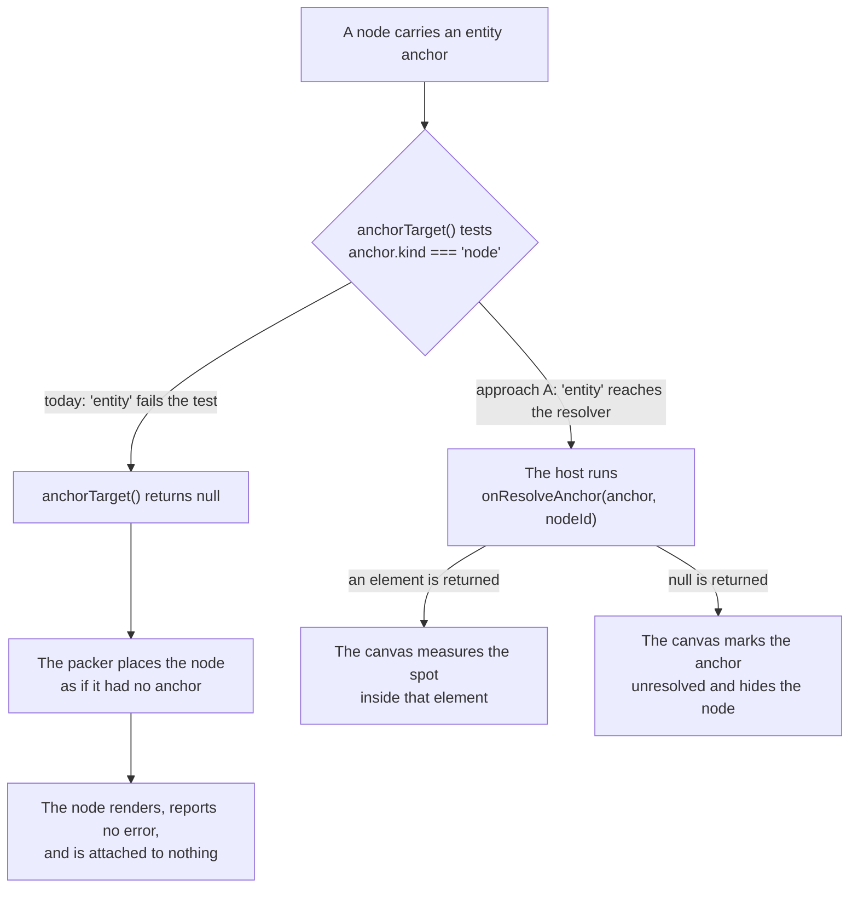

<!--
SPDX-FileCopyrightText: 2026 Priya Vijai Kalyan <priyavijai.kalyan2007@proton.me>
SPDX-FileCopyrightText: 2026 Outcrop Inc
SPDX-License-Identifier: MIT
Repository: enterprise-bootstrap-theme
File GUID: 7d41c8b2-05ea-4f36-9b17-2c6de8a41f09
Created: 2026
-->

<!-- AGENT: Design for durable canvas anchors. Addresses DEBT-DUI-1 and DEBT-DUI-5 together. AWAITING APPROVAL. No code is written. -->

# Durable anchors: identify the content, not the coordinate

**Status:** design, awaiting approval. No code is written.
**Addresses:** DEBT-DUI-1, DEBT-DUI-5
**Touches:** `runtime/src/types.ts`, `components/dynamiccanvas/dynamiccanvas.ts`,
`components/annotation/`, the capability manifest, the fleet conformance gate

## Summary

A user can attach one canvas node to another. A comment attached to a paragraph
is the common case. The runtime records that attachment as an anchor. Every
anchor that the canvas can resolve today names a position inside the target,
not the content the user pointed at. When the content moves, the attached node
stays at the old position and then points at whatever now occupies it.

This defect matters now for three reasons. First, two debt items describe it
from two sides, so each one looks partial and neither looks urgent. Second, the
cure that both items prescribe does not work: the runtime accepts an `entity`
anchor, validates it, and then ignores it. Third, measurement on 9 October 2026
showed that both items understate the problem. The index that one of them calls
stable can move inside a single session.

This design recommends approach A, which adds a content resolver to the host
application. The host owns its content, so only the host can say what a stable
content identity is. Approach A needs no change to any of the 97 components
that the conformance gate covers. It costs the host application one new
function, and it makes the `entity` anchor mean what its name says.

The main tradeoff is the size of the host interface. `DynamicUIHost` documents
itself as six functions, and approach A proposes a seventh. The main risk is
backward compatibility, because the `within` field is a persisted integer that
host documents already contain. Section "`within` is a persisted integer"
states the rule that keeps existing documents working.

The next action belongs to you. Nothing starts until you answer the three
questions in the next section.

## Decisions needed from you

1. **Is `onResolveAnchor` required or optional on `DynamicUIHost`?** A required
   function keeps the interface honest, because every host then states how its
   content is identified. An optional function keeps the documented count of
   six closer to true, and no existing host has to change.
2. **When an anchor cannot be resolved, does the canvas hide the attached node
   or show it as orphaned?** Hiding matches how the canvas treats nodes that
   scroll off screen. Showing the node in a grey state at its last known
   position tells the user that an anchored node was lost. The section "What a
   durable anchor must do" argues for telling the user.
3. **Does the apps team need this, and by when?** The apps team is the only
   consumer. That team currently works on the TenantSwitcher migration.

One question that this list held in an earlier draft is settled. That question
was whether the resolver should be registered for each canvas or for each node.
`onFetch` already takes `nodeId` as a parameter, so one host callback
parameterized by node is the established shape. The resolver matches it.

## Terms used in this document

- **Anchor.** The record that says what a canvas node is attached to. The
  variants are `canvas`, `node`, and `entity`.
- **Anchored node.** A canvas node whose anchor points at another node, or at
  content inside one. A comment, a callout, or a review mark is an anchored
  node.
- **`spot`.** An optional field on a `node` anchor. It holds x and y as
  fractions of the target's scrollable content, from 0 to 1.
- **`within`.** An optional field on a `node` anchor. It holds the index of the
  scrolling region that `spot` is measured against. Index 0 is the target's own
  body.
- **Scrolling region.** An element that scrolls its own content. A grid's rows
  and a document's text are scrolling regions.
- **Reflow.** The change in where text sits when the width changes and the text
  re-wraps. The same fraction of the content then covers different text.
- **Packer.** The part of the canvas that turns layout intent into coordinates.
- **Host application.** The application that embeds the canvas and implements
  the `DynamicUIHost` interface.
- **Resolver.** The function proposed in approach A. The host implements it, and
  it returns the element that holds the anchored content.
- **Fleet conformance gate.** The test suite in `runtime/fleet-conformance.test.ts`.
  It requires every component to declare a capability manifest and to pass the
  contract tests.
- **`EXEMPT`.** The gate's list of components that have no manifest yet. ADR-160
  reduced this list from 16 components to 5 on 10 October 2026.

## The two debt items describe one defect

DEBT-DUI-1 and DEBT-DUI-5 were filed separately and read as unrelated. They are
the same defect seen from two sides. The `node` anchor carries two locator
fields, and neither field identifies content.

| Field | What it names | When it stops being correct |
|---|---|---|
| `spot` | a fraction of the content box | the content reflows, so the same fraction covers different text (DEBT-DUI-1) |
| `within` | the Nth scrolling region, in DOM order | the set of scrolling regions changes (DEBT-DUI-5) |

A fix that addresses one field and not the other leaves the anchor durable
along one axis and fragile along the other. That outcome is worse than the
present state, because it reads as solved.

## What the measurements show

The measurements below were taken on 9 October 2026, while the parked debt
entries were re-checked. They are the reason this is a defect rather than a
theoretical weakness.

DEBT-DUI-5 claims that `within` is stable for a given component version. That
claim is false. `isScrollable()` in `dynamiccanvas.ts` requires an element to
overflow at the time of the test, and also to carry a scrolling overflow style:

```ts
if (el.scrollHeight <= el.clientHeight
    && el.scrollWidth <= el.clientWidth) { return false; }
```

A styled region whose content happens to fit is therefore absent from the list,
and every later index shifts up by one. The index moves when the content
changes, inside the same component, the same version, and the same session. An
anchor that records region 2 re-anchors to a different region as soon as an
earlier sibling's content shrinks below its box.

DEBT-DUI-5 also assumes one scrolling region for each component in practice.
That assumption is false. 25 components declare more than one scrolling
region. `ribbonbuilder` declares 5. Then `applauncher`, `conversation`,
`docviewer`, `formdialog`, `markdowneditor`, `ribbon` and `tabbedpanel`
declare 4 each. 68 components declare at least one.

The figures above count distinct selectors in each component's SCSS that set
`overflow`, `overflow-x` or `overflow-y` to `auto` or `scroll`. The unit is the
selector rather than the declaration, because `isScrollable()` tests one
element. The predicate covers both axes for the same reason. `isScrollable()`
returns true when either `overflowX` or `overflowY` permits scrolling. A
horizontally scrolling region therefore takes an index exactly like a
vertical one.

The 9 October 2026 measurement reported 21 components and counted vertical
overflow only. That figure is low by four components, and it reached the debt
entry, ADR-159 and the first draft of this design before anybody re-ran it.

## The entity anchor does nothing today

Both debt items prescribe content anchoring through the existing
`{ kind: "entity" }` anchor. That anchor is accepted and then ignored. The
string `"entity"` does not appear in `dynamiccanvas.ts`.



The consequence is that a caller cannot tell an entity anchor apart from no
anchor at all. ADR-148 exists to prevent exactly that shape. This instance of
the shape was reached through documentation rather than through a fabricated
return value.

`components/dynamiccanvas/README.md` recommended the broken path until
10 October 2026. The old text read: "Anchoring to content — a text quote, a row
id — is what `{ kind: "entity", entityId }` is for". Commit `2d04799` replaced
that text with a warning that the anchor does nothing yet. The README now
states that spot anchors are the only working kind. No further README work is
needed before this design is approved.

Three separate anchor unions also exist, in the runtime, in `annotation.ts`,
and in `diagramengine.ts`. `annotation.setAnchor()` accepts an entity anchor and
stores it. Only `diagramengine` resolves an `entityId`, against its own object
model, through its own code.

## What a durable anchor must do

1. **Survive reflow.** When the content re-wraps at a different width, the
   attached node stays on the same content.
2. **Survive a change in the number of regions.** When a sibling region stops
   overflowing, the attached node stays in its own region.
3. **Degrade honestly.** When the content is gone, say so. Never re-anchor in
   silence to whatever now occupies the position. Silent re-anchoring is the
   current behavior, and it is the one genuinely unsafe outcome.
4. **Work before the whole fleet participates.** 5 components are still
   `EXEMPT` from the conformance gate. A design that needs fleet-wide adoption
   before it delivers anything delivers nothing. This requirement stands on the
   97 components that the gate already covers.

## Three approaches

### Approach A: content selectors that the host resolves

Approach A replaces the opaque `entityId` with a descriptor that the host can
resolve, and it makes the host do the resolving. Only the host knows what its
content is.

```ts
| {
    readonly kind: "entity";
    readonly entityId: string;
    /** Opaque to the runtime; passed to the host's resolver verbatim. */
    readonly selector?: Readonly<Record<string, unknown>>;
  }
```

The resolver sits on `DynamicUIHost` and mirrors `onFetch`:

```ts
onFetch(source: DataSource, nodeId: string): Promise<unknown>;         // exists
onResolveAnchor(anchor: EntityAnchor, nodeId: string): HTMLElement | null;  // new
```

This design recommends approach A, because it matches how the runtime already
handles every fact that it cannot know for itself. `DataSource.query` is
documented as opaque to the runtime and meaningful to the host's `onFetch`.
Content identity is the same kind of fact. The same party resolves it, through a
callback of the same shape, which takes a domain object and the `nodeId`.
Approach A also completes a promise that the documentation already made,
instead of adding a fourth anchor concept.

Two costs are easy to miss.

The first cost is the size of the host interface. `runtime/src/types.ts` line 605
describes `DynamicUIHost` as "The complete surface a consuming application
implements. Six functions." That count is load-bearing prose, because it is the
interface's own claim to being small. Adding a function is therefore a
deliberate act, and the comment must change with it. The alternative is an
optional seventh function. An optional function keeps the promise, makes content
anchoring opt-in, and leaves a host that does not implement it exactly where it
is today.

The second cost is that the resolver must be synchronous, unlike `onFetch`. The
canvas refines the position of an attached node on scroll. A resolver that
returns a `Promise` cannot be awaited for each frame. Awaiting it would either
block the scroll path or produce attached nodes that lag their content. The
resolver therefore returns an element directly. The canvas consults it on mount
and on reflow, and not on every refinement pass. The canvas caches the resolved
element for each node for the lifetime of one layout pass. `regionsOf()` already
memoizes scrolling regions in the same way.

Degradation is explicit. When the resolver returns `null`, the canvas marks the
anchor as unresolved and hides the node. That matches how the canvas hides
nodes that scroll off screen. The canvas never places the node by position
instead.

The cost to a consumer is one function. A host that wants content anchoring
writes a resolver. A host that does not want content anchoring is unaffected.

### Approach B: region descriptors that components own

Approach B is the fix that DEBT-DUI-5 prescribes. Each scrolling region
declares a stable name that it owns, and `within` becomes that name:

```html
<div class="docviewer-body" data-dui-region="body">
```

The field `within?: number` becomes `within?: string`, and the canvas resolves
it by query rather than by index. Each component declares its region names in
its capability manifest. The conformance gate then asserts that every
scrollable region has a name.

Approach B fixes DEBT-DUI-5 completely and DEBT-DUI-1 not at all. A named
region still holds a geometric fraction inside it.

The cost is fleet work, and it is larger than the count of multi-region
components suggests. A gate that asserts a name on every scrollable region
reaches all 68 components that declare one. The 25 components with more than
one region are where the names change behavior. The remaining 43 still have to
declare a name to keep the gate green.

### Approach C: both, with B underneath A

Approach A names the content. Approach B names the region that the content
lives in. A full anchor then reads as "region `body`, entity `row-4823`". The
geometric `spot` stops being the locator and becomes a hint. The canvas uses
the hint to break ties, and to place a node before the resolver has answered.

Approach C is the end state. It is also two pieces of work. Approach A is
useful without approach B, and approach B is not useful without approach A.

## Recommendation

Build approach A first. Design approach B alongside it. Ship approach B one
component at a time afterwards.

Approach A is self-contained, needs no component changes, and makes the
documentation true. Approach B is fleet work that depends on the conformance
gate. Approach B can land component by component without blocking anything
else.

## `within` is a persisted integer

Any host that has saved a canvas holds integers in its documents. Changing the
type of the `within` field is therefore a breaking change to the document
format. The following rules keep existing documents working:

- The field `within?: number` stays. It is deprecated, and it keeps resolving
  by index.
- The field `region?: string` is added alongside it.
- When a document carries both fields, `region` wins.
- An anchor that carries only an integer keeps today's behavior exactly,
  including today's fragility. It does not become something else in silence.

The repository carries no persisted fixtures that contain `within`. The field
appears only in `document.test.ts` and in the live code path. The migration
surface is therefore entirely host-side, and this repository cannot see it.
That is the argument for additive change rather than a version bump, because we
do not know which host would break.

## Effect on the component fleet

Approach B needs the conformance gate to assert that every scrollable region
declares a name. Without that assertion, adoption is zero. The assertion cannot
pass for the 5 components that remain `EXEMPT` after ADR-160. Clearing those 5
is DEBT-DUI-4. That work is separate, and this design deliberately leaves it
separate.
